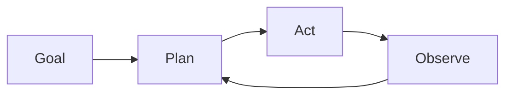

# Agents autonomes

## Définition

Les agents autonomes poursuivent des objectifs sur des horizons étendus avec une intervention humaine limitée. They plan, use tools, and adapt when the environment or task changes (par ex. coding agents, research assistants).

They sit at the “high autonomy” end of the [agents](/docs/agents) spectrum: au lieu d'un tour d'utilisateur et d'une réponse, ils exécutent de longues boucles (plan → act → observe → replan) until the goal is met or a limit is hit. [Subagents](/docs/subagents) and [raisonnement patterns](/docs/reasoning-patterns) (par ex. ReAct, ToT) are often used inside autonomous agents to structure planning and action.

## Comment ça fonctionne

The agent starts from a **goal** (par ex. “implement feature X”). It **plans** (possibly breaking into steps or sub-tasks), then **acts** (appels d'outils, code edits, search). The **observe** step captures results (tool outputs, errors, state) and feeds back into **plan** for the next iteration. The loop combines planning, memory (what was tried, what worked), tool use, and often reflection (par ex. self-critique). It runs until a stopping condition: task done, step/budget limit, or human-in-the-loop check. Safety and oversight (par ex. approval gates, rollback) are important when autonomy is high.

## Cas d'utilisation

Les agents autonomes sont adaptés pour les travaux à long terme et multi-étapes où le système doit planifier, agir et s'adapter sans intervention humaine étape par étape.

- Long-horizon coding agents that plan, edit, and test
- Research assistants that gather sources, summarize, and iterate
- Data pipelines that adapt when inputs or schemas change

## Documentation externe

- [From Prototypes to Agents with ADK – Google Codelabs](https://codelabs.developers.google.com/your-first-agent-with-adk#0)
- [LangChain – Autonomous agents](https://python.langchain.com/docs/concepts/agents/)

## Voir aussi

- [Agents](/docs/agents)
- [Subagents](/docs/subagents)
- [Reasoning patterns](/docs/reasoning-patterns)
