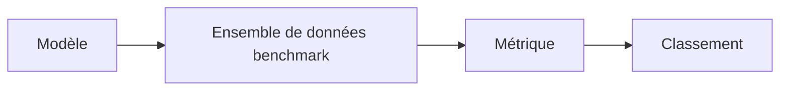

# Benchmarks

## Définition

Les benchmarks sont des ensembles de données standardisés et des protocoles d'évaluation (comme GLUE, SuperGLUE pour le NLP ; MMLU pour les connaissances générales ; HumanEval pour le code). Ils permettent la comparaison entre modèles et dans le temps.

Ils dépendent des [métriques d'évaluation](/docs/evaluation-metrics) et de divisions fixes pour que les résultats soient comparables. Le surapprentissage aux benchmarks est un problème connu ; complétez avec des évaluations hors distribution et humaines lors du déploiement de [LLMs](/docs/llms) ou de systèmes en production.

## Comment ça fonctionne

Un **modèle** est exécuté sur un **ensemble de données benchmark** (invites ou entrées fixes, division standard). Les **métriques** (comme l'exactitude, pass@k) sont calculées par tâche et souvent moyennées ; les résultats sont rapportés dans un **classement** ou dans des articles. Les protocoles définissent quelles entrées utiliser, comment analyser les sorties et quelles [métriques](/docs/evaluation-metrics) rapporter. La réutilisation du même benchmark dans le temps permet à la communauté de suivre les progrès. Il faut être prudent : les modèles peuvent surapprentir les particularités des benchmarks et les benchmarks peuvent ne pas refléter la qualité réelle.

## Cas d'utilisation

Les benchmarks fournissent une mesure commune pour comparer les modèles et les méthodes ; utilisez-les avec l'évaluation spécifique à la tâche et humaine.

- Comparer des modèles NLP (comme GLUE, SuperGLUE, MMLU)
- Évaluer la génération de code (comme HumanEval) ou le raisonnement
- Suivre les progrès des modèles et des méthodes dans le temps

## Ressources pratiques

- [Papers with Code – Classements](https://paperswithcode.com/)
- [MMLU (Hendrycks et al.)](https://arxiv.org/abs/2009.03300) — Benchmark de connaissances générales
- [HumanEval](https://github.com/openai/human-eval) — Benchmark de génération de code

## Voir aussi

- [Métriques d'évaluation](/docs/evaluation-metrics)
- [LLMs](/docs/llms)
