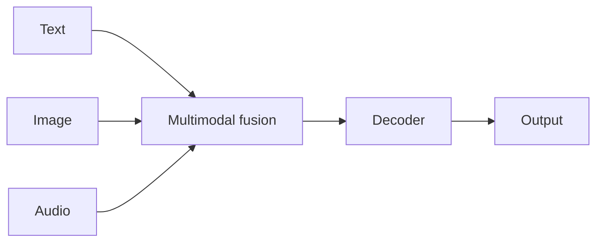

# Case study: Gemini

## Définition

Gemini est la famille de [LLMs](/docs/llms) de Google avec un support **multimodal natif** : texte, image, audio et vidéo dans un seul modèle. Il succède aux modèles Google antérieurs (p. ex., [BART](/docs/case-studies/bart) dans la ligne encodeur-décodeur) et est proposé en plusieurs niveaux d'échelle (Nano, Pro, Ultra) pour différents compromis de latence et de capacité.

Gemini est entraîné et déployé dans les produits Google (Search, Workspace, Vertex AI, Android). Cas d'utilisation : chat, compréhension et génération [multimodale](/docs/multimodal-ai), programmation et utilisation d'outils de style [agent](/docs/agents).

## Comment ça fonctionne

Les **entrées multimodales** (texte, image, audio, vidéo) sont encodées et fusionnées dans une pile [transformer](/docs/transformers) unifiée. Le **décodeur** génère du texte (ou une sortie structurée) conditionné sur toutes les modalités. **Niveaux d'échelle** : les modèles plus petits (p. ex., Nano) pour [l'edge](/docs/edge-reasoning) et sur l'appareil ; les plus grands (Pro, Ultra) pour une capacité maximale dans le cloud. **Intégration** : les mêmes modèles alimentent Gemini dans Search, Workspace et les API Vertex AI. [L'ingénierie de prompts](/docs/prompt-engineering) et [RAG](/docs/rag) ou les outils étendent l'utilisation dans les applications.

## Cas d'utilisation

Gemini convient quand on a besoin de compréhension ou de génération multimodale et d'une intégration optionnelle avec la pile Google.

- Chat et assistants avec compréhension d'images, de documents ou de vidéos
- Recherche multimodale, résumé et génération de contenu
- Programmation et raisonnement via l'API ou les produits Google

## Documentation externe

- [Google AI – Gemini](https://ai.google.dev/gemini-api) — API et présentation générale
- [Google – Gemini models](https://deepmind.google/technologies/gemini/) — Niveaux du modèle et capacités

## Voir aussi

- [LLMs](/docs/llms)
- [IA multimodale](/docs/multimodal-ai)
- [BART](/docs/case-studies/bart) — Prédécesseur dans la ligne encodeur-décodeur
