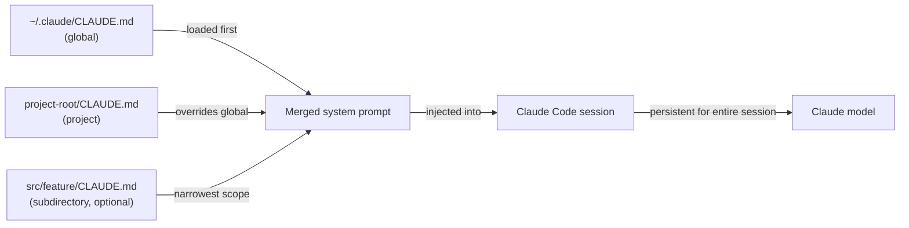

# Configuration CLAUDE.md

## Définition

`CLAUDE.md` est un fichier Markdown que Claude Code lit automatiquement au début de chaque session. Son contenu est injecté dans le prompt système, donnant au modèle des instructions persistantes et conscientes du projet sans que le développeur ait besoin de les répéter dans chaque conversation. Considérez-le comme le "document d'intégration" que chaque session reçoit : il indique à Claude ce qu'est le projet, comment il est structuré, quelles conventions suivre et quels comportements éviter.

Le fichier est intentionnellement écrit en Markdown simple plutôt que dans un format propriétaire, ce qui signifie qu'il est lisible par l'humain, versionnable et modifiable par n'importe quel développeur de l'équipe. Parce qu'il vit dans le dépôt aux côtés du code, il évolue avec le projet : lorsque la stack technique change, lorsque de nouvelles conventions sont adoptées, ou lorsqu'un nouveau développeur rejoint l'équipe et a besoin d'être intégré, le `CLAUDE.md` est la source unique de vérité sur la façon dont Claude doit se comporter dans cette base de code.

Il existe deux portées distinctes pour les fichiers `CLAUDE.md`. Un fichier **au niveau du projet** vit à la racine du dépôt (ou dans n'importe quel sous-répertoire) et s'applique uniquement à ce projet. Un fichier **global** vit à `~/.claude/CLAUDE.md` et s'applique à chaque session Claude Code indépendamment du projet. Les deux portées sont additives : les deux sont chargées simultanément, avec les instructions au niveau du projet qui ont priorité lorsqu'elles entrent en conflit avec les instructions globales.

## Comment ça fonctionne

### Découverte des fichiers et ordre de chargement

Lorsque Claude Code démarre une session, il parcourt l'arborescence des répertoires vers le haut depuis le répertoire de travail actuel en cherchant des fichiers `CLAUDE.md`. Les fichiers trouvés dans les répertoires parents sont chargés en premier (portée la plus large), puis les fichiers trouvés dans le répertoire actuel et ses sous-répertoires (portée la plus étroite). Le fichier global à `~/.claude/CLAUDE.md` est toujours chargé en premier, fournissant une base de référence que les fichiers de projet peuvent remplacer. Ce chargement hiérarchique signifie qu'un monorepo peut avoir un `CLAUDE.md` au niveau racine pour les conventions partagées et des fichiers `CLAUDE.md` par package pour les règles spécifiques au package — les deux s'appliquent simultanément pendant une session.

### Injection dans le prompt système

Le contenu de tous les fichiers `CLAUDE.md` découverts est concaténé et ajouté au début du prompt système avant tout tour de conversation. Cela signifie que Claude a accès aux instructions à chaque requête unique, pas seulement à la première. Parce que les instructions font partie du prompt système plutôt que du message utilisateur, elles ne consomment pas le contexte conversationnel qui serait autrement utilisé pour le code et les résultats des outils. Les instructions persistent pour toute la session et ne sont pas résumées ou compressées par le système de gestion du contexte.

### Ce qui appartient dans CLAUDE.md

Un `CLAUDE.md` bien rédigé répond aux questions qu'un nouveau membre de l'équipe poserait avant de toucher à la base de code : Qu'est-ce que ce projet ? Quel langage et framework sont utilisés ? Comment le code est-il organisé ? Quelles sont les conventions de test et de formatage ? Y a-t-il des patterns à suivre ou des anti-patterns à éviter ? Y a-t-il des commandes que Claude devrait ou ne devrait pas exécuter ? Le fichier doit être suffisamment spécifique pour être actionnable mais suffisamment concis pour que le modèle puisse tout intégrer. Évitez de le remplir d'informations que Claude connaît déjà (par ex., expliquer ce qu'est TypeScript) et concentrez-vous sur les faits spécifiques au projet.

### Maintenir CLAUDE.md à jour

Parce que `CLAUDE.md` est injecté à chaque requête, des instructions obsolètes nuisent activement aux performances — Claude peut suivre des conventions dépassées ou utiliser des patterns dépréciés. La pratique recommandée est de traiter les mises à jour de `CLAUDE.md` comme faisant partie du développement normal : lorsqu'un refactoring majeur change la structure du projet, mettez à jour le fichier dans le même commit. La revue de code devrait inclure les changements de `CLAUDE.md` comme n'importe quel autre changement de configuration. Les équipes avec des pipelines CI peuvent linter le fichier (par ex., vérifier que les chemins référencés existent encore) pour détecter rapidement les entrées obsolètes.



## Quand utiliser / Quand NE PAS utiliser

| Utiliser quand | Éviter quand |
|---|---|
| Vous souhaitez que Claude suive toujours des standards de code spécifiques (par ex., utiliser `const` plutôt que `let`, préférer les composants fonctionnels) | Les instructions changent fréquemment par tâche — utilisez des prompts en session pour les requêtes ponctuelles |
| Vous devez fournir le contexte de la stack technique qui nécessiterait autrement une ré-explication (par ex., "nous utilisons Zod pour la validation des schémas, pas Yup") | Le fichier contiendrait des secrets ou des credentials — utilisez des variables d'environnement pour ceux-là |
| Vous souhaitez empêcher Claude d'exécuter des commandes dangereuses (par ex., "ne jamais exécuter `DROP TABLE` ou `rm -rf`") | Les instructions sont des bonnes pratiques génériques que Claude suit déjà par défaut |
| Votre projet a des décisions d'architecture non évidentes qui affectent la façon dont le code doit être écrit | Le projet est un script ponctuel sans conventions partagées valant la peine d'être documentées |
| Vous travaillez sur plusieurs projets et souhaitez un style de base personnel dans votre `~/.claude/CLAUDE.md` global | Différents membres de l'équipe ont des préférences contradictoires — résolvez-les d'abord dans la revue de code |

## Exemples de code

```markdown
# CLAUDE.md — my-app project instructions

## Project overview
This is a full-stack web app: React + TypeScript frontend, Node.js + Express backend,
PostgreSQL database managed with Prisma ORM. The monorepo is structured as:

- `packages/web/` — React frontend (Vite, React Router v6, Tailwind CSS)
- `packages/api/` — Express REST API (TypeScript, Zod for request validation)
- `packages/shared/` — Shared TypeScript types used by both packages

## Tech stack conventions

### Frontend (packages/web)
- Use functional components with hooks only — no class components
- Prefer named exports over default exports for components
- State management: Zustand for global state, React Query for server state
- Styling: Tailwind utility classes; no inline styles or CSS modules
- Use `zod` schemas imported from `packages/shared` to validate API responses

### Backend (packages/api)
- All route handlers live in `src/routes/`; use Express Router, one file per resource
- Validate all request bodies and query params with Zod before accessing them
- Use Prisma's generated client — never write raw SQL unless Prisma cannot express the query
- Return errors as `{ error: string, code: string }` JSON objects, never as HTML

## Code style
- TypeScript strict mode is enabled — never use `any` or `// @ts-ignore`
- Use `const` by default; only use `let` when reassignment is required
- Prefer early returns over nested conditionals
- All async functions must handle errors with try/catch or `.catch()`
- Do not import from `../../..` more than two levels deep — use path aliases (`@web/`, `@api/`, `@shared/`)

## Testing
- Tests live alongside source files as `*.test.ts` — not in a separate `tests/` directory
- Use Vitest for all tests (not Jest)
- Write unit tests for all utility functions; integration tests for all API routes
- Run tests with: `pnpm test` (runs all packages) or `pnpm --filter @app/api test` (single package)

## Git conventions
- Use conventional commits: `feat:`, `fix:`, `chore:`, `docs:`, `refactor:`, `test:`
- One logical change per commit — do not bundle unrelated changes
- Branch names: `feat/description`, `fix/description`, `chore/description`

## Commands you may run freely
- `pnpm install`, `pnpm build`, `pnpm test`, `pnpm lint`, `pnpm format`
- `prisma generate`, `prisma migrate dev`, `prisma studio`
- `git status`, `git diff`, `git log`

## Commands to NEVER run without explicit user confirmation
- Any `prisma migrate reset` or `prisma db push --force-reset` — these destroy data
- Any `DROP TABLE`, `DELETE FROM` without a WHERE clause
- `rm -rf` on any directory other than `node_modules` or build artifacts
```

```bash
# Global CLAUDE.md at ~/.claude/CLAUDE.md (applies to all projects)
# Good for personal style preferences and safety rules that span every project

# Example global instructions:
cat ~/.claude/CLAUDE.md
```

```markdown
# Global Claude Code instructions (all projects)

## My personal defaults
- I prefer TypeScript over JavaScript in all new files
- Use single quotes for strings in JavaScript/TypeScript
- Explain what you are going to do before making large changes (more than 3 files)
- When writing commit messages, always use conventional commits format

## Safety rules (all projects)
- Never commit directly to `main` or `master` — always create a feature branch first
- Never run database migration commands without showing me the migration file first
- Ask before installing new dependencies — I want to review package size and license
```

## Ressources pratiques

- [Documentation Claude Code — CLAUDE.md](https://docs.anthropic.com/en/docs/claude-code/memory) — Guide officiel sur les emplacements des fichiers CLAUDE.md, l'ordre de chargement et les meilleures pratiques.
- [Référence des paramètres Claude Code](https://docs.anthropic.com/en/docs/claude-code/settings) — Référence complète des paramètres incluant toutes les options de configuration aux côtés de CLAUDE.md.
- [Démarrage rapide Claude Code](https://docs.anthropic.com/en/docs/claude-code/quickstart) — Guide de démarrage qui couvre la configuration initiale de CLAUDE.md.

## Voir aussi

- [Vue d'ensemble Claude Code](/docs/claude-code)
- [Skills Claude Code](/docs/claude-code/skills)
- [Gestion du contexte](/docs/claude-code/context-management)
