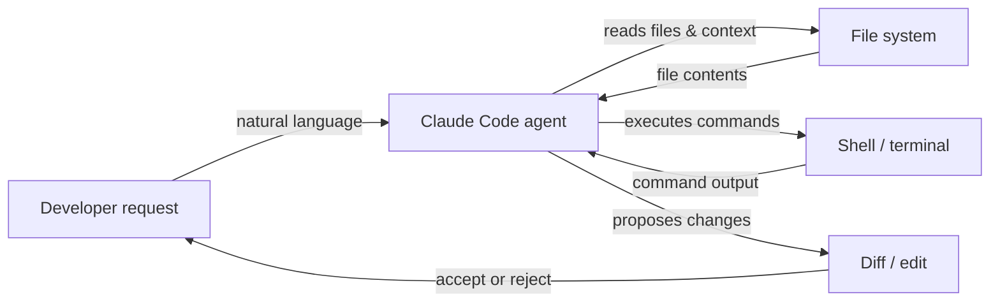

# Claude Code

## Définition

Claude Code est l'agent de codage alimenté par l'IA d'Anthropic — un outil conçu spécifiquement pour intégrer les capacités de raisonnement de Claude directement dans le workflow du développeur. Contrairement aux outils d'IA orientés chat, Claude Code est conçu pour un **fonctionnement agentique** : il peut planifier et exécuter de manière autonome des tâches multi-étapes, naviguer dans de grandes bases de code, exécuter des commandes shell, éditer des fichiers, gérer des opérations git et itérer sur ses propres sorties sans guidage humain constant à chaque étape.

Il est disponible dans plusieurs environnements : en tant qu'**interface en ligne de commande (CLI)** qui fonctionne dans n'importe quel terminal, en tant qu'extension pour les IDE **VS Code** et **JetBrains** avec édition inline et diffs visuels, et via l'**application web** à claude.ai/code pour les sessions basées sur un navigateur. Cette présence multi-environnements signifie que les développeurs peuvent utiliser Claude Code où qu'ils travaillent déjà, plutôt que de basculer vers un éditeur dédié à l'outil.

L'ensemble de capacités principal couvre le cycle de vie complet du codage : **génération de code** (création de nouveaux fichiers, écriture de fonctions, génération de tests), **refactoring** (restructuration du code existant en préservant le comportement), **débogage** (diagnostic des erreurs avec un contexte complet), **opérations git** (staging, commit, lecture des diffs, interprétation de l'historique) et **gestion des fichiers** (lecture, écriture, recherche et organisation des fichiers du projet). Parce que Claude Code fonctionne avec accès à l'arborescence complète du projet et à un terminal, il gère naturellement les tâches qui nécessitent une compréhension inter-fichiers et une utilisation séquentielle des outils.

## Comment ça fonctionne

### Installation et authentification

Claude Code est installé en tant que package npm (`npm install -g @anthropic-ai/claude-code`) et nécessite un abonnement Claude (Pro, Teams ou Enterprise) ou un accès API via Amazon Bedrock ou Google Vertex AI. Après avoir exécuté `claude` dans un terminal, l'authentification est gérée via OAuth ou une clé API stockée dans la configuration locale. La CLI lit le répertoire du projet, localise tous les fichiers d'instructions `CLAUDE.md` et entre dans une session interactive où l'utilisateur tape des requêtes en langage naturel.

### Boucle d'exécution des tâches agentiques

Lorsqu'une tâche lui est assignée, Claude Code suit une boucle interne plan-action-observation. Il lit d'abord les fichiers pertinents pour construire le contexte, puis émet des appels d'outils (lectures de fichiers, commandes shell, éditions de code) en séquence, observe chaque résultat et ajuste son plan en conséquence. Cette boucle continue de manière autonome jusqu'à ce que la tâche soit terminée ou que Claude détermine qu'il a besoin de clarifications. L'agent maintient l'historique complet de la conversation au fil des tours, ce qui lui permet de se référer à des découvertes antérieures et d'éviter les opérations redondantes.

### Intégrations IDE

Dans VS Code et JetBrains, Claude Code apparaît comme un panneau intégré avec une interface de chat et des vues diff inline. Lorsque Claude propose des modifications de code, elles apparaissent sous forme de diffs côte à côte que le développeur peut accepter, rejeter ou appliquer partiellement. L'extension a accès au même système de fichiers et terminal que la CLI, donc les capacités sont équivalentes — la différence est ergonomique, pas fonctionnelle. Les raccourcis d'édition inline (déclenchés par un raccourci clavier) permettent aux développeurs de demander des modifications ciblées sans passer au panneau de chat.

### Contexte et utilisation des outils

Claude Code utilise un ensemble d'outils intégrés : `Read`, `Edit`, `Write`, `Bash`, `Glob` et `Grep`. Ceux-ci correspondent directement aux actions qu'un développeur prendrait lors de l'investigation et de la modification d'une base de code. Chaque appel d'outil est visible pour l'utilisateur dans la session, rendant le raisonnement de l'agent traçable. Le contexte des fichiers est chargé à la demande plutôt que préchargé, ce qui aide à gérer efficacement la fenêtre de contexte. Les instructions au niveau du projet dans les fichiers `CLAUDE.md` sont automatiquement injectées dans le prompt système pour guider le comportement.



## Quand utiliser / Quand NE PAS utiliser

| Utiliser quand | Éviter quand |
|---|---|
| Vous avez besoin d'un agent pour exécuter des tâches multi-étapes de manière autonome (par ex., "ajouter la pagination à tous les endpoints de liste") | Vous n'avez besoin que d'une seule suggestion d'autocomplétion — un outil inline plus simple est plus rapide |
| Vous souhaitez explorer une base de code inconnue avec des questions en langage naturel | La base de code contient des secrets sensibles qui ne devraient jamais être lus par une IA externe |
| Vous avez besoin d'opérations conscientes de git : résumer les diffs, écrire des messages de commit, examiner les PRs | Votre projet nécessite un développement hors ligne ou en réseau isolé sans accès API |
| Vous souhaitez une intégration IDE avec des diffs visuels et des éditions inline | Vous préférez une IA entièrement locale/open source sans dépendance cloud |
| Vous exécutez des tâches depuis le terminal et souhaitez une assistance IA native CLI | Vous avez besoin d'un suivi précis des coûts par token au niveau gratuit |

## Comparaisons

| Critère | Claude Code | Cursor | GitHub Copilot |
|---|---|---|---|
| **Niveau d'autonomie** | Élevé — boucle agentique complète avec planification et exécution multi-étapes | Moyen — éditeur alimenté par l'IA avec mode agent, mais principalement centré sur l'éditeur | Faible à moyen — complétions inline et chat ; Copilot Workspace ajoute la planification |
| **Support IDE** | VS Code, JetBrains, plus CLI autonome et web | Fork propriétaire de VS Code uniquement | VS Code, Visual Studio, JetBrains, Neovim et plus |
| **Modèle de tarification** | Inclus dans l'abonnement Claude Pro/Teams ou pay-per-token via API | Abonnement (20$/mois hobby, 40$/mois pro) ; pas de niveau gratuit au-delà de l'essai | Gratuit pour les particuliers ; 10$/mois Pro ; niveaux Teams et Enterprise |
| **Capacités agentiques** | Natives : exécute des commandes shell, édite des fichiers, utilise git, boucle de manière autonome | En développement : mode Agent disponible, exécute des commandes terminal | Limité : Copilot Workspace pour la planification ; le mode standard est réactif |
| **Gestion du contexte** | Chargement de fichiers basé sur des outils explicites ; supporte `CLAUDE.md` pour des instructions persistantes | Cursor Rules (`.cursorrules`) + indexation de base de code avec embeddings | Le contexte Copilot vient des fichiers ouverts et du code sélectionné ; pas de règles de projet persistantes |

Voir aussi les articles dédiés : [Cursor](/docs/tools/cursor) et [GitHub Copilot](/docs/tools/github-copilot).

## Exemples de code

```bash
# Install Claude Code globally
npm install -g @anthropic-ai/claude-code

# Start an interactive session in your project directory
cd ~/projects/my-app
claude

# --- Inside the Claude Code CLI session ---

# Ask a question about the codebase
> How is authentication handled in this project?

# Ask Claude to make a targeted change
> Add input validation to the POST /users endpoint in src/routes/users.ts

# Ask Claude to fix a bug with context
> The test in tests/auth.test.ts is failing with "Cannot read property 'id' of undefined". Fix it.

# Ask Claude to perform a cross-file refactor
> Rename the UserProfile component to ProfileCard across all files that import it

# Use git-aware operations
> Write a conventional commit message for the changes currently staged in git

# Run a slash command to clear conversation context
> /clear

# Run a multi-step agentic task
> Create a new Express route for GET /health that returns server uptime and version from package.json, add a unit test for it, and stage both files

# Exit the session
> /exit
```

## Ressources pratiques

- [Documentation Claude Code — Anthropic](https://docs.anthropic.com/en/docs/claude-code) — Docs officielles couvrant l'installation, l'utilisation CLI, les intégrations IDE et la configuration.
- [Démarrage rapide Claude Code](https://docs.anthropic.com/en/docs/claude-code/quickstart) — Guide étape par étape pour installer, authentifier et exécuter votre première session.
- [Dépôt GitHub Claude Code](https://github.com/anthropics/claude-code) — Source, suivi des problèmes et notes de version pour la CLI et les extensions.
- [Page produit Anthropic Claude Code](https://www.anthropic.com/claude-code) — Vue d'ensemble de haut niveau et exemples de cas d'usage d'Anthropic.
- [Dépôt de skills](https://github.com/EmersonBraun/skills) — Collection organisée de skills IA réutilisables pour Claude Code et d'autres assistants de codage IA

## Voir aussi

- [Configuration CLAUDE.md](/docs/claude-code/claude-md)
- [Skills Claude Code](/docs/claude-code/skills)
- [Cursor](/docs/tools/cursor)
- [GitHub Copilot](/docs/tools/github-copilot)
