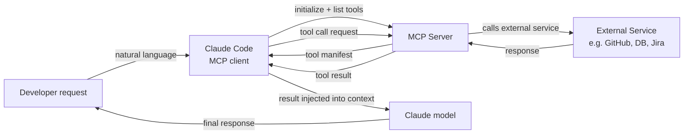

# Plugins et intégrations MCP

## Définition

Le Model Context Protocol (MCP) est un standard ouvert développé par Anthropic qui définit comment les modèles d'IA communiquent avec des sources de données et des outils externes. Dans le contexte de Claude Code, les serveurs MCP sont des plugins qui étendent l'ensemble des outils disponibles pour Claude au-delà de ses capacités intégrées (accès au système de fichiers, commandes shell, git). Avec MCP, Claude peut interroger des bases de données, appeler des API externes, naviguer sur le web, lire des tickets Jira, interroger des tableaux de bord Grafana, interagir avec GitHub et faire tout ce qu'un serveur MCP implémente — le tout via la même interface en langage naturel que les outils intégrés.

MCP suit une architecture client-serveur. Claude Code agit comme un **client MCP** : il découvre les serveurs MCP disponibles à partir de la configuration, se connecte à eux au démarrage de la session et les interroge pour la liste des outils qu'ils exposent. Chaque serveur MCP expose un ensemble d'**outils** (fonctions avec des définitions JSON Schema d'entrée, identiques en structure aux outils intégrés), des **ressources** optionnelles (sources de données en lecture seule comme de la documentation ou des schémas de bases de données) et des **prompts** optionnels (modèles de prompts réutilisables). Lorsque Claude décide d'appeler un outil MCP, Claude Code achemine l'appel vers le serveur approprié, exécute l'opération et renvoie le résultat au modèle sous forme de résultat d'outil.

Le principal avantage de MCP par rapport aux intégrations d'outils ad hoc est la standardisation. Avant MCP, chaque assistant IA avait son propre format de plugin propriétaire. MCP définit un protocole universel de sorte qu'un serveur MCP écrit une fois peut fonctionner avec n'importe quel client compatible MCP — Claude Code, Claude Desktop ou tout autre client MCP. Cela signifie que l'écosystème des intégrations disponibles se développe rapidement, et la construction d'une nouvelle intégration ne nécessite pas de comprendre les spécificités internes de Claude.

## Comment ça fonctionne

### Types de serveurs MCP et transports

Les serveurs MCP se déclinent en deux variétés de transport. Les **serveurs stdio** s'exécutent comme des sous-processus locaux : Claude Code lance le processus serveur au démarrage de la session et communique via stdin/stdout en utilisant JSON-RPC. Les serveurs stdio sont le type le plus courant pour les outils locaux (clients de bases de données, processeurs de fichiers, analyse de code spécialisée). Les **serveurs SSE (Server-Sent Events)** s'exécutent comme des serveurs HTTP persistants et communiquent via une connexion réseau. Les serveurs SSE sont meilleurs pour les services distants, l'infrastructure partagée d'équipe, ou les serveurs qui ont besoin de maintenir un état sur plusieurs connexions client.

### Configuration et découverte

Les serveurs MCP sont configurés dans le fichier de paramètres de Claude Code, généralement à `~/.claude/settings.json` pour la configuration globale ou `.claude/settings.json` pour les serveurs spécifiques au projet. Chaque entrée de serveur spécifie un nom, un type de transport et la commande (pour stdio) ou l'URL (pour SSE) nécessaire pour démarrer ou se connecter à lui. Claude Code lit cette configuration au démarrage de la session, initialise les connexions à tous les serveurs configurés et récupère leurs manifestes d'outils. Les outils de tous les serveurs MCP connectés apparaissent dans la liste d'outils du modèle aux côtés des outils intégrés — du point de vue du modèle, il n'y a pas de différence.

### Flux d'invocation des outils

Lorsque Claude décide d'appeler un outil MCP, Claude Code agit comme intermédiaire : il sérialise les arguments de l'appel d'outil en JSON, envoie une requête `tools/call` au serveur MCP via le transport configuré, attend la réponse, désérialise le résultat et le renvoie au modèle sous forme de bloc `tool_result`. Tout l'aller-retour est transparent pour le modèle — il voit simplement un résultat d'outil, tout comme un appel d'outil intégré. Les serveurs MCP peuvent renvoyer du texte, des images ou des données structurées, que Claude Code transmet tous de manière appropriée au modèle.

### Authentification et sécurité

Les serveurs MCP gèrent leur propre authentification. Un serveur MCP GitHub, par exemple, lit un token d'accès personnel GitHub depuis une variable d'environnement configurée dans le champ `env` de l'entrée du serveur. Claude Code transmet l'environnement configuré au sous-processus mais ne gère pas les secrets lui-même — c'est la responsabilité du serveur MCP de s'authentifier auprès des services externes. Parce que les serveurs MCP exécutent du code avec les permissions de l'utilisateur local, il convient d'être prudent lors de l'utilisation de serveurs MCP tiers : examinez le code du serveur ou faites confiance à l'éditeur avant de l'ajouter à votre configuration.



## Quand utiliser / Quand NE PAS utiliser

| Utiliser quand | Éviter quand |
|---|---|
| Vous avez besoin que Claude interagisse avec un service externe (GitHub, Jira, Slack, bases de données) | La tâche peut être accomplie avec des outils intégrés (système de fichiers, shell) — pas besoin d'ajouter de la complexité |
| Votre équipe partage un ensemble commun d'outils et vous souhaitez une couche d'intégration standardisée | Vous êtes dans un environnement sensible à la sécurité où l'accès aux outils externes doit être étroitement contrôlé |
| Vous souhaitez donner à Claude accès à des sources de données privées (API internes, bases de données propriétaires) | Vous avez besoin d'une intégration ponctuelle rapide — un script shell appelé via l'outil Bash est plus simple |
| Vous construisez un outil réutilisable qui devrait fonctionner sur plusieurs clients IA | Le serveur MCP que vous souhaitez utiliser provient d'une source non fiable — examinez d'abord son code |
| Vous souhaitez que Claude ait un accès en direct à l'état du système (métriques, logs, suivi des erreurs) | Le service externe a des limites de taux qui pourraient être dépassées par les appels d'outils autonomes de Claude |

## Exemples de code

```json
// ~/.claude/settings.json — MCP server configuration
{
  "mcpServers": {
    // GitHub MCP server — gives Claude access to repos, issues, PRs
    "github": {
      "command": "npx",
      "args": ["-y", "@modelcontextprotocol/server-github"],
      "env": {
        "GITHUB_PERSONAL_ACCESS_TOKEN": "${GITHUB_TOKEN}"
      }
    },

    // PostgreSQL MCP server — gives Claude read access to your database schema and query capability
    "postgres": {
      "command": "npx",
      "args": ["-y", "@modelcontextprotocol/server-postgres", "postgresql://localhost/mydb"],
      "env": {
        "PGPASSWORD": "${DB_PASSWORD}"
      }
    },

    // Filesystem MCP server (extended) — gives Claude access to directories beyond the project root
    "filesystem": {
      "command": "npx",
      "args": [
        "-y",
        "@modelcontextprotocol/server-filesystem",
        "/Users/me/projects",
        "/Users/me/documents/specs"
      ]
    },

    // Custom internal MCP server (stdio, local binary)
    "internal-tools": {
      "command": "/usr/local/bin/my-mcp-server",
      "args": ["--config", "/etc/my-mcp/config.json"],
      "env": {
        "INTERNAL_API_KEY": "${INTERNAL_API_KEY}"
      }
    },

    // Remote SSE server — shared team infrastructure
    "team-server": {
      "url": "https://mcp.internal.mycompany.com/sse",
      "headers": {
        "Authorization": "Bearer ${TEAM_MCP_TOKEN}"
      }
    }
  }
}
```

```typescript
// Custom MCP server — TypeScript implementation using the official MCP SDK
// This example creates an MCP server that wraps an internal metrics API

import { McpServer } from "@modelcontextprotocol/sdk/server/mcp.js";
import { StdioServerTransport } from "@modelcontextprotocol/sdk/server/stdio.js";
import { z } from "zod";

// Initialize the MCP server with a name and version
const server = new McpServer({
  name: "metrics-server",
  version: "1.0.0",
});

// Define a tool: get_error_rate
// The description is critical — Claude uses it to decide when to call this tool
server.tool(
  "get_error_rate",
  "Get the error rate for a service over a specified time window. Use this when the user asks about errors, reliability, or service health.",
  {
    // Zod schema — the SDK converts this to JSON Schema automatically
    service: z.string().describe("The service name, e.g. 'api', 'frontend', 'worker'"),
    window: z
      .enum(["1h", "6h", "24h", "7d"])
      .describe("Time window for the metric. Defaults to 1h."),
  },
  async ({ service, window }) => {
    // In production, this would call your metrics API (Prometheus, Datadog, etc.)
    const response = await fetch(
      `https://metrics.internal.mycompany.com/api/error-rate?service=${service}&window=${window}`,
      { headers: { Authorization: `Bearer ${process.env.METRICS_API_KEY}` } }
    );

    if (!response.ok) {
      return {
        content: [{ type: "text", text: `Error fetching metrics: ${response.statusText}` }],
        isError: true,
      };
    }

    const data = await response.json();
    return {
      content: [
        {
          type: "text",
          text: JSON.stringify({
            service,
            window,
            error_rate: data.errorRate,
            total_requests: data.totalRequests,
            error_count: data.errorCount,
            timestamp: new Date().toISOString(),
          }, null, 2),
        },
      ],
    };
  }
);

// Define a tool: list_services
server.tool(
  "list_services",
  "List all services that have metrics available for monitoring.",
  {},
  async () => {
    const response = await fetch("https://metrics.internal.mycompany.com/api/services", {
      headers: { Authorization: `Bearer ${process.env.METRICS_API_KEY}` },
    });
    const services = await response.json();
    return {
      content: [{ type: "text", text: JSON.stringify(services, null, 2) }],
    };
  }
);

// Start the server with stdio transport (for local subprocess use)
const transport = new StdioServerTransport();
await server.connect(transport);
```

```bash
# Install the MCP SDK for building custom servers
npm install @modelcontextprotocol/sdk zod

# Compile and run the custom server locally for testing
npx ts-node metrics-server.ts

# Add the custom server to your Claude Code configuration
cat >> ~/.claude/settings.json << 'EOF'
# (add to the mcpServers object in your existing settings.json)
"metrics": {
  "command": "node",
  "args": ["/path/to/metrics-server.js"],
  "env": {
    "METRICS_API_KEY": "your-api-key-here"
  }
}
EOF

# Inside a Claude Code session, use the MCP tools naturally:
claude
> What is the current error rate for the api service?
> List all services and show me the error rates for any that exceed 1% in the last hour
> Compare error rates across all services for the past 24 hours
```

## Ressources pratiques

- [Documentation MCP — Anthropic](https://docs.anthropic.com/en/docs/mcp) — Spécification MCP officielle, vue d'ensemble du protocole et architecture client/serveur.
- [SDK TypeScript MCP](https://github.com/modelcontextprotocol/typescript-sdk) — SDK officiel pour la construction de serveurs et clients MCP en TypeScript/JavaScript.
- [Dépôt de serveurs MCP](https://github.com/modelcontextprotocol/servers) — Collection officielle de serveurs MCP de référence : système de fichiers, GitHub, PostgreSQL, Google Drive, Slack et plus.
- [Guide d'intégration MCP Claude Code](https://docs.anthropic.com/en/docs/claude-code/mcp) — Guide spécifique à Claude Code pour configurer et utiliser les serveurs MCP dans les sessions.
- [Spécification MCP](https://spec.modelcontextprotocol.io) — Spécification complète du protocole pour implémenter des clients ou serveurs personnalisés.

## Voir aussi

- [Vue d'ensemble Claude Code](/docs/claude-code)
- [Skills Claude Code](/docs/claude-code/skills)
- [Utilisation des outils Anthropic](/docs/agents/anthropic-tool-use)
