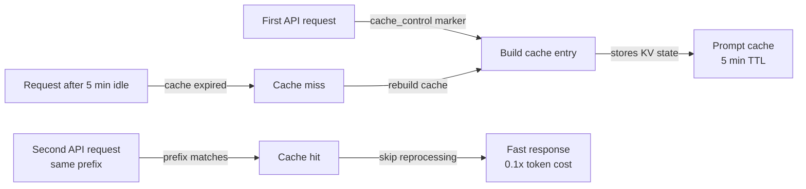

# Mise en cache des prompts

## Définition

La mise en cache des prompts est une fonctionnalité de l'API Claude qui permet aux portions répétées d'un prompt — le prompt système, les définitions d'outils, le contexte du document ou les longs préfixes de conversation — d'être traitées une fois et réutilisées sur plusieurs appels API ultérieurs. Au lieu de retraiter des séquences de tokens identiques à chaque requête, le modèle les lit depuis un cache, ce qui réduit la latence et diminue le coût des tokens mis en cache. Dans Claude Code, la mise en cache des prompts fonctionne automatiquement en arrière-plan pour rendre les longues sessions et l'utilisation répétée des outils plus rapides et moins coûteuses.

L'insight fondamental derrière la mise en cache des prompts est que la plupart de ce qui change entre les appels API dans une session de codage est petit : un nouveau message utilisateur, un nouveau résultat d'outil ou un fichier mis à jour. Les grandes parties stables — le prompt système contenant les instructions du projet, les définitions de tous les outils disponibles et l'historique de conversation accumulé — restent inchangées pour la plupart des tours. Traiter ces portions stables de manière redondante à chaque requête est du gaspillage. La mise en cache des prompts élimine ce gaspillage en stockant des états clé-valeur traités et en les réutilisant lorsque le préfixe du prompt correspond.

Du point de vue du développeur, la mise en cache des prompts est largement transparente dans les sessions Claude Code — elle se produit automatiquement sans configuration. La comprendre est le plus utile lors de la construction directement sur l'API Claude, de la conception de boucles d'agents à exécution longue ou du dépannage d'une latence ou de coûts inattendus élevés. Dans ces contextes, savoir comment structurer les prompts pour une utilisation optimale du cache peut produire des économies substantielles : les tokens d'entrée mis en cache sont facturés à une fraction du coût des tokens d'entrée réguliers, et les hits de cache éliminent entièrement la latence de traitement pour les portions mises en cache.

## Comment ça fonctionne

### Marqueurs de contrôle du cache

La mise en cache des prompts utilise des annotations `cache_control` explicites pour marquer où dans le prompt un point de contrôle de cache doit être créé. Lorsque l'API traite une requête avec le contrôle de cache `{"type": "ephemeral"}` sur un bloc de contenu, elle stocke l'état traité de tous les tokens jusqu'à ce bloc inclus. Sur les requêtes suivantes avec le même préfixe, l'API détecte le hit de cache et ignore le retraitement de ces tokens. Un prompt peut avoir jusqu'à quatre points de contrôle de cache actifs simultanément, permettant aux développeurs de mettre en cache le prompt système séparément des définitions d'outils et de l'historique de conversation.

### Durée de vie du cache et invalidation

Le cache éphémère a une durée de vie d'environ cinq minutes d'inactivité. Si aucun appel API ne référence un préfixe mis en cache dans cette fenêtre, l'entrée de cache est expulsée et doit être reconstruite à la prochaine requête. Cela signifie que la mise en cache des prompts est la plus efficace pour les cas d'usage à haute fréquence : les sessions de codage interactives où les requêtes arrivent toutes les quelques secondes, les boucles d'agents qui exécutent de nombreux appels d'outils en succession rapide, ou les pipelines de traitement par lots qui traitent de nombreux documents avec un prompt système partagé. Pour les workflows à faible fréquence où des minutes s'écoulent entre les requêtes, le cache peut expirer et ne fournir aucun avantage.

### Quoi mettre en cache

Les meilleurs candidats à la mise en cache sont les contenus qui sont volumineux, stables et fréquemment réutilisés. Le prompt système est le candidat le plus évident : dans Claude Code, il contient les instructions du projet depuis CLAUDE.md, les définitions d'outils et les directives comportementales — souvent des milliers de tokens identiques à chaque tour. Les définitions d'outils (schémas JSON pour tous les outils disponibles) sont un autre bon candidat. Dans les workflows RAG ou intensifs en documents, les grands documents de référence chargés au début d'une session peuvent être mis en cache de sorte que les questions suivantes sur ces documents n'entraînent que le coût marginal de la nouvelle question, pas le coût de relecture des documents.

### Détection des hits de cache et rapport d'utilisation

La réponse API inclut un objet `usage` qui distingue entre les tokens d'entrée réguliers, les tokens de création de cache et les tokens de lecture de cache. Les tokens de création de cache sont facturés à 1,25x le tarif de base (le coût unique d'écriture dans le cache). Les tokens de lecture de cache sont facturés à 0,1x le tarif de base — une réduction de 90% par rapport aux tokens d'entrée réguliers. La surveillance de ces champs permet aux développeurs de mesurer l'efficacité réelle du cache : le ratio des tokens de lecture de cache aux tokens d'entrée totaux indique quelle part du prompt est servie depuis le cache.



## Quand utiliser / Quand NE PAS utiliser

| Utiliser quand | Éviter quand |
|---|---|
| Votre prompt système est volumineux (>1 000 tokens) et constant sur de nombreuses requêtes | Vos prompts changent significativement à chaque requête — pas de préfixe stable à mettre en cache |
| Vous exécutez une boucle d'agent avec de nombreux appels d'outils séquentiels dans une seule session | Les requêtes sont peu fréquentes (>5 min entre les tours) — le cache expire avant de pouvoir être réutilisé |
| Vous chargez de grands documents de référence (specs, bases de code) au début de la session | Votre cas d'usage est des requêtes à coup unique sans contexte répété |
| Vous souhaitez réduire la latence sur la première réponse visible par l'utilisateur dans une session interactive | Vous testez ou déboguez et voulez des comptages de tokens déterministes par requête |
| Vous optimisez les coûts dans un système en production avec un volume élevé d'appels API | La surcharge de structuration des marqueurs cache_control dépasse les économies à faible volume |

## Exemples de code

```python
import anthropic

client = anthropic.Anthropic()

# Example: caching a large system prompt and tool definitions
# The system prompt is the same on every request — mark it for caching

SYSTEM_PROMPT = """
You are a senior software engineer working on a large TypeScript monorepo.
The project uses React on the frontend, Node.js/Express on the backend, and PostgreSQL.
[... imagine 2000+ tokens of detailed project instructions here ...]
""" * 10  # simulating a large system prompt

# Tool definitions for the coding agent — stable across all requests
TOOLS = [
    {
        "name": "read_file",
        "description": "Read a file from the project directory",
        "input_schema": {
            "type": "object",
            "properties": {
                "path": {"type": "string", "description": "Relative file path"}
            },
            "required": ["path"]
        }
    },
    {
        "name": "write_file",
        "description": "Write content to a file",
        "input_schema": {
            "type": "object",
            "properties": {
                "path": {"type": "string"},
                "content": {"type": "string"}
            },
            "required": ["path", "content"]
        }
    },
    # ... more tools
]

def make_request(messages: list, turn_number: int) -> dict:
    """
    Make a Claude API request with prompt caching enabled.
    The system prompt and tools are marked with cache_control so they are
    processed once and reused on subsequent calls in the same session.
    """
    response = client.messages.create(
        model="claude-opus-4-5",
        max_tokens=4096,
        # Mark the system prompt for caching with cache_control
        system=[
            {
                "type": "text",
                "text": SYSTEM_PROMPT,
                # This tells the API to cache everything up to this point
                "cache_control": {"type": "ephemeral"}
            }
        ],
        # Mark tool definitions for caching too
        tools=[
            {**tool, "cache_control": {"type": "ephemeral"}} if i == len(TOOLS) - 1 else tool
            for i, tool in enumerate(TOOLS)
        ],
        messages=messages
    )

    # Inspect cache usage in the response
    usage = response.usage
    print(f"Turn {turn_number} token usage:")
    print(f"  Input tokens:        {usage.input_tokens:>8}")
    print(f"  Cache creation:      {usage.cache_creation_input_tokens:>8}  (1.25x cost)")
    print(f"  Cache read:          {usage.cache_read_input_tokens:>8}  (0.1x cost)")
    print(f"  Output tokens:       {usage.output_tokens:>8}")

    # Calculate effective cost savings
    if usage.cache_read_input_tokens > 0:
        savings_pct = (usage.cache_read_input_tokens / usage.input_tokens) * 100 * 0.9
        print(f"  Estimated savings:   {savings_pct:.1f}% on input tokens this turn")

    return response

# Simulate a multi-turn coding session
messages = []

# Turn 1 — cold start, cache is built
messages.append({"role": "user", "content": "What files exist in the src/ directory?"})
response1 = make_request(messages, turn_number=1)
# Output: cache_creation_input_tokens > 0, cache_read_input_tokens = 0
messages.append({"role": "assistant", "content": response1.content})

# Turn 2 — system prompt and tools are now cached
messages.append({"role": "user", "content": "Read the main entry point file"})
response2 = make_request(messages, turn_number=2)
# Output: cache_read_input_tokens > 0, significant cost savings

# Turn 3 — still cache-hitting on system prompt + tools
messages.append({"role": "user", "content": "Explain how the authentication middleware works"})
response3 = make_request(messages, turn_number=3)
# Output: continued cache hits, growing cache_read_input_tokens
```

```bash
# Observing prompt caching in Claude Code sessions
# Claude Code automatically applies caching — use verbose mode to see token counts

# Start a session with verbose output to inspect token usage
claude --verbose

# Inside the session, run several requests in sequence
> List all TypeScript files in src/
> Read src/index.ts
> Explain the main function

# With --verbose, Claude Code prints token usage per turn including cache statistics
# You'll see cache_creation_input_tokens spike on turn 1, then
# cache_read_input_tokens grow on subsequent turns
```

## Ressources pratiques

- [Documentation de la mise en cache des prompts — Anthropic](https://docs.anthropic.com/en/docs/build-with-claude/prompt-caching) — Référence officielle complète : format de contrôle du cache, tarification des tokens, TTL et modèles pris en charge.
- [Cookbook de la mise en cache des prompts](https://github.com/anthropics/anthropic-cookbook/blob/main/misc/prompt_caching.ipynb) — Notebook Jupyter avec des exemples fonctionnels incluant le calcul des coûts et la mesure des hits de cache.
- [Tarification API Claude](https://www.anthropic.com/pricing) — Tarifs actuels des tokens pour l'entrée, la création de cache et les tokens de lecture de cache sur tous les modèles.
- [Surveillance d'utilisation Anthropic](https://console.anthropic.com/usage) — Tableau de bord de la console pour inspecter les décompositions d'utilisation des tokens par clé API.

## Voir aussi

- [Vue d'ensemble Claude Code](/docs/claude-code)
- [Gestion du contexte](/docs/claude-code/context-management)
- [Modes de réflexion et effort](/docs/claude-code/thinking-modes)
