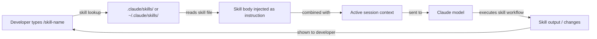

# Skills Claude Code

## Définition

Les skills sont des fichiers de prompts réutilisables et invocables qui étendent le comportement de Claude Code au-delà de ses comportements par défaut. Une skill est un fichier Markdown avec un frontmatter YAML qui définit une commande nommée : lorsqu'un développeur tape `/nom-du-skill` dans une session Claude Code, le contenu de la skill est injecté comme instruction — transformant ainsi un flux de travail courant, complexe ou spécifique à une équipe en une seule commande slash.

Le modèle mental est similaire aux alias shell ou aux cibles Makefile, mais pour les flux de travail assistés par IA. Au lieu de répéter un prompt long et soigneusement élaboré chaque fois que vous voulez que Claude suive un processus spécifique (checklist de revue de code, génération de notes de version, documentation d'architecture, audit de sécurité), vous l'écrivez une fois sous forme de skill, vous le commitez dans le dépôt et vous l'invoquez avec une commande courte. Les skills sont versionnées, partageables et composables avec les instructions CLAUDE.md.

Les skills diffèrent des instructions CLAUDE.md d'une manière importante : CLAUDE.md est toujours actif et s'applique à chaque interaction, tandis que les skills sont opt-in et invoquées explicitement. Cela rend les skills appropriées pour les flux de travail lourds ou spécifiques au contexte qui ne doivent pas s'exécuter à chaque requête, tandis que CLAUDE.md est mieux adaptée aux conventions et contraintes légères qui doivent toujours être en vigueur.

## Comment ça fonctionne

### Format du fichier de skill

Un fichier de skill est un fichier `.md` avec un frontmatter YAML. Le frontmatter doit inclure au minimum un champ `description` qui indique à Claude ce que fait la skill. Le corps du fichier est le prompt qui sera injecté lors de l'invocation de la skill. Le nom du fichier (sans `.md`) devient le nom de la commande slash : un fichier nommé `code-review.md` est invoqué avec `/code-review`. Les noms de skills peuvent contenir des tirets mais pas des espaces.

### Répertoires des skills

Claude Code cherche les skills à deux endroits. Les **skills de projet** résident dans `.claude/skills/` par rapport à la racine du projet et ne sont disponibles que lors du travail dans ce projet. Les **skills globales** résident dans `~/.claude/skills/` et sont disponibles dans chaque session Claude Code. Les skills de projet ont la priorité sur les skills globales portant le même nom, permettant aux équipes de remplacer les skills personnelles par des versions spécifiques au projet. Vous pouvez également diriger Claude Code vers un répertoire de skills personnalisé via la configuration.

### Invocation des skills

Dans une session Claude Code, taper `/nom-du-skill` déclenche la skill. Claude Code trouve le fichier de skill correspondant, lit son corps et injecte le contenu comme instruction utilisateur à ce point de la conversation. La skill peut faire référence au contexte déjà existant dans la session (fichiers précédemment lus, sorties d'outils antérieures) et peut émettre ses propres appels d'outils (lire des fichiers, exécuter des commandes) pour rassembler des informations supplémentaires avant de produire la sortie. Les skills peuvent accepter des arguments en ligne après le nom de commande : `/generate-test src/utils/format.ts` passe le chemin du fichier comme contexte.

### Composition des skills avec CLAUDE.md

Les skills et CLAUDE.md fonctionnent ensemble. CLAUDE.md établit la base du projet (conventions, patterns interdits, stack technologique), et les skills fournissent des flux de travail invocables sur cette base. Une skill `code-review`, par exemple, peut instruire Claude à « vérifier que tous les changements respectent les conventions dans CLAUDE.md » — elle n'a pas besoin de répéter ces conventions car elles sont déjà dans le prompt système. Cette séparation des préoccupations maintient chaque fichier focalisé et évite la duplication.



## Quand utiliser / Quand NE PAS utiliser

| Utiliser quand | Éviter quand |
|---|---|
| Vous avez un flux de travail multi-étapes que vous répétez régulièrement (p. ex., écrire des changelogs, exécuter une checklist de revue) | La tâche est vraiment ponctuelle et ne sera pas répétée — tapez simplement le prompt directement |
| Vous voulez standardiser un processus complexe dans une équipe (p. ex., revue de sécurité, format de résumé PR) | Les instructions appartiennent à CLAUDE.md parce qu'elles s'appliquent à chaque session, pas seulement à la demande |
| Le flux de travail dépend du contexte et bénéficie d'accepter des arguments (p. ex., `/document src/api/users.ts`) | La skill dupliquerait la documentation qui existe déjà dans CLAUDE.md |
| Vous voulez partager les meilleures pratiques de prompting entre projets via votre répertoire de skills global | Le flux de travail nécessite des intégrations d'outils externes au-delà de ce que les outils intégrés de Claude supportent |
| Vous construisez une bibliothèque de skills pour votre équipe et voulez des fichiers de prompts versionnés et révisables | Vous devez déclencher des skills automatiquement — les skills sont invoquées manuellement, pas par événements |

## Exemples de code

```markdown
<!-- File: .claude/skills/code-review.md -->
---
description: Perform a thorough code review on staged or recently changed files. Checks correctness, security, performance, test coverage, and project conventions.
---

You are conducting a code review. Follow these steps:

1. **Identify changed files**: Run `git diff --name-only HEAD` to list recently changed files.
   If there are staged changes, also run `git diff --cached --name-only`.

2. **Read each changed file** and the corresponding test file if it exists.

3. **Review for the following categories** (report findings under each heading):

   ### Correctness
   - Are there logic errors, off-by-one errors, or unhandled edge cases?
   - Does the code handle null/undefined inputs safely?

   ### Security
   - Is any user input used in SQL queries without parameterization? Flag immediately.
   - Are secrets or credentials hardcoded? Flag immediately.
   - Is authentication/authorization enforced on all new API routes?

   ### Performance
   - Are there N+1 query patterns in database access code?
   - Are expensive operations inside loops that could be moved outside?

   ### Test coverage
   - Do the tests cover the happy path, error paths, and edge cases?
   - Are there any new code paths with zero test coverage?

   ### Conventions
   - Does the code follow the project conventions in CLAUDE.md?
   - Are imports organized correctly? Are there unused imports?

4. **Summarize**: Provide an overall verdict (Approve / Request Changes / Needs Discussion)
   and a prioritized list of action items.
```

```markdown
<!-- File: .claude/skills/generate-changelog.md -->
---
description: Generate a changelog entry for changes since the last git tag. Follows Keep a Changelog format.
---

Generate a changelog entry for inclusion in CHANGELOG.md.

1. Run `git describe --tags --abbrev=0` to find the most recent tag.
2. Run `git log <tag>..HEAD --oneline` to list all commits since that tag.
3. Read the commit messages and group them into these categories:
   - **Added** — new features
   - **Changed** — changes to existing functionality
   - **Deprecated** — features that will be removed in a future release
   - **Removed** — features that were removed
   - **Fixed** — bug fixes
   - **Security** — security-related changes

4. Write the changelog entry in Keep a Changelog format:

   ## [Unreleased] - YYYY-MM-DD

   ### Added
   - ...

   ### Fixed
   - ...

Use concise, user-facing language. Omit chore/refactor/docs commits that don't affect users.
Output only the Markdown text — I will paste it into CHANGELOG.md manually.
```

```bash
# Invoke skills inside a Claude Code session

# Start a session
claude

# Trigger the code review skill (no arguments)
> /code-review

# Trigger the changelog skill
> /generate-changelog

# A skill that accepts an argument — document a specific file
> /document src/services/payment.ts

# List available skills (Claude will search .claude/skills/ and ~/.claude/skills/)
> /help

# Skills can be combined with regular instructions in the same turn
> /code-review and also check that the PR title follows conventional commits format
```

```markdown
<!-- File: ~/.claude/skills/explain-error.md (global skill, available in all projects) -->
---
description: Explain a compiler or runtime error in plain language and suggest fixes. Paste the error message after the command.
---

The user has provided an error message. Analyze it and respond with:

1. **Plain language explanation**: What does this error mean? Why does it occur?
2. **Most likely cause**: Given the error message and any stack trace, what is the most probable root cause?
3. **Suggested fixes**: Provide 2-3 concrete fixes, ranked by likelihood. Show code snippets where relevant.
4. **How to verify**: How can the developer confirm the fix worked?

If the error references a file path, read that file to provide more specific advice.
```

## Ressources pratiques

- [Documentation mémoire et skills Claude Code](https://docs.anthropic.com/en/docs/claude-code/memory) — Référence officielle pour le format de fichier skill, les répertoires et l'invocation.
- [Paramètres Claude Code](https://docs.anthropic.com/en/docs/claude-code/settings) — Options de configuration incluant les chemins de répertoires de skills personnalisés.
- [GitHub Anthropic Claude Code](https://github.com/anthropics/claude-code) — Source et exemples contribués par la communauté.
- [Référence des commandes slash Claude Code](https://docs.anthropic.com/en/docs/claude-code/cli-reference) — Liste complète des commandes slash intégrées aux côtés du système de skills personnalisées.
- [Dépôt de skills](https://github.com/EmersonBraun/skills) — Collection curatée de skills IA réutilisables pour Claude Code et autres assistants de codage IA

## Voir aussi

- [Vue d'ensemble de Claude Code](/docs/claude-code)
- [Configuration CLAUDE.md](/docs/claude-code/claude-md)
- [Plugins et intégrations MCP](/docs/claude-code/mcp-plugins)
