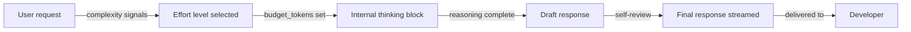

# Modes de réflexion et effort

## Définition

La réflexion étendue est une fonctionnalité des modèles Claude qui permet au modèle de raisonner à travers un problème étape par étape dans un bloc-notes interne dédié avant de produire sa réponse finale. Contrairement à la sortie visible, ce processus de raisonnement est conçu pour la délibération interne du modèle — il fait émerger des conclusions intermédiaires, évalue des alternatives, détecte ses propres erreurs et construit vers une réponse bien considérée. Le résultat est des réponses plus précises sur les tâches complexes, mieux raisonnées sur les problèmes ambigus, et moins susceptibles aux erreurs superficielles de correspondance de patterns.

Dans Claude Code, la réflexion étendue se manifeste comme un paramètre de **niveau d'effort** qui contrôle la quantité de travail computationnel que le modèle effectue avant de répondre. Les réponses à faible effort sont rapides et appropriées pour les tâches simples et non ambiguës (formater du code, expliquer une courte fonction). Les réponses à fort effort investissent plus de budget de raisonnement et sont mieux adaptées aux décisions architecturales complexes, aux sessions de débogage difficiles, ou aux tâches où les erreurs sont coûteuses. Le compromis est toujours vitesse versus profondeur : plus de réflexion prend plus de temps et consomme plus de tokens.

Il est important de distinguer la réflexion étendue du prompting par chaîne de pensée. La chaîne de pensée demande au modèle de montrer son travail dans la sortie — le raisonnement fait partie du texte de réponse. La réflexion étendue, en revanche, se produit dans un bloc `thinking` séparé que le modèle traite en interne. Dans les sessions Claude Code, vous pouvez parfois observer des blocs `<thinking>` dans la sortie brute de l'API, bien que l'interface de Claude Code n'affiche généralement que la réponse finale. La réflexion interne n'est pas soumise aux mêmes contraintes que la sortie et est optimisée pour la qualité du raisonnement plutôt que la lisibilité.

## Comment ça fonctionne

### Blocs de réflexion et tokens budget

Quand la réflexion étendue est activée, le modèle reçoit un paramètre supplémentaire : `budget_tokens`. Cet entier spécifie le nombre maximum de tokens que le modèle peut utiliser pour son raisonnement interne avant de produire la réponse finale. Un budget de 1 000 tokens permet une brève délibération ; un budget de 10 000 tokens permet une analyse profonde et multi-étapes. Le modèle n'utilise pas toujours son budget complet — il arrête de réfléchir quand il atteint une conclusion satisfaisante. Définir le budget plus haut que nécessaire ajoute de la latence sans gains de qualité proportionnels ; le bon budget dépend de la complexité de la tâche.

### Niveaux d'effort dans Claude Code

Claude Code traduit le concept abstrait de tokens budget en niveaux d'effort nommés plus faciles à appréhender :

- **Faible effort (par défaut pour les tâches simples)** : budget de réflexion minimal, réponses rapides, approprié pour le formatage de code, les explications simples, les éditions de fichier unique et les opérations de recherche.
- **Effort moyen** : budget de réflexion modéré, la valeur par défaut pour la plupart des sessions de codage interactives ; équilibre vitesse et qualité pour les tâches de développement typiques.
- **Fort effort / maximum** : grand budget de réflexion, réservé pour les tâches complexes — débogage de problèmes difficiles à reproduire, conception de systèmes, analyse des implications de sécurité, ou toute tâche où une mauvaise réponse serait coûteuse à corriger.

### Quand le modèle réfléchit

Chaque réponse ne déclenche pas la réflexion étendue. Claude Code utilise des heuristiques pour déterminer quand un raisonnement supplémentaire est justifié en fonction des signaux de complexité de la tâche : la longueur et l'ambiguïté de la demande, le nombre de fichiers impliqués, si la tâche implique de faire des changements irréversibles, et si l'utilisateur a explicitement demandé une analyse approfondie. Les utilisateurs peuvent également signaler l'effort souhaité explicitement en ajoutant des phrases comme « réfléchis attentivement à cela » ou « prends ton temps » dans leurs demandes — celles-ci sont reconnues par le modèle comme des signaux pour investir plus de budget de raisonnement.

### Streaming et latence

La réflexion étendue interagit avec le streaming de manière prévisible : le modèle commence à transmettre sa sortie visible uniquement après avoir terminé son raisonnement interne. Cela signifie que les requêtes à fort effort ont une pause initiale plus longue avant que la sortie ne commence, mais le premier token de contenu réel arrive complètement formé plutôt qu'incrémentalement incertain. Dans la CLI de Claude Code et les intégrations IDE, cela apparaît comme un bref indicateur « réflexion en cours... » avant que la réponse ne commence. Pour les sessions interactives, ce délai vaut généralement la peine pour les tâches complexes ; pour les boucles de rétroaction étroites, maintenir l'effort faible est préférable.



## Quand utiliser / Quand NE PAS utiliser

| Utiliser quand | Éviter quand |
|---|---|
| Débogage d'une erreur complexe et difficile à reproduire avec de nombreuses causes racines possibles | Demander un simple one-liner ou une correction de syntaxe rapide — le faible effort est plus rapide et suffisant |
| Conception ou revue d'une architecture système avec des compromis importants | Sessions interactives aller-retour où chaque tour est une petite étape — la latence s'accumule |
| Analyse des implications de sécurité d'un changement de code avant de fusionner | Génération de code boilerplate ou scaffolding qui suit des patterns bien établis |
| Tâches où une mauvaise réponse nécessiterait un retravail significatif | Exécution dans des pipelines CI où le déterminisme et la vitesse importent plus que la profondeur de raisonnement |
| Toute tâche que vous donneriez à un ingénieur senior connu pour « réfléchir avant de coder » | Vous travaillez sous des contraintes de budget de tokens serrées — les tokens de réflexion comptent dans votre utilisation |

## Avantages et inconvénients

| | Avantages | Inconvénients |
|---|---|---|
| **Fort effort** | Meilleure précision sur les tâches complexes ; détecte les cas limites ; produit des explications bien raisonnées | Latence plus élevée ; plus de tokens consommés ; pause plus longue avant le premier token de sortie |
| **Faible effort** | Réponses rapides ; bon pour les boucles interactives serrées ; coût en tokens plus faible | Peut manquer des cas limites sur les tâches complexes ; peut produire une analyse superficielle sur les problèmes ambigus |
| **Effort automatique** | Aucune configuration nécessaire ; le modèle se calibre à la complexité de la tâche | Comportement moins prévisible ; peut sous-investir sur des tâches genuinement difficiles qui semblent simples |

## Exemples de code

```bash
# Claude Code CLI — signaling desired effort level through natural language

# Low effort (fast): simple, well-defined tasks
> Format this function to match our Prettier config

# Medium effort (default): typical coding tasks
> Refactor the UserService class to use dependency injection

# High effort: complex tasks — add "think carefully", "take your time", or "analyze deeply"
> Think carefully: this WebSocket handler occasionally drops messages under high load.
  Analyze all the possible race conditions and ordering issues in src/ws/handler.ts
  before suggesting a fix.

# High effort: architectural decisions
> Take your time to analyze the trade-offs between using Redis Pub/Sub versus
  a message queue like RabbitMQ for our notification service. Consider our
  current scale (10k concurrent users) and the team's operational experience.

# High effort: security review
> Analyze src/auth/jwt.ts carefully for security vulnerabilities. Think through
  all the attack vectors — token forgery, replay attacks, expiry bypass —
  before giving me your assessment.
```

```json
// Claude Code settings.json — configuring default thinking behavior
// Located at: ~/.claude/settings.json or .claude/settings.json in project root
{
  "thinking": {
    "defaultEffort": "medium",
    "maxBudgetTokens": 8000,
    "enableForComplexTasks": true
  }
}
```

```python
# Using extended thinking directly via the Anthropic API (for custom integrations)
import anthropic

client = anthropic.Anthropic()

# High-effort request: complex architectural question
response = client.messages.create(
    model="claude-opus-4-5",
    max_tokens=16000,
    # thinking block enables extended reasoning; budget_tokens controls depth
    thinking={
        "type": "enabled",
        "budget_tokens": 10000  # allow up to 10k tokens of internal reasoning
    },
    messages=[{
        "role": "user",
        "content": (
            "Analyze the following database schema for potential performance issues "
            "at 1M+ rows. Consider indexing strategies, query patterns, and normalization "
            "trade-offs. Schema: [paste schema here]"
        )
    }]
)

# The response content may include both thinking blocks and text blocks
for block in response.content:
    if block.type == "thinking":
        # Internal reasoning — useful for debugging model behavior
        print(f"[THINKING]: {block.thinking[:200]}...")
    elif block.type == "text":
        # Final response — the part to show the user
        print(f"[RESPONSE]: {block.text}")

# Low-effort request: simple, fast task (thinking disabled or minimal budget)
quick_response = client.messages.create(
    model="claude-haiku-4-5",  # Haiku for fast, simple tasks
    max_tokens=1024,
    # No thinking block for simple requests — faster and cheaper
    messages=[{
        "role": "user",
        "content": "Convert this array of objects to a Map keyed by id: [{id: 1, name: 'a'}, {id: 2, name: 'b'}]"
    }]
)
print(quick_response.content[0].text)
```

## Ressources pratiques

- [Documentation de réflexion étendue — Anthropic](https://docs.anthropic.com/en/docs/build-with-claude/extended-thinking) — Référence complète sur les blocs de réflexion, les tokens budget, le comportement de streaming et les paramètres API.
- [Cookbook de réflexion étendue](https://github.com/anthropics/anthropic-cookbook/tree/main/extended_thinking) — Notebooks pratiques démontrant la réflexion étendue pour les tâches de raisonnement complexes.
- [Comparaison des modèles Claude](https://docs.anthropic.com/en/docs/about-claude/models) — Détails de la fiche modèle incluant quels modèles supportent la réflexion étendue et leurs capacités relatives.
- [Référence des paramètres Claude Code](https://docs.anthropic.com/en/docs/claude-code/settings) — Où configurer les niveaux d'effort par défaut et le comportement de réflexion dans Claude Code.

## Voir aussi

- [Vue d'ensemble de Claude Code](/docs/claude-code)
- [Mise en cache des prompts](/docs/claude-code/prompt-caching)
- [Gestion du contexte](/docs/claude-code/context-management)
