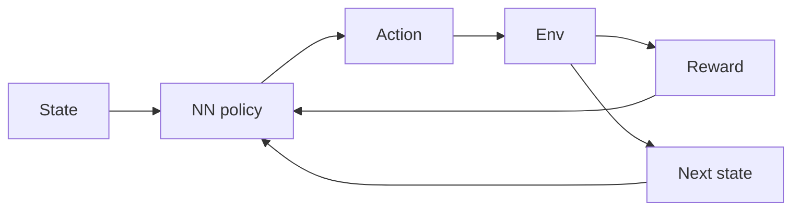

# Apprentissage par renforcement profond (DRL)

## Définition

Deep RL combines reinforcement learning with deep neural networks to handle high-dimensional state and action spaces. Examples: DQN, A3C, PPO, SAC.

[Neural networks](/docs/neural-networks) approximent la fonction de valeur et/ou la politique pour que [RL](/docs/rl) can scale to raw pixels, high-D controls, and large discrete actions. Training is unstable without tricks (experience replay, target networks, advantage estimation); modern algorithms (PPO, SAC) are widely used in robotics and [LLM](/docs/llms) alignment (RLHF, DPO).

## Comment ça fonctionne

The **state** (par ex. image, vector) est alimenté dans un **neural network policy** (or value network) qui produit an **action**. The **env** returns **reward** and **next state**; the agent uses this experience to update the policy (par ex. policy gradient or Q-learning with function approximation). **Experience replay** (store transitions, sample batches) and **target networks** (slow-moving copy of the network) stabilize training. **Advantage estimation** (par ex. GAE) reduces variance in policy gradients. PPO and SAC are common for continuous control; DQN and variants for discrete actions.

## Cas d'utilisation

Deep RL est utilisé quand le problème de décision est complexe et qu'on peut apprendre par essai et erreur (simulation or real environment).

- High-dimensional control (par ex. robotics, autonomous driving)
- Game AI and simulation (par ex. DQN, PPO in complex environments)
- LLM alignment via policy optimization (par ex. RLHF, DPO)

## Documentation externe

- [Spinning Up in Deep RL (OpenAI)](https://spinningup.openai.com/)
- [Stable-Baselines3 – DRL algorithms](https://stable-baselines3.readthedocs.io/)

## Voir aussi

- [RL](/docs/rl)
- [Neural networks](/docs/neural-networks)
