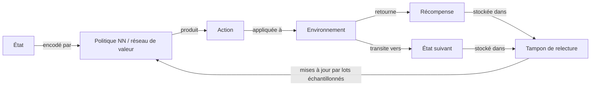

# Deep reinforcement learning (DRL)

## Définition

Le deep reinforcement learning (DRL) étend le [reinforcement learning](/docs/rl) classique en remplaçant l'ingénierie manuelle des caractéristiques et les fonctions de valeur tabulaires par des [réseaux de neurones](/docs/neural-networks) profonds. Cela permet aux algorithmes d'RL de traiter des espaces d'états à haute dimensionnalité — tels que des pixels bruts d'un écran de jeu ou des angles d'articulation d'un robot — qui étaient auparavant intractables. Le réseau de neurones agit comme un approximateur de fonction universel pour la politique, la fonction de valeur, ou les deux.

La percée décisive est venue avec DQN (Mnih et al., 2015), qui a combiné le Q-learning avec un réseau convolutif, la relecture d'expérience et des réseaux cibles pour atteindre un niveau de jeu humain sur 49 jeux Atari. Depuis lors, le domaine a produit une riche famille d'algorithmes : basés sur la valeur (DQN, Rainbow), gradient de politique (REINFORCE, A3C), et acteur-critique (PPO, SAC, TD3). Chaque famille effectue différents compromis entre l'efficacité des échantillons, la stabilité et l'applicabilité aux espaces d'action continus versus discrets.

L'entraînement d'agents deep RL est notoirement instable sans techniques de stabilisation spécifiques. La **relecture d'expérience** brise les corrélations temporelles en stockant des transitions dans un tampon et en échantillonnant des mini-lots aléatoires. Les **réseaux cibles** sont des copies à mise à jour lente du réseau de valeurs qui fournissent des cibles de régression stables. L'**estimation d'avantage** (par ex. GAE) réduit la variance dans les mises à jour du gradient de politique. Les algorithmes modernes tels que PPO et SAC intègrent ces idées par défaut, ce qui en fait des références fiables pour le contrôle continu, la robotique et l'alignement des LLM (RLHF, DPO).

## Comment ça fonctionne

### Politique de réseau de neurones et fonctions de valeur

L'état (par ex. une image, un vecteur de capteurs ou un embedding de tokens) est encodé par un réseau de neurones qui produit soit des probabilités d'action (réseau de politique) soit des retours espérés (réseau de valeur). Dans les méthodes acteur-critique, les deux têtes peuvent partager un backbone.



### Relecture d'expérience

Les transitions (état, action, récompense, état suivant, terminé) sont stockées dans un **tampon de relecture**. Des mini-lots aléatoires sont échantillonnés pour chaque mise à jour du gradient, brisant les corrélations temporelles nuisibles et améliorant l'efficacité des données.

### Réseaux cibles

Une copie du réseau de valeurs — mise à jour lentement (moyennage Polyak) ou périodiquement — fournit des cibles de régression stables. Sans cela, les mises à jour du gradient peuvent osciller car la cible change à chaque étape.

### Estimation d'avantage

Les méthodes de gradient de politique calculent l'avantage A(s, a) = Q(s, a) − V(s) pour indiquer à l'agent à quel point une action était meilleure que la moyenne. L'**estimation d'avantage généralisée (GAE)** échange le biais contre la variance avec un hyperparamètre λ, et est standard dans PPO.

### Algorithmes clés

| Algorithme | Famille | Espace d'action | Caractéristique clé |
|---|---|---|---|
| DQN | Basé sur la valeur | Discret | Relecture d'expérience + réseaux cibles |
| PPO | Acteur-critique | Les deux | Mises à jour de politique écrêtées pour la stabilité |
| SAC | Acteur-critique | Continu | Maximisation de l'entropie pour l'exploration |
| TD3 | Acteur-critique | Continu | Critiques jumeaux réduisent le biais de surestimation |

## Quand utiliser / Quand NE PAS utiliser

| Scénario | Utiliser DRL | Éviter DRL |
|---|---|---|
| Observations à haute dimensionnalité (pixels, capteurs) | Oui — les réseaux de neurones gèrent les entrées brutes | Non — RL tabulaire si l'espace d'état est petit |
| Simulateur disponible pour essai-erreur sécurisé | Oui — DRL nécessite des millions d'échantillons | Non — uniquement monde réel avec interactions limitées |
| Tâches de contrôle complexes à long horizon | Oui — PPO/SAC excellent en contrôle continu | Non — l'apprentissage par imitation est plus rapide si des données d'expert existent |
| Calcul limité ou interprétabilité requise | Non — DRL est intensif en calcul et opaque | — |
| Problème simple basé sur des règles ou à faible dimension | Non — RL classique ou optimisation suffit | — |

## Comparaisons

| Méthode | Espace d'état | Stabilité | Efficacité des échantillons | Utilisation typique |
|---|---|---|---|---|
| Q-learning tabulaire | Petit discret | Élevée | Faible | Environnements jouets |
| DQN | Discret haute-dim | Moyenne | Faible-moyenne | Jeux Atari |
| PPO | Quelconque | Élevée | Moyenne | Robotique, RLHF |
| SAC | Continu | Élevée | Plus élevée | Manipulation robotique |

## Avantages et inconvénients

| Avantages | Inconvénients |
|---|---|
| Gère les entrées de pixels bruts et haute dimensionnalité | Extrêmement inefficace en échantillons vs l'apprentissage supervisé |
| État de l'art sur les jeux, la robotique et l'alignement des LLM | Sensibilité aux hyperparamètres ; instable sans astuces |
| PPO/SAC sont des références robustes et polyvalentes | La mauvaise spécification des récompenses entraîne un comportement inattendu |
| S'adapte au calcul et à la capacité du modèle | Nécessite un simulateur ou un budget important d'interaction avec l'environnement |

## Exemples de code

Boucle d'entraînement PPO minimale utilisant Stable-Baselines3 :

```python
from stable_baselines3 import PPO
from stable_baselines3.common.env_util import make_vec_env

# Environnement vectorisé pour la collecte de rollouts en parallèle
env = make_vec_env("LunarLander-v2", n_envs=4)

model = PPO(
    policy="MlpPolicy",
    env=env,
    learning_rate=3e-4,
    n_steps=2048,        # Étapes par rollout par env
    batch_size=64,
    n_epochs=10,         # Époques de gradient par rollout
    gamma=0.99,
    gae_lambda=0.95,
    clip_range=0.2,      # Paramètre d'écrêtage PPO
    verbose=1,
)

model.learn(total_timesteps=500_000)
model.save("ppo_lunar_lander")

# Évaluation
obs = env.reset()
for _ in range(1000):
    action, _ = model.predict(obs, deterministic=True)
    obs, rewards, dones, info = env.step(action)
```

## Ressources pratiques

- [Spinning Up in Deep RL (OpenAI)](https://spinningup.openai.com/) — Explications concises des algorithmes avec des implémentations PyTorch de PPO, SAC, DDPG et TD3
- [Stable-Baselines3](https://stable-baselines3.readthedocs.io/) — Implémentations DRL bien testées et prêtes pour la production avec une API unifiée
- [CleanRL](https://docs.cleanrl.dev/) — Implémentations lisibles en fichier unique de DQN, PPO, SAC et plus
- [DeepMind Lab / dm_control](https://github.com/deepmind/dm_control) — Environnements de contrôle continu pour l'évaluation comparative DRL

## Voir aussi

- [RL](/docs/rl)
- [Réseaux de neurones](/docs/neural-networks)
