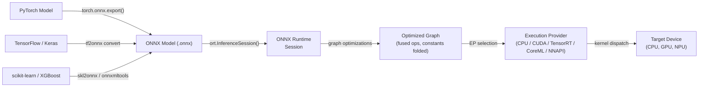

# ONNX Runtime

## Définition

ONNX Runtime (ORT) est une bibliothèque open-source d'inférence et d'accélération d'entraînement multiplateforme développée par Microsoft. Son objectif principal est d'exécuter des modèles au format **Open Neural Network Exchange (ONNX)** — une représentation intermédiaire indépendante du framework pour les modèles d'apprentissage automatique — avec de hautes performances sur une large gamme de cibles matérielles et de systèmes d'exploitation. ORT n'est pas lié à un seul framework d'entraînement : les modèles de PyTorch, TensorFlow, scikit-learn, LightGBM, XGBoost et d'autres peuvent tous être exportés en ONNX et exécutés via la même API runtime, ce qui en fait l'une des solutions d'inférence les plus interopérables disponibles.

À son cœur, ORT charge un graphe ONNX, applique une série étendue d'optimisations au niveau du graphe (pliage de constantes, fusion de nœuds, transformation de layout) et distribue les opérations au meilleur fournisseur d'exécution disponible pour le matériel actuel. L'abstraction du **Fournisseur d'Exécution (EP)** permet à ORT d'acheminer des sous-graphes vers les CPU, les GPU NVIDIA via CUDA ou TensorRT, les GPU AMD via ROCm, le matériel Intel via OpenVINO, Apple Silicon via CoreML, Android via NNAPI, et Windows via DirectML — le tout via une surface d'API unifiée. Cela rend ORT adapté à un spectre de déploiement allant des serveurs cloud aux ordinateurs portables Windows en passant par les appareils mobiles.

ONNX Runtime est particulièrement précieux dans les environnements d'entreprise et de production où un seul pipeline de déploiement doit servir des modèles entraînés dans différents frameworks. C'est le backend d'inférence qui alimente les endpoints Azure ML, la bibliothèque Optimum de Hugging Face, Windows ML et de nombreux systèmes de recommandation et de classement en production.

## Comment ça fonctionne



### Format ONNX et interopérabilité des modèles

ONNX représente un modèle comme un graphe de calcul acyclique dirigé où les nœuds sont des opérateurs standardisés (p. ex. `Conv`, `MatMul`, `LayerNormalization`) définis dans la spécification d'opérateurs ONNX, et les arêtes transportent des tenseurs typés. Le format est versionné : chaque version d'opset ONNX (actuellement 21) définit l'ensemble complet des opérateurs pris en charge et leurs sémantiques. Le fichier `.onnx` sérialisé en protobuf inclut la topologie du graphe, les noms d'opérateurs, les formes des tenseurs et les valeurs des poids constants, rendant le format autonome et portable.

### Optimisations du graphe

Quand une `InferenceSession` est créée, ORT applique trois niveaux d'optimisation du graphe contrôlés par le paramètre `GraphOptimizationLevel`. Le niveau 1 (basique) effectue des réécritures sûres : pliage de constantes, élimination de nœuds redondants, inférence de formes et suppression des identités. Le niveau 2 (étendu) ajoute la fusion d'opérations : `Conv + BatchNorm`, `Conv + Relu`, `Transpose + MatMul` et des patterns similaires sont fusionnés en noyaux uniques. Le niveau 3 (optimisation de layout) restructure les layouts mémoire des tenseurs pour correspondre à ce que préfèrent les fournisseurs d'exécution.

### Fournisseurs d'exécution

Le mécanisme de Fournisseur d'Exécution est le principal levier d'extensibilité et de performance d'ORT. L'**EP CPU** utilise MLAS (Microsoft Linear Algebra Subprograms), une implémentation BLAS vectorisée à la main avec support AVX-512 et NEON. L'**EP CUDA** décharge les convolutions et GEMMs sur cuDNN et cuBLAS. L'**EP TensorRT** applique la fusion de couches et la calibration de précision de TensorRT pour FP16 et INT8. L'**EP CoreML** délègue au Neural Engine d'Apple sur macOS et iOS. L'**EP DirectML** prend en charge l'inférence accélérée par matériel sur n'importe quel GPU compatible DirectX 12 sur Windows.

### Quantification dans ONNX Runtime

ORT prend en charge l'inférence INT8 via le motif de nœud **QDQ (Quantize-Dequantize)** : le graphe ONNX contient des nœuds explicites `QuantizeLinear` et `DequantizeLinear` qui représentent les frontières de précision. La quantification statique nécessite un ensemble de données de calibration pour calculer les échelles d'entrée/sortie ; le package Python `onnxruntime.quantization` fournit les fonctions `quantize_static` et `quantize_dynamic`.

### Déploiement mobile et edge

ORT Mobile est une version allégée d'ONNX Runtime pour Android et iOS qui supprime les opérateurs et bibliothèques EP inutilisés, réduisant la taille binaire à ~1-3 Mo compressé. Sur Android, l'EP NNAPI délègue à l'accélérateur matériel. Sur iOS et macOS, l'EP CoreML utilise l'Apple Neural Engine.

## Quand utiliser / Quand NE PAS utiliser

| Utiliser quand | Éviter quand |
|---|---|
| Vous avez besoin d'une inférence indépendante du framework — servir des modèles de PyTorch, TF et scikit-learn via un seul runtime | Votre cible de déploiement est un microcontrôleur avec \<256 Ko de RAM (TFLM couvre mieux ce cas) |
| Vous construisez des pipelines ML d'entreprise sur Windows/Azure où les outils Microsoft sont déjà en place | Vous avez besoin d'une délégation matérielle Android profonde avec des outils matures aujourd'hui (TFLite est plus éprouvé pour Android) |
| Vous avez besoin de l'accélération NVIDIA TensorRT sans gérer directement l'API TensorRT | Votre modèle utilise des ops personnalisées sans équivalent ONNX |
| Vous voulez une inférence dans le navigateur/WASM pour le même modèle qui s'exécute côté serveur | Votre équipe est native PyTorch et veut la boucle la plus serrée possible du training au mobile |
| La portabilité multiplateforme est une préoccupation de premier ordre (même modèle sur Windows, Linux, macOS, Android, iOS) | Vous avez besoin d'un entraînement en temps réel ou d'un apprentissage en ligne à la périphérie |

## Comparaisons

Comparaison d'ONNX Runtime avec TFLite et PyTorch Mobile pour les scénarios de déploiement edge et multiplateforme.

| Critère | ONNX Runtime | TensorFlow Lite | PyTorch Mobile |
|---|---|---|---|
| Support de plateforme | Windows, Linux, macOS, Android, iOS, WASM, cloud — couverture la plus large | Android, iOS, Linux embarqué, microcontrôleurs (TFLM) | Android, iOS ; ExecuTorch étend à l'embarqué et bare-metal |
| Conversion de modèle | N'importe quel framework → export ONNX (chemin le plus interopérable, plusieurs convertisseurs) | TF/Keras → TFLite Converter (mature, écosystème TF uniquement) | PyTorch → TorchScript ou ExecuTorch (natif PyTorch, moins de friction pour les utilisateurs PT) |
| Performance sur appareil | EP CPU avec MLAS est compétitif ; EPs TensorRT/CUDA en tête pour GPU ; EPs CoreML/NNAPI pour mobile | Excellent sur Android via NNAPI/délégué GPU ; meilleur de sa catégorie pour microcontrôleurs | XNNPACK sur CPU ARM ; GPU Vulkan ; délégation NPU ExecuTorch |
| Écosystème | Indépendant du framework ; Hugging Face Optimum ; Windows ML ; Azure ML ; forte adoption en entreprise | Mature : MediaPipe, TF Hub, Model Garden ; la plus grande communauté ML mobile | Fort en recherche ; Hugging Face ; communauté ExecuTorch en croissance |
| Support de quantification | INT8 via nœuds QDQ ; PTQ dynamique et statique ; QAT ; INT8 matériel via EP | Complet : plage dynamique, INT8, FP16, QAT avec chemins INT8 complets | PTQ (INT8 dynamique + statique) et QAT via torch.ao.quantization |

## Avantages et inconvénients

| Avantages | Inconvénients |
|---|---|
| Indépendant du framework : tout modèle exportable ONNX fonctionne avec le même runtime | L'export ONNX peut échouer pour les modèles avec des ops non supportées ou personnalisées |
| Couverture de fournisseur d'exécution la plus large : CPU, CUDA, TensorRT, DirectML, CoreML, NNAPI, OpenVINO | Le débogage des graphes ONNX est plus difficile que le débogage natif du framework |
| Forte intégration Windows et Azure ; citoyen de première classe dans le stack ML Microsoft | Plus de complexité opérationnelle que TFLite pour les scénarios Android/iOS purs |
| Hugging Face Optimum fournit une quantification et optimisation de haut niveau pour les transformers | Le versionnage des opsets ONNX peut créer des frictions de compatibilité entre exporteurs et versions ORT |
| Performance CPU compétitive via MLAS avec vectorisation AVX-512 et NEON | La taille binaire mobile est plus grande que TFLite quand tous les EPs sont inclus |

## Exemples de code

```python
import numpy as np
import torch
import torch.nn as nn
import onnxruntime as ort

# ── 1. Define a simple model in PyTorch ───────────────────────────────────────
class SimpleClassifier(nn.Module):
    """Minimal classifier for demonstration."""

    def __init__(self, input_dim: int = 784, num_classes: int = 10):
        super().__init__()
        self.net = nn.Sequential(
            nn.Linear(input_dim, 128),
            nn.ReLU(),
            nn.Linear(128, 64),
            nn.ReLU(),
            nn.Linear(64, num_classes),
        )

    def forward(self, x: torch.Tensor) -> torch.Tensor:
        return self.net(x)


model = SimpleClassifier()
# Switch to inference mode: disables dropout, BatchNorm uses running statistics
model.train(False)

# ── 2. Export PyTorch model to ONNX ──────────────────────────────────────────
dummy_input = torch.randn(1, 784)  # batch=1, flattened 28x28 image

torch.onnx.export(
    model,
    dummy_input,
    "model.onnx",
    opset_version=17,                         # target ONNX opset
    input_names=["input"],
    output_names=["logits"],
    dynamic_axes={
        "input":  {0: "batch_size"},          # allow variable batch size
        "logits": {0: "batch_size"},
    },
    do_constant_folding=True,                 # fold constant sub-expressions during export
)
print("Exported model.onnx")

# ── 3. Apply INT8 post-training dynamic quantization ─────────────────────────
from onnxruntime.quantization import quantize_dynamic, QuantType

quantize_dynamic(
    "model.onnx",
    "model_int8.onnx",
    weight_type=QuantType.QInt8,              # quantize weights to INT8
)
print("Quantized model saved as model_int8.onnx")

# ── 4. Run inference with ONNX Runtime ───────────────────────────────────────
# SessionOptions allow controlling graph optimization level and thread counts
sess_options = ort.SessionOptions()
sess_options.graph_optimization_level = ort.GraphOptimizationLevel.ORT_ENABLE_ALL

# Providers list is checked in order; falls back to CPU if GPU is unavailable
providers = ["CUDAExecutionProvider", "CPUExecutionProvider"]
session = ort.InferenceSession("model_int8.onnx", sess_options, providers=providers)

print(f"Active execution provider: {session.get_providers()[0]}")

# Prepare a batch of random inputs as float32 numpy arrays
batch = np.random.randn(4, 784).astype(np.float32)
input_name = session.get_inputs()[0].name
output_name = session.get_outputs()[0].name

outputs = session.run([output_name], {input_name: batch})
logits = outputs[0]                          # shape (4, 10)
predicted_classes = np.argmax(logits, axis=1)
print(f"Batch predictions: {predicted_classes}")
```

## Ressources pratiques

- [Documentation ONNX Runtime](https://onnxruntime.ai/docs/) — référence officielle couvrant l'installation, les fournisseurs d'exécution, l'optimisation des graphes, la quantification et le déploiement mobile pour toutes les plateformes prises en charge.
- [Référence API Python ONNX Runtime](https://onnxruntime.ai/docs/api/python/api_summary.html) — documentation API détaillée pour `InferenceSession`, `SessionOptions`, les fournisseurs d'exécution et le sous-package de quantification.
- [Hugging Face Optimum](https://huggingface.co/docs/optimum/onnxruntime/overview) — bibliothèque de haut niveau qui enveloppe ORT pour l'optimisation des modèles transformer, fournissant les classes `ORTModelForXxx` et `ORTQuantizer`.
- [ONNX Model Zoo](https://github.com/onnx/models) — référentiel curé de modèles ONNX pré-entraînés couvrant la vision par ordinateur, NLP, la parole et le ML classique.
- [Guide de déploiement mobile ONNX Runtime](https://onnxruntime.ai/docs/tutorials/mobile/) — tutoriel étape par étape pour construire une application ORT minimale pour Android ou iOS.

## Voir aussi

- [TensorFlow Lite](/docs/edge-ai/tflite)
- [PyTorch Mobile](/docs/edge-ai/pytorch-mobile)
- [PyTorch](/docs/frameworks/pytorch)
- [TensorFlow](/docs/frameworks/tensorflow)
