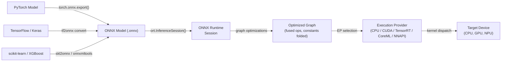

# ONNX Runtime

## Définition

ONNX Runtime (ORT) est une bibliothèque d'accélération d'inférence et d'entraînement open-source et multiplateforme développée par Microsoft. Son objectif principal est d'exécuter des modèles au format **Open Neural Network Exchange (ONNX)** — une représentation intermédiaire agnostique au framework pour les modèles de machine learning — avec de hautes performances sur une large gamme de cibles matérielles et de systèmes d'exploitation. ORT n'est lié à aucun framework d'entraînement unique : les modèles de PyTorch, TensorFlow, scikit-learn, LightGBM, XGBoost et d'autres peuvent tous être exportés vers ONNX et exécutés via la même API de runtime, ce qui en fait l'une des solutions d'inférence les plus interopérables disponibles.

Au cœur de son fonctionnement, ORT charge un graphe ONNX, applique une série extensive d'optimisations au niveau du graphe (pliage des constantes, fusion de nœuds, transformation de mise en page) et dispatche les opérations vers le meilleur fournisseur d'exécution disponible pour le matériel actuel. L'abstraction du **Fournisseur d'Exécution (EP)** permet à ORT d'acheminer les sous-graphes vers les CPU, les GPU NVIDIA via CUDA ou TensorRT, les GPU AMD via ROCm, le matériel Intel via OpenVINO, Apple Silicon via CoreML, Android via NNAPI et Windows via DirectML — le tout via une surface d'API unifiée. Cela rend ORT adapté à un spectre de déploiement allant des serveurs cloud aux laptops Windows en passant par les appareils mobiles.

ONNX Runtime est particulièrement utile dans les environnements d'entreprise et de production où un seul pipeline de déploiement doit servir des modèles entraînés dans différents frameworks. C'est le backend d'inférence alimentant les endpoints Azure ML, la bibliothèque Optimum de Hugging Face, Windows ML et de nombreux systèmes de recommandation et de classement en production. Son extension d'entraînement (ORT Training) permet également le fine-tuning accéléré de grands modèles de transformeurs, mais l'inférence est son cas d'usage principal.

## Comment ça fonctionne



### Format ONNX et interopérabilité des modèles

ONNX représente un modèle comme un graphe de calcul acyclique dirigé où les nœuds sont des opérateurs standardisés (par ex. `Conv`, `MatMul`, `LayerNormalization`) définis dans la spécification des opérateurs ONNX, et les arêtes transportent des tenseurs typés. Le format est versionné : chaque version d'opset ONNX (actuellement 21) définit l'ensemble complet des opérateurs supportés et leurs sémantiques. Les exportateurs de chaque framework mappent les ops spécifiques au framework vers leurs équivalents ONNX ; lorsqu'un mapping direct n'existe pas, des extensions `custom_op` peuvent être enregistrées. Le fichier `.onnx` sérialisé en protobuf inclut la topologie du graphe, les noms des opérateurs, les formes des tenseurs et les valeurs de poids constants, rendant le format autonome et portable.

### Optimisations du graphe

Lorsqu'une `InferenceSession` est créée, ORT applique trois niveaux d'optimisation du graphe contrôlés par le paramètre `GraphOptimizationLevel`. Le niveau 1 (basic) effectue des réécritures sûres : pliage des constantes, élimination des nœuds redondants, inférence de forme et suppression d'identité. Le niveau 2 (extended) ajoute la fusion d'opérations : `Conv + BatchNorm`, `Conv + Relu`, `Transpose + MatMul` et des patterns similaires sont fusionnés en noyaux uniques pour éliminer les allocations mémoire intermédiaires et la surcharge de lancement des noyaux. Le niveau 3 (layout optimization) restructure les mises en page mémoire des tenseurs pour correspondre à ce que les fournisseurs d'exécution préfèrent (par ex. NHWC pour les convolutions GPU). Les graphes optimisés peuvent être sérialisés de nouveau vers `.onnx` pour inspection ou pour éviter la ré-optimisation lors des chargements suivants.

### Fournisseurs d'exécution

Le mécanisme de Fournisseur d'Exécution est le principal levier d'extensibilité et de performance d'ORT. Lorsqu'une session est créée avec un EP spécifique, ORT interroge quels nœuds l'EP peut gérer, partitionne le graphe et remplace les sous-graphes revendiqués par des implémentations `ComputeKernel` spécifiques à l'EP. Le **CPU EP** utilise MLAS (Microsoft Linear Algebra Subprograms), une implémentation BLAS vectorisée à la main avec support AVX-512 et NEON. Le **CUDA EP** décharge les convolutions et GEMMs vers cuDNN et cuBLAS. Le **TensorRT EP** applique la fusion de couches de TensorRT et le calibrage de précision pour FP16 et INT8, produisant le débit le plus élevé sur les GPU NVIDIA. Le **CoreML EP** délègue au Neural Engine d'Apple sur macOS et iOS. Le **DirectML EP** supporte l'inférence accélérée matériellement sur tout GPU compatible DirectX 12 sous Windows, incluant les graphiques intégrés AMD et Intel.

### Quantification dans ONNX Runtime

ORT supporte l'inférence INT8 via le pattern de nœud **QDQ (Quantize-Dequantize)** : le graphe ONNX contient des nœuds explicites `QuantizeLinear` et `DequantizeLinear` qui représentent les frontières de précision. La quantification statique nécessite un ensemble de données de calibrage pour calculer les échelles d'entrée/sortie ; le package Python `onnxruntime.quantization` fournit les fonctions `quantize_static` et `quantize_dynamic`. ORT accepte également les modèles exportés avec QAT où des nœuds Q/DQ ont été insérés pendant l'entraînement. L'accélération matérielle INT8 n'est activée que lorsque le fournisseur d'exécution le supporte (le CUDA EP nécessite CUDA 11+, le TensorRT EP gère INT8 nativement via des tables de calibrage). L'`ORTQuantizer` dans Hugging Face Optimum fournit une interface de haut niveau pour quantifier les modèles de transformeurs de bout en bout.

### Déploiement mobile et edge

ORT Mobile est une version allégée d'ONNX Runtime pour Android et iOS qui supprime les opérateurs inutilisés et les bibliothèques EP, réduisant la taille binaire à ~1-3 Mo compressé. Le package Python `onnxruntime-mobile` prépare les modèles pour mobile en pré-emballant les poids et en éliminant les métadonnées de temps d'entraînement. Sur Android, le NNAPI EP délègue à l'accélérateur matériel. Sur iOS et macOS, le CoreML EP utilise le Neural Engine d'Apple. ORT fonctionne également sur Raspberry Pi (ARM Linux) via le CPU EP, et un support expérimental existe pour les cibles WebAssembly. Le package npm `ort` permet ORT dans Node.js et les contextes navigateur via WASM.

## Quand utiliser / Quand NE PAS utiliser

| Utiliser quand | Éviter quand |
|---|---|
| Vous avez besoin d'inférence agnostique au framework — servir des modèles de PyTorch, TF et scikit-learn via un seul runtime | Votre cible de déploiement est un microcontrôleur avec \<256 Ko de RAM (TFLM couvre mieux ce cas) |
| Vous construisez des pipelines ML d'entreprise sur Windows/Azure où les outils Microsoft sont déjà en place | Vous avez besoin d'une délégation matérielle Android profonde avec des outils matures aujourd'hui (TFLite est plus éprouvé pour Android) |
| Vous avez besoin d'accélération NVIDIA TensorRT sans gérer directement l'API TensorRT | Votre modèle utilise des ops personnalisées qui n'ont pas d'équivalent ONNX et sont impraticables à enregistrer |
| Vous souhaitez une inférence navigateur/WASM pour le même modèle qui s'exécute côté serveur | Votre équipe est native PyTorch et veut la boucle la plus serrée possible de l'entraînement au mobile (PyTorch Mobile / ExecuTorch peut être plus simple) |
| La portabilité multiplateforme est une préoccupation de premier plan (même modèle sur Windows, Linux, macOS, Android, iOS) | Vous avez besoin d'un entraînement en temps réel ou d'un apprentissage en ligne à la périphérie (ORT Training existe mais ajoute une complexité significative) |

## Comparaisons

Comparaison d'ONNX Runtime avec TFLite et PyTorch Mobile pour le déploiement edge et multiplateforme.

| Critère | ONNX Runtime | TensorFlow Lite | PyTorch Mobile |
|---|---|---|---|
| Support des plateformes | Windows, Linux, macOS, Android, iOS, WASM, cloud — couverture la plus large | Android, iOS, Linux embarqué, microcontrôleurs (TFLM) | Android, iOS ; ExecuTorch étend à l'embarqué et bare-metal |
| Conversion de modèle | N'importe quel framework → export ONNX (chemin le plus interopérable, plusieurs convertisseurs) | TF/Keras → TFLite Converter (mature, écosystème TF uniquement) | PyTorch → TorchScript ou ExecuTorch (natif PyTorch, moins de friction pour les utilisateurs PT) |
| Performance sur appareil | CPU EP avec MLAS est compétitif ; EPs TensorRT/CUDA mènent pour GPU ; EPs CoreML/NNAPI pour mobile | Excellent sur Android via NNAPI/délégué GPU ; meilleur de sa catégorie pour les microcontrôleurs | XNNPACK sur CPU ARM ; GPU Vulkan ; délégation NPU ExecuTorch |
| Écosystème | Agnostique au framework ; Hugging Face Optimum ; Windows ML ; Azure ML ; forte adoption entreprise | Mature : MediaPipe, TF Hub, Model Garden ; plus grande communauté ML mobile | Fort en recherche ; Hugging Face ; communauté ExecuTorch en croissance |
| Support de quantification | INT8 via nœuds QDQ ; PTQ dynamique et statique ; QAT ; INT8 matériel via EP | Complet : plage dynamique, INT8, FP16, QAT avec chemins INT8 complets | PTQ (INT8 dynamique + statique) et QAT via torch.ao.quantization |

## Avantages et inconvénients

| Avantages | Inconvénients |
|------|------|
| Agnostique au framework : tout modèle exportable en ONNX fonctionne avec le même runtime | L'export ONNX peut échouer pour les modèles avec des ops non supportées ou personnalisées |
| Couverture des fournisseurs d'exécution la plus large : CPU, CUDA, TensorRT, DirectML, CoreML, NNAPI, OpenVINO | Le débogage des graphes ONNX est plus difficile que le débogage natif du framework |
| Forte intégration Windows et Azure ; citoyen de première classe dans la stack ML Microsoft | Plus de complexité opérationnelle que TFLite pour les scénarios purement Android/iOS |
| Hugging Face Optimum fournit une quantification et optimisation de haut niveau pour les transformeurs | Le versionnage des opsets ONNX peut créer des frictions de compatibilité entre les exportateurs et les versions ORT |
| Performance CPU compétitive via MLAS avec vectorisation AVX-512 et NEON | La taille binaire mobile est plus grande que TFLite lorsque tous les EPs sont inclus |

## Exemples de code

```python
import numpy as np
import torch
import torch.nn as nn
import onnxruntime as ort

# ── 1. Define a simple model in PyTorch ───────────────────────────────────────
class SimpleClassifier(nn.Module):
    """Minimal classifier for demonstration."""

    def __init__(self, input_dim: int = 784, num_classes: int = 10):
        super().__init__()
        self.net = nn.Sequential(
            nn.Linear(input_dim, 128),
            nn.ReLU(),
            nn.Linear(128, 64),
            nn.ReLU(),
            nn.Linear(64, num_classes),
        )

    def forward(self, x: torch.Tensor) -> torch.Tensor:
        return self.net(x)


model = SimpleClassifier()
# Switch to inference mode: disables dropout, BatchNorm uses running statistics
model.train(False)

# ── 2. Export PyTorch model to ONNX ──────────────────────────────────────────
dummy_input = torch.randn(1, 784)  # batch=1, flattened 28x28 image

torch.onnx.export(
    model,
    dummy_input,
    "model.onnx",
    opset_version=17,                         # target ONNX opset
    input_names=["input"],
    output_names=["logits"],
    dynamic_axes={
        "input":  {0: "batch_size"},          # allow variable batch size
        "logits": {0: "batch_size"},
    },
    do_constant_folding=True,                 # fold constant sub-expressions during export
)
print("Exported model.onnx")

# ── 3. Apply INT8 post-training dynamic quantization ─────────────────────────
from onnxruntime.quantization import quantize_dynamic, QuantType

quantize_dynamic(
    "model.onnx",
    "model_int8.onnx",
    weight_type=QuantType.QInt8,              # quantize weights to INT8
)
print("Quantized model saved as model_int8.onnx")

# ── 4. Run inference with ONNX Runtime ───────────────────────────────────────
# SessionOptions allow controlling graph optimization level and thread counts
sess_options = ort.SessionOptions()
sess_options.graph_optimization_level = ort.GraphOptimizationLevel.ORT_ENABLE_ALL

# Providers list is checked in order; falls back to CPU if GPU is unavailable
providers = ["CUDAExecutionProvider", "CPUExecutionProvider"]
session = ort.InferenceSession("model_int8.onnx", sess_options, providers=providers)

print(f"Active execution provider: {session.get_providers()[0]}")

# Prepare a batch of random inputs as float32 numpy arrays
batch = np.random.randn(4, 784).astype(np.float32)
input_name = session.get_inputs()[0].name
output_name = session.get_outputs()[0].name

outputs = session.run([output_name], {input_name: batch})
logits = outputs[0]                          # shape (4, 10)
predicted_classes = np.argmax(logits, axis=1)
print(f"Batch predictions: {predicted_classes}")
```

## Ressources pratiques

- [Documentation ONNX Runtime](https://onnxruntime.ai/docs/) — Référence officielle couvrant l'installation, les fournisseurs d'exécution, l'optimisation du graphe, la quantification et le déploiement mobile pour toutes les plateformes supportées.
- [Référence API Python ONNX Runtime](https://onnxruntime.ai/docs/api/python/api_summary.html) — Docs API détaillées pour `InferenceSession`, `SessionOptions`, les fournisseurs d'exécution et le sous-package de quantification.
- [Hugging Face Optimum](https://huggingface.co/docs/optimum/onnxruntime/overview) — Bibliothèque de haut niveau qui encapsule ORT pour l'optimisation des modèles de transformeurs, fournissant les classes `ORTModelForXxx` et `ORTQuantizer` pour l'export en une étape et la quantification INT8.
- [ONNX Model Zoo](https://github.com/onnx/models) — Dépôt organisé de modèles ONNX pré-entraînés couvrant la vision par ordinateur, le NLP, la parole et le ML classique ; utile pour mesurer les performances ORT et comme templates de déploiement.
- [Guide de déploiement mobile ONNX Runtime](https://onnxruntime.ai/docs/tutorials/mobile/) — Tutoriel étape par étape pour construire une application Android ou iOS ORT minimale, incluant la préparation du modèle et la configuration EP NNAPI/CoreML.

## Voir aussi

- [TensorFlow Lite](/docs/edge-ai/tflite)
- [PyTorch Mobile](/docs/edge-ai/pytorch-mobile)
- [PyTorch](/docs/frameworks/pytorch)
- [TensorFlow](/docs/frameworks/tensorflow)
