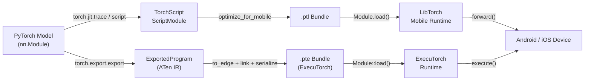

# PyTorch Mobile

## Définition

PyTorch Mobile est la famille d'outils et de runtimes qui apporte les modèles entraînés avec PyTorch sur les appareils Android et iOS sans nécessiter de connexion serveur ou cloud. Il préserve l'expérience de développement PyTorch — les chercheurs et ingénieurs s'entraînent dans l'API Python en mode eager familier, puis exportent leurs modèles via le chemin **TorchScript** ou le plus récent **ExecuTorch** pour le déploiement sur appareil. Ce couplage étroit entre les environnements d'entraînement et de déploiement réduit la surface pour les bugs de divergence numérique qui émergent souvent lors du changement de framework.

Le chemin de déploiement historique est centré sur TorchScript, un sous-ensemble de Python statiquement typé qui peut être compilé et sérialisé dans un format indépendant de la plateforme (`.ptl` pour mobile). TorchScript supporte deux modes de compilation : le **tracing**, où un exemple d'entrée est passé à travers le modèle et le chemin d'exécution est enregistré, et le **scripting**, où le flux de contrôle Python est analysé statiquement. Les deux produisent un `ScriptModule` qui peut être chargé par le runtime C++ LibTorch embarqué dans le SDK mobile.

Google et Meta ont développé conjointement **ExecuTorch** comme framework de nouvelle génération pour exécuter des modèles PyTorch en périphérie. ExecuTorch introduit un format d'exécution portable (`.pte`), un runtime C++ minimal (moins de 50 Ko pour les modèles simples) et un support de première classe pour la délégation vers des backends matériels incluant Qualcomm AI Engine, Apple Neural Engine, NPUs Arm Ethos et DSPs Cadence. ExecuTorch est conçu pour une utilisation en production et remplace le runtime PyTorch Mobile original pour les nouveaux projets nécessitant une large portabilité matérielle et une taille binaire minimale.

## Comment ça fonctionne



### Tracing et Scripting TorchScript

Le tracing (`torch.jit.trace`) exécute un exemple d'entrée à travers le modèle et enregistre la séquence d'opérations tensorielles, produisant un graphe de calcul statique. Le tracing est simple et couvre la plupart des architectures standard, mais il capture uniquement le chemin d'exécution pour l'entrée donnée — le flux de contrôle dépendant des données (instructions if, boucles qui varient avec les valeurs d'entrée) sera silencieusement intégré. Le scripting (`torch.jit.script`) analyse le source Python avec un vérificateur de type TorchScript et préserve le flux de contrôle, le rendant correct pour les modèles avec une logique de branchement. En pratique, les approches hybrides sont courantes : scripter le module de niveau supérieur tout en traçant les sous-modules internes qui n'ont pas de flux de contrôle dynamique.

### Pipeline d'export ExecuTorch

ExecuTorch utilise `torch.export.export` pour capturer une représentation stricte et sans effets de bord du modèle en ATen IR — un ensemble canonique d'opérateurs PyTorch garantis d'avoir une sémantique bien définie. Le programme exporté est ensuite abaissé vers l'**Edge IR** via `to_edge`, qui effectue des passes de graphe spécifiques au backend (décomposition des opérateurs, propagation de mise en page). Les backends (cibles de délégation) peuvent revendiquer des sous-graphes lors de l'étape `to_backend`, les remplaçant par des implémentations spécifiques au matériel. L'artefact final est sérialisé vers un flatbuffer `.pte` qui est chargé par le runtime C++ ExecuTorch, qui ne nécessite pas d'allocation de mémoire dynamique pendant l'inférence.

### Optimisation : Quantification et élagage

PyTorch offre une quantification post-entraînement statique et dynamique via `torch.quantization` (legacy) et le nouvel espace de noms `torch.ao.quantization`. La quantification statique INT8 nécessite un ensemble de données de calibrage représentatif et réduit la taille du modèle d'environ 4x avec une amélioration de la latence de 2-3x sur les CPU ARM. L'entraînement conscient de la quantification (QAT) insère des nœuds `FakeQuantize` dans le graphe de passage en avant pendant le fine-tuning, permettant au modèle d'adapter ses poids à la précision INT8. L'élagage (`torch.nn.utils.prune`) supprime des poids individuels ou des canaux entiers basé sur la magnitude ou des critères structurés, réduisant la charge de calcul effective avant la quantification. Les deux techniques peuvent être combinées : élaguer d'abord pour réduire les canaux, puis quantifier pour réduire la précision.

### Runtime mobile et intégration de plateforme

Le bundle `.ptl` produit par `optimize_for_mobile` inclut des optimisations de fusion d'opérateurs et élimine les opérateurs inutilisés du registre d'opérateurs, réduisant l'empreinte binaire. Le SDK Android (`pytorch_android`) est publié sur Maven Central et expose une API Kotlin/Java. Le SDK iOS est distribué comme CocoaPod ou Swift Package et fournit des liaisons Objective-C et Swift. Les deux SDKs encapsulent le même noyau C++ LibTorch. ExecuTorch cible les mêmes plateformes mais expose une API C plus légère et supporte également les cibles embarquées bare-metal. La classe `torch::executor::Module` fournit une API `execute()` minimale qui opère directement sur des tenseurs `EValue` pré-alloués, évitant la surcharge de style JNI.

### Accélération GPU et NPU

Le délégué GPU de PyTorch Mobile pour Android fonctionne via le backend Vulkan (`torch.backends.vulkan`), qui décharge les convolutions et multiplications matricielles vers le GPU. Le backend XNNPACK d'ExecuTorch accélère les opérations à virgule flottante et INT8 sur les CPU ARM via les instructions SIMD NEON et est le défaut recommandé pour l'accélération CPU. Le backend Qualcomm AI Engine Direct et le backend Apple Core ML fournissent une accélération au niveau NPU via l'API de délégation d'ExecuTorch, produisant généralement des accélérations de 5-15x par rapport aux chemins CPU de référence pour les modèles de vision et NLP standard.

## Quand utiliser / Quand NE PAS utiliser

| Utiliser quand | Éviter quand |
|---|---|
| Votre base de code d'entraînement est PyTorch et vous souhaitez une friction de conversion minimale | Vos modèles proviennent de TensorFlow/Keras et la surcharge de conversion est une préoccupation |
| Vous devez déployer sur Android ou iOS avec un workflow familier à Python | Vous avez besoin de cibles microcontrôleur avec \<256 Ko de RAM (TFLM est mieux adapté) |
| Vous souhaitez ExecuTorch pour la délégation NPU matérielle de nouvelle génération (Qualcomm, Apple ANE) | Votre modèle utilise un flux de contrôle dynamique au niveau Python que TorchScript ne peut pas capturer via le tracing |
| Itération rapide : réutilisez la même classe de modèle pour l'entraînement et l'inférence mobile | Vous avez besoin d'outils de production matures avec une large couverture de délégués matériels aujourd'hui (TFLite est plus mature) |
| Vous construisez sur l'écosystème Hugging Face (de nombreux modèles s'exportent via TorchScript) | La taille binaire est extrêmement contrainte et l'empreinte du runtime LibTorch (~3-8 Mo compressé) est trop grande |

## Comparaisons

Comparaison de PyTorch Mobile avec TFLite et ONNX Runtime pour les scénarios de déploiement edge.

| Critère | PyTorch Mobile | TensorFlow Lite | ONNX Runtime |
|---|---|---|---|
| Support des plateformes | Android, iOS ; ExecuTorch étend à l'embarqué et bare-metal | Android, iOS, Linux embarqué, microcontrôleurs (TFLM) | Windows, Linux, macOS, Android, iOS, WebAssembly |
| Conversion de modèle | torch.jit.trace / script (natif PyTorch) ou torch.export (ExecuTorch) | TFLite Converter depuis TF/Keras SavedModel | N'importe quel framework → export ONNX (chemin le plus interopérable) |
| Performance sur appareil | XNNPACK sur CPU ARM ; GPU Vulkan ; délégation NPU ExecuTorch | Excellent sur Android via NNAPI/délégué GPU ; meilleur de sa catégorie pour les microcontrôleurs | CPU EP compétitif ; EPs CUDA/TensorRT brillent dans les appareils edge avec GPU |
| Écosystème | Fort en recherche ; intégration Hugging Face ; communauté ExecuTorch en croissance | Mature : MediaPipe, TF Hub, Model Garden ; plus grande communauté ML mobile | Support entreprise large ; agnostique au framework ; forte intégration Microsoft/Azure |
| Support de quantification | PTQ (INT8 dynamique + statique) et QAT via torch.ao.quantization ; quantification spécifique au backend ExecuTorch | Complet : plage dynamique, INT8, FP16, QAT avec chemins INT8 complets | INT8 via nœuds QDQ ; INT8 matériel dépend du fournisseur d'exécution |

## Avantages et inconvénients

| Avantages | Inconvénients |
|------|------|
| Workflow transparent pour les utilisateurs PyTorch — même classe de modèle pour l'entraînement et le déploiement | Le binaire mobile LibTorch ajoute ~3-8 Mo à la taille de l'app compressée |
| ExecuTorch fournit une architecture moderne et extensible pour la délégation NPU | Le tracing TorchScript manque silencieusement le flux de contrôle dépendant des données |
| Forte intégration avec l'écosystème Hugging Face | Moins mature que TFLite pour les déploiements Android/iOS en production |
| QAT est bien intégré avec la boucle d'entraînement standard | La couverture du délégué GPU Vulkan est plus étroite que le délégué GPU de TFLite |
| Développement actif avec un fort soutien de Meta et de la communauté | L'interopérabilité ONNX nécessite une étape de conversion supplémentaire via l'exportateur ONNX |

## Exemples de code

```python
import torch
import torch.nn as nn

# ── 1. Define a simple convolutional model ────────────────────────────────────
class SmallCNN(nn.Module):
    """Minimal CNN for demonstration. Replace with your real model."""

    def __init__(self, num_classes: int = 10):
        super().__init__()
        self.features = nn.Sequential(
            nn.Conv2d(1, 16, kernel_size=3, padding=1),
            nn.ReLU(inplace=True),
            nn.MaxPool2d(2),
            nn.Conv2d(16, 32, kernel_size=3, padding=1),
            nn.ReLU(inplace=True),
            nn.AdaptiveAvgPool2d(1),
        )
        self.classifier = nn.Linear(32, num_classes)

    def forward(self, x: torch.Tensor) -> torch.Tensor:
        x = self.features(x)
        x = x.flatten(1)
        return self.classifier(x)


model = SmallCNN(num_classes=10)
model.eval()  # set model to inference mode

# ── 2. Export with TorchScript tracing ───────────────────────────────────────
example_input = torch.rand(1, 1, 28, 28)
scripted_model = torch.jit.trace(model, example_input)

from torch.utils.mobile_optimizer import optimize_for_mobile

optimized_model = optimize_for_mobile(scripted_model)
optimized_model._save_for_lite_interpreter("model.ptl")
print("Saved model.ptl")

# ── 3. Apply post-training dynamic quantization ───────────────────────────────
quantized_model = torch.quantization.quantize_dynamic(
    model,
    qconfig_spec={nn.Linear, nn.Conv2d},  # quantize these layer types to INT8
    dtype=torch.qint8,
)
quantized_model.eval()

with torch.no_grad():
    output = quantized_model(example_input)
print(f"Output shape: {output.shape}, predicted class: {output.argmax(dim=1).item()}")

# ── 4. Load .ptl on Python (mirrors Android/iOS Module.load() behavior) ───────
loaded = torch.jit.load("model.ptl")
loaded.eval()
with torch.no_grad():
    result = loaded(example_input)
print(f"Loaded mobile model predicted class: {result.argmax(dim=1).item()}")
```

## Ressources pratiques

- [Documentation PyTorch Mobile](https://pytorch.org/mobile/home/) — Guide officiel couvrant l'export TorchScript, les SDKs Android et iOS, l'optimisation des modèles et le profilage des performances sur appareil.
- [Documentation ExecuTorch](https://pytorch.org/executorch/) — La documentation du runtime edge de nouvelle génération, couvrant le pipeline d'export, la délégation de backend et les guides d'intégration matérielle pour Qualcomm, Apple et ARM.
- [Guide torch.ao.quantization](https://pytorch.org/docs/stable/quantization.html) — Référence complète pour l'API de quantification de PyTorch, couvrant PTQ, QAT et le nouvel espace de noms `torch.ao` utilisé dans les workflows ExecuTorch.
- [Apps de démonstration Android PyTorch](https://github.com/pytorch/android-demo-app) — Apps Android open-source démontrant la classification d'images, la détection d'objets, la reconnaissance vocale et le NLP avec PyTorch Mobile ; utiles comme templates d'intégration.
- [Tutoriels ExecuTorch](https://pytorch.org/executorch/stable/tutorials/export-to-executorch-tutorial.html) — Tutoriels étape par étape pour exporter des modèles via le pipeline ExecuTorch et les exécuter avec le runtime C++.

## Voir aussi

- [TensorFlow Lite](/docs/edge-ai/tflite)
- [ONNX Runtime](/docs/edge-ai/onnx)
- [PyTorch](/docs/frameworks/pytorch)
- [Quantification](/docs/quantization)
