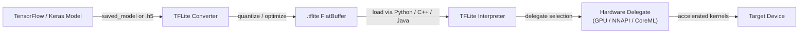

# TensorFlow Lite

## Définition

TensorFlow Lite (TFLite) est le framework open-source de Google pour exécuter des modèles de machine learning sur des appareils à ressources limitées — téléphones mobiles, tablettes, systèmes embarqués et microcontrôleurs. Plutôt qu'un framework d'entraînement, TFLite est un **runtime d'inférence** dédié : les modèles sont entraînés avec TensorFlow complet, convertis au format compact `.tflite`, puis exécutés sur l'appareil sans nécessiter de connexion à un serveur. Cette conception permet aux applications d'effectuer des tâches ML — classification d'images, détection d'objets, reconnaissance vocale, compréhension du langage naturel — entièrement hors ligne et avec une faible latence.

Le cœur de TFLite est un format de modèle à tampon plat qui minimise la surcharge d'allocation mémoire et évite le besoin d'un interpréteur de graphe de runtime complexe. Le format supprime les constructions de temps d'entraînement (gradients, état de l'optimiseur) et ne conserve que les opérations nécessaires à l'inférence en passe avant. Cela produit des fichiers de modèles souvent d'un ordre de grandeur plus petits que leurs équivalents TensorFlow complets, rendant la distribution via les boutiques d'applications pratique même pour les utilisateurs avec des connexions limitées.

TFLite cible une gamme matérielle inhabituellement large. Au haut de gamme, il s'exécute sur les appareils Android et iOS et exploite les accélérateurs matériels via son API **delegate**. Au bas de gamme, la variante TensorFlow Lite pour Microcontrôleurs (TFLM) supprime entièrement l'allocation dynamique de mémoire et peut tenir dans quelques dizaines de kilo-octets de flash, permettant le déploiement sur des puces Cortex-M bare-metal et des cibles ultra-contraintes similaires.

## Comment ça fonctionne



### Conversion de modèle

Le TFLite Converter (`tf.lite.TFLiteConverter`) accepte les répertoires SavedModel, les fichiers Keras `.h5` ou les fonctions TensorFlow concrètes et produit un flatbuffer `.tflite`. Lors de la conversion, le graphe est figé (les variables deviennent des constantes), les opérations inutilisées sont éliminées, et la fusion d'opérateurs (par ex. Conv + ReLU → ConvReLU fusionné) réduit la surcharge de lancement des noyaux. Le convertisseur supporte un ensemble croissant d'ops TensorFlow via le mécanisme **select TF ops**, revenant à un ensemble restreint d'ops TFLite intégrées garanties de s'exécuter sur chaque cible. La quantification post-entraînement peut être appliquée à cette étape, réduisant le modèle et débloquant des chemins d'inférence entiers en nombres entiers.

### Quantification

TFLite supporte quatre modes de quantification : la quantification à plage dynamique (poids uniquement, activations quantifiées à l'exécution), la quantification entière complète (poids et activations, nécessite un ensemble de données représentatif pour la calibration), la quantification float16 (bonne pour les délégués GPU) et l'entraînement conscient de la quantification (QAT, où des nœuds de pseudo-quantification sont insérés pendant l'entraînement pour que le modèle apprenne à être robuste à la réduction de précision). La quantification INT8 complète réduit typiquement la taille du modèle de 4x et la latence de 2-3x sur les CPU avec support SIMD. La quantification est particulièrement impactante sur les puces mobiles qui manquent de chemins d'exécution FP32 rapides.

### Interpréteur et noyaux d'opérations

L'interpréteur TFLite charge un fichier `.tflite`, alloue la mémoire des tenseurs (tout dans une seule arène pour éviter la fragmentation) et exécute les opérations dans l'ordre topologique. Chaque opération est implémentée par un noyau enregistré dans le résolveur d'ops ; le MutableOpResolver permet aux applications d'inclure uniquement les ops dont elles ont besoin, réduisant significativement la taille binaire. L'interpréteur expose une API C++ minimale (`AllocateTensors`, `Invoke`, `typed_input_tensor`, `typed_output_tensor`) et des wrappers de plus haut niveau existent pour Java/Kotlin (Android), Swift/ObjC (iOS) et Python. L'interpréteur Python est principalement utilisé pour la validation et le benchmarking avant de déployer des binaires natifs.

### Délégués

Les délégués sont l'interface de plugin d'accélération matérielle de TFLite. Lorsqu'un délégué est appliqué à l'interpréteur, il inspecte le graphe du modèle et revendique les sous-graphes qu'il peut accélérer, remplaçant les noyaux CPU de référence de TFLite par des implémentations optimisées. Le **délégué GPU** décharge les convolutions et les multiplications matricielles vers OpenGL ES ou Metal, produisant des accélérations de 2-7x sur les modèles de vision typiques. Le **délégué NNAPI** achemine les opérations via l'API Neural Networks d'Android vers n'importe quel accélérateur fourni par le vendeur (DSP, NPU). Le **délégué CoreML** utilise CoreML d'Apple sur iOS. Le **délégué Hexagon** cible directement les DSP Qualcomm. Les délégués dégradent gracieusement : les ops non supportées reviennent automatiquement au CPU.

### TFLite pour Microcontrôleurs

Le fork TFLM supprime l'allocateur C++ standard, l'I/O de fichiers et la distribution dynamique. Les modèles sont compilés dans le firmware comme tableaux d'octets C et l'inférence s'exécute depuis la SRAM avec un tampon de travail de taille fixe. Les cibles supportées incluent STM32, Arduino Nano 33 BLE Sense, SparkFun Edge et Sony Spresense. TFLM supporte un sous-ensemble d'opérations suffisant pour la détection de mots-clés, la reconnaissance de gestes et les tâches de vision simples sur des budgets d'alimentation inférieurs au milliwatt.

## Quand utiliser / Quand NE PAS utiliser

| Utiliser quand | Éviter quand |
|---|---|
| Déploiement sur Android ou iOS sans dépendance cloud | Votre modèle utilise des ops pas encore supportées par l'ensemble d'ops TFLite |
| Vous avez besoin d'une latence inférieure à 100ms pour l'inférence en temps réel sur mobile | Vous avez besoin de formes dynamiques ou de flux de contrôle non exprimables dans les graphes TFLite statiques |
| Exécution sur des cartes Linux embarqué (Raspberry Pi, Coral Edge TPU) | Votre équipe travaille principalement en PyTorch et la friction de conversion de modèle est un bloqueur |
| La taille binaire compte et vous voulez un runtime d'inférence minimal | Vous avez besoin de fonctionnalités de service avancées : batching, versionnage de modèle, routage A/B |
| Vous voulez une large accélération matérielle via l'API de délégués | L'architecture de votre modèle change fréquemment pendant l'expérimentation |

## Comparaisons

Comparaison de TFLite avec PyTorch Mobile et ONNX Runtime pour les scénarios de déploiement edge.

| Critère | TensorFlow Lite | PyTorch Mobile | ONNX Runtime |
|---|---|---|---|
| Support des plateformes | Android, iOS, Linux embarqué, microcontrôleurs | Android, iOS (embarqué limité) | Windows, Linux, macOS, Android, iOS, WebAssembly |
| Conversion de modèle | TF/Keras → TFLite Converter (mature, bien documenté) | PyTorch → TorchScript ou ExecuTorch (Pythonique, moins de friction pour les utilisateurs PyTorch) | N'importe quel framework → export ONNX → ORT (le plus interopérable) |
| Performance sur appareil | Excellent sur Android via délégué NNAPI/GPU ; meilleur de sa catégorie pour microcontrôleurs | Bon sur mobile ; ExecuTorch apporte des performances et une portabilité améliorées | Compétitif avec CPU EP ; les EPs CUDA/TensorRT excellent dans les scénarios GPU cloud/edge |
| Écosystème | Large : modèles TensorFlow Hub, Model Garden, intégration MediaPipe | Croissant : fort en recherche, modèles torchvision, intégration Hugging Face | Large : tout framework compatible ONNX ; fort dans l'entreprise et la stack Microsoft |
| Support de quantification | Complet : plage dynamique, INT8, FP16, QAT | PTQ et QAT via torch.quantization ; ExecuTorch ajoute plus de backends | Supporte INT8 via nœuds QDQ ; dépend du fournisseur d'exécution pour INT8 matériel |

## Avantages et inconvénients

| Avantages | Inconvénients |
|------|------|
| Écosystème mature avec des outils mobiles et une documentation étendus | Nécessite une étape de conversion ; toutes les ops TensorFlow ne sont pas supportées |
| Excellent support microcontrôleur via TFLM | Le débogage des modèles convertis est plus difficile qu'en mode eager TensorFlow |
| L'API de délégués matériels couvre les principaux accélérateurs mobiles | L'interopérabilité ONNX nécessite une conversion intermédiaire |
| Le format à tampon plat se charge instantanément sans surcharge de parsing | Moins flexible que TF complet pour les architectures de modèles dynamiques |
| Forte communauté, soutien de Google et intégration MediaPipe | Les utilisateurs PyTorch font face à plus de friction que les workflows TF natifs TFLite |

## Exemples de code

```python
import numpy as np
import tensorflow as tf

# ── 1. Build and train a simple Keras model ──────────────────────────────────
model = tf.keras.Sequential([
    tf.keras.layers.InputLayer(input_shape=(28, 28, 1)),
    tf.keras.layers.Conv2D(8, (3, 3), activation="relu"),
    tf.keras.layers.MaxPooling2D(),
    tf.keras.layers.Flatten(),
    tf.keras.layers.Dense(10, activation="softmax"),
])
model.compile(optimizer="adam", loss="sparse_categorical_crossentropy", metrics=["accuracy"])

# Dummy training data — replace with real dataset (e.g. MNIST)
x_train = np.random.rand(128, 28, 28, 1).astype(np.float32)
y_train = np.random.randint(0, 10, 128).astype(np.int32)
model.fit(x_train, y_train, epochs=1, verbose=0)

# ── 2. Convert to TFLite with full INT8 quantization ─────────────────────────
def representative_dataset():
    """Yields small batches from training data for calibration."""
    for i in range(0, len(x_train), 8):
        yield [x_train[i : i + 8]]

converter = tf.lite.TFLiteConverter.from_keras_model(model)
converter.optimizations = [tf.lite.Optimize.DEFAULT]
converter.representative_dataset = representative_dataset
converter.target_spec.supported_ops = [tf.lite.OpsSet.TFLITE_BUILTINS_INT8]
converter.inference_input_type = tf.int8
converter.inference_output_type = tf.int8

tflite_model = converter.convert()

# Persist the .tflite file
with open("model.tflite", "wb") as f:
    f.write(tflite_model)
print(f"Model size: {len(tflite_model) / 1024:.1f} KB")

# ── 3. Run inference with the TFLite Interpreter ─────────────────────────────
interpreter = tf.lite.Interpreter(model_content=tflite_model)
interpreter.allocate_tensors()

input_details = interpreter.get_input_details()
output_details = interpreter.get_output_details()

# Quantize a float32 input to INT8 using the input tensor's scale and zero-point
scale, zero_point = input_details[0]["quantization"]
sample = x_train[:1]  # shape (1, 28, 28, 1)
sample_int8 = (sample / scale + zero_point).astype(np.int8)

interpreter.set_tensor(input_details[0]["index"], sample_int8)
interpreter.invoke()

output = interpreter.get_tensor(output_details[0]["index"])
# Dequantize output
out_scale, out_zero = output_details[0]["quantization"]
probabilities = (output.astype(np.float32) - out_zero) * out_scale
predicted_class = np.argmax(probabilities)
print(f"Predicted class: {predicted_class}")
```

## Ressources pratiques

- [Guide officiel TensorFlow Lite](https://www.tensorflow.org/lite/guide) — documentation complète couvrant la conversion de modèle, l'optimisation, les délégués et les guides de déploiement spécifiques aux plateformes pour Android, iOS et Linux embarqué.
- [TFLite Model Maker](https://www.tensorflow.org/lite/models/modify/model_maker) — API de haut niveau pour le transfer learning qui produit directement des modèles `.tflite`, utile pour le prototypage rapide avec des ensembles de données personnalisés.
- [TFLite pour Microcontrôleurs](https://www.tensorflow.org/lite/microcontrollers) — le guide TFLM expliquant comment déployer sur les cartes Cortex-M sans dépendance OS ; inclut des exemples de détection de mots-clés et de reconnaissance de gestes.
- [MediaPipe Solutions](https://developers.google.com/mediapipe/solutions) — les pipelines prêts pour la production de Google (détection de visage, suivi des mains, estimation de pose) construits sur TFLite ; utiles comme référence pour intégrer TFLite dans de vraies applications.
- [Benchmarks de performance TFLite](https://www.tensorflow.org/lite/performance/benchmarks) — benchmarks officiels de latence et de précision sur les puces mobiles pour les modèles de vision courants, utiles pour les décisions de sélection matérielle.

## Voir aussi

- [PyTorch Mobile](/docs/edge-ai/pytorch-mobile)
- [ONNX Runtime](/docs/edge-ai/onnx)
- [Infrastructure](/docs/infrastructure)
- [Compression de modèle](/docs/model-compression)
