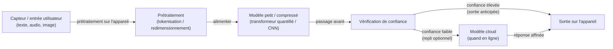

# Raisonnement en périphérie

## Définition

Le raisonnement en périphérie désigne l'exécution d'inférences IA et de raisonnements légers sur des **appareils en périphérie** — smartphones, passerelles IoT, capteurs industriels, ordinateurs embarqués dans les véhicules, caméras intelligentes et wearables — plutôt que de router les données vers un serveur cloud pour le traitement. L'objectif est d'atteindre un comportement raisonnablement intelligent tout en respectant les contraintes matérielles strictes : DRAM limitée (généralement 2–16 Go), calcul contraint par la batterie, connectivité internet intermittente ou inexistante, et exigences de latence strictes mesurées en millisecondes plutôt qu'en secondes.

La distinction avec [l'inférence locale](/docs/local-inference) réside dans la portée et la classe matérielle : l'inférence locale cible généralement les ordinateurs portables de développeurs, les postes de travail ou les serveurs sur site avec suffisamment de mémoire et des GPU dédiés. Le raisonnement en périphérie opère sur du matériel bien plus contraint — un microcontrôleur avec 256 Ko de RAM, un NPU intégré dans le SoC d'un téléphone (Apple Neural Engine, Qualcomm Hexagon), ou un appareil ARM basse consommation sans GPU discret. Réaliser un raisonnement utile sur ce matériel nécessite une combinaison de petits [LLM](/docs/llms) distillés, une [quantification](/docs/quantization) et un [élagage](/docs/pruning) agressifs, des runtimes adaptés au matériel (TFLite, ONNX Runtime Mobile, Core ML), et des stratégies de raisonnement telles que la sortie anticipée et le décodage spéculatif.

Les applications vont des assistants vocaux hors ligne et des wearables aux véhicules autonomes qui doivent répondre sans aller-retour cloud, en passant par les moniteurs de santé respectueux de la confidentialité qui conservent les données biométriques sensibles sur l'appareil, et les équipements industriels qui doivent classifier des défauts en périphérie d'un atelier de fabrication sans réseau fiable.

## Comment ça fonctionne

### Pipeline d'inférence en périphérie



### Stratégies de raisonnement en périphérie


### Techniques clés

**Distillation de modèle** — entraîner un petit étudiant à imiter un grand enseignant ; voir [distillation de connaissances](/docs/knowledge-distillation). **Quantification** — les poids et activations INT8 ou INT4 réduisent la mémoire et le calcul ; voir [quantification](/docs/quantization). **Élagage structuré** — supprimer des canaux ou des têtes pour une sparsité efficace matériellement ; voir [élagage](/docs/pruning). **Sortie anticipée** — attacher des classificateurs aux couches intermédiaires ; sortir quand la confiance est suffisante pour éviter d'exécuter toutes les couches. **Décodage spéculatif** — un petit modèle brouillon sur l'appareil génère des tokens qu'un modèle plus grand vérifie, amortissant le coût de vérification.

## Quand utiliser / Quand NE PAS utiliser

| Scénario | Utiliser le raisonnement en périphérie | NE PAS utiliser le raisonnement en périphérie |
|----------|---------------------|-----------------------------|
| Environnements hors ligne ou à connectivité non fiable | Oui — pas de dépendance au cloud | |
| Latence ultra-faible (réponse sub-100ms) | Oui — pas d'aller-retour réseau | |
| Données sensibles à la confidentialité devant rester sur l'appareil | Oui — données jamais transmises | |
| Déploiements à bande passante contrainte (IoT, capteurs distants) | Oui — traitement local, envoi des résultats seulement | |
| Qualité de modèle frontier nécessaire pour un raisonnement complexe | | Les LLM cloud sont bien plus capables |
| Le modèle nécessite plus de mémoire que la DRAM de l'appareil | | L'inférence locale sur un serveur GPU est nécessaire |
| Mises à jour fréquentes du modèle nécessaires | | Les modèles cloud peuvent être mis à jour sans pousser sur les appareils |

## Avantages et inconvénients

| Avantages | Inconvénients |
|------|------|
| Faible latence — pas d'aller-retour vers le cloud | Modèles plus petits ; moins capables que les grands LLM cloud |
| Fonctionne hors ligne et avec une mauvaise connectivité | Contraintes matérielles (mémoire, alimentation, budget thermique) |
| Les données restent sur l'appareil pour une forte confidentialité | Compromis entre taille du modèle et qualité du raisonnement |
| Bande passante réduite et coût cloud moindre | Nécessite un effort significatif de [quantification](/docs/quantization) et de [compression](/docs/model-compression) |

## Exemples de code

```python
# Charger un modèle quantifié avec TensorFlow Lite pour l'inférence sur l'appareil
import numpy as np
import tensorflow as tf

# Charger le modèle .tflite (par ex. MobileNetV3 ou un transformeur distillé)
interpreter = tf.lite.Interpreter(model_path="model_int8.tflite")
interpreter.allocate_tensors()

input_details = interpreter.get_input_details()
output_details = interpreter.get_output_details()

# Préparer l'entrée (par ex. une lecture de capteur prétraitée ou du texte tokenisé)
input_data = np.array([[0.1, 0.5, 0.3, 0.8]], dtype=np.float32)
interpreter.set_tensor(input_details[0]["index"], input_data)

# Exécuter l'inférence
interpreter.invoke()
output = interpreter.get_tensor(output_details[0]["index"])
predicted_class = np.argmax(output)
print(f"Classe prédite : {predicted_class}")
```

## Conseils pour une utilisation efficace

- Profilez la mémoire et la latence sur l'appareil cible réel dès le début — les benchmarks de bureau se traduisent rarement sur le matériel de périphérie.
- Utilisez des runtimes spécifiques au matériel (Core ML sur Apple, SNPE sur Qualcomm, TFLite sur Android) pour de meilleures performances.
- Concevez un repli élégant : essayez d'abord sur l'appareil, revenez au cloud si le modèle manque de confiance ou si la tâche est trop complexe.
- Préférez l'élagage structuré à l'élagage non structuré pour les modèles de périphérie — les matrices denses plus petites s'exécutent plus rapidement sur les NPU que les matrices creuses.
- Évaluez la précision sur des données représentatives des conditions de périphérie (capteurs bruités, éclairage variable) et pas seulement sur des benchmarks de laboratoire.

## Ressources pratiques

- [TensorFlow Lite — Inférence sur l'appareil](https://www.tensorflow.org/lite/guide) — Conversion de modèle, quantification et déploiement sur mobile/embarqué
- [ONNX Runtime — Mobile et périphérie](https://onnxruntime.ai/docs/tutorials/mobile/) — Inférence multiplateforme sur l'appareil
- [Apple — Core ML et MLX](https://developer.apple.com/machine-learning/) — ML sur l'appareil sur Apple Silicon (iPhone, iPad, Mac)
- [Google — ML Kit](https://developers.google.com/ml-kit) — API ML prêtes à l'emploi pour Android et iOS
- [Qualcomm — AI Hub](https://aihub.qualcomm.com/) — Modèles optimisés pour le NPU Snapdragon

## Voir aussi

- [Inférence locale](/docs/local-inference)
- [Compression de modèle](/docs/model-compression)
- [Quantification](/docs/quantization)
- [Élagage](/docs/pruning)
- [Distillation de connaissances](/docs/knowledge-distillation)
- [Modèles de raisonnement](/docs/reasoning-patterns)
