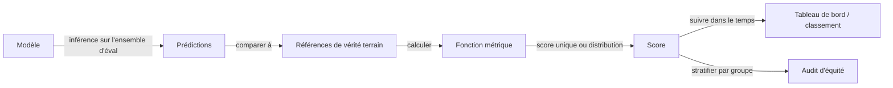

# Métriques d'évaluation

## Définition

Les métriques d'évaluation sont les outils quantitatifs qui vous indiquent à quel point un modèle performe sur une tâche donnée — et s'il s'améliore, régresse ou atteint le niveau requis pour le déploiement. Le choix de la métrique détermine directement ce que vous optimisez pendant l'entraînement et ce que vous rapportez lors de la comparaison de modèles. Utiliser la mauvaise métrique peut créer des angles morts : un modèle avec 99 % de précision sur un ensemble de données déséquilibré peut performer moins bien qu'une référence aléatoire sur la classe minoritaire ; un score BLEU élevé ne garantit pas qu'une traduction est fluide ou fidèle.

Les métriques varient selon la famille de tâches. Pour la **classification**, les métriques principales sont la précision globale, la précision positive, le rappel, le F1 et l'AUC-ROC — chacune capturant un compromis différent entre faux positifs et faux négatifs. Pour les tâches de **génération** (traduction, résumé, génération de texte), les métriques de chevauchement de n-grammes comme BLEU et ROUGE mesurent la similarité de surface avec les sorties de référence ; BERTScore et les métriques apprises (par ex. FActScore) évaluent la fidélité sémantique. Pour la **récupération**, précision@k, rappel@k et MRR (Mean Reciprocal Rank) mesurent à quel point un système remonte les documents pertinents. Pour les **LLM** évalués sur la génération en texte libre, les métriques automatisées sont souvent insuffisantes — les évaluations de préférence humaine (collectées via des comparaisons par paires) restent l'étalon-or pour la qualité, le ton et l'utilité.

L'évaluation se connecte directement aux [benchmarks](/docs/benchmarks) — des ensembles de données et protocoles standardisés permettant une comparaison reproductible entre modèles — et au [biais dans l'IA](/docs/bias-in-ai), où les métriques d'équité stratifient les métriques standard par groupe démographique pour détecter des performances disparates. En production, l'évaluation ne s'arrête pas au lancement du modèle : les tests A/B, les tableaux de bord de surveillance et les audits périodiques suivent la dérive des métriques et détectent les régressions ou les changements de distribution dans le temps.

## Comment ça fonctionne

### Calcul des métriques



### Métriques de classification en profondeur

Pour la classification binaire, la matrice de confusion (VP, VN, FP, FN) est la base. **Précision positive** = VP / (VP + FP) — quand le modèle dit positif, à quelle fréquence a-t-il raison ? **Rappel** = VP / (VP + FN) — parmi tous les positifs réels, combien le modèle en a-t-il capturé ? Le **F1** est leur moyenne harmonique, équilibrant les deux. L'**AUC-ROC** mesure la capacité de classement du modèle sur tous les seuils, indépendant du déséquilibre de classe. Pour les problèmes multi-classes, la moyenne macro traite toutes les classes de façon égale ; la moyenne micro pondère par la fréquence de classe.

### Métriques de génération en profondeur

BLEU compte les chevauchements de n-grammes entre une sortie de modèle et une ou plusieurs références, pénalisant les sorties plus courtes que la référence (pénalité de brièveté). ROUGE-L mesure la sous-séquence commune la plus longue. Les deux sont rapides et déterministes mais récompensent le chevauchement de surface, pas la correction sémantique. **BERTScore** utilise des embeddings pré-entraînés pour comparer le sens. L'**évaluation humaine** (comparaisons par paires externalisées ou évaluations d'experts sur des dimensions comme la fluidité, la factualité et l'utilité) fournit le signal le plus fiable pour la génération en texte libre mais est lente et coûteuse.

## Quand utiliser / Quand NE PAS utiliser

| Utiliser quand | Éviter quand |
|----------|------------|
| Entraînement ou comparaison de modèles où une vérité terrain claire existe | Aucune vérité terrain fiable n'est disponible et un jugement humain est nécessaire à la place |
| Suivi de la qualité dans le temps dans la surveillance de production | Une métrique agrégée unique masquerait d'importants échecs de sous-groupes |
| Audit d'équité ou de sécurité en stratifiant les métriques par groupes | La métrique ne correspond pas à l'objectif du produit (par ex. optimiser BLEU quand les utilisateurs se soucient de la fluidité) |
| Exécution d'évaluations de [benchmark](/docs/benchmarks) automatisées pour une comparaison reproductible | La tâche est si ouverte que les métriques automatisées corrèlent mal avec le jugement humain |

## Comparaisons

| Tâche | Métriques courantes | Quand l'évaluation humaine est nécessaire |
|------|---------------|--------------------------|
| Classification binaire | Précision, F1, AUC-ROC | Rarement — les métriques sont bien définies |
| Classification multi-étiquettes | F1 micro/macro, précision de sous-ensemble | Quand la taxonomie des étiquettes est ambiguë |
| Traduction / résumé | BLEU, ROUGE, BERTScore | Quand la fluidité ou la factualité est critique |
| Récupération / RAG | Rappel@k, MRR, NDCG | Quand la pertinence est subjective |
| Génération LLM en texte libre | LLM-as-judge, préférence humaine | Presque toujours pour l'évaluation de la qualité |

## Avantages et inconvénients

| Avantages | Inconvénients |
|------|------|
| Les métriques automatisées permettent une évaluation rapide, bon marché et reproductible | Peuvent ne pas corréler avec la satisfaction réelle des utilisateurs ou les objectifs du produit |
| Permettent une comparaison systématique entre les versions et les exécutions de modèles | Une seule métrique peut masquer des échecs sur des sous-groupes importants |
| Les métriques d'équité révèlent les performances disparates avant le déploiement | Jouer avec une métrique est plus facile qu'améliorer la qualité sous-jacente |
| Les métriques de production détectent la dérive et les régressions dans les systèmes déployés | L'évaluation humaine est coûteuse et difficile à mettre à l'échelle |

## Exemples de code

### Métriques de classification avec scikit-learn (Python)

```python
from sklearn.metrics import (
    classification_report,
    roc_auc_score,
    confusion_matrix,
)
import numpy as np

# Prédictions simulées
np.random.seed(0)
y_true = np.random.randint(0, 2, size=200)
y_pred = np.where(np.random.rand(200) > 0.3, y_true, 1 - y_true)  # ~70% de précision
y_prob = np.clip(y_pred + np.random.randn(200) * 0.2, 0, 1)

print("Rapport de classification :")
print(classification_report(y_true, y_pred, target_names=["négatif", "positif"]))

print(f"AUC-ROC : {roc_auc_score(y_true, y_prob):.4f}")
print(f"Matrice de confusion :\n{confusion_matrix(y_true, y_pred)}")
```

## Ressources pratiques

- [Hugging Face – Bibliothèque Evaluate](https://huggingface.co/docs/evaluate/) — Bibliothèque unifiée pour plus de 50 métriques avec une API cohérente
- [Papers with Code – Métriques](https://paperswithcode.com/task/image-classification) — Définitions des métriques liées aux résultats de benchmark
- [Article BERTScore (Zhang et al., 2019)](https://arxiv.org/abs/1904.09675) — Évaluation de génération basée sur les embeddings
- [BLEU : une méthode pour l'évaluation automatique de la traduction automatique](https://aclanthology.org/P02-1040/) — Article original BLEU
- [Évaluation des grands modèles de langage (enquête)](https://arxiv.org/abs/2307.03109) — Vue d'ensemble complète des approches d'évaluation des LLM

## Voir aussi

- [Benchmarks](/docs/benchmarks)
- [Biais dans l'IA](/docs/bias-in-ai)
