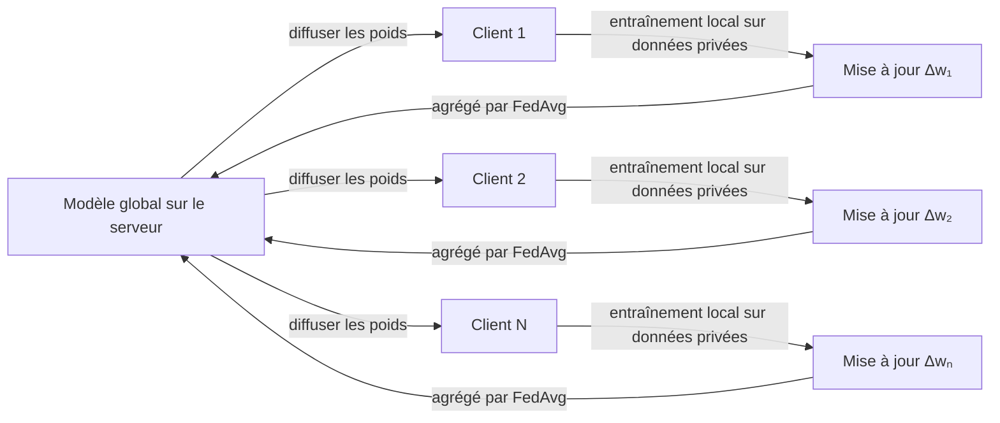

# Apprentissage fédéré

## Définition

L'apprentissage fédéré (FL) est un paradigme d'apprentissage automatique distribué où un modèle est entraîné sur de nombreux appareils ou silos organisationnels sans que les données brutes ne quittent jamais leur source. Au lieu de centraliser les données sensibles sur un serveur, chaque participant s'entraîne localement et partage uniquement les mises à jour du modèle — gradients ou deltas de poids — avec un coordinateur central. Le coordinateur agrège ces mises à jour pour améliorer un modèle global partagé, puis le redistribue pour le prochain cycle.

L'approche a été introduite par Google (McMahan et al., 2017) pour entraîner des modèles de prédiction du mot suivant sur des téléphones Android sans télécharger les frappes clavier des utilisateurs. Le principal avantage en matière de confidentialité est que les données brutes restent sur l'appareil ou dans les limites de l'organisation. Cependant, les mises à jour du modèle peuvent encore divulguer des informations sur les données d'entraînement via des attaques par inférence ; des techniques telles que la **confidentialité différentielle** (ajout de bruit calibré aux mises à jour) et l'**agrégation sécurisée** (agrégation cryptographique empêchant le serveur de voir les mises à jour individuelles) fournissent des garanties plus fortes.

L'apprentissage fédéré est utilisé chaque fois que les données sont légalement, éthiquement ou pratiquement contraintes à ne pas être regroupées — des institutions de santé collaborant sur des modèles diagnostiques, des banques entraînant des détecteurs de fraude à travers des agences, ou des smartphones améliorant des modèles de langage sur l'appareil. Il croise les fondamentaux de [l'apprentissage automatique](/docs/fundamentals/machine-learning) et soulève d'importantes préoccupations discutées dans [l'éthique de l'IA](/docs/ai-ethics). Les défis clés incluent l'**hétérogénéité statistique** (données non-IID entre clients), l'**hétérogénéité système** (calcul et disponibilité variables des appareils), et l'**efficacité de la communication** (minimisation de la bande passante pour la transmission des mises à jour).

## Comment ça fonctionne

### Le cycle fédéré

Chaque cycle d'entraînement suit le même schéma : le serveur diffuse le modèle global actuel, les clients sélectionnés s'entraînent localement, et leurs mises à jour sont renvoyées et agrégées.



### Agrégation FedAvg

L'algorithme d'agrégation le plus courant, **FedAvg**, calcule une moyenne pondérée des poids du modèle client, où chaque client est pondéré par la taille de son ensemble de données local :

```
w_global = Σ (nₖ / n_total) · wₖ
```

Les clients exécutent plusieurs étapes SGD locales avant d'envoyer les mises à jour, réduisant les cycles de communication.

### Améliorations de la confidentialité

La **confidentialité différentielle (DP)** écrête le gradient de chaque client et ajoute du bruit gaussien avant la transmission, limitant l'influence que les données d'un seul utilisateur peuvent avoir sur le modèle. L'**agrégation sécurisée** utilise des protocoles cryptographiques pour que le serveur ne voie que la somme des mises à jour, jamais les mises à jour individuelles des clients.

### Défis

Les **données non-IID** signifient que les ensembles de données locaux peuvent être très asymétriques (par ex. un hôpital qui ne voit que des maladies rares), causant la divergence des modèles locaux par rapport à l'optimum global. Des algorithmes comme FedProx et SCAFFOLD ajoutent des termes proximaux ou des variantes de contrôle pour contrecarrer cette dérive. L'**abandon de clients** (appareils qui se déconnectent en cours de cycle) nécessite une agrégation robuste qui gère la participation partielle.

## Quand utiliser / Quand NE PAS utiliser

| Scénario | Utiliser l'apprentissage fédéré | Éviter l'apprentissage fédéré |
|---|---|---|
| Les données ne peuvent pas quitter leur source (légal, réglementaire) | Oui — cas d'usage principal | Non — si les données peuvent être regroupées, l'entraînement centralisé est plus simple |
| Appareils mobiles/périphériques avec données locales | Oui — téléphones, wearables, capteurs IoT | Non — si les appareils manquent de calcul pour l'entraînement local |
| Collaboration inter-organisations sur des données sensibles | Oui — hôpitaux, banques, agences gouvernementales | Non — si les organisations refusent de partager même les mises à jour du modèle |
| Petit nombre de participants avec des connexions stables | Partiel — FL fonctionne mais ajoute des frais généraux | Préférer l'entraînement centralisé si le partage de données est autorisé |
| Mises à jour de modèle en temps réel à faible latence | Non — la communication multi-cycles ajoute des délais | — |

## Comparaisons

| Approche | Emplacement des données | Confidentialité | Coût de communication | Évolutivité |
|---|---|---|---|---|
| Entraînement centralisé | Serveur central | Faible (données exposées) | Faible | Élevée |
| Apprentissage fédéré | Sur l'appareil / silo | Moyenne–Élevée | Élevée | Moyenne |
| Apprentissage fractionné | Couches distribuées | Moyenne | Moyenne | Moyenne |
| FL + confidentialité différentielle | Sur l'appareil / silo | Élevée | Élevée | Moyenne |

## Avantages et inconvénients

| Avantages | Inconvénients |
|---|---|
| Les données brutes ne quittent jamais l'appareil ou l'organisation | Les mises à jour du modèle peuvent encore divulguer des informations privées |
| Permet la collaboration sans partage de données | Les données non-IID causent une dérive des clients, dégradant la convergence |
| S'adapte à des millions d'appareils (par ex. Android) | Frais généraux de communication élevés sur de nombreux cycles |
| Compatible avec la confidentialité différentielle pour des garanties plus fortes | Les retardataires et les clients abandonnés compliquent l'agrégation |

## Exemples de code

Entraînement fédéré simulé avec FedAvg utilisant Flower :

```python
import flwr as fl
import torch
import torch.nn as nn
from torch.utils.data import DataLoader, TensorDataset

# Modèle simple
class Net(nn.Module):
    def __init__(self):
        super().__init__()
        self.fc = nn.Linear(20, 1)
    def forward(self, x):
        return self.fc(x)

# Client Flower : encapsule l'entraînement local
class FedClient(fl.client.NumPyClient):
    def __init__(self, data):
        self.model = Net()
        self.loader = DataLoader(data, batch_size=32, shuffle=True)

    def get_parameters(self, config):
        return [p.detach().numpy() for p in self.model.parameters()]

    def set_parameters(self, parameters):
        for p, w in zip(self.model.parameters(), parameters):
            p.data = torch.tensor(w)

    def fit(self, parameters, config):
        self.set_parameters(parameters)
        opt = torch.optim.SGD(self.model.parameters(), lr=0.01)
        loss_fn = nn.MSELoss()
        for x, y in self.loader:
            opt.zero_grad()
            loss_fn(self.model(x), y).backward()
            opt.step()
        return self.get_parameters(config), len(self.loader.dataset), {}

    def evaluate(self, parameters, config):
        self.set_parameters(parameters)
        # Simplifié : retourner une perte factice
        return 0.0, len(self.loader.dataset), {"accuracy": 0.0}

# Simuler un client avec des données synthétiques
data = TensorDataset(torch.randn(100, 20), torch.randn(100, 1))
client = FedClient(data)

# Démarrer le client Flower (se connecter à un serveur Flower en cours d'exécution)
# fl.client.start_numpy_client(server_address="localhost:8080", client=client)
print("Client prêt. Dans un scénario réel, appelez fl.client.start_numpy_client().")
```

## Ressources pratiques

- [Communication-Efficient Learning of Deep Networks (McMahan et al., 2017)](https://arxiv.org/abs/1602.05629) — Article FedAvg original de Google
- [TensorFlow Federated](https://www.tensorflow.org/federated) — Framework open-source de Google pour les calculs fédérés
- [Flower (flwr)](https://flower.dev/) — Bibliothèque FL agnostique au framework supportant PyTorch, TensorFlow, JAX
- [PySyft](https://github.com/OpenMined/PySyft) — ML respectueux de la confidentialité avec confidentialité différentielle et agrégation sécurisée

## Voir aussi

- [Apprentissage automatique](/docs/fundamentals/machine-learning)
- [Confidentialité et éthique de l'IA](/docs/ai-ethics)
