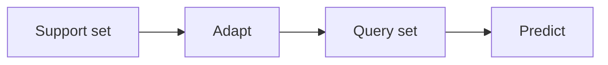

# Apprentissage few-shot

## Définition

Few-shot learning aims to adapt quickly from a small number of labeled examples (par ex. 1–5 par classe). Meta-learning (par ex. MAML) trains models to be good at few-shot adaptation.

Il se situe entre [transfer learning](/docs/transfer-learning) (more target data) and [zero-shot](/docs/zero-shot-learning) (no target examples). [LLMs](/docs/llms) do few-shot implicitly via in-context examples in the prompt; classical few-shot uses episodic meta-training (par ex. MAML) so the model learns to adapt from a support set.

## Comment ça fonctionne

Each task has a **support set** (quelques exemples étiquetés, par ex. 1–5 par classe) and a **query set** (examples to predict). **Adapt**: the model uses the support set to adapt (par ex. compute prototypes, or take a few gradient steps in MAML). **Predict**: the adapted model predicts labels for the query set. **Episodic training**: sample many few-shot tasks from a meta-train set; for each, adapt on the task support set and optimize so that predictions on the query set improve. At test time, the model gets a new task’s support set and predicts on its query set. For LLMs, "adapt" is just conditioning on the support examples in the prompt (in-context few-shot).

## Cas d'utilisation

Few-shot learning applies when you have only a handful of examples par classe or task (including in-context LLM prompts).

- Classifying rare classes with only a quelques exemples étiquetés
- LLM in-context learning (par ex. 1–5 examples in the prompt)
- Rapid adaptation in robotics or personalization with minimal data

## Documentation externe

- [Model-Agnostic Meta-Learning (MAML) (Finn et al.)](https://arxiv.org/abs/1703.03400)
- [Hugging Face – Few-shot learning](https://huggingface.co/docs/transformers/tasks/summarization#few-shot-summarization)

## Voir aussi

- [Zero-shot learning](/docs/zero-shot-learning)
- [LLMs](/docs/llms)
- [Transfer learning](/docs/transfer-learning)
