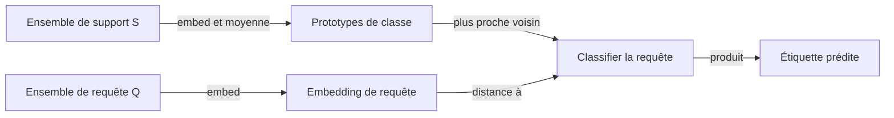
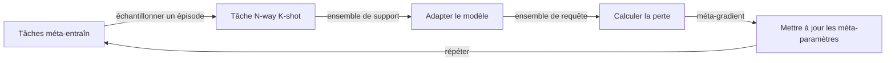

# Apprentissage few-shot

## Définition

L'apprentissage few-shot est la capacité d'un modèle à généraliser à de nouvelles tâches ou classes à partir d'un très petit nombre d'exemples étiquetés — typiquement 1 à 5 par classe (1-shot, 5-shot). Plutôt que de nécessiter des centaines ou des milliers d'échantillons étiquetés, les systèmes d'apprentissage few-shot exploitent les connaissances préalables (du pré-entraînement ou du méta-entraînement) pour extraire un signal maximal de données minimales. Le défi est distinct de l'apprentissage supervisé standard : le modèle doit **s'adapter rapidement** au moment du test, pas seulement s'ajuster à un grand ensemble d'entraînement.

Deux paradigmes principaux ont émergé. Le **méta-apprentissage** (apprendre à apprendre) entraîne des modèles sur de nombreuses tâches few-shot différentes échantillonnées à partir d'un ensemble méta-entraîn, de sorte que le modèle apprend explicitement comment s'adapter. MAML (Model-Agnostic Meta-Learning) optimise pour une initialisation de paramètres qui peut être affinée en quelques étapes de gradient sur n'importe quelle nouvelle tâche. Les **méthodes basées sur les métriques** (Prototypical Networks, Matching Networks) apprennent un espace d'embedding où la classification se réduit à une recherche du plus proche voisin par rapport aux prototypes de classe calculés à partir des exemples de support.

Le troisième paradigme — l'**apprentissage en contexte** — est spécifique aux grands [LLM](/docs/llms) : les exemples de support sont simplement préfixés à l'invite comme démonstrations, et le modèle se conditionne dessus sans aucune mise à jour de gradient. GPT-3 a popularisé cette approche, démontrant que des modèles de langage suffisamment grands peuvent effectuer de nouvelles tâches à partir d'une poignée d'exemples dans la fenêtre de contexte. L'apprentissage few-shot se situe entre [l'apprentissage par transfert](/docs/transfer-learning) (qui nécessite plus de données cibles étiquetées) et [l'apprentissage zero-shot](/docs/zero-shot-learning) (qui n'en nécessite aucune).

## Comment ça fonctionne

### Structure de tâche épisodique

Chaque tâche few-shot est définie par un **ensemble de support** (N classes × K exemples = N-way K-shot) et un **ensemble de requête** (exemples à classifier). Le modèle s'adapte à l'ensemble de support et prédit les étiquettes pour l'ensemble de requête.

### Méta-apprentissage (MAML)

MAML apprend une initialisation de modèle θ telle que quelques étapes de gradient sur l'ensemble de support de n'importe quelle nouvelle tâche donnent de bonnes performances sur l'ensemble de requête de cette tâche. Le méta-objectif est : mettre à jour θ pour que θ − α·∇L_tâche soit bon sur toutes les tâches échantillonnées.

### Méthodes basées sur les métriques

Les Prototypical Networks calculent un **prototype** pour chaque classe en faisant la moyenne des embeddings de ses exemples de support. Les exemples de requête sont classifiés par leur distance au prototype le plus proche dans l'espace d'embedding.

### Few-shot en contexte (LLMs)

Aucune mise à jour de gradient n'a lieu. L'invite contient les exemples de support formatés comme des démonstrations, et le modèle complète la requête sur la base de la correspondance de motifs provenant du pré-entraînement.



### Entraînement épisodique



## Quand utiliser / Quand NE PAS utiliser

| Scénario | Utiliser l'apprentissage few-shot | Éviter l'apprentissage few-shot |
|---|---|---|
| Seulement 1–20 exemples étiquetés par classe | Oui — conçu pour la rareté des données | Non — apprentissage supervisé standard si les données sont suffisantes |
| Inférence LLM avec exemples dans l'invite | Oui — few-shot en contexte est gratuit à l'inférence | Non — l'affinement est meilleur pour les tâches cohérentes à grand volume |
| Adaptation rapide à de nouvelles classes sans réentraînement | Oui — prototypical networks ou MAML | Non — si les nouvelles classes sont stables et que des données étiquetées peuvent être collectées |
| Domaine entièrement nouveau sans modèle pré-entraîné | Non — le pré-entraînement est un prérequis | — |
| Haute précision sur un ensemble de données fixe et bien étiqueté | Non — l'apprentissage supervisé surpasse | — |

## Comparaisons

| Approche | Exemples nécessaires | Mécanisme d'adaptation | Mises à jour de gradient au moment du test |
|---|---|---|---|
| Apprentissage zero-shot | 0 | Invite / description textuelle | Non |
| Apprentissage few-shot (en contexte) | 1–10 | Démonstrations en contexte | Non |
| Apprentissage few-shot (MAML) | 1–10 | Étapes de gradient en boucle interne | Oui (quelques étapes) |
| Apprentissage par transfert / affinement | 100–10K+ | Affinement complet ou partiel | Oui (nombreuses étapes) |
| Apprentissage supervisé | 1K–1M+ | SGD standard | Oui |

## Avantages et inconvénients

| Avantages | Inconvénients |
|---|---|
| Généralise à de nouvelles tâches avec des données étiquetées minimales | Les performances sont généralement inférieures aux approches entièrement supervisées |
| Le few-shot en contexte ne nécessite pas d'entraînement — juste du prompting | Sensible au format de l'invite et à l'ordre des exemples pour les LLM |
| Le méta-apprentissage permet une adaptation rapide entre domaines | Le méta-entraînement est intensif en calcul (de nombreuses tâches nécessaires) |
| Utile pour les catégories rares et la personnalisation | La qualité de l'ensemble de support impacte fortement les prédictions |

## Exemples de code

Inférence du Prototypical Network (classification d'images few-shot) :

```python
import torch
import torch.nn as nn

class PrototypicalNet(nn.Module):
    """Encodeur CNN simple pour la classification d'images few-shot."""
    def __init__(self, embedding_dim=64):
        super().__init__()
        self.encoder = nn.Sequential(
            nn.Conv2d(1, 32, 3, padding=1), nn.ReLU(), nn.MaxPool2d(2),
            nn.Conv2d(32, 64, 3, padding=1), nn.ReLU(), nn.AdaptiveAvgPool2d(4),
            nn.Flatten(),
            nn.Linear(64 * 4 * 4, embedding_dim),
        )

    def forward(self, x):
        return self.encoder(x)

def prototypical_predict(model, support_images, support_labels, query_images, n_classes):
    """
    support_images: (N*K, C, H, W) — K exemples par classe, N classes
    support_labels: (N*K,)
    query_images:   (Q, C, H, W)
    Retourne les étiquettes prédites pour query_images.
    """
    model.eval()
    with torch.no_grad():
        support_emb = model(support_images)   # (N*K, D)
        query_emb   = model(query_images)     # (Q, D)

        # Calculer les prototypes de classe (embedding moyen par classe)
        prototypes = torch.stack([
            support_emb[support_labels == c].mean(0)
            for c in range(n_classes)
        ])  # (N, D)

        # Distance euclidienne de chaque requête à chaque prototype
        dists = torch.cdist(query_emb, prototypes)  # (Q, N)
        return dists.argmin(dim=1)  # Prototype le plus proche = classe prédite

# Exemple : 5-way 1-shot, 10 images de requête (28x28 niveaux de gris)
model = PrototypicalNet(embedding_dim=64)
support = torch.randn(5, 1, 28, 28)   # 1 exemple par classe
labels  = torch.arange(5)             # Classes 0–4
queries = torch.randn(10, 1, 28, 28)

preds = prototypical_predict(model, support, labels, queries, n_classes=5)
print("Étiquettes prédites :", preds)
```

Few-shot en contexte avec un LLM via l'API OpenAI :

```python
from openai import OpenAI

client = OpenAI()

# Classification de sentiment 3-shot via des messages de chat
response = client.chat.completions.create(
    model="gpt-4o-mini",
    messages=[
        {"role": "system", "content": "Classifiez le sentiment comme positif ou négatif."},
        {"role": "user",   "content": "Avis : 'J'ai absolument adoré ce film !' Sentiment :"},
        {"role": "assistant", "content": "positif"},
        {"role": "user",   "content": "Avis : 'Expérience terrible, je ne reviendrai jamais.' Sentiment :"},
        {"role": "assistant", "content": "négatif"},
        {"role": "user",   "content": "Avis : 'Meilleur produit que j'ai jamais acheté.' Sentiment :"},
        {"role": "assistant", "content": "positif"},
        {"role": "user",   "content": "Avis : 'Perte d'argent, très déçu.' Sentiment :"},
    ]
)
print(response.choices[0].message.content)  # Attendu : négatif
```

## Ressources pratiques

- [Model-Agnostic Meta-Learning (MAML) (Finn et al., 2017)](https://arxiv.org/abs/1703.03400) — Article de méta-apprentissage fondateur pour une adaptation few-shot rapide
- [Prototypical Networks (Snell et al., 2017)](https://arxiv.org/abs/1703.05175) — Classification few-shot basée sur les métriques simple et efficace
- [Language Models are Few-Shot Learners (Brown et al., 2020)](https://arxiv.org/abs/2005.14165) — Article GPT-3 démontrant l'apprentissage few-shot en contexte à grande échelle
- [Bibliothèque learn2learn](https://learn2learn.net/) — Toolkit PyTorch pour les algorithmes de méta-apprentissage incluant MAML

## Voir aussi

- [Apprentissage zero-shot](/docs/zero-shot-learning)
- [LLMs](/docs/llms)
- [Apprentissage par transfert](/docs/transfer-learning)
