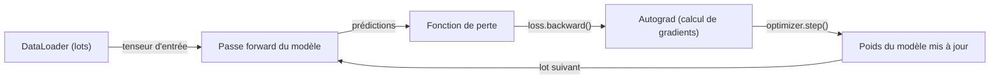
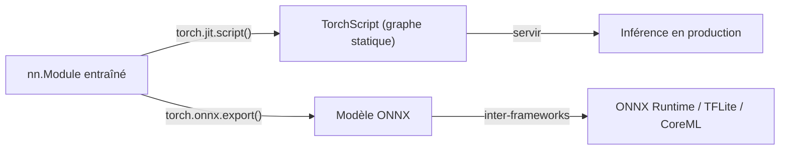

# PyTorch

## Définition

PyTorch est un framework d'[apprentissage profond](/docs/fundamentals/deep-learning) Python-first développé par Meta AI, caractérisé par des graphes de calcul dynamiques et un modèle de programmation impératif. Chaque opération s'exécute immédiatement (mode eager), et le graphe computationnel pour la rétropropagation est construit à la volée. Cela rend simple l'écriture, l'exécution et le débogage du code de réseaux de neurones en utilisant des outils Python standard — les instructions print, les débogueurs et le REPL Python fonctionnent exactement comme prévu.

PyTorch est devenu le framework dominant en recherche et est la base de l'écosystème ML moderne : la bibliothèque Transformers de [Hugging Face](/docs/tools/huggingface) utilise PyTorch par défaut, la plupart des articles académiques publient des implémentations PyTorch, et des bibliothèques telles que torchvision, torchaudio, torchtext et PyTorch Geometric l'étendent aux domaines de la vision par ordinateur, de l'audio, du texte et des graphes. Le framework prend en charge le CPU, le GPU, Apple Silicon (backend MPS) et l'entraînement multi-GPU via `torch.distributed`, avec des wrappers de niveau supérieur comme HuggingFace Accelerate et PyTorch Lightning réduisant le code répétitif pour l'entraînement distribué.

Comparé à [TensorFlow](/docs/frameworks/tensorflow), PyTorch est préféré pour la recherche et le prototypage rapide en raison de son expérience de débogage native Python et de son cycle d'itération plus rapide. TensorFlow maintient un avantage dans le déploiement mobile (TFLite), l'entraînement sur TPU et l'outillage de pipeline de production. Pour le déploiement, PyTorch fournit TorchScript (graphe statique pour la production), l'export ONNX (interopérabilité entre frameworks) et PyTorch Mobile. La plupart des travaux d'entraînement et de fine-tuning de [LLM](/docs/llms) se font dans PyTorch via l'écosystème HuggingFace.

## Fonctionnement

### Boucle d'entraînement



### Pipeline de déploiement



### Abstractions clés

**`nn.Module`** — classe de base pour tous les modèles ; définit `__init__` (couches) et `forward` (calcul). **`autograd`** — différentiation automatique ; `loss.backward()` calcule les gradients pour tous les paramètres. **`DataLoader`** — regroupement en lots, mélange et chargement de données multiprocessus. **`torch.optim`** — optimiseurs (Adam, SGD, AdamW). **`torch.distributed`** — entraînement distribué parallèle de données et de modèles.

## Quand utiliser / Quand NE PAS utiliser

| Scénario | Utiliser PyTorch | NE PAS utiliser PyTorch |
|----------|------------|-------------------|
| Recherche et expérimentation avec de nouvelles architectures | Oui — mode eager, débogage natif Python | |
| Fine-tuning de modèles HuggingFace | Oui — backend par défaut pour HuggingFace | |
| Charges de travail d'entraînement et d'inférence LLM | Oui — dominant dans l'écosystème LLM | |
| Déploiement mobile ou edge (iOS, Android) | | [TensorFlow Lite](/docs/frameworks/tensorflow) est plus mature pour cela |
| Entraînement sur Google TPUs | | [TensorFlow](/docs/frameworks/tensorflow) ou JAX ont un meilleur support TPU |
| Pipelines ML en production avec service géré | | TF Serving + TFX fournissent une pile plus intégrée |

## Comparaisons

| Fonctionnalité | PyTorch | TensorFlow / Keras |
|---------|---------|-------------------|
| Mode d'exécution | Eager (par défaut) + TorchScript | Eager (par défaut) + tf.function |
| Expérience de débogage | Native Python (pdb, print) | tf.function peut masquer les erreurs |
| Adoption en recherche | Dominant | En déclin |
| Mobile / edge | PyTorch Mobile (expérimental) | TFLite (première classe) |
| Écosystème HuggingFace | Backend par défaut | Supporté mais secondaire |
| Support TPU | Via PyTorch/XLA | Première classe |
| API de haut niveau | Lightning, Ignite (tiers) | Keras (intégré) |

## Avantages et inconvénients

| Avantages | Inconvénients |
|------|------|
| Débogage natif Python avec exécution eager | L'entraînement distribué nécessite plus de configuration manuelle |
| Dominant en recherche ; la plupart des articles publient du code PyTorch | Pas d'API d'entraînement de haut niveau intégrée (nécessite Lightning ou similaire) |
| Base de l'écosystème HuggingFace | Le déploiement mobile est moins mature que TFLite |
| Flexible ; facile à implémenter des couches et des pertes personnalisées | La sérialisation des modèles (TorchScript) a des limitations vs SavedModel |

## Exemples de code

```python
import torch
import torch.nn as nn
from torch.utils.data import DataLoader, TensorDataset

# Define a simple feedforward network
class MLP(nn.Module):
    def __init__(self, in_features: int, hidden: int, num_classes: int):
        super().__init__()
        self.net = nn.Sequential(
            nn.Linear(in_features, hidden),
            nn.ReLU(),
            nn.Linear(hidden, num_classes),
        )

    def forward(self, x: torch.Tensor) -> torch.Tensor:
        return self.net(x)

model = MLP(in_features=784, hidden=256, num_classes=10)
optimizer = torch.optim.AdamW(model.parameters(), lr=1e-3)
loss_fn = nn.CrossEntropyLoss()

# Explicit training loop
for epoch in range(5):
    for x_batch, y_batch in train_loader:
        optimizer.zero_grad()
        logits = model(x_batch)
        loss = loss_fn(logits, y_batch)
        loss.backward()          # compute gradients
        optimizer.step()         # update weights

# Export for cross-framework deployment
dummy_input = torch.randn(1, 784)
torch.onnx.export(model, dummy_input, "mlp.onnx")
```

## Ressources pratiques

- [PyTorch — Démarrage](https://pytorch.org/get-started/locally/) — Installation et démarrage rapide
- [Tutoriels PyTorch](https://pytorch.org/tutorials/) — Tutoriels officiels des bases à l'entraînement distribué
- [Documentation PyTorch](https://pytorch.org/docs/stable/) — Référence complète de l'API
- [HuggingFace Accelerate](https://huggingface.co/docs/accelerate) — Wrapper d'entraînement distribué et à précision mixte
- [PyTorch Lightning](https://lightning.ai/docs/pytorch/stable/) — Framework d'entraînement de haut niveau construit sur PyTorch

## Voir aussi

- [TensorFlow](/docs/frameworks/tensorflow)
- [Hugging Face](/docs/tools/huggingface)
- [Apprentissage profond](/docs/fundamentals/deep-learning)
