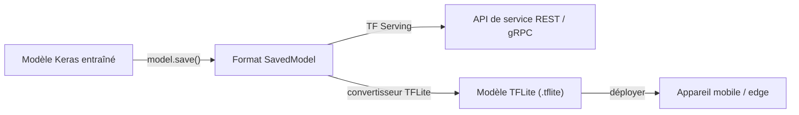

# TensorFlow

## Définition

TensorFlow est le framework d'[apprentissage profond](/docs/fundamentals/deep-learning) open-source de Google, conçu avec un fort accent sur le déploiement en production. Initialement publié en 2015, il a mûri pour devenir une plateforme de bout en bout couvrant les pipelines de données (`tf.data`), la construction de modèles (Keras), l'entraînement distribué (`tf.distribute`) et le service (TensorFlow Serving, Vertex AI). L'API Keras de haut niveau est l'interface principale pour la plupart des praticiens, fournissant des modèles de construction de modèles séquentiels et fonctionnels qui réduisent le code répétitif.

TensorFlow prend en charge une large gamme de cibles matérielles : CPUs, GPUs NVIDIA, TPUs Google et appareils mobiles/edge via TensorFlow Lite. Cette largeur matérielle, combinée avec SavedModel — un format de sérialisation de modèles standardisé — fait de TensorFlow le framework de choix lorsque la cible de déploiement couvre cloud, infrastructure de service sur site et inférence sur appareil (iOS, Android, microcontrôleurs) dans le même projet.

Comparé à [PyTorch](/docs/frameworks/pytorch), TensorFlow a historiquement été plus solide dans les pipelines de production, l'entraînement sur TPU et le déploiement mobile, tandis que PyTorch a été préféré en recherche pour son expérience de débogage impérative. Depuis que TensorFlow 2.x a introduit l'exécution eager par défaut, l'expérience de développement quotidienne a convergé, mais les différences d'écosystème persistent : TF Serving, TFLite et TensorFlow Extended (TFX) sont des composants de niveau production sans équivalent direct dans PyTorch.

## Fonctionnement

### Pipeline d'entraînement


### Pipeline de déploiement



### Composants clés

**Keras** — API de haut niveau pour définir couches, modèles et boucles d'entraînement. **`tf.data`** — chargement de données efficace, mélange, regroupement en lots et augmentation. **`tf.distribute`** — stratégies d'entraînement distribué multi-GPU et multi-hôte. **SavedModel** — format de sérialisation portable pour l'inférence et le service. **TensorFlow Lite** — modèles quantifiés pour appareils mobiles et edge. **TensorFlow Hub** — modèles pré-entraînés pour l'[apprentissage par transfert](/docs/transfer-learning).

## Quand utiliser / Quand NE PAS utiliser

| Scénario | Utiliser TensorFlow | NE PAS utiliser TensorFlow |
|----------|---------------|----------------------|
| Pipelines ML en production avec TF Serving | Oui — intégration native | |
| Déploiement mobile et edge via TFLite | Oui — meilleur support edge de sa catégorie | |
| Entraînement sur Google TPUs | Oui — le support TPU est de première classe | |
| Itération rapide en recherche et architectures personnalisées | | [PyTorch](/docs/frameworks/pytorch) a une expérience de débogage plus naturelle |
| Chargement de modèles Transformers HuggingFace | | La plupart des modèles HuggingFace utilisent PyTorch par défaut ; certains supportent TF |
| Recherche RL et environnements | | PyTorch est plus répandu dans la recherche RL |

## Comparaisons

| Fonctionnalité | TensorFlow / Keras | PyTorch |
|---------|-------------------|---------|
| Cas d'usage principal | Pipelines de production, mobile, TPU | Recherche, prototypage rapide |
| API de haut niveau | Keras (intégré) | Lightning, Ignite (tiers) |
| Mode d'exécution | Eager (par défaut) + graphe (tf.function) | Eager (par défaut) + TorchScript |
| Mobile / edge | TFLite (première classe) | PyTorch Mobile (expérimental) |
| Support TPU | Première classe | Via XLA / PyTorch/XLA |
| Écosystème | TFX, TF Serving, TF Hub | HuggingFace, torchvision, ONNX |
| Adoption en recherche | En déclin | Dominant |

## Avantages et inconvénients

| Avantages | Inconvénients |
|------|------|
| Écosystème de production mature (TF Serving, TFX, TFLite) | Le mode graphe et `tf.function` ajoutent de la complexité au débogage |
| Support de première classe pour TPU et déploiement mobile | Courbe d'apprentissage plus raide pour le code de recherche personnalisé |
| SavedModel est un format portable et versionné | L'écosystème HuggingFace utilise PyTorch par défaut |
| Keras fournit une API de haut niveau propre | Certaines APIs sont encore en flux entre les versions TF |

## Exemples de code

```python
import tensorflow as tf
from tensorflow import keras

# Build a simple image classifier with Keras functional API
inputs = keras.Input(shape=(28, 28, 1))
x = keras.layers.Conv2D(32, 3, activation="relu")(inputs)
x = keras.layers.GlobalAveragePooling2D()(x)
outputs = keras.layers.Dense(10, activation="softmax")(x)
model = keras.Model(inputs, outputs)

model.compile(
    optimizer="adam",
    loss="sparse_categorical_crossentropy",
    metrics=["accuracy"],
)

# Load and batch data with tf.data
(x_train, y_train), (x_test, y_test) = keras.datasets.mnist.load_data()
x_train = x_train[..., tf.newaxis] / 255.0

dataset = tf.data.Dataset.from_tensor_slices((x_train, y_train))
dataset = dataset.shuffle(10000).batch(64).prefetch(tf.data.AUTOTUNE)

model.fit(dataset, epochs=5)

# Export for serving
model.save("mnist_model")  # SavedModel format
```

## Ressources pratiques

- [TensorFlow — Démarrage](https://www.tensorflow.org/tutorials) — Tutoriels officiels couvrant Keras et tf.data
- [Documentation Keras](https://keras.io/) — Référence complète de l'API Keras et guides
- [TensorFlow Lite — Guide d'inférence](https://www.tensorflow.org/lite/guide) — Déploiement mobile et edge
- [TensorFlow Hub](https://tfhub.dev/) — Modèles pré-entraînés pour l'apprentissage par transfert
- [TensorFlow Extended (TFX)](https://www.tensorflow.org/tfx) — Pipelines ML en production

## Voir aussi

- [PyTorch](/docs/frameworks/pytorch)
- [Apprentissage profond](/docs/fundamentals/deep-learning)
- [Infrastructure](/docs/infrastructure)
