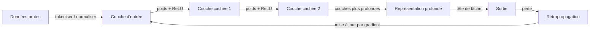

# Apprentissage profond

## Définition

L'apprentissage profond utilise des réseaux de neurones avec de nombreuses couches pour apprendre des représentations hiérarchiques à partir de données. Il a conduit des progrès en vision, en langage et dans d'autres domaines en mettant à l'échelle les données et le calcul.

Il étend l'[apprentissage automatique](/docs/fundamentals/machine-learning) en utilisant des modèles différentiables et en couches (voir [réseaux de neurones](/docs/neural-networks)) qui apprennent les caractéristiques automatiquement plutôt que celles élaborées à la main. La profondeur permet au modèle de construire des représentations progressivement plus abstraites (par ex. bords -> textures -> parties -> objets en vision).

La caractéristique définissante de l'apprentissage profond est l'**apprentissage de bout en bout** : les entrées brutes (pixels, tokens, échantillons audio) sont transformées à travers des couches non linéaires successives, et le pipeline entier est optimisé conjointement par la descente de gradient. Cela supprime le besoin d'ingénierie de caractéristiques spécifique au domaine dont dépend le ML traditionnel. Le compromis est que les modèles profonds nécessitent beaucoup plus de données et de calcul — GPUs, TPUs et grande mémoire — et sont plus difficiles à interpréter que les modèles classiques.

## Fonctionnement



### Passe forward

Les **données** sont alimentées dans la couche d'entrée. Chaque couche applique une transformation linéaire (multiplication de matrices + biais) suivie d'une non-linéarité (par ex. ReLU). Empiler des couches produit des **représentations** progressivement plus abstraites. La couche finale mappe vers la sortie de la tâche (scores de classe, valeur de régression ou logits de token).

### Passe arrière et optimisation

La **perte** (par ex. entropie croisée pour la classification) est calculée entre les prédictions et les cibles. La **rétropropagation** utilise la règle des chaînes pour calculer les gradients de la perte par rapport à chaque poids dans le réseau. Un optimiseur (SGD, Adam) met ensuite à jour les poids dans la direction qui réduit la perte.

### Architectures

Le choix d'architecture adapte la connectivité au type de données : les [CNN](/docs/neural-networks/cnn) exploitent la localité spatiale pour les images ; les [RNN](/docs/neural-networks/rnn) gèrent les séquences de longueur variable ; les [Transformers](/docs/transformers) utilisent l'auto-attention globale et dominent désormais les tâches de vision et de langage à grande échelle.

## Quand utiliser / Quand NE PAS utiliser

| Scénario | Utiliser l'apprentissage profond ? | Notes |
|---|---|---|
| Reconnaissance d'images ou de vidéos à grande échelle | Oui | Les CNN sont la colonne vertébrale standard |
| Compréhension ou génération de texte | Oui | Les Transformers établissent l'état de l'art en NLP |
| Petit ensemble de données structuré/tabulaire | Non | Le gradient boosting surpasse généralement |
| Besoin d'une interprétabilité complète du modèle | Non | Les modèles profonds sont en grande partie des boîtes noires |
| Calcul limité / déploiement edge | Avec précaution | Utiliser la quantification ou les modèles distillés |
| Reconnaissance de la parole et de l'audio | Oui | Les modèles profonds surpassent le traitement classique du signal |

## Comparaisons

| Aspect | ML Classique | Apprentissage Profond |
|---|---|---|
| Ingénierie des caractéristiques | Manuelle | Automatique (de bout en bout) |
| Besoins en données | Faible à moyen | Élevé |
| Besoins en calcul | Faible | Élevé (GPU/TPU) |
| Interprétabilité | Élevée (par ex. arbres) | Faible |
| Performance sur données non structurées | Modérée | Très élevée |

## Avantages et inconvénients

| Avantages | Inconvénients |
|---|---|
| Apprentissage automatique des caractéristiques | Gourmand en données |
| État de l'art en vision et langage | Nécessite GPU/TPU |
| Optimisation de bout en bout | Difficile à interpréter |
| L'apprentissage par transfert réduit les besoins en données | Temps d'entraînement longs |

## Exemples de code

```python
# Feedforward network with PyTorch for image classification (MNIST)
import torch
import torch.nn as nn
import torch.optim as optim
from torchvision import datasets, transforms
from torch.utils.data import DataLoader

# Data loaders
transform = transforms.Compose([
    transforms.ToTensor(),
    transforms.Normalize((0.5,), (0.5,))
])
train_loader = DataLoader(
    datasets.MNIST('.', train=True, download=True, transform=transform),
    batch_size=64, shuffle=True
)
test_loader = DataLoader(
    datasets.MNIST('.', train=False, download=True, transform=transform),
    batch_size=1000
)

# Model definition
class MLP(nn.Module):
    def __init__(self):
        super().__init__()
        self.net = nn.Sequential(
            nn.Flatten(),
            nn.Linear(28 * 28, 256), nn.ReLU(),
            nn.Linear(256, 128),     nn.ReLU(),
            nn.Linear(128, 10),
        )

    def forward(self, x):
        return self.net(x)

device  = "cuda" if torch.cuda.is_available() else "cpu"
model   = MLP().to(device)
opt     = optim.Adam(model.parameters(), lr=1e-3)
loss_fn = nn.CrossEntropyLoss()

# Training
for epoch in range(3):
    model.train()
    for X, y in train_loader:
        X, y = X.to(device), y.to(device)
        opt.zero_grad()
        loss_fn(model(X), y).backward()
        opt.step()

# Evaluation
model.train(False)
correct = sum(
    (model(X.to(device)).argmax(1) == y.to(device)).sum().item()
    for X, y in test_loader
)
print(f"Test accuracy: {correct / len(test_loader.dataset):.2%}")
```

## Ressources pratiques

- [Apprentissage Profond (Goodfellow et al.)](https://www.deeplearningbook.org/) — Manuel en ligne gratuit couvrant la théorie en profondeur
- [PyTorch – Introduction](https://pytorch.org/tutorials/beginner/deep_learning_60min_blitz.html) — Tutoriel pratique d'apprentissage profond en 60 minutes
- [fast.ai – Apprentissage Profond Pratique](https://course.fast.ai/) — Cours de haut en bas avec des projets du monde réel et du code

## Voir aussi

- [Réseaux de neurones](/docs/neural-networks)
- [Transformers](/docs/transformers)
- [Frameworks (PyTorch, TensorFlow)](/docs/frameworks/pytorch)
