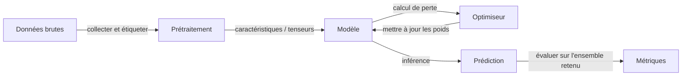

# Fondamentaux de l'IA

## Définition

Les fondamentaux de l'IA couvrent les idées centrales derrière l'intelligence artificielle : ce que nous entendons par apprentissage, représentation et généralisation. Cela inclut l'apprentissage supervisé et non supervisé, l'optimisation et la relation entre les données, les modèles et les objectifs.

Ces idées sous-tendent à la fois l'[apprentissage automatique](/docs/fundamentals/machine-learning) classique et l'[apprentissage profond](/docs/fundamentals/deep-learning). Les comprendre vous aide à choisir le bon paradigme, interpréter les résultats et raisonner sur les limites (par ex. besoins en données, biais, robustesse).

Au cœur de l'IA se trouve une boucle simple : vous collectez des données qui encodent un aspect du monde, vous définissez un objectif qui formalise ce que signifie « bon », et vous exécutez un optimiseur qui ajuste un modèle jusqu'à ce qu'il atteigne l'objectif sur des exemples retenus. Tout le reste — architectures neuronales, techniques de régularisation, algorithmes d'alignement — est un raffinement de cette boucle centrale. Développer une intuition sur chaque composant vous aide à diagnostiquer les échecs rapidement et à faire des choix de conception fondés lors de la construction de systèmes réels.

## Fonctionnement



### Collecte et prétraitement des données

Les **données** sont collectées ou étiquetées ; elles doivent être représentatives de la distribution du monde réel que le modèle rencontrera. Le prétraitement transforme les entrées brutes (images, texte, lignes tabulaires) en caractéristiques ou tenseurs que le modèle peut consommer.

### Sélection et entraînement du modèle

Un **modèle** (par ex. une fonction linéaire, un arbre de décision ou un réseau de neurones) est choisi en fonction du type de données et de la tâche. Un objectif (perte pour supervisé/non supervisé, récompense pour RL) est optimisé avec un algorithme tel que la descente de gradient. L'**optimiseur** met à jour les paramètres du modèle pour minimiser la perte sur les données d'entraînement.

### Évaluation et généralisation

Le résultat est un modèle ajusté qui doit se généraliser à de nouvelles entrées. L'évaluation utilise des divisions entraînement/validation/test. Si le modèle fonctionne bien sur les données d'entraînement mais mal sur l'ensemble de test, il surapprend. Des techniques comme la validation croisée, la régularisation et l'arrêt précoce abordent cela. Les fondements mathématiques — probabilité, algèbre linéaire, calcul — relient chaque étape.

## Quand utiliser / Quand NE PAS utiliser

| Scénario | Utiliser IA/ML ? | Notes |
|---|---|---|
| Reconnaissance de motifs complexes à partir de grandes données | Oui | Le ML excelle quand les règles sont difficiles à coder manuellement |
| Logique déterministe bien définie (par ex. calculs fiscaux) | Non | Le code déterministe est plus simple et plus auditable |
| Les données étiquetées sont disponibles et abondantes | Oui | L'apprentissage supervisé fonctionne mieux ici |
| Les données sont très rares (\< quelques centaines d'exemples) | Avec précaution | L'apprentissage few-shot ou par transfert peut s'appliquer |
| Décisions en temps réel nécessitant des garanties strictes | Non | Les modèles ML sont probabilistes ; utiliser avec des solutions de repli |
| Exploration ou recommandation avec retour utilisateur | Oui | Le RL et le filtrage collaboratif brillent ici |

## Comparaisons

| Concept | Description | Données typiques | Nécessite des étiquettes |
|---|---|---|---|
| Apprentissage supervisé | Apprendre d'exemples étiquetés | Structuré, images, texte | Oui |
| Apprentissage non supervisé | Trouver une structure sans étiquettes | Tous types | Non |
| Apprentissage par renforcement | Apprendre de signaux de récompense | Séquentiel/interactif | Non (utilise des récompenses) |
| Systèmes de règles classiques | Logique codée manuellement | Tous types | Non |

## Exemples de code

```python
# Minimal supervised learning pipeline with scikit-learn
from sklearn.datasets import load_iris
from sklearn.model_selection import train_test_split
from sklearn.preprocessing import StandardScaler
from sklearn.linear_model import LogisticRegression
from sklearn.metrics import accuracy_score

# 1. Load data
X, y = load_iris(return_X_y=True)

# 2. Split into train / test
X_train, X_test, y_train, y_test = train_test_split(
    X, y, test_size=0.2, random_state=42
)

# 3. Preprocess
scaler = StandardScaler()
X_train = scaler.fit_transform(X_train)
X_test = scaler.transform(X_test)

# 4. Train model
model = LogisticRegression(max_iter=200)
model.fit(X_train, y_train)

# 5. Evaluate
preds = model.predict(X_test)
print(f"Accuracy: {accuracy_score(y_test, preds):.2%}")
```

## Ressources pratiques

- [Cours intensif ML de Google](https://developers.google.com/machine-learning/crash-course) — Introduction complète aux concepts ML avec exercices interactifs
- [MIT 6.S191 – Introduction à l'Apprentissage Profond](http://introtodeeplearning.com/) — Diapositives de cours, vidéos et laboratoires couvrant la pile complète d'apprentissage profond
- [fast.ai – Apprentissage Profond Pratique pour les Développeurs](https://course.fast.ai/) — Introduction de haut en bas, centré sur le code, idéal pour les praticiens

## Voir aussi

- [Apprentissage automatique](/docs/fundamentals/machine-learning)
- [Apprentissage profond](/docs/fundamentals/deep-learning)
- [Réseaux de neurones](/docs/neural-networks)
