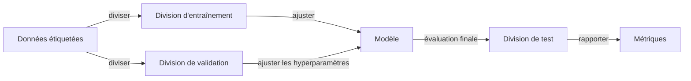

# Apprentissage automatique

## Définition

L'apprentissage automatique (ML) est l'étude des algorithmes qui s'améliorent avec l'expérience (données). Les paradigmes clés incluent l'**apprentissage supervisé** (apprendre d'exemples étiquetés), l'**apprentissage non supervisé** (trouver une structure sans étiquettes) et l'**apprentissage par renforcement** (apprendre de récompenses).

Le ML est préféré aux règles codées manuellement lorsque le problème est trop complexe à spécifier explicitement ou quand les données sont abondantes. Il se situe entre l'IA classique (règles symboliques) et l'[apprentissage profond](/docs/fundamentals/deep-learning) (grands réseaux de neurones) ; beaucoup de systèmes du monde réel combinent des modèles ML avec des pipelines et de la logique métier.

Le pouvoir du ML vient de sa capacité à généraliser : un modèle entraîné sur un sous-ensemble d'exemples peut faire des prédictions précises sur de nouvelles données non vues. Cette généralisation n'est possible que lorsque la distribution d'entraînement est représentative du monde réel, le modèle est convenablement régularisé pour éviter de mémoriser le bruit, et l'évaluation est effectuée rigoureusement sur des données retenues. Comprendre le compromis biais-variance, la validation croisée et l'ingénierie appropriée des caractéristiques sont donc aussi importants que le choix de l'algorithme.

## Fonctionnement



### Entraînement

Vous choisissez une représentation (par ex. modèle linéaire, arbre ou réseau de neurones) et un objectif (perte pour supervisé/non supervisé, récompense pour RL). Un optimiseur (par ex. descente de gradient, ou un algorithme d'ajustement d'arbre) met à jour les paramètres du modèle pour minimiser la perte sur les données d'entraînement.

### Validation et ajustement des hyperparamètres

Après l'entraînement initial, les performances sont mesurées sur l'ensemble de **validation**. Les hyperparamètres (taux d'apprentissage, profondeur de l'arbre, force de régularisation) sont ajustés selon les résultats de validation. La validation croisée fournit des estimations plus fiables lorsque les données sont limitées.

### Évaluation sur le test

La **division de test** n'est touchée qu'une seule fois, à la fin, pour donner une estimation non biaisée de la généralisation. Des métriques telles que la précision, le F1, l'AUC ou le RMSE sont rapportées selon le type de tâche. Le **modèle** entraîné est déployé pour l'inférence sur de nouvelles entrées.

## Quand utiliser / Quand NE PAS utiliser

| Scénario | Utiliser ML ? | Notes |
|---|---|---|
| Données structurées/tabulaires avec cible claire | Oui | Les arbres de décision, gradient boosting, modèles linéaires excellent ici |
| Données non structurées complexes (images, texte brut) | Utiliser l'apprentissage profond | Le ML classique nécessite des caractéristiques élaborées manuellement |
| Très petit ensemble de données (\< 100 exemples) | Avec précaution | Préférer les modèles simples et la validation croisée |
| Besoin d'interprétabilité du modèle (par ex. réglementations) | Oui | Les modèles linéaires et les arbres de décision sont auditables |
| Les règles peuvent être entièrement spécifiées par des experts du domaine | Non | Les systèmes basés sur des règles sont plus prévisibles |
| Tâche interactive basée sur des récompenses (jeux, contrôle) | Utiliser RL | Le ML supervisé nécessite des paires étiquetées |

## Comparaisons

| Paradigme | Étiquettes requises | Type de données | Algorithmes typiques | Exemple de tâche |
|---|---|---|---|---|
| Apprentissage supervisé | Oui | Tous types | Régression logistique, SVM, XGBoost, réseau de neurones | Détection de spam, classification d'images |
| Apprentissage non supervisé | Non | Tous types | K-means, DBSCAN, PCA, autoencodeurs | Segmentation de clients, détection d'anomalies |
| Apprentissage par renforcement | Non (utilise des récompenses) | Séquentiel/interactif | Q-learning, PPO, SAC | Jeux, contrôle robotique |

## Avantages et inconvénients

| Avantages | Inconvénients |
|---|---|
| Généralise à partir d'exemples sans règles explicites | Nécessite des données étiquetées de qualité |
| Évolue bien avec plus de données | Fragile en dehors de la distribution d'entraînement |
| Grande bibliothèque d'algorithmes interprétables (sklearn) | L'ingénierie des caractéristiques est souvent encore nécessaire |
| Inférence efficace une fois entraîné | Peut encoder les biais présents dans les données |

## Exemples de code

```python
# Supervised learning with scikit-learn: gradient boosting on tabular data
from sklearn.datasets import load_breast_cancer
from sklearn.model_selection import train_test_split, cross_val_score
from sklearn.ensemble import GradientBoostingClassifier
from sklearn.preprocessing import StandardScaler
from sklearn.metrics import classification_report
import numpy as np

# Load dataset
X, y = load_breast_cancer(return_X_y=True)
X_train, X_test, y_train, y_test = train_test_split(
    X, y, test_size=0.2, random_state=42, stratify=y
)

# Scale features
scaler = StandardScaler()
X_train_sc = scaler.fit_transform(X_train)
X_test_sc = scaler.transform(X_test)

# Train gradient boosting classifier
clf = GradientBoostingClassifier(n_estimators=100, learning_rate=0.1, max_depth=3)
clf.fit(X_train_sc, y_train)

# Cross-validation estimate
cv_scores = cross_val_score(clf, X_train_sc, y_train, cv=5)
print(f"CV accuracy: {np.mean(cv_scores):.2%} ± {np.std(cv_scores):.2%}")

# Final evaluation on held-out test set
print(classification_report(y_test, clf.predict(X_test_sc)))
```

## Ressources pratiques

- [Cours intensif ML de Google](https://developers.google.com/machine-learning/crash-course) — Introduction interactive aux concepts ML avec codelabs
- [Scikit-learn – Guide utilisateur](https://scikit-learn.org/stable/user_guide.html) — Guide complet du ML classique en pratique
- [Apprentissage Automatique Pratique (Géron)](https://www.oreilly.com/library/view/hands-on-machine-learning/9781098125967/) — Livre pratique couvrant à la fois le ML classique et l'apprentissage profond

## Voir aussi

- [Apprentissage profond](/docs/fundamentals/deep-learning)
- [Apprentissage par renforcement](/docs/rl)
- [Métriques d'évaluation](/docs/evaluation-metrics)
