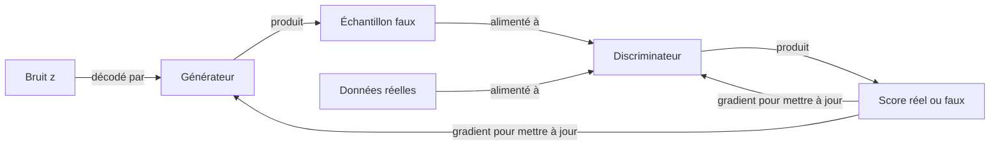

# Réseaux antagonistes génératifs (GAN)

## Définition

Les réseaux antagonistes génératifs (GAN), introduits par Goodfellow et al. en 2014, entraînent deux réseaux de neurones en compétition : un **générateur** qui produit des échantillons synthétiques à partir de bruit aléatoire, et un **discriminateur** qui tente de distinguer les échantillons générés des vrais. Cette dynamique adversariale pousse le générateur à produire des sorties de plus en plus réalistes sans nécessiter de fonction de vraisemblance explicite ni de calendrier de bruit prédéfini.

L'objectif d'entraînement est un jeu min-max : le générateur minimise la capacité du discriminateur à identifier les faux tandis que le discriminateur maximise sa précision de classification. À l'équilibre (équilibre de Nash), les sorties du générateur deviennent indiscernables des données réelles. En pratique, atteindre cet équilibre est difficile — l'entraînement est sujet à l'**effondrement de mode** (le générateur produit une variété limitée) et au **déséquilibre discriminateur/générateur** (un côté domine trop tôt).

Les GAN étaient l'approche générative dominante avant les [modèles de diffusion](/docs/diffusion-models) et restent pertinents pour le transfert de style, l'adaptation de domaine et l'augmentation de données. Comparés aux [VAE](/docs/vaes), les GAN produisent généralement des images plus nettes au prix d'une instabilité d'entraînement et d'une diversité limitée. Les améliorations architecturales (DCGAN, StyleGAN, BigGAN) et les techniques d'entraînement (normalisation spectrale, perte de Wasserstein, croissance progressive) ont considérablement amélioré la stabilité et la qualité des sorties.

## Comment ça fonctionne

### Générateur

Prend un **vecteur de bruit aléatoire z** (échantillonné à partir d'une distribution gaussienne ou uniforme) et le mappe à travers un réseau de neurones (typiquement des convolutions transposées pour les images) pour produire un **échantillon faux** — par ex. une image.

### Discriminateur

Reçoit soit un **échantillon réel** des données d'entraînement soit un **échantillon faux** du générateur. Il produit un score scalaire (probabilité réel ou faux). Sa perte est une entropie croisée binaire entre les étiquettes prédites et vraies.

### Boucle d'entraînement



L'entraînement alterne : (1) mettre à jour le discriminateur pour mieux distinguer le réel du faux, puis (2) mettre à jour le générateur pour mieux tromper le discriminateur. Le générateur ne voit jamais directement les données réelles — il ne reçoit que le signal de gradient du discriminateur.

### Variantes clés

| Variante | Innovation clé |
|---|---|
| DCGAN | Architecture convolutive pour la génération d'images |
| WGAN | Perte de distance de Wasserstein pour un entraînement plus stable |
| StyleGAN | Générateur basé sur le style pour des visages de haute qualité |
| CycleGAN | Traduction image-à-image non appariée |
| GAN conditionnel | Conditionner la génération sur une étiquette de classe ou un attribut |

## Quand utiliser / Quand NE PAS utiliser

| Scénario | Utiliser les GAN | Éviter les GAN |
|---|---|---|
| Génération d'images nettes et photoréalistes | Oui — les GAN produisent des détails nets et à haute fréquence | Non — si la stabilité d'entraînement est une priorité, utiliser la diffusion |
| Transfert de style et adaptation de domaine | Oui — CycleGAN excelle en traduction d'images non appariées | Non — si vous avez besoin de diversité et de couverture, la diffusion est meilleure |
| Augmentation de données pour les classes rares | Oui — les GAN peuvent générer des échantillons synthétiques ciblés | Non — si l'effondrement de mode est un risque avec des données limitées |
| Pipeline d'entraînement stable et reproductible | Non — l'entraînement GAN est notoirement instable | — |
| Estimation de densité ou évaluation de vraisemblance | Non — les GAN ne fournissent pas de vraisemblances explicites | — |

## Comparaisons

| Modèle | Entraînement | Qualité des échantillons | Diversité | Stabilité |
|---|---|---|---|---|
| GAN | Min-max adversarial | Net, haute résolution | Sujet à l'effondrement de mode | Difficile |
| VAE | ELBO (reconstruction + KL) | Flou, lisse | Bonne couverture | Stable |
| Diffusion | Score matching par débruitage | Très net, diversifié | Excellent | Stable |
| Basé sur les flux | Vraisemblance exacte | Net | Bon | Stable |

## Avantages et inconvénients

| Avantages | Inconvénients |
|---|---|
| Produit des détails d'image nets et à haute fréquence | Effondrement de mode — le générateur peut ignorer certaines parties de la distribution |
| Pas de vraisemblance explicite requise | L'équilibre discriminateur/générateur est difficile à maintenir |
| Très flexible — nombreuses variantes pour différentes tâches | L'évaluation est difficile ; FID/IS sont des proxies imparfaits |
| Inférence rapide (un seul passage avant) | L'entraînement est instable ; sensible aux hyperparamètres |

## Exemples de code

Entraînement DCGAN minimal sur MNIST avec PyTorch :

```python
import torch
import torch.nn as nn
from torchvision import datasets, transforms
from torch.utils.data import DataLoader

# Générateur : bruit → image 28x28
class Generator(nn.Module):
    def __init__(self, latent_dim=100):
        super().__init__()
        self.net = nn.Sequential(
            nn.Linear(latent_dim, 256), nn.ReLU(),
            nn.Linear(256, 512), nn.ReLU(),
            nn.Linear(512, 28 * 28), nn.Tanh(),
        )
    def forward(self, z):
        return self.net(z).view(-1, 1, 28, 28)

# Discriminateur : image → score réel/faux
class Discriminator(nn.Module):
    def __init__(self):
        super().__init__()
        self.net = nn.Sequential(
            nn.Flatten(),
            nn.Linear(28 * 28, 512), nn.LeakyReLU(0.2),
            nn.Linear(512, 256), nn.LeakyReLU(0.2),
            nn.Linear(256, 1), nn.Sigmoid(),
        )
    def forward(self, x):
        return self.net(x)

latent_dim = 100
G, D = Generator(latent_dim), Discriminator()
opt_G = torch.optim.Adam(G.parameters(), lr=2e-4, betas=(0.5, 0.999))
opt_D = torch.optim.Adam(D.parameters(), lr=2e-4, betas=(0.5, 0.999))
bce = nn.BCELoss()

loader = DataLoader(
    datasets.MNIST(".", download=True, transform=transforms.ToTensor()),
    batch_size=128, shuffle=True
)

for epoch in range(5):
    for real, _ in loader:
        batch = real.size(0)
        real = real * 2 - 1  # Normaliser à [-1, 1]

        # --- Entraîner le discriminateur ---
        z = torch.randn(batch, latent_dim)
        fake = G(z).detach()
        loss_D = bce(D(real), torch.ones(batch, 1)) + bce(D(fake), torch.zeros(batch, 1))
        opt_D.zero_grad(); loss_D.backward(); opt_D.step()

        # --- Entraîner le générateur ---
        z = torch.randn(batch, latent_dim)
        loss_G = bce(D(G(z)), torch.ones(batch, 1))
        opt_G.zero_grad(); loss_G.backward(); opt_G.step()

    print(f"Époque {epoch+1} | Perte D : {loss_D.item():.3f} | Perte G : {loss_G.item():.3f}")
```

## Ressources pratiques

- [Generative Adversarial Networks (Goodfellow et al., 2014)](https://arxiv.org/abs/1406.2661) — Article GAN original introduisant le cadre min-max
- [PyTorch – Tutoriel DCGAN](https://pytorch.org/tutorials/beginner/dcgan_faces_tutorial.html) — Tutoriel officiel avec GAN convolutif sur CelebA
- [StyleGAN2 (Karras et al.)](https://arxiv.org/abs/1912.04958) — Architecture état de l'art pour la synthèse de visages haute résolution
- [GAN Lab (visualisation interactive)](https://poloclub.github.io/ganlab/) — Visualisation en navigateur des dynamiques d'entraînement GAN

## Voir aussi

- [Modèles de diffusion](/docs/diffusion-models)
- [VAE](/docs/vaes)
