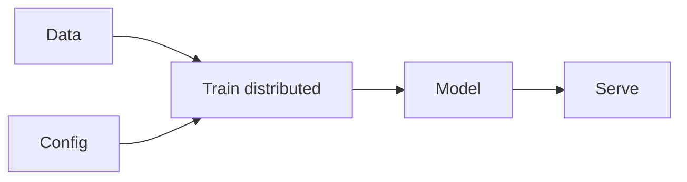

# Infrastructure

## Définition

AI infrastructure covers hardware (GPUs, TPUs, custom accelerators) and software (distributed training, serving, orchestration) for training and deploying large models.

L'échelle est portée par les [LLMs](/docs/llms) et les grands modèles de vision ; l'entraînement peut utiliser des milliers de GPU ; le déploiement utilise la [compression de modèleompression](/docs/model-compression) (par ex. [quantization](/docs/quantization)) and batching to meet latency and cost. [Frameworks](/docs/frameworks/pytorch) (PyTorch, JAX, TensorFlow) provide the programming model; clouds and on-prem clusters provide the hardware and orchestration.

## Comment ça fonctionne

**Les données** et la **configuration** (modèle, hyperparamètres) alimentent l'**entraînement** : l'entraînement distribué s'exécute sur de nombreux appareils en utilisantg data parallelism (replicate model, split data) and/or model parallelism (split model across devices). Frameworks (PyTorch, JAX) and orchestrators (SLURM, Kubernetes, cloud jobs) manage scheduling and communication. The trained **model** is then **served**: loaded on inference hardware, optionally [quantized](/docs/quantization), and exposed via an API. Serving uses batching, replication, and load balancing to meet throughput and latency; monitoring and versioning are part of the pipeline.

## Cas d'utilisation

ML infrastructure covers training at scale and serving with the right latency, throughput, and reliability.

- Distributed training of large models across GPU/TPU clusters
- Serving models at scale with batching and replication
- End-to-end ML pipelines from data to deployment

## Documentation externe

- [PyTorch – Distributed training](https://pytorch.org/tutorials/beginner/distributed_overview.html)
- [Google Cloud – GPU and TPU](https://cloud.google.com/ai-platform/docs/get-started-with-tpu)

## Voir aussi

- [Local inference](/docs/local-inference)
- [Edge raisonnement](/docs/edge-reasoning)
- [Model compression](/docs/model-compression)
- [Quantization](/docs/quantization)
- [Frameworks](/docs/frameworks/pytorch)
