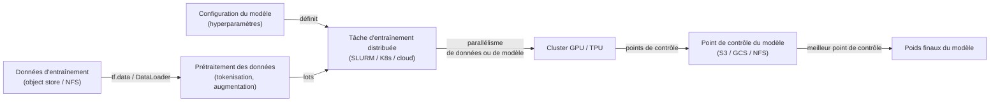
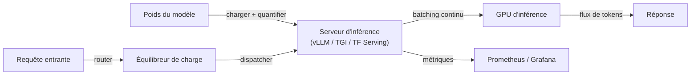

# Infrastructure

## Définition

L'infrastructure IA englobe le matériel, la mise en réseau et les systèmes logiciels requis pour entraîner et déployer de grands modèles d'apprentissage automatique à grande échelle. Côté matériel, cela signifie des GPU (NVIDIA H100/A100, série RTX grand public), des TPU (accélérateurs IA personnalisés de Google) et des puces spécifiques à l'inférence émergentes (AWS Inferentia, Groq LPU). Côté logiciel, cela inclut les frameworks d'entraînement distribué, les ordonnanceurs de tâches, les piles de service de modèles et les outils d'observabilité.

L'échelle de l'infrastructure nécessaire est principalement déterminée par les [LLM](/docs/llms) et les grands modèles de vision. L'entraînement d'un modèle frontier peut nécessiter des milliers de GPU fonctionnant pendant des semaines, exigeant une attention particulière à la mise en réseau inter-nœuds (NVLink, InfiniBand), les entrées/sorties de stockage (systèmes de fichiers parallèles comme Lustre, stockage d'objets cloud avec connecteurs haute bande passante) et la tolérance aux pannes (points de contrôle automatiques, gestion de la préemption). Servir efficacement ces modèles entraînés nécessite différentes optimisations matérielles : la [quantification](/docs/quantization), le décodage spéculatif et le batching continu réduisent les coûts par token et la latence.

Les [frameworks](/docs/frameworks/pytorch) tels que PyTorch, JAX et TensorFlow fournissent le modèle de programmation pour exprimer les calculs de réseaux de neurones ; l'infrastructure fournit le substrat. Les fournisseurs cloud (AWS, GCP, Azure) offrent une infrastructure IA gérée (SageMaker, Vertex AI, Azure ML) qui gère le provisionnement de clusters, l'ordonnancement des tâches et le suivi des expériences, tandis que les déploiements sur site utilisent des orchestrateurs comme SLURM ou Kubernetes avec des plugins de périphériques GPU.

## Comment ça fonctionne

### Pipeline d'entraînement



### Pipeline de service



### Concepts clés

**Parallélisme de données** — répliquer le modèle sur tous les appareils ; diviser les données entre les appareils ; synchroniser les gradients. **Parallélisme de modèle** — diviser les couches du modèle entre les appareils ; nécessaire quand le modèle ne tient pas sur un seul GPU. **Parallélisme de pipeline** — diviser le modèle en étapes entre les appareils ; chevaucher le calcul et la communication. **Batching continu** — grouper dynamiquement les requêtes d'inférence simultanées pour maximiser l'utilisation du GPU. **Cache KV** — mettre en cache les tenseurs clé/valeur d'attention entre les tokens pour éviter le recalcul.

## Quand utiliser / Quand NE PAS utiliser

| Scénario | Investir dans une infrastructure dédiée | Utiliser des services cloud / gérés |
|----------|-----------------------------------|------------------------------|
| Entraînement de modèles frontier propriétaires | Oui — coût et contrôle à grande échelle | |
| Environnements réglementés (souveraineté des données) | Oui — sur site garantit la résidence des données | |
| Affinement ou inférence occasionnels | | Les instances spot cloud ou les API gérées sont moins chères |
| Service de modèles publics à charge variable | | Le service cloud à autoscaling est plus facile à gérer |
| Recherche avec besoins GPU fréquents | | Les instances réservées cloud ou les clusters académiques suffisent |

## Avantages et inconvénients

| Avantages | Inconvénients |
|------|------|
| Contrôle total du matériel, des données et de la sécurité | Coût en capital et opérationnel élevé pour les clusters sur site |
| Coût prévisible à forte utilisation | Nécessite une expertise en systèmes distribués et MLOps |
| Latence la plus faible quand co-localisé avec les services | Risque de sur-provisionnement si les charges de travail fluctuent |
| Pas de coûts d'egress ni de limites de débit API | Contraintes d'approvisionnement GPU et longs délais de procurement |

## Exemples de code

```python
# Entraînement PyTorch DistributedDataParallel (DDP) — exemple minimal
import torch
import torch.distributed as dist
import torch.multiprocessing as mp
from torch.nn.parallel import DistributedDataParallel as DDP
from torch.utils.data.distributed import DistributedSampler

def train(rank: int, world_size: int):
    dist.init_process_group("nccl", rank=rank, world_size=world_size)
    torch.cuda.set_device(rank)

    model = MyModel().to(rank)
    model = DDP(model, device_ids=[rank])          # encapsuler pour la synchronisation distribuée

    sampler = DistributedSampler(dataset, num_replicas=world_size, rank=rank)
    loader = DataLoader(dataset, batch_size=64, sampler=sampler)

    optimizer = torch.optim.AdamW(model.parameters(), lr=1e-4)
    for epoch in range(10):
        sampler.set_epoch(epoch)                   # assurer des mélanges différents
        for x, y in loader:
            x, y = x.to(rank), y.to(rank)
            loss = loss_fn(model(x), y)
            loss.backward()
            optimizer.step()
            optimizer.zero_grad()

    dist.destroy_process_group()

if __name__ == "__main__":
    mp.spawn(train, args=(torch.cuda.device_count(),), nprocs=torch.cuda.device_count())
```

## Ressources pratiques

- [PyTorch — Présentation de l'entraînement distribué](https://pytorch.org/tutorials/beginner/distributed_overview.html) — DDP, FSDP et RPC
- [Google Cloud — Démarrage rapide TPU](https://cloud.google.com/tpu/docs/quick-starts) — Entraînement sur des pods TPU
- [Documentation vLLM](https://docs.vllm.ai/) — Serveur d'inférence LLM à haut débit
- [NVIDIA — Megatron-LM](https://github.com/NVIDIA/Megatron-LM) — Parallélisme de modèle à grande échelle pour l'entraînement LLM
- [Kubernetes — Ordonnancement GPU](https://kubernetes.io/docs/tasks/manage-gpus/scheduling-gpus/) — Exécution de charges de travail GPU sur K8s

## Voir aussi

- [Inférence locale](/docs/local-inference)
- [Raisonnement en périphérie](/docs/edge-reasoning)
- [Compression de modèle](/docs/model-compression)
- [Quantification](/docs/quantization)
- [MLOps](/docs/mlops)
- [Frameworks](/docs/frameworks/pytorch)
