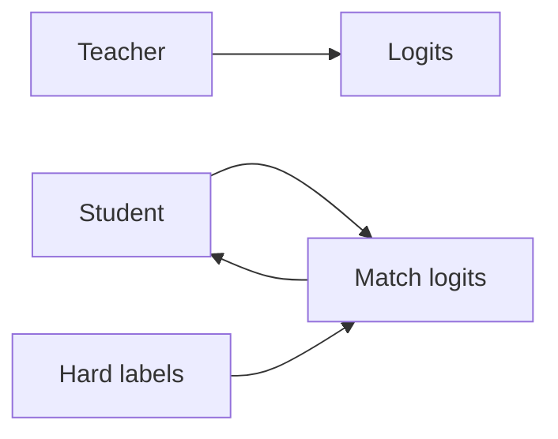

# Distillation de connaissances

## Définition

Knowledge distillation entraîne un modèle étudiant plus petit pour correspondre aux sorties (and sometimes intermediate representations) d'un enseignant plus grand. The student gains from the teacher’s soft labels and can run with less compute.

C'est a [model compression](/docs/model-compression) technique that preserves more of the teacher’s behavior than training the student on hard labels alone. Used for BERT → DistilBERT, large [LLMs](/docs/llms) → smaller variants, and [transfer learning](/docs/transfer-learning) from ensembles.

## Comment ça fonctionne

Le **professeur** (grand modèle) produit des **logits** (ou embeddings) sur les données d'entraînement. L'**élève** (modèle plus petit) estrained to **match** the teacher’s logits (par ex. KL divergence with temperature scaling) in addition to or instead of **hard labels** (ground truth). Temperature softens the teacher distribution so the student learns from dark knowledge (relative scores across classes). Optionally, intermediate layers or attention can be matched. The student is trained with a mix of distillation loss and task loss; after training it runs with the student’s capacity and latency.

## Cas d'utilisation

Knowledge distillation fits when you want a small, fast student that approximates a large teacher for deployment.

- Training smaller, faster models that approximate large ones (par ex. BERT → DistilBERT)
- Enabling deployment when the teacher is too heavy for production
- Transferring knowledge from ensembles or from multiple teachers

## Documentation externe

- [Distilling the Knowledge in a Neural Network (Hinton et al.)](https://arxiv.org/abs/1503.02531)
- [Hugging Face – Distillation](https://huggingface.co/docs/transformers/tasks/distillation)

## Voir aussi

- [Model compression](/docs/model-compression)
- [Transfer learning](/docs/transfer-learning)
