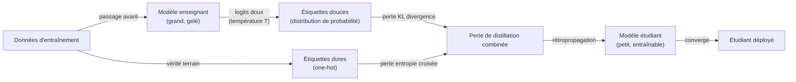
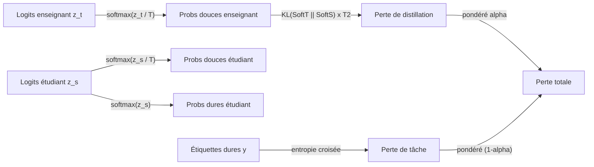

# Distillation de connaissances

## Définition

La distillation de connaissances est une technique de [compression de modèle](/docs/model-compression) dans laquelle un modèle **étudiant** plus petit est entraîné à reproduire le comportement d'un modèle **enseignant** plus grand et plus capable. Plutôt que d'entraîner l'étudiant sur des étiquettes dures seules (la classe ou le token de vérité terrain), la distillation expose l'étudiant aux **sorties douces** de l'enseignant — des distributions de probabilité sur toutes les classes ou tokens — qui contiennent des informations plus riches sur les représentations internes du modèle et les similarités relatives entre concepts. Ce signal supplémentaire permet à l'étudiant d'atteindre des niveaux de précision qui nécessiteraient beaucoup plus de données ou de capacité s'il était entraîné de zéro.

Le concept a été formalisé par Hinton et al. en 2015 et a depuis été appliqué largement : BERT (110M paramètres) a été distillé en DistilBERT (66M, conservant ~97% des performances de BERT), les modèles de style GPT ont été distillés en variantes de chat plus petites, et les modèles d'ensemble ont été distillés en réseaux uniques. Au-delà de la classification, la distillation s'applique à la génération de séquences (correspondance des distributions de sortie token par token), la correspondance de caractéristiques intermédiaires (alignement des états cachés entre enseignant et étudiant) et le transfert d'attention (correspondance des cartes d'attention dans les modèles de transformateur).

La distillation de connaissances est complémentaire à la [quantification](/docs/quantization) et à l'[élagage](/docs/pruning) dans le pipeline de compression. Un workflow de production typique distille un grand modèle en un plus petit, puis quantifie l'étudiant pour le déploiement. Contrairement à l'élagage (qui modifie un modèle existant) et à la quantification (qui change la représentation numérique), la distillation crée un modèle fondamentalement différent, entraîné spécifiquement, dont l'architecture peut être librement conçue.

## Comment ça fonctionne

### Pipeline d'entraînement



### Décomposition de la fonction de perte



### Variantes de distillation

| Variante | Ce qui est correspondé | Cas d'usage |
|---------|----------------|---------|
| Basée sur la réponse (Hinton) | Logits de sortie (étiquettes douces) | Classification, génération |
| Basée sur les caractéristiques | États cachés intermédiaires | Compression structurelle |
| Transfert d'attention | Cartes de poids d'attention | Compression de têtes de transformateur |
| Distillation sans données | Données synthétiques générées par l'enseignant | Pas d'accès aux données d'entraînement originales |
| Distillation en ligne | Apprentissage mutuel entre pairs | Pas besoin d'enseignant fort |

## Quand utiliser / Quand NE PAS utiliser

| Scénario | Utiliser la distillation de connaissances | NE PAS utiliser la distillation de connaissances |
|----------|--------------------------|------------------------------------|
| Besoin d'un petit modèle avec une précision proche de l'enseignant | Oui — la distillation est la méthode de compression la plus précise | |
| Déployer un étudiant affiné pour une tâche spécifique | Oui — la distillation spécifique à la tâche est très efficace | |
| Compresser des modèles d'ensemble en un seul réseau | Oui — cas d'usage canonique | |
| Compression rapide sans réentraînement | | Utiliser la [quantification](/docs/quantization) PTQ à la place |
| Pas d'accès aux données d'entraînement | | La distillation sans données est complexe ; la quantification est plus simple |
| Élagage d'un modèle existant sans changer l'architecture | | L'[élagage](/docs/pruning) est plus approprié |

## Avantages et inconvénients

| Avantages | Inconvénients |
|------|------|
| L'architecture de l'étudiant est sans contrainte — peut être librement conçue | Nécessite un calcul d'entraînement significatif (exécution d'entraînement complète) |
| Atteint souvent une meilleure précision que l'élagage au même ratio de compression | Nécessite l'accès à l'enseignant au moment de l'entraînement |
| Les étiquettes douces fournissent un signal plus riche que les étiquettes dures seules | L'écart de capacité enseignant-étudiant peut limiter l'efficacité du transfert |
| Complémentaire à la quantification et à l'élagage | Le réglage des hyperparamètres (température, poids de perte) ajoute de la complexité |

## Exemples de code

```python
# Boucle d'entraînement de distillation de connaissances en PyTorch
import torch
import torch.nn.functional as F

def distillation_loss(
    student_logits: torch.Tensor,
    teacher_logits: torch.Tensor,
    hard_labels: torch.Tensor,
    temperature: float = 4.0,
    alpha: float = 0.7,
) -> torch.Tensor:
    """Combiner la perte de distillation KL-divergence avec la perte de tâche entropie croisée."""
    # Cibles douces de l'enseignant (mises à l'échelle par la température)
    soft_teacher = F.softmax(teacher_logits / temperature, dim=-1)
    soft_student = F.log_softmax(student_logits / temperature, dim=-1)

    # Perte de distillation : divergence KL entre distributions douces
    # Multiplier par T^2 pour maintenir l'amplitude du gradient relative à la perte de tâche
    loss_kl = F.kl_div(soft_student, soft_teacher, reduction="batchmean") * (temperature ** 2)

    # Perte de tâche : entropie croisée standard avec étiquettes dures
    loss_ce = F.cross_entropy(student_logits, hard_labels)

    return alpha * loss_kl + (1 - alpha) * loss_ce


# Configuration d'entraînement : l'enseignant est gelé, l'étudiant est mis à jour
teacher.train(False)   # mettre l'enseignant en mode inférence (pas de mises à jour de gradient)
student.train(True)

for x_batch, y_batch in train_loader:
    with torch.no_grad():
        teacher_logits = teacher(x_batch)   # obtenir les étiquettes douces de l'enseignant gelé

    student_logits = student(x_batch)       # passage avant de l'étudiant

    loss = distillation_loss(
        student_logits, teacher_logits, y_batch,
        temperature=4.0,
        alpha=0.7,
    )

    optimizer.zero_grad()
    loss.backward()
    optimizer.step()
```

## Ressources pratiques

- [Distilling the Knowledge in a Neural Network (Hinton et al., 2015)](https://arxiv.org/abs/1503.02531) — Article original introduisant les cibles douces et la température
- [Article DistilBERT](https://arxiv.org/abs/1910.01108) — Distillation de BERT avec 40% moins de paramètres et 97% des performances
- [Hugging Face — Guide de distillation](https://huggingface.co/docs/transformers/tasks/distillation) — Guide pratique avec Transformers
- [Article TinyBERT](https://arxiv.org/abs/1909.10351) — Distillation basée sur l'attention et les caractéristiques pour BERT

## Voir aussi

- [Compression de modèle](/docs/model-compression)
- [Apprentissage par transfert](/docs/transfer-learning)
