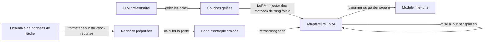

# Fine-tuning

## Définition

Le fine-tuning continue l'entraînement d'un modèle pré-entraîné sur des données spécifiques à une tâche ou un domaine. Le fine-tuning complet met à jour tous les paramètres ; les méthodes efficaces en paramètres (par ex. LoRA, adaptateurs) mettent à jour un petit sous-ensemble pour réduire le coût.

Utilisez-le quand vous avez besoin d'un comportement ou d'un style spécifique stable pour la tâche (par ex. langage de domaine, format de sortie) et que vous disposez de suffisamment de données étiquetées. Pour les connaissances fréquemment mises à jour ou les questions ponctuelles, le [RAG](/docs/rag) ou l'[ingénierie de prompts](/docs/prompt-engineering) sont souvent meilleurs. Voir [LLMs](/docs/llms) pour le pipeline d'entraînement complet.

Les méthodes de fine-tuning efficaces en paramètres (PEFT), en particulier **LoRA** (Adaptation de Rang Faible), ont rendu le fine-tuning pratique sur du matériel grand public. LoRA gèle les poids du modèle original et injecte des matrices entraînables de rang faible dans les projections d'attention ; seules ces petites matrices sont mises à jour et stockées. Le modèle original peut être partagé entre de nombreux adaptateurs LoRA, chacun se spécialisant pour une tâche ou un domaine différent. LoRA quantifié (QLoRA) combine la quantification 4 bits avec LoRA, permettant le fine-tuning de modèles de 7B–70B sur un seul GPU grand public. Cela réduit considérablement la barrière à l'adaptation de domaine par rapport au fine-tuning complet.

## Fonctionnement



### Partir d'un modèle de base

Vous partez d'un **modèle de base** (par ex. un [LLM](/docs/llms) pré-entraîné) et d'un **ensemble de données** d'exemples de tâche. L'ensemble de données est formaté en paires instruction-réponse (pour l'ajustement d'instructions) ou en texte de domaine brut (pour le pré-entraînement continu).

### LoRA : adaptation de rang faible

Au lieu de mettre à jour tous les paramètres, LoRA ajoute des matrices entraînables A et B (où le rang r ≪ d) aux matrices de poids. Seuls A et B sont entraînés ; les poids originaux sont gelés. Cela réduit les paramètres entraînables de plus de 99% tout en atteignant une qualité proche du fine-tuning complet. Les adaptateurs peuvent être fusionnés dans le modèle de base au moment de l'inférence pour zéro surcharge.

### Validation et arrêt

La **perte de validation** sur une division retenue guide l'arrêt précoce. Le surapprentissage est courant avec de petits ensembles de données ; des techniques comme le découpage des gradients, des taux d'apprentissage faibles (1e-4 à 1e-5) et un entraînement court (1–3 epochs) sont des pratiques standard.

## Quand utiliser / Quand NE PAS utiliser

| Scénario | Utiliser le fine-tuning ? | Notes |
|---|---|---|
| Adaptation de domaine (juridique, médical, code) | Oui | Quelques centaines d'exemples peuvent changer significativement le comportement du modèle |
| Format de sortie cohérent (JSON, tableaux) | Oui | Plus fiable qu'avec des prompts seuls |
| Connaissances changeant fréquemment | Non | RAG est moins cher et plus à jour |
| Réponse à des questions ponctuelles | Non | Le prompting few-shot est suffisant |
| Réduire les hallucinations sur des faits connus | Partiellement | Combiner avec RAG pour de meilleurs résultats |
| Budget contraint (\< $50) | Oui (LoRA) | QLoRA le rend faisable sur du matériel grand public |

## Comparaisons

| Méthode | Mises à jour | Coût | Qualité | Quand utiliser |
|---|---|---|---|---|
| Prompting zero-shot | Aucune | Le plus bas | Ligne de base | Tâches générales |
| Prompting few-shot | Aucune | Bas | Bonne | Guidage de format |
| Fine-tuning complet | Tous les paramètres | Très élevé | Meilleure | Grandes données, performance maximale |
| Fine-tuning LoRA | ~0.1–1% des params | Bas à modéré | Quasi-complète | Adaptation de domaine pratique |
| RAG | Aucune | Modéré (récupération) | Bonne pour les connaissances | Bases de connaissances en direct ou grandes |

## Avantages et inconvénients

| Avantages | Inconvénients |
|---|---|
| Forte performance spécifique à la tâche | Nécessite des données étiquetées organisées |
| LoRA/QLoRA est abordable et accessible | Risque d'oubli catastrophique |
| Comportement intégré (pas de surcharge d'ingénierie de prompts) | Les modèles fine-tunés peuvent encore halluciner |
| Fichiers d'adaptateurs portables (Mo pas Go) | L'évaluation est plus difficile qu'avec des prompts |

## Exemples de code

```python
# LoRA fine-tuning with Hugging Face PEFT and TRL (SFTTrainer)
# pip install transformers peft trl datasets bitsandbytes accelerate
from transformers import AutoTokenizer, AutoModelForCausalLM, BitsAndBytesConfig
from peft import LoraConfig, get_peft_model, TaskType
from trl import SFTTrainer, SFTConfig
from datasets import Dataset

# Small toy dataset — replace with your domain data
data = [
    {"text": "USER: What is LoRA? ASSISTANT: LoRA is a parameter-efficient fine-tuning technique that injects trainable low-rank matrices into frozen model weights."},
    {"text": "USER: Why use LoRA? ASSISTANT: LoRA reduces trainable parameters by 99%+ while achieving near-full fine-tuning quality, making it feasible on consumer GPUs."},
]
dataset = Dataset.from_list(data)

model_name = "facebook/opt-125m"  # tiny model for illustration; swap for llama-3, mistral, etc.
tokenizer  = AutoTokenizer.from_pretrained(model_name)
tokenizer.pad_token = tokenizer.eos_token

# Load model (add BitsAndBytesConfig for 4-bit QLoRA on larger models)
model = AutoModelForCausalLM.from_pretrained(model_name)

# LoRA configuration
lora_config = LoraConfig(
    task_type=TaskType.CAUSAL_LM,
    r=8,            # rank
    lora_alpha=32,
    target_modules=["q_proj", "v_proj"],
    lora_dropout=0.05,
)
model = get_peft_model(model, lora_config)
model.print_trainable_parameters()   # prints e.g. "trainable params: 0.05%"

# Train
training_args = SFTConfig(
    output_dir="./lora-output",
    num_train_epochs=3,
    per_device_train_batch_size=1,
    logging_steps=1,
    save_strategy="no",
    dataset_text_field="text",
    max_seq_length=128,
)
trainer = SFTTrainer(model=model, train_dataset=dataset, args=training_args)
trainer.train()
print("Fine-tuning complete.")
```

## Ressources pratiques

- [Hugging Face – Affiner un modèle pré-entraîné](https://huggingface.co/docs/transformers/training) — Guide complet avec l'API Trainer
- [OpenAI – Fine-tuning](https://platform.openai.com/docs/guides/fine-tuning) — Fine-tuning basé sur API pour les modèles GPT
- [Documentation de la bibliothèque PEFT](https://huggingface.co/docs/peft) — LoRA, adaptateurs et autres méthodes PEFT

## Voir aussi

- [LLMs](/docs/llms)
- [Ingénierie de prompts](/docs/prompt-engineering)
