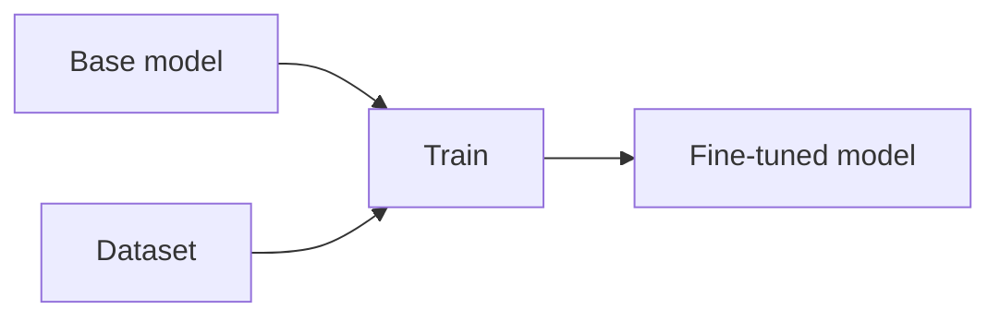

# Fine-tuning

## Définition

L'affinage poursuit l'entraînement d'un modèle pré-entraîné sur des données spécifiques à une tâche ou un domaine. Full fine-tuning updates all parameters; parameter-efficient methods (par ex. LoRA, adapters) update a small subset to reduce cost.

Utilisez-le quand you need stable, task-specific behavior or style (par ex. domain language, output format) and have enough labeled data. For frequently updated knowledge or one-off questions, [RAG](/docs/rag) or [prompt engineering](/docs/llms/prompt-engineering) are often better. See [LLMs](/docs/llms) for the full training pipeline.

## Comment ça fonctionne

You start from a **base model** (par ex. a pretrained [LLM](/docs/llms)) and a **dataset** of task examples. You define a **loss** (par ex. cross-entropy for classification, next-token for generation) and run optimization (par ex. Adam) on your data. Le résultat est un **fine-tuned model** whose weights are updated (fully or only adapters/LoRA). **Instruction tuning** uses (instruction, response) pairs so the model learns to follow prompts; **domain fine-tuning** uses in-domain text or labeled tasks. Validation and early stopping prevent overfitting; often only 1–5% of parameters are updated with LoRA to save compute.

## Cas d'utilisation

Fine-tuning is the right tool when you need a model to follow a specific style, domain, or task better than prompting alone.

- Adapting a base model to a specific domain (par ex. legal, medical)
- Teaching a consistent output format or style (par ex. JSON, tone)
- Improving performance on a narrow task with limited labeled data

## Documentation externe

- [Hugging Face – Fine-tune a pretrained model](https://huggingface.co/docs/transformers/training)
- [OpenAI – Fine-tuning](https://platform.openai.com/docs/guides/fine-tuning)

## Voir aussi

- [LLMs](/docs/llms)
- [Prompt engineering](/docs/llms/prompt-engineering)
