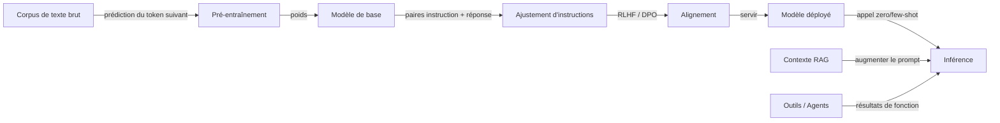

# Grands modèles de langage (LLM)

## Définition

Les grands modèles de langage sont des modèles basés sur des transformers entraînés sur des données massives de texte (et parfois multimodales). Ils présentent des capacités émergentes : apprentissage few-shot, raisonnement et utilisation d'outils lorsqu'ils sont mis à l'échelle et alignés (par ex. via RLHF).

Un modèle mental utile : le **pré-entraînement** apprend la prédiction du token suivant sur d'énormes corpus et donne au modèle de larges connaissances et des capacités linguistiques. L'**ajustement d'instructions** (et similaires) entraîne le modèle à suivre les instructions et formats utilisateur. L'**alignement** (par ex. RLHF, DPO) façonne le comportement pour être utile, honnête et sûr. Au moment de l'inférence, vous pouvez utiliser le modèle zero-shot, few-shot, ou l'augmenter avec de la récupération (RAG) ou des outils (agents).

Les « capacités émergentes » sont la propriété distinctive clé des LLM : des capacités qui ne sont pas explicitement entraînées mais qui émergent de l'échelle. Le raisonnement par chaîne de pensée, l'arithmétique en plusieurs étapes, la synthèse de code et l'apprentissage en contexte à partir d'une poignée d'exemples apparaissent tous au-dessus de certaines tailles de modèle et volumes de données. Cela rend les LLM fondamentalement différents des modèles de tâches entraînés de manière étroite — un seul LLM peut remplacer des dizaines de classificateurs spécialisés grâce à une ingénierie soigneuse de [prompts](/docs/prompt-engineering), au [fine-tuning](/docs/llms/fine-tuning) ou au [RAG](/docs/rag). La conséquence pratique est que les applications alimentées par LLM nécessitent une discipline d'évaluation différente : au-delà de la précision, vous devez tester les hallucinations, le comportement de refus, la toxicité et la robustesse au changement de distribution.

## Fonctionnement



### Pré-entraînement

Le **modèle de base** est entraîné sur des billions de tokens en utilisant la prédiction du token suivant (perte d'entropie croisée). Cette phase est intensive en calcul (des milliers de jours-GPU) et produit un modèle avec de larges connaissances du monde et une fluidité linguistique.

### Ajustement d'instructions et alignement

L'**ajustement d'instructions** utilise des paires (instruction, réponse) pour que le modèle apprenne à suivre les prompts de manière fiable. L'**alignement** (RLHF, DPO, Constitutional AI) utilise des retours humains ou des signaux générés par l'IA pour récompenser les réponses utiles, honnêtes et sûres et pénaliser les réponses nuisibles.

### Augmentation de l'inférence

Au moment de l'inférence, le modèle déployé peut être appelé zero-shot, few-shot ou de manière augmentée. Le **RAG** injecte des documents récupérés dans le contexte du prompt. Les **agents** donnent au modèle accès à des outils externes (recherche, exécution de code, APIs) et boucle jusqu'à ce qu'une tâche soit complète.

## Quand utiliser / Quand NE PAS utiliser

| Scénario | Utiliser LLM ? | Notes |
|---|---|---|
| Tâches en langage naturel (résumé, QA, chat) | Oui | Les LLM sont le choix par défaut |
| Prédiction structurée (par ex. remplir une table SQL) | Avec précaution | Les LLM ajustés ou avec prompts fonctionnent ; valider les sorties |
| Déterminisme strict requis (par ex. logique de facturation) | Non | Utiliser du code déterministe ; les LLM sont probabilistes |
| Base de connaissances fréquemment mise à jour | Utiliser RAG | Le fine-tuning est coûteux pour les données changeant rapidement |
| Tâche étroite avec données étiquetées abondantes | Avec précaution | Un modèle plus petit fine-tuné peut être moins cher et plus rapide |
| Production à faible latence et haut débit | Avec précaution | Profiler le coût par token ; les modèles distillés peuvent suffire |

## Comparaisons

| Approche | Meilleur pour | Données nécessaires | Coût |
|---|---|---|---|
| Prompting zero-shot | Prototypage rapide, tâches générales | Aucune | Bas (appels API) |
| Prompting few-shot | Format cohérent, tâches rares | Quelques exemples | Bas |
| RAG | QA intensif en connaissances, données en direct | Corpus de récupération | Modéré |
| Fine-tuning | Adaptation de domaine, style spécifique | Centaines à milliers | Élevé (entraînement) |

## Avantages et inconvénients

| Avantages | Inconvénients |
|---|---|
| Flexible, un modèle pour de nombreuses tâches | Coût et latence |
| Forte performance few-shot | Hallucinations et biais |
| Permet les agents et l'utilisation d'outils | Nécessite une évaluation soigneuse |
| S'améliore rapidement avec les nouvelles versions | Sorties non déterministes |

## Exemples de code

```python
# Zero-shot and few-shot prompting with the OpenAI SDK
from openai import OpenAI

client = OpenAI()  # OPENAI_API_KEY from environment

def call_llm(messages: list[dict], model: str = "gpt-4o-mini") -> str:
    response = client.chat.completions.create(
        model=model,
        messages=messages,
        temperature=0.0,
        max_tokens=256,
    )
    return response.choices[0].message.content.strip()

# Zero-shot example
zero_shot = call_llm([
    {"role": "system", "content": "Classify the sentiment of the input as positive or negative. Reply with one word."},
    {"role": "user",   "content": "The delivery was fast and the product quality exceeded my expectations!"},
])
print(f"Zero-shot: {zero_shot}")

# Few-shot example
few_shot_messages = [
    {"role": "system", "content": "Classify sentiment. Reply with one word."},
    {"role": "user",   "content": "Horrible service."},
    {"role": "assistant", "content": "Negative"},
    {"role": "user",   "content": "Best purchase I have ever made!"},
    {"role": "assistant", "content": "Positive"},
    {"role": "user",   "content": "It arrived late but the item is fine."},
]
few_shot = call_llm(few_shot_messages)
print(f"Few-shot: {few_shot}")
```

## Ressources pratiques

- [OpenAI – Vue d'ensemble des modèles](https://platform.openai.com/docs/models) — Familles de modèles GPT et capacités
- [Google AI pour les développeurs](https://ai.google.dev/) — Modèles Gemini, APIs et guides
- [Anthropic – Modèles](https://www.anthropic.com/product) — Documentation et API Claude
- [Hugging Face – Cours NLP](https://huggingface.co/learn/nlp-course/) — Des transformers aux LLM fine-tunés

## Voir aussi

- [Fine-tuning](/docs/llms/fine-tuning)
- [Ingénierie de prompts](/docs/prompt-engineering)
- [RAG](/docs/rag)
- [Agents](/docs/agents)
