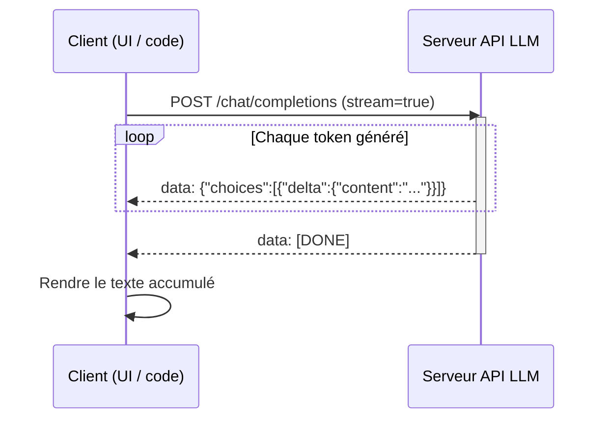

# Streaming (LLMs)

## Définition

Le streaming signifie retourner la sortie du [LLM](/docs/llms) **token par token** (ou morceau par morceau) au fur et à mesure de sa génération, au lieu d'attendre la réponse complète. Les utilisateurs voient le texte apparaître de manière incrémentielle, ce qui réduit la **latence perçue** et améliore les [cas d'usage](/docs/llms) de chat et d'assistants.

Il est supporté par la plupart des APIs LLM (OpenAI, Anthropic, Gemini, serveurs open-source comme vLLM) via Server-Sent Events (SSE) ou des protocoles similaires. Les mêmes modèles d'[ingénierie de prompts](/docs/prompt-engineering) et de [RAG](/docs/rag) ou d'[agents](/docs/agents) s'appliquent ; seule la livraison de la réponse est incrémentielle.

La différence d'expérience utilisateur entre le streaming et le non-streaming est grande en pratique : une réponse qui prend 10 secondes à se compléter semble presque instantanée quand le premier token arrive en 200 ms. Cette métrique de « temps jusqu'au premier token » (TTFT) est aussi importante que le débit pour les applications interactives. Le streaming permet également l'**annulation anticipée** — si le modèle commence à générer une réponse hors cible, l'utilisateur ou l'application peut arrêter le stream immédiatement, économisant du calcul et du temps. Pour les sorties longues comme la génération de code ou la rédaction de documents, le streaming fournit une progression visible qui renforce la confiance de l'utilisateur.

## Fonctionnement



### Génération côté serveur

Le **client** envoie une requête avec le prompt (et contexte [RAG](/docs/rag) optionnel ou résultats d'outils) avec `stream=True`. Le **serveur** exécute le modèle de manière autorégressive et, au lieu de mettre en tampon la sortie complète, **pousse** chaque nouveau token (ou un petit groupe de tokens) au client comme un événement SSE dès qu'il est généré.

### Rendu côté client

Le client **reçoit** et **rend** les tokens au fur et à mesure de leur arrivée (par ex. en les ajoutant à une UI de chat). Chaque événement SSE contient un delta JSON avec le nouveau fragment de contenu. La connexion reste ouverte jusqu'à ce que le modèle émette un token de fin de séquence ou que le serveur envoie `[DONE]`.

### Annulation et gestion des erreurs

Le client peut fermer la connexion à tout moment pour annuler la génération. Les implémentations de production doivent gérer gracieusement les réponses partielles (par ex. appels d'outils JSON incomplets) et implémenter une logique de reconnexion pour les connexions interrompues.

## Quand utiliser / Quand NE PAS utiliser

| Scénario | Utiliser le streaming ? | Notes |
|---|---|---|
| UIs de chat et d'assistants | Oui | Par défaut pour toute sortie de texte interactive |
| Génération de contenu long | Oui | Montre la progression, permet l'annulation anticipée |
| Traitement par lots / travaux hors ligne | Non | Le non-streaming est plus simple et également rapide |
| Analyse de sortie JSON structurée | Avec précaution | Analyser uniquement quand `[DONE]` est reçu |
| Résultats d'appels d'outils dépendant de la sortie complète | Non | Attendre la réponse complète avant d'agir |
| Pipelines webhook / asynchrones | Non | Le fire-and-forget est plus simple |

## Comparaisons

| Fonctionnalité | Streaming | Non-streaming |
|---|---|---|
| Temps jusqu'au premier token | Très bas | Élevé (attend la réponse complète) |
| Latence perçue | Basse | Élevée |
| Annulation anticipée | Oui | Non |
| Complexité d'implémentation | Modérée | Basse |
| Meilleur pour | UI interactive, longues réponses | Travaux par lots, courtes réponses |

## Avantages et inconvénients

| Avantages | Inconvénients |
|---|---|
| Latence perçue considérablement plus faible | Implémentation client plus complexe |
| Permet l'annulation anticipée | La sortie partielle complique l'analyse structurée |
| Meilleure expérience utilisateur pour les UIs de chat | Nécessite une connexion persistante |
| Permet le rendu progressif des longues sorties | La récupération d'erreurs est plus complexe |

## Exemples de code

```python
# Streaming chat completion with OpenAI SDK
from openai import OpenAI
import sys

client = OpenAI()  # OPENAI_API_KEY from environment

def stream_response(prompt: str, system: str = "You are a helpful assistant.") -> str:
    """Stream tokens to stdout and return the full accumulated text."""
    full_text = []

    stream = client.chat.completions.create(
        model="gpt-4o-mini",
        messages=[
            {"role": "system",  "content": system},
            {"role": "user",    "content": prompt},
        ],
        stream=True,
        temperature=0.7,
        max_tokens=512,
    )

    for chunk in stream:
        delta = chunk.choices[0].delta
        if delta.content:
            print(delta.content, end="", flush=True)
            full_text.append(delta.content)

    print()  # newline after stream ends
    return "".join(full_text)


# Example usage
if __name__ == "__main__":
    prompt = "Explain token streaming in LLMs in three short paragraphs."
    result = stream_response(prompt)
    print(f"\nTotal characters: {len(result)}")
```

## Ressources pratiques

- [OpenAI – Streaming](https://platform.openai.com/docs/api-reference/streaming) — Référence officielle de l'API streaming OpenAI
- [Anthropic – Streaming](https://docs.anthropic.com/en/api/streaming) — Documentation streaming Claude
- [vLLM – Streaming](https://docs.vllm.ai/en/latest/serving/openai_compatible_server.html#streaming) — Service open-source avec support streaming

## Voir aussi

- [LLMs](/docs/llms)
- [Ingénierie de prompts](/docs/prompt-engineering)
- [Inférence locale](/docs/local-inference)
