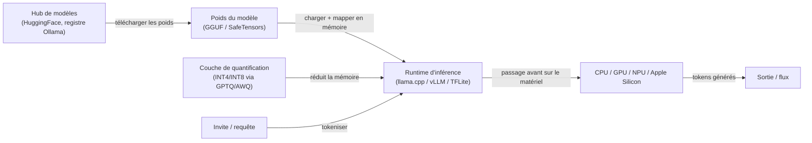
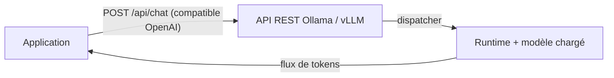

# Inférence locale

## Définition

L'inférence locale signifie exécuter des [LLM](/docs/llms), des modèles de vision ou d'autres modèles IA entièrement sur votre propre matériel — un ordinateur portable de développeur, un poste de travail, un serveur sur site ou un appareil en périphérie — sans envoyer de données à un fournisseur d'API cloud. Chaque token généré reste dans votre propre environnement, ce qui supporte directement la **confidentialité des données**, la **latence réduite**, le **coût prévisible** et le **fonctionnement hors ligne**.

La faisabilité pratique de l'inférence locale dépend de la [compression de modèle](/docs/model-compression) : les modèles frontier en pleine précision (FP16/BF16) nécessitent généralement 80–320 Go de mémoire GPU, les mettant hors de portée pour la plupart du matériel local. La [quantification](/docs/quantization) (INT8, INT4, GPTQ, AWQ) réduit la mémoire de 2–8x, rendant les modèles de 7B–70B paramètres exécutables sur des GPU grand public ou prosumer (16–48 Go de VRAM) et même sur du matériel CPU uniquement via le format GGUF. Les runtimes comme Ollama, LM Studio, llama.cpp, vLLM et TensorFlow Lite gèrent le chargement du modèle, la gestion de la mémoire et l'exécution de l'inférence avec une configuration minimale.

L'inférence locale n'est pas une technologie unique mais une pile : poids du modèle (GGUF, SafeTensors, ONNX) + runtime (llama.cpp, Ollama, vLLM, TFLite) + couche de service optionnelle (API REST compatible OpenAI). Cette pile peut être assemblée pour servir un seul développeur de façon interactive ou s'adapter à un cluster sur site servant des centaines d'utilisateurs simultanés, sans dépendance cloud.

## Comment ça fonctionne

### Pile d'inférence



### Couche de service (optionnelle)



### Comparaison des runtimes

| Runtime | Idéal pour | Format | GPU requis |
|---------|---------|--------|-------------|
| llama.cpp | Inférence CPU/GPU à faibles ressources | GGUF | Non (capable CPU) |
| Ollama | Service LLM local convivial pour les développeurs | GGUF / Modelfile | Non (capable CPU) |
| vLLM | Serveur sur site à haut débit | HuggingFace / safetensors | Oui (CUDA) |
| TensorFlow Lite | Inférence sur mobile et microcontrôleur | .tflite | Non |
| LM Studio | Interface graphique pour l'exploration LLM locale | GGUF | Non (capable CPU) |

## Quand utiliser / Quand NE PAS utiliser

| Scénario | Utiliser l'inférence locale | NE PAS utiliser l'inférence locale |
|----------|--------------------|-----------------------------|
| Les données ne doivent pas quitter le réseau (santé, juridique, finance) | Oui — les données ne quittent jamais le matériel local | |
| Assistant à faible latence ou intégration IDE | Oui — pas d'aller-retour réseau | |
| Développement et test sans clés API ni limites d'utilisation | Oui — gratuit et hors ligne | |
| Environnements réseau isolés ou restreints | Oui — pas de connectivité externe nécessaire | |
| Besoin de qualité de modèle frontier (GPT-4o, Claude 3.7) | | Les API cloud fournissent des modèles plus grands et plus capables |
| Schémas de charge imprévisibles ou en rafale | | L'autoscaling cloud est plus rentable |
| Pas de matériel GPU disponible et faible latence critique | | L'inférence cloud est plus rapide sur le matériel sous-alimenté |

## Avantages et inconvénients

| Avantages | Inconvénients |
|------|------|
| Les données restent sur votre infrastructure — forte garantie de confidentialité | Les modèles plus petits ou quantifiés peuvent avoir une qualité moindre |
| Pas de coût API par token au moment de l'inférence | Vous êtes responsable du matériel, des ops et des mises à jour du modèle |
| Fonctionne hors ligne et dans les réseaux restreints | Le débit et la longueur du contexte sont limités par le matériel |
| Contrôle total sur la version et le comportement du modèle | Besoin de [quantification](/docs/quantization) et de [compression](/docs/model-compression) pour les modèles plus grands |

## Exemples de code

```bash
# Installer Ollama et exécuter un LLM local
curl -fsSL https://ollama.ai/install.sh | sh

# Télécharger et exécuter un modèle de façon interactive
ollama run llama3.2

# Servir une API REST compatible OpenAI (s'exécute sur localhost:11434 par défaut)
ollama serve &

# Appeler l'API depuis Python en utilisant le client OpenAI
python3 - <<'EOF'
from openai import OpenAI

client = OpenAI(base_url="http://localhost:11434/v1", api_key="ollama")

response = client.chat.completions.create(
    model="llama3.2",
    messages=[{"role": "user", "content": "Expliquez la quantification en un paragraphe."}],
    stream=True,
)
for chunk in response:
    print(chunk.choices[0].delta.content or "", end="", flush=True)
EOF
```

## Conseils pour une utilisation efficace

- Commencez avec la quantification GGUF Q4_K_M pour un bon équilibre précision-vitesse ; descendez à Q3 ou Q2 seulement si la mémoire est critiquement contrainte.
- Utilisez Ollama pour les machines de développeurs et vLLM pour les serveurs sur site servant plusieurs utilisateurs simultanément.
- Épinglez les versions de modèle dans votre `Modelfile` ou configuration pour éviter des changements de qualité silencieux lors des mises à jour.
- Surveillez le débit de tokens et la latence du premier token — ils révèlent si votre matériel est le goulot d'étranglement ou si le modèle est sur-quantifié.
- Pour Apple Silicon (M1/M2/M3/M4), llama.cpp et Ollama utilisent automatiquement le backend GPU Metal, offrant un débit proche de la classe GPU.

## Ressources pratiques

- [Ollama](https://ollama.ai/) — Exécuter des LLM localement avec une simple CLI et une API compatible OpenAI
- [llama.cpp](https://github.com/ggerganov/llama.cpp) — Moteur d'inférence C++ pour LLaMA et les modèles compatibles, format GGUF
- [vLLM](https://docs.vllm.ai/) — Service LLM à haut débit avec batching continu et PagedAttention
- [LM Studio](https://lmstudio.ai/) — Interface graphique pour découvrir, télécharger et exécuter des LLM locaux
- [TensorFlow Lite](https://www.tensorflow.org/lite) — Inférence sur l'appareil pour mobile et périphérie

## Voir aussi

- [Quantification](/docs/quantization)
- [Compression de modèle](/docs/model-compression)
- [Infrastructure](/docs/infrastructure)
- [Raisonnement en périphérie](/docs/edge-reasoning)
