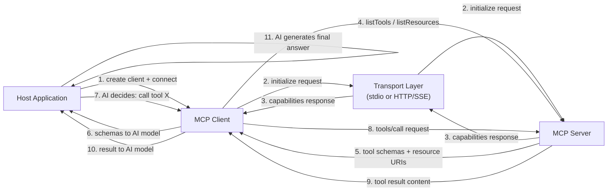

# Construire des clients MCP

## Définition

Un **client MCP** est le composant à l'intérieur d'une application hôte qui gère la connexion à un seul serveur MCP et traduit l'intention du modèle d'IA en requêtes au niveau protocole. L'application hôte — une interface de chat, un assistant de codage, un agent autonome — crée un client par serveur auquel elle veut se connecter. Le client gère tout le cycle de vie du protocole : établir la connexion de transport, compléter le handshake d'initialisation, découvrir les capacités du serveur, invoquer les outils au nom de l'IA, lire les ressources et récupérer les prompts. Du point de vue de l'application hôte, le client est la surface API vers le monde du serveur.

Le rôle du client dans l'application hôte est celui d'un intermédiaire intelligent. Il ne décide pas quels outils appeler — c'est la responsabilité du modèle d'IA. Au lieu de cela, le client fournit à l'IA des descriptions de capacités structurées (schémas d'outils, URI de ressources, définitions de prompts), puis exécute fidèlement ce que l'IA demande, renvoyant les résultats dans un format sur lequel l'IA peut raisonner. Un client bien construit isole toute la complexité du protocole de l'application hôte : l'hôte demande simplement "que peut faire ce serveur ?" et "appelle cet outil avec ces arguments", et le client gère tout le reste.

La découverte des capacités est l'une des responsabilités les plus importantes du client. Après le handshake d'initialisation, le client interroge le serveur pour son manifeste complet de capacités en appelant `tools/list`, `resources/list` et `prompts/list`. Ces réponses incluent les noms, descriptions, schémas d'entrée et templates d'URI — tout ce dont le modèle d'IA a besoin pour comprendre comment et quand utiliser chaque capacité. Dans les environnements dynamiques (serveurs qui changent leur ensemble d'outils à l'exécution), les clients peuvent écouter les événements `notifications/tools/list_changed` et re-interroger le manifeste à la demande, assurant que l'IA fonctionne toujours avec une vue à jour des capacités disponibles.

## Comment ça fonctionne

### Initialisation du client et handshake

Créer un client MCP nécessite deux choses : une identité de client (nom et version) et une déclaration de capacités. La déclaration de capacités indique au serveur quelles extensions de protocole le client supporte — par exemple, s'il peut gérer les abonnements aux ressources ou la validation des arguments de prompt. Après l'instanciation, le client est connecté à un transport, ce qui déclenche la requête `initialize`. Le serveur répond avec sa propre identité, sa version du protocole et ses capacités. Le client envoie ensuite une notification `initialized` pour confirmer que le handshake est complet. Ce n'est qu'après cette séquence que le client peut faire des requêtes de capacités ou d'invocation. Le SDK gère tout cela automatiquement lorsque vous appelez `client.connect(transport)`.

### Découverte des capacités

Une fois connecté, le client découvre ce que le serveur offre. `client.listTools()` renvoie toutes les définitions d'outils incluant leurs noms, descriptions et spécifications JSON Schema d'entrée. `client.listResources()` renvoie les URI de ressources statiques et les métadonnées. `client.listResourceTemplates()` renvoie les templates d'URI pour les ressources dynamiques. `client.listPrompts()` renvoie les noms de prompts et leurs définitions d'arguments. Dans une application IA typique, la découverte se produit une fois au début de la session et les résultats sont fournis au modèle d'IA comme contexte — soit injectés dans le prompt système, soit passés comme données structurées à une API d'appel de fonctions. Les schémas d'outils renvoyés par `listTools()` correspondent directement au format JSON Schema utilisé par la plupart des API d'appel de fonctions LLM, ce qui rend la conversion des outils MCP découverts en définitions d'outils LLM simple.

### Invocation des outils

Invoquer un outil nécessite un nom d'outil et un objet d'arguments qui satisfait le schéma d'entrée de l'outil. `client.callTool({ name, arguments })` envoie une requête `tools/call` au serveur et renvoie une réponse contenant un tableau `content` de blocs de contenu. Chaque bloc a un champ `type` (`text`, `image` ou `resource`) et les données correspondantes. Les blocs texte contiennent des résultats chaîne ; les blocs image contiennent des données d'image encodées en base64 avec un type MIME ; les blocs ressource embarquent une ressource inline. Le travail du client est de passer ces blocs de contenu au modèle d'IA — typiquement comme messages de résultat d'outil dans un tour de conversation. Si la réponse a `isError: true`, le client devrait le signaler clairement pour que l'IA puisse gérer l'erreur (réessayer, revenir en arrière ou signaler à l'utilisateur).

### Lecture des ressources

Les ressources sont lues via `client.readResource({ uri })`, qui renvoie un tableau `contents` d'éléments de contenu de ressource. Chaque élément a un URI, un type MIME et soit un champ `text` (pour les ressources basées sur le texte) soit un champ `blob` (pour les ressources binaires). Les ressources sont utilisées pour fournir à l'IA un contexte large et structuré — contenus de fichiers, enregistrements de base de données, réponses API — sans passer par le cycle d'invocation d'outils. Le client peut s'abonner aux mises à jour de ressources (`client.subscribeResource({ uri })`) et recevoir des événements `notifications/resources/updated` lorsque le serveur détermine que le contenu de la ressource a changé, permettant un rafraîchissement du contexte en temps réel.

### Sélection du transport

Le choix du transport dépend de l'endroit où le serveur s'exécute. Le **transport stdio** (`StdioClientTransport`) est utilisé lorsque le serveur s'exécute comme processus enfant local — le client lance directement le processus serveur et communique via son stdin/stdout. C'est zéro-configuration et idéal pour les outils de développement, les serveurs de système de fichiers locaux et tout serveur devant être limité à une seule session utilisateur. Le **transport SSE** (`SSEServerTransport` côté client) est utilisé pour les serveurs distants — le client se connecte à un endpoint HTTP et utilise les Server-Sent Events pour les réponses en streaming. Cela convient aux serveurs organisationnels partagés, aux capacités hébergées dans le cloud et aux déploiements en production où plusieurs instances client ont besoin de partager le même serveur. Le choix du transport est entièrement transparent pour les API de découverte et d'invocation des capacités ; vous pouvez changer de transport sans modifier aucun autre code client.



## Quand utiliser / Quand NE PAS utiliser

| Scénario | Construire un client MCP | Considérer des alternatives |
|---|---|---|
| Connexion d'une application IA à un ou plusieurs serveurs MCP | Requis — c'est le cas d'usage prévu | Appels API directs si le serveur n'utilise pas MCP |
| Construction d'un assistant IA généraliste devant supporter les serveurs MCP de la communauté | Meilleure option — tout serveur MCP fonctionne automatiquement | Intégrations d'outils personnalisées si l'ensemble d'outils est fixe et petit |
| Intégration de l'IA dans une application qui a déjà des dépendances de services | Client MCP par service fournit un accès uniforme aux outils | Appel de fonctions spécifique au fournisseur si verrouillé à un seul LLM |
| Développement d'outils s'exécutant localement sur la machine de l'utilisateur | Le transport stdio nécessite un client MCP | Scripts shell ou appels de bibliothèque directs si l'IA n'est pas impliquée |
| Agrégation de capacités depuis plusieurs serveurs spécialisés | Un client par serveur, l'hôte gère tous les clients | Liste d'outils monolithique unique si tous les outils sont au même endroit |
| Consommation d'un serveur qui utilise HTTP/SSE pour l'accès distant | Le client de transport SSE gère cela nativement | Client WebSocket ou REST si le serveur utilise un protocole non-MCP |

## Exemples de code

### Client MCP complet — connexion, découverte, invocation, lecture

```typescript
import { Client } from "@modelcontextprotocol/sdk/client/index.js";
import { StdioClientTransport } from "@modelcontextprotocol/sdk/client/stdio.js";

async function main() {
  // -----------------------------------------------------------------------
  // 1. Create transport — spawns the server as a child process
  // -----------------------------------------------------------------------
  const transport = new StdioClientTransport({
    command: "node",
    args: ["./file-and-weather-server.js"], // Path to your MCP server
  });

  // -----------------------------------------------------------------------
  // 2. Create client and connect (triggers the initialize handshake)
  // -----------------------------------------------------------------------
  const client = new Client(
    { name: "demo-client", version: "1.0.0" },
    {
      capabilities: {
        // Declare which protocol extensions this client supports
        roots: { listChanged: true },
      },
    }
  );

  await client.connect(transport);
  console.log("Connected to MCP server");

  // -----------------------------------------------------------------------
  // 3. Discover capabilities
  // -----------------------------------------------------------------------
  const { tools } = await client.listTools();
  console.log(
    "\nAvailable tools:",
    tools.map((t) => `${t.name}: ${t.description}`)
  );

  const { resources } = await client.listResources();
  console.log(
    "\nAvailable resources:",
    resources.map((r) => r.uri)
  );

  const { prompts } = await client.listPrompts();
  console.log(
    "\nAvailable prompts:",
    prompts.map((p) => p.name)
  );

  // -----------------------------------------------------------------------
  // 4. Invoke a tool
  // -----------------------------------------------------------------------
  console.log("\n--- Calling get_weather tool ---");
  const weatherResult = await client.callTool({
    name: "get_weather",
    arguments: { city: "Tokyo", units: "celsius" },
  });

  // weatherResult.content is an array of content blocks
  if (!weatherResult.isError) {
    for (const block of weatherResult.content) {
      if (block.type === "text") {
        console.log("Weather result:", block.text);
      }
    }
  } else {
    console.error("Tool returned an error:", weatherResult.content);
  }

  // -----------------------------------------------------------------------
  // 5. Invoke another tool
  // -----------------------------------------------------------------------
  console.log("\n--- Calling list_directory tool ---");
  const dirResult = await client.callTool({
    name: "list_directory",
    arguments: { dir_path: "/tmp" },
  });

  if (!dirResult.isError) {
    const textBlock = dirResult.content.find((b) => b.type === "text");
    if (textBlock && textBlock.type === "text") {
      console.log("Directory listing:", textBlock.text);
    }
  }

  // -----------------------------------------------------------------------
  // 6. Read a resource
  // -----------------------------------------------------------------------
  console.log("\n--- Reading a resource ---");
  try {
    const resourceResult = await client.readResource({
      uri: "file:///etc/hostname",
    });

    for (const item of resourceResult.contents) {
      console.log(`Resource [${item.uri}]:`, "text" in item ? item.text : "(binary)");
    }
  } catch (err) {
    console.error("Resource read failed:", (err as Error).message);
  }

  // -----------------------------------------------------------------------
  // 7. Fetch a prompt
  // -----------------------------------------------------------------------
  console.log("\n--- Fetching a prompt ---");
  try {
    const promptResult = await client.getPrompt({
      name: "analyze_file",
      arguments: {
        file_path: "/tmp/example.txt",
        focus: "structure and formatting",
      },
    });

    console.log("Prompt messages:");
    for (const msg of promptResult.messages) {
      console.log(`  [${msg.role}]:`, JSON.stringify(msg.content).slice(0, 120) + "...");
    }
  } catch (err) {
    console.error("Prompt fetch failed:", (err as Error).message);
  }

  // -----------------------------------------------------------------------
  // 8. Clean up
  // -----------------------------------------------------------------------
  await client.close();
  console.log("\nClient disconnected.");
}

main().catch((err) => {
  console.error("Client error:", err);
  process.exit(1);
});
```

### Connexion à un serveur distant via le transport SSE

```typescript
import { Client } from "@modelcontextprotocol/sdk/client/index.js";
import { SSEClientTransport } from "@modelcontextprotocol/sdk/client/sse.js";

async function connectRemote() {
  // Point to the SSE endpoint of your remote MCP server
  const transport = new SSEClientTransport(
    new URL("http://localhost:3000/sse")
  );

  const client = new Client(
    { name: "remote-client", version: "1.0.0" },
    { capabilities: {} }
  );

  await client.connect(transport);

  // From here, the API is identical to the stdio client example
  const { tools } = await client.listTools();
  console.log("Remote tools:", tools.map((t) => t.name));

  // Call a tool on the remote server
  const result = await client.callTool({
    name: "get_weather",
    arguments: { city: "Berlin" },
  });
  console.log(result.content);

  await client.close();
}

connectRemote().catch(console.error);
```

### Conversion des outils MCP découverts en schémas d'appel de fonctions LLM

```typescript
import { Client } from "@modelcontextprotocol/sdk/client/index.js";
import { StdioClientTransport } from "@modelcontextprotocol/sdk/client/stdio.js";
import type { Tool } from "@modelcontextprotocol/sdk/types.js";

// Convert an MCP tool definition to OpenAI function-calling format
function mcpToolToOpenAIFunction(tool: Tool) {
  return {
    type: "function" as const,
    function: {
      name: tool.name,
      description: tool.description ?? "",
      parameters: tool.inputSchema,
    },
  };
}

async function getToolsForLLM(serverCommand: string, serverArgs: string[]) {
  const transport = new StdioClientTransport({
    command: serverCommand,
    args: serverArgs,
  });

  const client = new Client(
    { name: "llm-bridge", version: "1.0.0" },
    { capabilities: {} }
  );

  await client.connect(transport);

  const { tools } = await client.listTools();

  // Convert to OpenAI format — these can be passed directly to the Chat Completions API
  const openAITools = tools.map(mcpToolToOpenAIFunction);

  return { client, openAITools };
}

// Usage:
// const { client, openAITools } = await getToolsForLLM("node", ["./my-server.js"]);
// Pass openAITools to openai.chat.completions.create({ tools: openAITools, ... })
// When the LLM returns a tool call, use: client.callTool({ name, arguments })
```

## Ressources pratiques

- [SDK TypeScript MCP — référence API client](https://github.com/modelcontextprotocol/typescript-sdk/tree/main/src/client) — Source et documentation inline pour `Client`, toutes les classes de transport et les types côté client.
- [Exemples et intégrations de clients MCP](https://modelcontextprotocol.io/clients) — Une liste organisée d'intégrations de clients MCP existantes sur les éditeurs, plateformes IA et outils développeur.
- [Spécification du protocole MCP — comportement du client](https://spec.modelcontextprotocol.io/specification/client/) — Référence faisant autorité pour les responsabilités du client incluant l'initialisation, la négociation de capacités et le cycle de vie des requêtes.
- [Guide d'intégration MCP](https://modelcontextprotocol.io/docs/concepts/architecture) — Vue d'ensemble conceptuelle de la façon dont les clients, serveurs et applications hôtes sont liés, avec des diagrammes et des conseils de décision.

## Voir aussi

- [Vue d'ensemble du Model Context Protocol](/docs/mcp)
- [Construire des serveurs MCP](/docs/mcp/building-servers)
- [Agents IA](/docs/agents)
