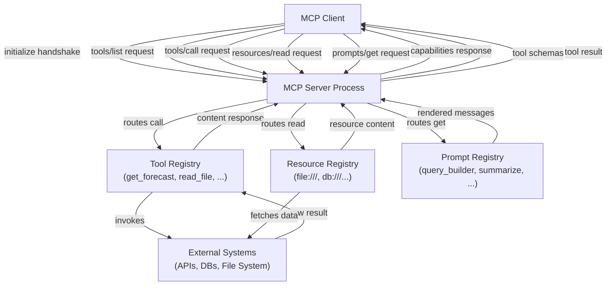

# Construire des serveurs MCP

## Définition

Un **serveur MCP** est un processus qui expose des capacités aux applications IA compatibles MCP via le Model Context Protocol. Il agit comme le pont entre un modèle d'IA et un système externe — un système de fichiers, une API REST, une base de données, un exécuteur de code — en enveloppant la fonctionnalité de ce système dans une interface bien définie et découvrable. Le serveur possède les détails d'implémentation ; le client a seulement besoin de connaître le protocole. Tout client compatible MCP peut se connecter à n'importe quel serveur MCP et immédiatement découvrir et utiliser ses capacités sans travail d'intégration personnalisé.

Un serveur MCP peut exposer trois catégories de capacités. Les **outils** sont des fonctions appelables qui acceptent une entrée structurée et renvoient une sortie — l'IA les invoque pour prendre des actions ou récupérer des informations dynamiques. Les **ressources** sont des sources de données adressées par URI en lecture seule que l'IA peut lire pour le contexte — fichiers, enregistrements de base de données, snapshots API. Les **prompts** sont des templates de prompts paramétrés réutilisables stockés sur le serveur que les clients peuvent exposer aux utilisateurs ou injecter dans les conversations. Un seul serveur peut offrir n'importe quelle combinaison de ceux-ci ; de nombreux serveurs n'exposent que des outils.

Le **cycle de vie du serveur** suit un pattern prévisible : le serveur démarre et se lie à un transport (stdio ou HTTP/SSE), attend qu'un client se connecte, complète le handshake `initialize` pour négocier les versions du protocole et les capacités, puis entre dans sa boucle principale répondant aux requêtes. Lorsque le client se déconnecte ou envoie un signal d'arrêt, le serveur effectue le nettoyage et se termine. Parce que le protocole est stateful dans une session, le serveur peut maintenir un état par connexion — par exemple, mettre en cache des réponses API coûteuses pour la durée d'une session.

## Comment ça fonctionne

### Configuration et initialisation du serveur

Configurer un serveur MCP commence par créer une instance `McpServer` (depuis le SDK de haut niveau) ou une instance `Server` (depuis le SDK de bas niveau) avec un nom et une version. Le nom et la version sont envoyés au client pendant le handshake `initialize` et aident au débogage et à la journalisation. Après la création du serveur, vous enregistrez des capacités — outils, ressources, prompts — avant de se connecter à un transport. La classe `McpServer` de haut niveau du SDK fournit des méthodes ergonomiques `server.tool()`, `server.resource()` et `server.prompt()` qui gèrent le routage des requêtes et la validation des schémas en interne. L'étape de connexion (`server.connect(transport)`) démarre la boucle d'événements et bloque jusqu'à la fin de la session.

### Définition des outils

Les outils sont la capacité MCP la plus couramment utilisée. Chaque outil a trois éléments requis : un **nom** (un identifiant court en minuscules utilisé dans les requêtes `tools/call`), une **description** (une explication en langage naturel que l'IA utilise pour décider quand et comment appeler l'outil) et un **schéma d'entrée** (un schéma Zod dans le SDK TypeScript, converti en JSON Schema pour le protocole). Lorsqu'un client appelle un outil, le SDK valide les arguments entrants par rapport au schéma avant d'invoquer votre fonction handler, de sorte que vous recevez une entrée typée et validée. Le handler renvoie un tableau `content` de blocs de contenu — texte, images ou ressources embarquées — que le client passe au modèle d'IA. Les outils peuvent également définir `isError: true` dans leur réponse pour signaler une erreur récupérable, ce qui permet à l'IA de réessayer ou de revenir en arrière gracieusement.

### Définition des ressources

Les ressources exposent des données de type fichier que l'IA peut lire pour le contexte. Une ressource est identifiée par un URI (par ex., `file:///path/to/data.json` ou `postgres://mydb/users/123`) et a un type MIME qui indique au client comment gérer le contenu. Les ressources sont découvertes via `resources/list` et lues via `resources/read`. Le SDK supporte à la fois les **ressources statiques** (enregistrées avec un URI et un contenu fixe) et les **ressources dynamiques** (enregistrées avec un pattern de template d'URI, résolu au moment de la lecture). Les templates de ressources utilisent la syntaxe de template d'URI RFC 6570 — par exemple, `file:///{path}` correspond à n'importe quel chemin de fichier. Lorsque le client lit un URI de ressource qui correspond à un template, votre handler reçoit les variables de template extraites et renvoie le contenu. Les ressources doivent être utilisées pour les données que l'IA a besoin de lire mais pas de modifier ; pour les opérations d'écriture, utilisez un outil.

### Définition des prompts

Les prompts sont des templates d'interaction réutilisables. Un prompt a un nom, une description et une liste optionnelle d'arguments (nom, description, indicateur requis). Lorsqu'un client demande un prompt via `prompts/get`, votre handler reçoit les valeurs d'arguments et renvoie une liste de messages — typiquement un mélange de messages avec les rôles `user` et `assistant` — que le client injecte dans la conversation. Les prompts permettent aux auteurs de serveurs d'encoder des connaissances de domaine sur comment interagir avec les capacités du serveur. Par exemple, un serveur de base de données pourrait exposer un prompt `query_builder` qui accepte une description en langage naturel d'une requête et renvoie un prompt structuré qui guide l'IA pour produire du SQL sûr et paramétré.

### Configuration du transport

La couche de transport détermine comment le serveur communique avec les clients. Le **transport stdio** (`StdioServerTransport`) lit depuis `process.stdin` et écrit vers `process.stdout`. C'est la valeur par défaut pour les serveurs d'outils locaux — l'application hôte lance le serveur comme processus enfant et communique via les flux du processus. Aucune configuration réseau n'est nécessaire, et le stderr du serveur est disponible pour la journalisation sans interférer avec le protocole. Le **transport HTTP avec SSE** (`SSEServerTransport`) accepte les requêtes HTTP POST pour les messages client-serveur et stream les messages serveur-client via un endpoint SSE `/sse`. C'est approprié pour les serveurs partagés auxquels plusieurs clients peuvent se connecter simultanément, ou pour les serveurs devant s'exécuter comme services de longue durée plutôt que comme processus à la demande.



## Quand utiliser / Quand NE PAS utiliser

| Scénario | Construire un serveur MCP | Considérer des alternatives |
|---|---|---|
| Exposition d'une API ou service existant à plusieurs applications IA | Meilleure option — un serveur, n'importe quel client peut l'utiliser | Appel de fonctions direct si seul un fournisseur et une app comptent |
| Enveloppement d'un système de fichiers, base de données ou source de données interne pour le contexte IA | Meilleure option — les ressources et outils correspondent naturellement | Pipeline RAG personnalisé si la récupération sémantique est le besoin principal |
| Fourniture de templates de prompts spécifiques au domaine aux utilisateurs IA | La capacité Prompts est conçue pour cela | Injection de prompt système si les templates sont simples et statiques |
| Construction d'outils pour une seule application IA interne avec un fournisseur | MCP ajoute une structure utile mais peut être excessif | Les fonctions d'outils in-process sont plus simples |
| Exposition d'outils nécessitant des résultats en streaming en temps réel | Supporté via le transport SSE | WebSockets ou streaming personnalisé si la surcharge du protocole compte |
| Outils nécessitant de maintenir un état de longue durée par utilisateur entre les sessions | Nécessite une conception soigneuse du serveur — les sessions sont 1:1 | Service backend stateful avec un mince wrapper MCP |

## Exemples de code

### Serveur MCP complet avec outils, ressources et un prompt

```typescript
import { McpServer, ResourceTemplate } from "@modelcontextprotocol/sdk/server/mcp.js";
import { StdioServerTransport } from "@modelcontextprotocol/sdk/server/stdio.js";
import { z } from "zod";
import * as fs from "fs/promises";
import * as path from "path";

const server = new McpServer({
  name: "file-and-weather-server",
  version: "1.0.0",
});

// -----------------------------------------------------------------------
// Tool 1: Get weather forecast (mock — replace with a real weather API)
// -----------------------------------------------------------------------
server.tool(
  "get_weather",
  "Fetches the current weather forecast for a given city. Returns temperature, conditions, and humidity.",
  {
    city: z.string().describe("The city name, e.g. 'Tokyo' or 'Berlin'"),
    units: z
      .enum(["celsius", "fahrenheit"])
      .default("celsius")
      .describe("Temperature units"),
  },
  async ({ city, units }) => {
    // In production, call a real weather API here (e.g. Open-Meteo, WeatherAPI)
    const mockData = {
      city,
      temperature: units === "celsius" ? 18 : 64,
      units,
      condition: "Partly cloudy",
      humidity_percent: 72,
      forecast: "Light rain expected in the evening",
    };

    return {
      content: [
        {
          type: "text",
          text: JSON.stringify(mockData, null, 2),
        },
      ],
    };
  }
);

// -----------------------------------------------------------------------
// Tool 2: List directory contents
// -----------------------------------------------------------------------
server.tool(
  "list_directory",
  "Lists the files and subdirectories in a given directory path. Use this to explore file system structure.",
  {
    dir_path: z
      .string()
      .describe("Absolute path to the directory to list"),
  },
  async ({ dir_path }) => {
    try {
      const entries = await fs.readdir(dir_path, { withFileTypes: true });
      const listing = entries.map((e) => ({
        name: e.name,
        type: e.isDirectory() ? "directory" : "file",
      }));

      return {
        content: [
          {
            type: "text",
            text: JSON.stringify(listing, null, 2),
          },
        ],
      };
    } catch (err) {
      return {
        isError: true,
        content: [
          {
            type: "text",
            text: `Error listing directory: ${(err as Error).message}`,
          },
        ],
      };
    }
  }
);

// -----------------------------------------------------------------------
// Resource: Read any text file by path (URI template)
// -----------------------------------------------------------------------
server.resource(
  "text-file",
  new ResourceTemplate("file:///{file_path}", { list: undefined }),
  async (uri, { file_path }) => {
    const resolvedPath = path.resolve(String(file_path));

    try {
      const content = await fs.readFile(resolvedPath, "utf-8");
      return {
        contents: [
          {
            uri: uri.href,
            mimeType: "text/plain",
            text: content,
          },
        ],
      };
    } catch (err) {
      throw new Error(`Cannot read file at ${resolvedPath}: ${(err as Error).message}`);
    }
  }
);

// -----------------------------------------------------------------------
// Prompt: Guided file analysis template
// -----------------------------------------------------------------------
server.prompt(
  "analyze_file",
  "Generates a structured prompt that guides the AI to analyze a text file for issues, patterns, or summaries.",
  {
    file_path: z.string().describe("Path to the file to analyze"),
    focus: z
      .string()
      .optional()
      .describe("Optional: specific aspect to focus on, e.g. 'security issues' or 'performance'"),
  },
  async ({ file_path, focus }) => {
    const focusInstruction = focus
      ? `Focus specifically on: ${focus}.`
      : "Provide a general analysis.";

    return {
      messages: [
        {
          role: "user",
          content: {
            type: "text",
            text: `Please analyze the file at \`${file_path}\`.

${focusInstruction}

Use the \`read_file\` resource (URI: file:///${file_path}) to read its contents, then provide:
1. A brief summary of what the file contains
2. Key observations or findings
3. Any recommendations or concerns

Be concise and structured.`,
          },
        },
      ],
    };
  }
);

// -----------------------------------------------------------------------
// Start the server
// -----------------------------------------------------------------------
async function main() {
  const transport = new StdioServerTransport();
  await server.connect(transport);
  // Log to stderr so it doesn't interfere with the stdio protocol
  console.error("file-and-weather-server is running on stdio");
}

main().catch((err) => {
  console.error("Server failed to start:", err);
  process.exit(1);
});
```

### Transport HTTP/SSE (pour les serveurs distants partagés)

```typescript
import { McpServer } from "@modelcontextprotocol/sdk/server/mcp.js";
import { SSEServerTransport } from "@modelcontextprotocol/sdk/server/sse.js";
import express from "express";

const app = express();
const server = new McpServer({ name: "remote-server", version: "1.0.0" });

// Register your tools, resources, and prompts here (same API as stdio)
// server.tool(...), server.resource(...), server.prompt(...)

// SSE endpoint: clients connect here to receive server-to-client messages
app.get("/sse", async (req, res) => {
  const transport = new SSEServerTransport("/messages", res);
  await server.connect(transport);
});

// POST endpoint: clients send messages here
app.post("/messages", express.json(), async (req, res) => {
  // The SSEServerTransport handles routing from the active session
  res.status(200).send("ok");
});

app.listen(3000, () => {
  console.log("MCP server listening on http://localhost:3000");
});
```

## Ressources pratiques

- [SDK TypeScript MCP — référence API serveur](https://github.com/modelcontextprotocol/typescript-sdk/tree/main/src/server) — Source et documentation inline pour `McpServer`, les transports et tous les types côté serveur.
- [Exemples officiels de serveurs MCP](https://github.com/modelcontextprotocol/servers) — Implémentations de référence incluant système de fichiers, GitHub, PostgreSQL, Slack et plus — invaluables comme points de départ.
- [Documentation des transports MCP](https://spec.modelcontextprotocol.io/specification/architecture/) — Section de la spécification du protocole couvrant en profondeur les transports stdio, HTTP/SSE et Streamable HTTP.
- [Documentation Zod](https://zod.dev) — La bibliothèque de schémas utilisée par le SDK TypeScript pour la validation des entrées ; comprendre les types Zod correspond directement aux schémas de paramètres d'outils.

## Voir aussi

- [Vue d'ensemble du Model Context Protocol](/docs/mcp)
- [Construire des clients MCP](/docs/mcp/building-clients)
- [Outils et actions des agents](/docs/agents/tools-actions)
