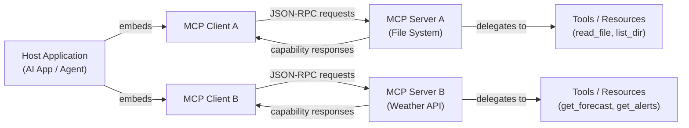

# Model Context Protocol (MCP)

## Définition

Le **Model Context Protocol (MCP)** est un standard ouvert qui définit une façon uniforme pour les applications d'IA de se connecter à des outils, des sources de données et des services externes. Plutôt que de construire des intégrations one-off pour chaque combinaison de modèle d'IA et de système externe, MCP fournit un langage commun : une application hôte parle à un serveur MCP via un protocole bien défini, et le serveur expose des capacités (outils, ressources, prompts) que tout client IA conforme peut découvrir et utiliser. MCP a été introduit par Anthropic fin 2024 et immédiatement publié comme standard ouvert, invitant l'écosystème plus large à l'adopter et à l'étendre.

Avant MCP, l'intégration d'outils pour les applications d'IA était fragmentée. Chaque fournisseur avait son propre format d'appel de fonctions ; chaque intégration devait être réimplémentée pour chaque nouveau backend IA. Un outil d'exécution de code écrit pour un modèle devait être réécrit lors du changement de fournisseur, et une nouvelle source de données nécessitait un plomberie personnalisée pour chaque application IA qui voulait y accéder. MCP résout ce problème en séparant la préoccupation de "comment une IA parle à un outil" (le protocole) de "quelle IA" et "quel outil", de sorte que tout client compatible MCP peut utiliser tout serveur compatible MCP sans code de colle supplémentaire.

L'impact pratique est significatif : les développeurs peuvent construire un serveur MCP une fois — pour une base de données, un système de fichiers, une API REST, un exécuteur de code — et chaque application IA compatible MCP y a accès. Le protocole est agnostique au transport (fonctionnant sur stdio pour les processus locaux ou HTTP/SSE pour les services distants), supporte la communication bidirectionnelle et inclut un handshake de négociation de capacités de sorte que les clients et serveurs peuvent annoncer exactement ce qu'ils supportent.

## Comment ça fonctionne

### Architecture client-serveur

MCP suit un modèle client-serveur strict avec trois rôles distincts. L'**application hôte** est l'application orientée IA (une interface de chat, un assistant de codage, un agent autonome) qui embarque un ou plusieurs clients MCP. Chaque **client MCP** maintient une connexion 1:1 avec un seul **serveur MCP** et agit comme intermédiaire entre l'hôte et les capacités de ce serveur. Le **serveur MCP** est le processus qui possède et expose les capacités réelles — il sait comment appeler une API météo, lire un fichier ou interroger une base de données. Cette séparation signifie qu'une seule application hôte peut se connecter à de nombreux serveurs simultanément, chacun fournissant un ensemble différent d'outils.



### Couche de transport

MCP est agnostique au transport : le même format de message JSON-RPC 2.0 fonctionne sur deux transports intégrés. Le **transport stdio** est utilisé pour les serveurs locaux — l'hôte lance le serveur comme processus enfant et communique via ses flux d'entrée et de sortie standard. C'est le déploiement le plus simple : pas de réseau, pas de ports, pas de surcharge d'authentification. Le **transport HTTP avec SSE (Server-Sent Events)** est utilisé pour les serveurs distants ou partagés : le client envoie des requêtes comme appels HTTP POST et reçoit des réponses en streaming via un endpoint SSE. Cela permet des serveurs hébergés de manière centralisée que plusieurs clients peuvent partager, et supporte le déploiement dans des environnements cloud ou conteneur. Un troisième type de transport, **Streamable HTTP**, a été introduit dans la spécification du protocole comme successeur plus capable de HTTP/SSE pour le streaming bidirectionnel.

### Capacités : outils, ressources et prompts

Un serveur MCP expose jusqu'à trois types de capacités. Les **outils** sont des fonctions appelables — analogues à l'appel de fonctions dans les API LLM — que l'IA peut invoquer pour prendre des actions ou récupérer des informations. Chaque outil a un nom, une description et un JSON Schema définissant ses paramètres d'entrée. Les **ressources** sont des sources de données en lecture seule, de type fichier, que l'IA peut accéder — un fichier local, un enregistrement de base de données, un snapshot d'API en direct — identifiées par un URI. Les ressources sont l'équivalent MCP de l'injection de contexte : elles permettent au serveur de fournir à l'IA des données structurées sans nécessiter un appel d'outil. Les **prompts** sont des modèles de prompts réutilisables stockés sur le serveur ; ils permettent aux auteurs de serveurs de définir des patterns d'interaction communs (par ex., "résumer ce fichier") que les clients peuvent exposer directement aux utilisateurs.

### Négociation de capacités et cycle de vie de la session

Lorsqu'un client se connecte à un serveur, le protocole commence par un handshake `initialize`. Le client envoie sa version du protocole et les capacités qu'il supporte ; le serveur répond avec sa version du protocole et les capacités qu'il offre. Cette négociation assure que les clients et serveurs avec différents ensembles de fonctionnalités peuvent interopérer gracieusement — un client qui ne supporte pas les prompts ne les utilisera simplement pas, même si le serveur les offre. Après l'initialisation, le client appelle `tools/list`, `resources/list` et `prompts/list` pour découvrir ce que le serveur expose. Les réponses de découverte incluent des schémas complets, des descriptions et des métadonnées. À partir de ce moment, le client peut invoquer des capacités au nom du modèle d'IA selon les besoins tout au long de la session.

## Quand utiliser / Quand NE PAS utiliser

| Scénario | MCP | Intégration REST/API personnalisée | Appel de fonctions natif |
|---|---|---|---|
| Construction d'outils devant fonctionner sur plusieurs fournisseurs d'IA | Meilleure option — écrivez une fois, utilisez avec n'importe quel client MCP | Chaque fournisseur nécessite sa propre intégration | Verrouillé au format API d'un seul fournisseur |
| Partage d'outils entre plusieurs applications IA dans votre organisation | Meilleure option — un serveur, plusieurs clients | Nécessite de dupliquer le code d'intégration dans chaque app | Non conçu pour le partage entre applications |
| Outil simple one-off dans une application mono-fournisseur | Excessif — ajoute une surcharge de protocole | Convient pour les cas simples | Option la plus simple |
| Exposition de sources de données existantes (fichiers, BDs) comme contexte IA | La capacité Resources est conçue pour cela | Nécessite une logique de récupération personnalisée | Pas de concept équivalent |
| Résultats en streaming en temps réel depuis des opérations longues | Supporté via le transport SSE | Nécessite une logique de streaming personnalisée | Support limité |
| Environnements air-gapped ou très restreints | Le transport stdio fonctionne sans réseau | Contrôle total | Contrôle total |

## Comparaisons

### MCP vs appel de fonctions OpenAI

L'appel de fonctions OpenAI et MCP permettent tous deux aux modèles d'IA d'invoquer des outils structurés, mais ils opèrent à des niveaux différents. L'appel de fonctions est une **fonctionnalité au niveau API** : les schémas d'outils sont passés dans la charge utile de la requête, les implémentations d'outils vivent dans le code de votre application et le pattern est spécifique au format API d'OpenAI. MCP est un **standard au niveau protocole** : les outils vivent dans des processus serveurs séparés, le protocole gère la découverte et l'invocation, et tout client conforme peut utiliser tout serveur conforme indépendamment du fournisseur d'IA qui alimente le client. L'appel de fonctions est le bon choix pour les outils simples, in-process dans une application mono-fournisseur ; MCP est le bon choix lorsque vous voulez des serveurs d'outils portables et réutilisables qui fonctionnent sur plusieurs fournisseurs et applications.

### MCP vs outils LangChain

Les outils LangChain sont une **abstraction de framework** : ils enveloppent des callables Python dans une interface standardisée que le runtime d'agent LangChain comprend. Ils sont puissants dans l'écosystème LangChain mais ne définissent pas un protocole de communication interprocessus — un outil LangChain ne peut pas être appelé par une application non-LangChain sans plomberie supplémentaire. MCP est un **protocole filaire** : il définit exactement comment les messages sont sérialisés et transportés entre les processus. Un serveur MCP écrit en TypeScript peut être appelé par un client MCP Python sans dépendance de framework partagée. Les deux ne sont pas mutuellement exclusifs — LangChain et d'autres frameworks peuvent implémenter des clients MCP pour utiliser des serveurs MCP.

### MCP vs appels API REST directs

Les appels API REST directs offrent une flexibilité maximale et aucune surcharge de protocole, mais chaque nouvelle application IA doit réimplémenter la même authentification, la gestion des erreurs et le formatage des résultats pour chaque API qu'elle appelle. MCP fournit une enveloppe uniforme qui abstrait ces différences : l'application IA fait toujours la même requête `tools/call` indépendamment du fait que le serveur frappe une API météo, une base de données SQL ou un dépôt GitHub. Le compromis est que MCP nécessite une infrastructure de serveur (un processus serveur en cours d'exécution), alors qu'un appel REST direct est juste une requête HTTP.

## Exemples de code

### Serveur MCP minimal

```typescript
import { McpServer } from "@modelcontextprotocol/sdk/server/mcp.js";
import { StdioServerTransport } from "@modelcontextprotocol/sdk/server/stdio.js";
import { z } from "zod";

// Create the server instance with a name and version
const server = new McpServer({
  name: "demo-server",
  version: "1.0.0",
});

// Register a tool — the AI can call this to get the current time
server.tool(
  "get_current_time",
  "Returns the current UTC time in ISO 8601 format.",
  {}, // No input parameters required
  async () => ({
    content: [
      {
        type: "text",
        text: new Date().toISOString(),
      },
    ],
  })
);

// Register a tool with input parameters
server.tool(
  "add_numbers",
  "Adds two numbers together and returns the result.",
  {
    a: z.number().describe("The first number"),
    b: z.number().describe("The second number"),
  },
  async ({ a, b }) => ({
    content: [
      {
        type: "text",
        text: String(a + b),
      },
    ],
  })
);

// Start the server using stdio transport (runs as a child process)
const transport = new StdioServerTransport();
await server.connect(transport);
console.error("Demo MCP server running on stdio");
```

### Client MCP minimal

```typescript
import { Client } from "@modelcontextprotocol/sdk/client/index.js";
import { StdioClientTransport } from "@modelcontextprotocol/sdk/client/stdio.js";

// Create a transport that spawns the server as a child process
const transport = new StdioClientTransport({
  command: "node",
  args: ["./demo-server.js"],
});

// Create and connect the client
const client = new Client(
  { name: "demo-client", version: "1.0.0" },
  { capabilities: {} }
);

await client.connect(transport);

// Discover available tools
const { tools } = await client.listTools();
console.log("Available tools:", tools.map((t) => t.name));

// Call a tool
const result = await client.callTool({
  name: "add_numbers",
  arguments: { a: 21, b: 21 },
});

console.log("Result:", result.content);
// Output: [{ type: 'text', text: '42' }]

await client.close();
```

## Ressources pratiques

- [Spécification Model Context Protocol](https://spec.modelcontextprotocol.io) — La spécification de protocole faisant autorité couvrant tous les types de messages, les transports et les définitions de capacités.
- [SDK TypeScript MCP](https://github.com/modelcontextprotocol/typescript-sdk) — Le SDK TypeScript/JavaScript officiel pour construire des serveurs et clients MCP, maintenu par Anthropic.
- [modelcontextprotocol.io](https://modelcontextprotocol.io) — Le site web officiel MCP avec des guides de démarrage rapide, de la documentation conceptuelle et un registre de serveurs construits par la communauté.
- [Dépôt d'exemples de serveurs MCP](https://github.com/modelcontextprotocol/servers) — Une collection organisée d'implémentations de serveurs MCP de référence couvrant les bases de données, les systèmes de fichiers, la recherche web et plus.

## Voir aussi

- [Construire des serveurs MCP](/docs/mcp/building-servers)
- [Construire des clients MCP](/docs/mcp/building-clients)
- [Agents IA](/docs/agents)
- [Sorties structurées](/docs/prompt-engineering/structured-outputs)
