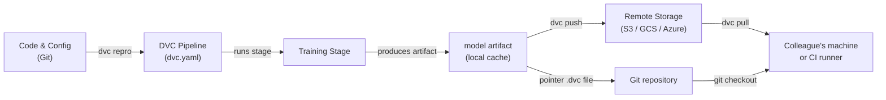

# Data Version Control (DVC)

## Définition

Data Version Control (DVC) est un outil open source qui étend Git pour suivre les fichiers volumineux, les jeux de données et les artefacts de modèles qui ne peuvent pas être stockés efficacement dans un dépôt Git. Alors que Git enregistre chaque modification du code source, DVC stocke un petit fichier pointeur (`.dvc`) dans le dépôt et pousse les octets de données réels vers un backend de stockage distant configurable — S3, GCS, Azure Blob, SSH ou même un répertoire local. Cela maintient le dépôt léger tout en préservant une reproductibilité complète.

DVC va au-delà du simple versionnage de fichiers. Il introduit le concept de **pipelines** — un DAG (Graphe Acyclique Dirigé) d'étapes définies dans un fichier `dvc.yaml`. Chaque étape spécifie sa commande, ses entrées (dépendances) et ses sorties, ce qui permet à DVC de déterminer quelles étapes doivent être ré-exécutées lorsque les entrées changent. Le résultat est un système de build pour le ML : reproductible, incrémental et versionné aux côtés du code qui l'a produit.

DVC s'intègre étroitement avec les workflows Git. Un fichier `dvc.lock`, commité dans Git, capture le hash de contenu exact de chaque entrée et sortie au moment où un pipeline a été exécuté, de sorte que le checkout d'un commit Git historique et l'exécution de `dvc pull` restaurent les jeux de données et artefacts de modèles exacts qui existaient à ce moment de l'histoire.

## Fonctionnement



### Initialisation d'un dépôt DVC

L'exécution de `dvc init` dans un dépôt Git crée un répertoire `.dvc/` qui contient la configuration et le cache local de DVC. DVC enregistre une entrée `.gitignore` pour le dossier de cache et ajoute quelques petits fichiers de suivi qui doivent être commités dans Git. À partir de ce moment, `dvc add <file>` crée un fichier pointeur `.dvc` pour tout fichier volumineux — les octets réels vont dans le cache local et ne sont jamais commités dans Git. Cette approche à deux couches signifie que le dépôt reste rapide à cloner tandis que DVC gère les actifs lourds séparément.

### Définition et exécution des pipelines

Un fichier `dvc.yaml` déclare chaque étape du pipeline avec sa commande, ses dépendances d'entrée et ses artefacts de sortie. Lorsque vous exécutez `dvc repro`, DVC inspecte le graphe de dépendances, compare les hashes de contenu de toutes les entrées avec le snapshot `dvc.lock`, et ré-exécute uniquement les étapes dont les entrées ont changé. C'est analogue à `make` mais adressé par contenu plutôt que basé sur les horodatages, ce qui le rend déterministe même entre les machines et les runners CI. Les pipelines peuvent être paramétrés via un fichier `params.yaml`, et DVC enregistre quelles valeurs de paramètres ont été utilisées dans chaque exécution.

### Stockage distant et collaboration

Un remote DVC est un emplacement de stockage configuré avec `dvc remote add`. Les équipes configurent généralement un bucket cloud partagé afin que tous les membres tirent les mêmes données. `dvc push` télécharge les artefacts nouveaux ou modifiés vers le remote, et `dvc pull` télécharge exactement les versions référencées par le `dvc.lock` du commit Git actuel. Ce workflow signifie que l'intégration d'un nouveau membre de l'équipe à un projet se fait avec `git clone` suivi de `dvc pull` — une seule commande qui matérialise le jeu de données et les artefacts de modèles corrects pour cette branche.

### Expériences

`dvc exp run` et `dvc exp show` fournissent une couche légère de suivi d'expériences au-dessus des pipelines. Chaque expérience est un stash Git temporaire des changements de paramètres et des métriques de résultats, qui peuvent être comparés dans un tableau et promus vers une branche complète si prometteurs. C'est moins riche en fonctionnalités que des outils dédiés comme MLflow ou W&B, mais il a l'avantage de ne nécessiter aucune infrastructure supplémentaire — tout vit dans le dépôt Git.

## Quand utiliser / Quand NE PAS utiliser

| Utiliser quand | Éviter quand |
|---|---|
| Vos jeux de données ou fichiers de modèles sont trop volumineux pour Git (>100 Mo) | Toutes les données tiennent confortablement dans Git LFS et aucun pipeline n'est nécessaire |
| Vous avez besoin de pipelines ML reproductibles liés aux versions de code | Vos exigences de suivi d'expériences dépassent l'approche légère de DVC |
| Votre équipe utilise Git et souhaite un workflow de contrôle de version unifié | Vous avez besoin d'une interface complète pour la gestion des expériences (préférez MLflow ou W&B) |
| Les pipelines CI/CD doivent tirer des artefacts de données exacts par branche | Les données sont extrêmement sensibles et ne peuvent pas quitter le stockage sur site |
| Vous souhaitez comparer les résultats d'expériences sans serveur séparé | Le projet n'a pas de remote partagé et la collaboration n'est pas une préoccupation |

## Comparaisons

| Critère | DVC | Git LFS | MLflow Tracking |
|---|---|---|---|
| Objectif principal | Versionnage données + pipeline | Versionnage de fichiers volumineux | Suivi d'expériences + registre de modèles |
| Support de pipeline | Oui (DAG dvc.yaml) | Non | Non (enregistre uniquement les exécutions) |
| Comparaison d'expériences | Basique (dvc exp show) | Non | Riche (interface + API) |
| Backends distants | S3, GCS, Azure, SSH, local | GitHub, GitLab LFS servers | Local, S3, Azure, SFTP |
| Serveur requis | Non | Non | Optionnel (serveur MLflow) |
| Intégration Git | Principe de conception fondamental | Principe de conception fondamental | Optionnel (via mlflow.log_param) |

## Avantages et inconvénients

| Avantages | Inconvénients |
|---|---|
| Pas de serveur supplémentaire requis — tout dans Git + stockage objet | Courbe d'apprentissage pour les équipes peu familières avec les pipelines basés sur DAG |
| Pipelines reproductibles avec cache adressé par contenu | Les conflits dvc.lock volumineux peuvent être délicats dans les monorepos très actifs |
| Fonctionne avec tout stockage cloud ou même des répertoires locaux | L'interface d'expériences est minimale comparée à MLflow / W&B |
| Léger — DVC est juste un outil CLI | Ne gère pas l'orchestration d'entraînement distribué |
| Intégration CI/CD de première classe via CML | Les coûts de stockage distant sont sous la responsabilité de l'équipe |

## Exemples de code

```bash
# --- DVC setup and basic data tracking ---

# 1. Initialize DVC inside an existing Git repository
git init my-ml-project && cd my-ml-project
dvc init
git add .dvc .dvcignore
git commit -m "Initialize DVC"

# 2. Configure a remote storage backend (AWS S3 example)
dvc remote add -d myremote s3://my-bucket/dvc-store
git add .dvc/config
git commit -m "Add DVC remote"

# 3. Track a large dataset — DVC creates data/train.csv.dvc
dvc add data/train.csv
git add data/train.csv.dvc data/.gitignore
git commit -m "Track training dataset with DVC"

# 4. Push data to the remote
dvc push

# --- Collaborator workflow ---

# 5. Clone the repo and pull the data artifacts
git clone https://github.com/org/my-ml-project
cd my-ml-project
dvc pull   # downloads data/train.csv from the configured remote
```

```yaml
# dvc.yaml — Define a two-stage pipeline: featurize -> train

stages:
  featurize:
    cmd: python src/featurize.py --input data/train.csv --output data/features.parquet
    deps:
      - src/featurize.py
      - data/train.csv
    outs:
      - data/features.parquet

  train:
    cmd: python src/train.py --features data/features.parquet --output models/
    deps:
      - src/train.py
      - data/features.parquet
      - params.yaml        # parameter file changes trigger re-run
    outs:
      - models/
    metrics:
      - reports/metrics.json:
          cache: false     # small metrics file — commit it to Git
```

```python
# src/train.py — DVC-compatible training script using joblib for model serialization

import json
import argparse
from pathlib import Path

import yaml
import joblib
import numpy as np
import pandas as pd
from sklearn.ensemble import GradientBoostingClassifier
from sklearn.model_selection import train_test_split
from sklearn.metrics import accuracy_score


def main(features_path: str, output_dir: str) -> None:
    # Load parameters tracked by DVC from params.yaml
    params = yaml.safe_load(Path("params.yaml").read_text())["train"]

    # Load feature-engineered data produced by the featurize stage
    df = pd.read_parquet(features_path)
    X = df.drop(columns=["label"])
    y = df["label"]

    X_train, X_test, y_train, y_test = train_test_split(
        X, y, test_size=0.2, random_state=42
    )

    # Train with parameters sourced from params.yaml — DVC tracks these
    model = GradientBoostingClassifier(
        n_estimators=params["n_estimators"],
        max_depth=params["max_depth"],
        random_state=42,
    )
    model.fit(X_train, y_train)

    # Save the model artifact — DVC will cache and hash the output directory
    out = Path(output_dir)
    out.mkdir(parents=True, exist_ok=True)
    joblib.dump(model, out / "model.joblib")

    # Write metrics.json so DVC can track and compare across experiments
    accuracy = float(accuracy_score(y_test, model.predict(X_test)))
    Path("reports").mkdir(exist_ok=True)
    Path("reports/metrics.json").write_text(
        json.dumps({"accuracy": accuracy}, indent=2)
    )
    print(f"Accuracy: {accuracy:.4f}")


if __name__ == "__main__":
    parser = argparse.ArgumentParser()
    parser.add_argument("--features", required=True)
    parser.add_argument("--output", required=True)
    args = parser.parse_args()
    main(args.features, args.output)
```

## Ressources pratiques

- [Documentation officielle DVC](https://dvc.org/doc) — Guide complet couvrant l'installation, les pipelines, les remotes et les expériences.
- [Tutoriel DVC Get Started](https://dvc.org/doc/start) — Présentation pratique pour configurer un projet DVC de zéro.
- [Blog Iterative : MLOps basé sur Git](https://iterative.ai/blog) — Articles sur les workflows MLOps combinant DVC, CML et MLEM.
- [Dépôt GitHub DVC](https://github.com/iterative/dvc) — Code source et problèmes communautaires.

## Voir aussi

- [CI/CD pour le ML](/docs/mlops/cicd)
- [Suivi d'expériences](/docs/mlops/experiment-tracking)
- [MLflow](/docs/mlops/mlflow)
