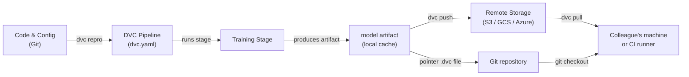

# Data Version Control (DVC)

## Définition

Data Version Control (DVC) est un outil open source qui étend Git pour suivre les fichiers volumineux, les jeux de données et les artefacts de modèles qui ne peuvent pas être stockés efficacement dans un dépôt Git. Alors que Git enregistre chaque modification du code source, DVC stocke un petit fichier pointeur (`.dvc`) dans le dépôt et pousse les octets de données réels vers un backend de stockage distant configurable — S3, GCS, Azure Blob, SSH ou même un répertoire local. Cela maintient le dépôt léger tout en préservant la reproductibilité complète.

DVC va au-delà du simple versionnage de fichiers. Il introduit le concept de **pipelines** — un DAG (Graphe Acyclique Dirigé) d'étapes définies dans un fichier `dvc.yaml`. Chaque étape spécifie sa commande, ses entrées (dépendances) et ses sorties, afin que DVC puisse déterminer quelles étapes doivent être ré-exécutées lorsque les entrées changent. Le résultat est un système de build pour le ML : reproductible, incrémental et versionné aux côtés du code qui l'a produit.

DVC s'intègre étroitement avec les flux de travail Git. Un fichier `dvc.lock`, commis dans Git, capture le hash de contenu exact de chaque entrée et sortie au moment de l'exécution d'une pipeline, de sorte que vérifier un commit Git historique et exécuter `dvc pull` restaure exactement le jeu de données et les artefacts de modèle qui existaient à ce moment de l'histoire.

## Fonctionnement



### Initialiser un dépôt DVC

Exécuter `dvc init` à l'intérieur d'un dépôt Git crée un répertoire `.dvc/` qui contient la configuration de DVC et le cache local. DVC enregistre une entrée `.gitignore` pour le dossier de cache et ajoute quelques petits fichiers de suivi qui doivent être commis dans Git. À partir de ce point, `dvc add <file>` crée un fichier pointeur `.dvc` pour tout fichier volumineux — les octets réels vont dans le cache local et ne sont jamais commis dans Git. Cette approche à deux couches signifie que le dépôt reste rapide à cloner tandis que DVC gère les actifs lourds séparément.

### Définir et exécuter des pipelines

Un fichier `dvc.yaml` déclare chaque étape de la pipeline avec sa commande, ses dépendances d'entrée et ses artefacts de sortie. Lorsque vous exécutez `dvc repro`, DVC inspecte le graphe de dépendances, compare les hashes de contenu de toutes les entrées par rapport au snapshot `dvc.lock`, et ré-exécute uniquement les étapes dont les entrées ont changé. C'est analogue à `make` mais adressé par contenu plutôt que basé sur les horodatages, il est donc déterministe même entre les machines et les runners CI. Les pipelines peuvent être paramétrées via un fichier `params.yaml`, et DVC enregistre quelles valeurs de paramètres ont été utilisées dans chaque exécution.

### Stockage distant et collaboration

Un remote DVC est un emplacement de stockage configuré avec `dvc remote add`. Les équipes configurent généralement un bucket cloud partagé pour que tous les membres extraient les mêmes données. `dvc push` télécharge les artefacts nouveaux ou modifiés vers le remote, et `dvc pull` télécharge exactement les versions référencées par le `dvc.lock` du commit Git actuel. Ce flux de travail signifie qu'intégrer un nouveau membre de l'équipe dans un projet se fait avec `git clone` suivi de `dvc pull` — une seule commande qui matérialise le jeu de données correct et les artefacts de modèle pour cette branche.

### Expériences

`dvc exp run` et `dvc exp show` fournissent une couche légère de suivi d'expériences par-dessus les pipelines. Chaque expérience est un stash Git temporaire de modifications de paramètres et de métriques de résultats, qui peuvent être comparés dans un tableau et promus en une branche complète s'ils sont prometteurs. C'est moins riche en fonctionnalités que les outils dédiés comme MLflow ou W&B, mais a l'avantage de ne nécessiter aucune infrastructure supplémentaire — tout vit dans le dépôt Git.

## Quand utiliser / Quand NE PAS utiliser

| Utiliser quand | Éviter quand |
|---|---|
| Vos jeux de données ou fichiers de modèles sont trop volumineux pour Git (>100 Mo) | Toutes les données tiennent confortablement dans Git LFS et aucune pipeline n'est nécessaire |
| Vous avez besoin de pipelines ML reproductibles liées aux versions de code | Vos exigences de suivi d'expériences dépassent l'approche légère de DVC |
| Votre équipe utilise Git et veut un flux de contrôle de version unifié | Vous avez besoin d'une interface complète pour la gestion des expériences (préférez MLflow ou W&B) |
| Les pipelines CI/CD ont besoin d'extraire des artefacts de données exacts par branche | Les données sont extrêmement sensibles et ne peuvent pas quitter le stockage on-premises |
| Vous voulez comparer les résultats d'expériences sans un serveur séparé | Le projet n'a pas de remote partagé et la collaboration n'est pas une préoccupation |

## Comparaisons

| Critère | DVC | Git LFS | MLflow Tracking |
|---|---|---|---|
| Objectif principal | Versionnage données + pipeline | Versionnage de fichiers volumineux | Suivi d'expériences + registre de modèles |
| Support de pipeline | Oui (dvc.yaml DAG) | Non | Non (enregistre seulement les exécutions) |
| Comparaison d'expériences | Basique (dvc exp show) | Non | Riche (UI + API) |
| Backends distants | S3, GCS, Azure, SSH, local | Serveurs LFS GitHub, GitLab | Local, S3, Azure, SFTP |
| Serveur requis | Non | Non | Optionnel (serveur MLflow) |
| Intégration Git | Principe de conception central | Principe de conception central | Optionnel (via mlflow.log_param) |

## Avantages et inconvénients

| Avantages | Inconvénients |
|---|---|
| Aucun serveur supplémentaire requis — tout dans Git + stockage d'objets | Courbe d'apprentissage pour les équipes peu familières avec les pipelines basées sur DAG |
| Pipelines reproductibles avec cache adressé par contenu | Les grands conflits dvc.lock peuvent être délicats dans les monorepos très actifs |
| Fonctionne avec tout stockage cloud ou même des répertoires locaux | L'UI d'expériences est minimale par rapport à MLflow / W&B |
| Léger — DVC est juste un outil CLI | Ne gère pas l'orchestration d'entraînement distribué |
| Intégration CI/CD de première classe via CML | Les coûts de stockage distant sont à la charge de l'équipe |

## Exemples de code

```bash
# --- DVC setup and basic data tracking ---
git init my-ml-project && cd my-ml-project
dvc init
git add .dvc .dvcignore
git commit -m "Initialize DVC"

dvc remote add -d myremote s3://my-bucket/dvc-store
git add .dvc/config
git commit -m "Add DVC remote"

dvc add data/train.csv
git add data/train.csv.dvc data/.gitignore
git commit -m "Track training dataset with DVC"

dvc push

# --- Collaborator workflow ---
git clone https://github.com/org/my-ml-project
cd my-ml-project
dvc pull
```

```yaml
# dvc.yaml
stages:
  featurize:
    cmd: python src/featurize.py --input data/train.csv --output data/features.parquet
    deps:
      - src/featurize.py
      - data/train.csv
    outs:
      - data/features.parquet
  train:
    cmd: python src/train.py --features data/features.parquet --output models/
    deps:
      - src/train.py
      - data/features.parquet
      - params.yaml
    outs:
      - models/
    metrics:
      - reports/metrics.json:
          cache: false
```

```python
# src/train.py
import json
import argparse
from pathlib import Path
import yaml
import joblib
import pandas as pd
from sklearn.ensemble import GradientBoostingClassifier
from sklearn.model_selection import train_test_split
from sklearn.metrics import accuracy_score


def main(features_path: str, output_dir: str) -> None:
    params = yaml.safe_load(Path("params.yaml").read_text())["train"]
    df = pd.read_parquet(features_path)
    X = df.drop(columns=["label"])
    y = df["label"]
    X_train, X_test, y_train, y_test = train_test_split(X, y, test_size=0.2, random_state=42)
    model = GradientBoostingClassifier(
        n_estimators=params["n_estimators"],
        max_depth=params["max_depth"],
        random_state=42,
    )
    model.fit(X_train, y_train)
    out = Path(output_dir)
    out.mkdir(parents=True, exist_ok=True)
    joblib.dump(model, out / "model.joblib")
    accuracy = float(accuracy_score(y_test, model.predict(X_test)))
    Path("reports").mkdir(exist_ok=True)
    Path("reports/metrics.json").write_text(json.dumps({"accuracy": accuracy}, indent=2))
    print(f"Accuracy: {accuracy:.4f}")


if __name__ == "__main__":
    parser = argparse.ArgumentParser()
    parser.add_argument("--features", required=True)
    parser.add_argument("--output", required=True)
    args = parser.parse_args()
    main(args.features, args.output)
```

## Ressources pratiques

- [Documentation officielle DVC](https://dvc.org/doc) — Guide complet couvrant l'installation, les pipelines, les remotes et les expériences.
- [Tutoriel DVC Get Started](https://dvc.org/doc/start) — Guide pratique pour configurer un projet DVC de zéro.
- [Blog Iterative : Git-based MLOps](https://iterative.ai/blog) — Articles sur les flux de travail MLOps combinant DVC, CML et MLEM.
- [Dépôt GitHub DVC](https://github.com/iterative/dvc) — Code source et issues de la communauté.

## Voir aussi

- [CI/CD pour le ML](/docs/mlops/cicd)
- [Suivi d'expériences](/docs/mlops/experiment-tracking)
- [MLflow](/docs/mlops/mlflow)
