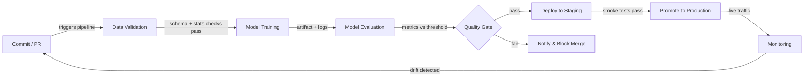

# CI/CD pour le ML

## Définition

L'intégration continue et la livraison continue (CI/CD) est une pratique d'ingénierie logicielle qui automatise la construction, les tests et le déploiement du code à chaque changement. Lorsqu'elle est appliquée à l'apprentissage automatique, le périmètre s'étend au-delà du code : la qualité des données, les performances des modèles et le versionnage des artefacts deviennent tous des citoyens de première classe du pipeline. Un pipeline CI/CD ML défaillant peut expédier un modèle qui se dégrade silencieusement en production sans qu'une seule ligne de code d'application ne change.

Le CI/CD traditionnel valide la logique et les contrats d'API. Le CI/CD ML doit en plus valider les propriétés statistiques des données (schéma, distributions, taux de valeurs manquantes), les seuils de qualité des modèles (précision, latence, équité) et la reproductibilité — la capacité de ré-entraîner exactement le même modèle à partir des mêmes entrées. Des outils comme [DVC](/docs/mlops/cicd/dvc) pour le versionnage des données et CML (Continuous Machine Learning) pour signaler les métriques dans les pull requests rendent cela pratique.

L'objectif final est un chemin entièrement automatisé d'un changement de code ou de données à un modèle déployé en toute sécurité, avec des portes humaines uniquement là où elles apportent une vraie valeur — comme la révision d'une fiche modèle avant une promotion en production.

## Fonctionnement



### Validation des données

Avant le début de l'entraînement, le pipeline vérifie que les données entrantes correspondent au schéma et au profil statistique attendus. Great Expectations ou TensorFlow Data Validation (TFDV) peuvent affirmer que les types de colonnes sont corrects, que les plages de valeurs sont sensées et qu'il n'y a pas de pics inattendus dans les valeurs manquantes. L'échec de cette porte tôt évite le gaspillage de calcul sur des lots corrompus. Toute dérive de schéma est signalée comme une vérification échouée dans la pull request, ce qui bloque la fusion jusqu'à ce que le problème soit compris et soit corrigé ou explicitement accepté. Cette étape est l'équivalent ML de la vérification de type du code avant l'exécution des tests.

### Entraînement du modèle

L'entraînement est exécuté comme un job reproductible et paramétré — idéalement conteneurisé pour que l'environnement exact (version CUDA, épinglage des bibliothèques) soit capturé. Un bon système CI/CD passe les hyperparamètres via des fichiers de configuration suivis dans le contrôle de version, et non codés en dur dans les scripts. Des outils comme [DVC](/docs/mlops/cicd/dvc) suivent quelle version du jeu de données et quelle configuration ont produit quel artefact de modèle, afin que tout modèle entraîné puisse être retracé jusqu'à ses entrées. Les exécutions d'entraînement sont enregistrées dans un outil de suivi d'expériences (MLflow, W&B) afin que la comparaison avec le modèle champion précédent soit automatique.

### Évaluation du modèle

Après l'entraînement, des scripts d'évaluation automatisés calculent les métriques cibles sur un ensemble de test réservé et les comparent à un seuil défini ou au modèle de production actuel. CML (d'Iterative.ai) peut publier un rapport Markdown avec des tableaux de métriques et des graphiques directement sur la pull request GitHub ou GitLab, afin que les réviseurs voient les régressions de performances sans quitter leur workflow de révision de code. L'évaluation doit également couvrir les métriques d'équité par tranches pour les domaines réglementés. La porte de qualité ne passe que si le nouveau modèle atteint ou dépasse les seuils.

### Déploiement et surveillance

Après avoir passé la porte de qualité, l'artefact de modèle est enregistré dans un [registre de modèles](/docs/mlops/cicd/model-registry) et déployé dans un environnement de staging où des tests smoke s'exécutent sur du trafic réel (ou représentatif). La promotion en production peut être manuelle (un clic dans l'interface du registre) ou entièrement automatisée. Une fois en production, une couche de [surveillance](/docs/mlops/monitoring) suit la dérive des données, la dérive des prédictions et les KPIs métier, et peut déclencher un cycle de ré-entraînement — bouclant la boucle de feedback jusqu'à l'étape Commit.

## Quand utiliser / Quand NE PAS utiliser

| Utiliser quand | Éviter quand |
|---|---|
| Plusieurs data scientists committent sur du code de modèle partagé | Travail solo sur une expérience notebook ponctuelle |
| Les modèles sont ré-entraînés régulièrement sur de nouvelles données | Le modèle est statique et entraîné une fois, jamais mis à jour |
| Les défaillances en production sont coûteuses (fraude, santé, sécurité) | Phase prototype où la rapidité d'itération prime sur la correction |
| L'équipe a besoin de reproductibilité et de pistes d'audit | La maturité infrastructure / DevOps est très faible |
| La conformité réglementaire exige un versionnage documenté des modèles | Le jeu de données est minuscule et tient dans un seul notebook de bout en bout |

## Comparaisons

| Critère | CI/CD traditionnel | CI/CD ML |
|---|---|---|
| Artefact principal | Binaire / image Docker | Artefact de modèle + version des données |
| Types de tests | Unitaires, intégration, E2E | Unitaires + qualité des données + qualité du modèle + équité |
| Déclencheur | Push de code | Push de code OU nouvelles données OU ré-entraînement planifié |
| Rollback | Redéployer l'image précédente | Redéployer la version précédente du modèle depuis le registre |
| Observabilité | Logs d'application, traces | Dérive des données, dérive des prédictions, métriques métier |

## Avantages et inconvénients

| Avantages | Inconvénients |
|---|---|
| Détecte les régressions avant qu'elles n'atteignent la production | Coût de configuration plus élevé que le CI/CD traditionnel |
| Piste d'audit complète des versions données + code + modèle | La validation des données nécessite une expertise du domaine pour être définie correctement |
| Permet des mises à jour fréquentes et sûres des modèles | Les jobs d'entraînement peuvent être lents, rendant les boucles de feedback CI plus longues |
| Réduit les transferts manuels entre la data science et les ops | Nécessite un alignement entre les équipes données, ML et plateforme |
| Les métriques dans les PRs améliorent la qualité de la révision de code | Des seuils mal configurés peuvent bloquer des améliorations valides |

## Exemples de code

```yaml
# .github/workflows/ml-pipeline.yml
# GitHub Actions workflow for a full ML CI/CD pipeline with CML reporting

name: ML Pipeline

on:
  push:
    branches: [main, "feat/**"]
  pull_request:
    branches: [main]

jobs:
  ml-pipeline:
    runs-on: ubuntu-latest

    steps:
      # 1. Check out the repository with full git history (needed for DVC)
      - name: Checkout code
        uses: actions/checkout@v4
        with:
          fetch-depth: 0

      # 2. Set up Python and install dependencies
      - name: Set up Python 3.11
        uses: actions/setup-python@v5
        with:
          python-version: "3.11"

      - name: Install dependencies
        run: pip install -r requirements.txt

      # 3. Pull data and model artifacts from DVC remote
      - name: Pull DVC artifacts
        env:
          AWS_ACCESS_KEY_ID: ${{ secrets.AWS_ACCESS_KEY_ID }}
          AWS_SECRET_ACCESS_KEY: ${{ secrets.AWS_SECRET_ACCESS_KEY }}
        run: dvc pull

      # 4. Validate data quality before training
      - name: Validate data
        run: python src/validate_data.py --data data/train.csv

      # 5. Train the model and save metrics to metrics.json
      - name: Train model
        run: python src/train.py --config configs/train.yaml

      # 6. Evaluate model and write report for CML
      - name: Evaluate model
        run: python src/evaluate.py --output reports/metrics.md

      # 7. Post CML report as a comment on the pull request
      - name: Post CML report
        uses: iterative/setup-cml@v2
        with:
          version: latest

      - name: Publish CML report
        env:
          REPO_TOKEN: ${{ secrets.GITHUB_TOKEN }}
        run: |
          # Append the confusion matrix image to the report
          echo "## Model evaluation report" >> reports/metrics.md
          cml comment create reports/metrics.md

      # 8. Push updated DVC artifacts (only on main)
      - name: Push DVC artifacts
        if: github.ref == 'refs/heads/main'
        env:
          AWS_ACCESS_KEY_ID: ${{ secrets.AWS_ACCESS_KEY_ID }}
          AWS_SECRET_ACCESS_KEY: ${{ secrets.AWS_SECRET_ACCESS_KEY }}
        run: dvc push
```

```python
# src/validate_data.py
# Simple data validation gate using pandas — replace with Great Expectations for production

import argparse
import sys
import pandas as pd

EXPECTED_COLUMNS = {"feature_a", "feature_b", "label"}
MAX_MISSING_RATE = 0.05  # 5% threshold


def validate(path: str) -> None:
    df = pd.read_csv(path)

    # Check that all required columns are present
    missing_cols = EXPECTED_COLUMNS - set(df.columns)
    if missing_cols:
        print(f"FAIL: Missing columns: {missing_cols}")
        sys.exit(1)

    # Check missing-value rates
    for col in EXPECTED_COLUMNS:
        rate = df[col].isna().mean()
        if rate > MAX_MISSING_RATE:
            print(f"FAIL: Column '{col}' has {rate:.1%} missing values (threshold: {MAX_MISSING_RATE:.0%})")
            sys.exit(1)

    print("Data validation passed.")


if __name__ == "__main__":
    parser = argparse.ArgumentParser()
    parser.add_argument("--data", required=True)
    args = parser.parse_args()
    validate(args.data)
```

## Ressources pratiques

- [CML (Continuous Machine Learning) par Iterative](https://cml.dev/) — Documentation officielle pour publier des métriques et des graphiques ML directement dans les PRs GitHub/GitLab.
- [GitHub Actions pour ML — Guide Iterative](https://iterative.ai/blog/github-actions-ml) — Présentation de la mise en place d'un pipeline ML de bout en bout avec GitHub Actions et DVC.
- [Google MLOps : pipelines de livraison continue et d'automatisation en ML](https://cloud.google.com/architecture/mlops-continuous-delivery-and-automation-pipelines-in-machine-learning) — Architecture de référence de Google décrivant trois niveaux de maturité d'automatisation ML.
- [Documentation Great Expectations](https://docs.greatexpectations.io/) — Framework pour la validation et la documentation des données dans les pipelines ML.

## Voir aussi

- [Data Version Control (DVC)](/docs/mlops/cicd/dvc)
- [Registre de modèles](/docs/mlops/cicd/model-registry)
- [Vue d'ensemble MLOps](/docs/mlops)
