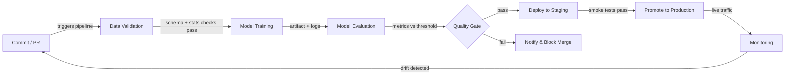

# CI/CD pour le ML

## Définition

L'Intégration Continue et la Livraison Continue (CI/CD) est une pratique d'ingénierie logicielle qui automatise la construction, les tests et le déploiement du code à chaque modification. Appliquée au machine learning, la portée s'étend au-delà du code : la qualité des données, les performances du modèle et le versionnage des artefacts deviennent tous des éléments de première classe de la pipeline. Une pipeline CI/CD de ML défaillante peut livrer un modèle qui se dégrade silencieusement en production sans qu'une seule ligne de code d'application ne change.

Le CI/CD traditionnel valide la logique et les contrats d'API. Le CI/CD de ML doit en plus valider les propriétés statistiques des données (schéma, distributions, taux de valeurs manquantes), les seuils de qualité du modèle (précision, latence, équité) et la reproductibilité — la capacité à ré-entraîner exactement le même modèle à partir des mêmes entrées. Des outils comme [DVC](/docs/mlops/cicd/dvc) pour le versionnage des données et CML (Continuous Machine Learning) pour rapporter les métriques dans les pull requests rendent cela praticable.

L'objectif final est un chemin entièrement automatisé d'un changement de code ou de données à un modèle déployé en toute sécurité, avec des points de contrôle humains uniquement là où ils apportent une réelle valeur — comme l'examen d'une fiche de modèle avant une promotion en production.

## Fonctionnement



### Validation des données

Avant le début de l'entraînement, la pipeline vérifie que les données entrantes correspondent au schéma attendu et au profil statistique. Great Expectations ou TensorFlow Data Validation (TFDV) peuvent vérifier que les types de colonnes sont corrects, que les plages de valeurs sont sensées et qu'il n'y a pas de pics inattendus de valeurs manquantes. Échouer à cette étape tôt évite de gaspiller des ressources de calcul sur des lots corrompus. Toute dérive de schéma est signalée comme un contrôle échoué dans la pull request, ce qui bloque la fusion jusqu'à ce que le problème soit compris et soit corrigé ou explicitement accepté. Cette étape est l'équivalent ML de la vérification de types du code avant d'exécuter les tests.

### Entraînement du modèle

L'entraînement est exécuté comme un travail reproductible et paramétré — idéalement conteneurisé pour que l'environnement exact (version CUDA, épinglage de bibliothèques) soit capturé. Un bon système CI/CD passe les hyperparamètres via des fichiers de configuration suivis dans le contrôle de version, non codés en dur dans les scripts. Des outils comme [DVC](/docs/mlops/cicd/dvc) suivent quelle version du jeu de données et quelle configuration ont produit quel artefact de modèle, afin que tout modèle entraîné puisse être retracé jusqu'à ses entrées. Les exécutions d'entraînement sont enregistrées dans un tracker d'expériences (MLflow, W&B) pour que la comparaison avec le modèle champion précédent soit automatique.

### Évaluation du modèle

Après l'entraînement, des scripts d'évaluation automatisés calculent les métriques cibles sur un ensemble de test retenu et les comparent à un seuil défini ou au modèle de production actuel. CML (d'Iterative.ai) peut publier un rapport Markdown avec des tableaux de métriques et des graphiques directement sur la pull request GitHub ou GitLab, afin que les réviseurs voient les régressions de performance sans quitter leur flux de travail de revue de code. L'évaluation doit également couvrir les métriques d'équité par tranche pour les domaines réglementés. La porte de qualité ne passe que si le nouveau modèle atteint ou dépasse les seuils.

### Déploiement et surveillance

Après avoir passé la porte de qualité, l'artefact du modèle est enregistré dans un [registre de modèles](/docs/mlops/cicd/model-registry) et déployé dans un environnement de staging où des tests de fumée s'exécutent sur le trafic réel (ou représentatif). La promotion en production peut être manuelle (un clic dans l'UI du registre) ou entièrement automatisée. Une fois en production, une couche de [surveillance](/docs/mlops/monitoring) suit la dérive des données, la dérive des prédictions et les KPIs métier, et peut déclencher une exécution de ré-entraînement — bouclant la boucle de rétroaction vers l'étape Commit.

## Quand utiliser / Quand NE PAS utiliser

| Utiliser quand | Éviter quand |
|---|---|
| Plusieurs data scientists commitent sur du code de modèle partagé | Travail individuel sur une expérience de notebook ponctuelle |
| Les modèles sont ré-entraînés régulièrement sur de nouvelles données | Le modèle est statique et entraîné une seule fois, jamais mis à jour |
| Les échecs en production sont coûteux (fraude, santé, sécurité) | Phase de prototypage où la vitesse d'itération prime sur la correction |
| L'équipe a besoin de reproductibilité et de pistes d'audit | La maturité infrastructure/DevOps est très faible |
| La conformité réglementaire exige un versionnage documenté des modèles | Le jeu de données est petit et tient dans un seul notebook |

## Comparaisons

| Critère | CI/CD traditionnel | CI/CD ML |
|---|---|---|
| Artefact principal | Binaire / image Docker | Artefact de modèle + version des données |
| Types de tests | Unitaire, intégration, E2E | Unitaire + qualité des données + qualité du modèle + équité |
| Déclencheur | Push de code | Push de code OU nouvelles données OU ré-entraînement planifié |
| Rollback | Redéployer l'image précédente | Redéployer la version précédente du modèle depuis le registre |
| Observabilité | Logs d'application, traces | Dérive des données, dérive des prédictions, métriques métier |

## Avantages et inconvénients

| Avantages | Inconvénients |
|---|---|
| Détecte les régressions avant qu'elles n'atteignent la production | Coût de configuration plus élevé que le CI/CD traditionnel |
| Piste d'audit complète des données + code + versions de modèle | La validation des données nécessite une expertise du domaine pour être définie correctement |
| Permet des mises à jour fréquentes et sécurisées des modèles | Les jobs d'entraînement peuvent être lents, allongeant les boucles de rétroaction CI |
| Réduit les transferts manuels entre science des données et opérations | Nécessite un alignement entre les équipes données, ML et plateforme |
| Les métriques dans les PRs améliorent la qualité de la revue de code | Des seuils mal configurés peuvent bloquer des améliorations valides |

## Exemples de code

```yaml
# .github/workflows/ml-pipeline.yml
name: ML Pipeline
on:
  push:
    branches: [main, "feat/**"]
  pull_request:
    branches: [main]
jobs:
  ml-pipeline:
    runs-on: ubuntu-latest
    steps:
      - name: Checkout code
        uses: actions/checkout@v4
        with:
          fetch-depth: 0
      - name: Set up Python 3.11
        uses: actions/setup-python@v5
        with:
          python-version: "3.11"
      - name: Install dependencies
        run: pip install -r requirements.txt
      - name: Pull DVC artifacts
        env:
          AWS_ACCESS_KEY_ID: ${{ secrets.AWS_ACCESS_KEY_ID }}
          AWS_SECRET_ACCESS_KEY: ${{ secrets.AWS_SECRET_ACCESS_KEY }}
        run: dvc pull
      - name: Validate data
        run: python src/validate_data.py --data data/train.csv
      - name: Train model
        run: python src/train.py --config configs/train.yaml
      - name: Evaluate model
        run: python src/evaluate.py --output reports/metrics.md
      - name: Post CML report
        uses: iterative/setup-cml@v2
        with:
          version: latest
      - name: Publish CML report
        env:
          REPO_TOKEN: ${{ secrets.GITHUB_TOKEN }}
        run: |
          echo "## Model evaluation report" >> reports/metrics.md
          cml comment create reports/metrics.md
      - name: Push DVC artifacts
        if: github.ref == 'refs/heads/main'
        env:
          AWS_ACCESS_KEY_ID: ${{ secrets.AWS_ACCESS_KEY_ID }}
          AWS_SECRET_ACCESS_KEY: ${{ secrets.AWS_SECRET_ACCESS_KEY }}
        run: dvc push
```

```python
# src/validate_data.py
import argparse
import sys
import pandas as pd

EXPECTED_COLUMNS = {"feature_a", "feature_b", "label"}
MAX_MISSING_RATE = 0.05

def validate(path: str) -> None:
    df = pd.read_csv(path)
    missing_cols = EXPECTED_COLUMNS - set(df.columns)
    if missing_cols:
        print(f"FAIL: Missing columns: {missing_cols}")
        sys.exit(1)
    for col in EXPECTED_COLUMNS:
        rate = df[col].isna().mean()
        if rate > MAX_MISSING_RATE:
            print(f"FAIL: Column '{col}' has {rate:.1%} missing values (threshold: {MAX_MISSING_RATE:.0%})")
            sys.exit(1)
    print("Data validation passed.")

if __name__ == "__main__":
    parser = argparse.ArgumentParser()
    parser.add_argument("--data", required=True)
    args = parser.parse_args()
    validate(args.data)
```

## Ressources pratiques

- [CML (Continuous Machine Learning) by Iterative](https://cml.dev/) — Documentation officielle pour publier des métriques et graphiques ML directement dans les PRs GitHub/GitLab.
- [GitHub Actions for ML — Iterative guide](https://iterative.ai/blog/github-actions-ml) — Guide pour configurer une pipeline ML de bout en bout avec GitHub Actions et DVC.
- [Google MLOps: Continuous delivery and automation pipelines in ML](https://cloud.google.com/architecture/mlops-continuous-delivery-and-automation-pipelines-in-machine-learning) — Architecture de référence de Google décrivant trois niveaux de maturité d'automatisation ML.
- [Great Expectations documentation](https://docs.greatexpectations.io/) — Framework pour la validation et la documentation des données dans les pipelines ML.

## Voir aussi

- [Data Version Control (DVC)](/docs/mlops/cicd/dvc)
- [Registre de modèles](/docs/mlops/cicd/model-registry)
- [Vue d'ensemble MLOps](/docs/mlops)
