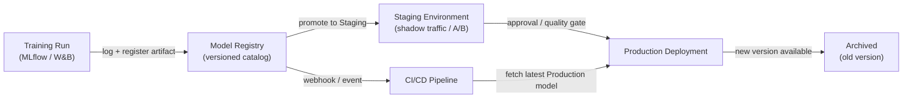

# Registre de modèles

## Définition

Un registre de modèles est un catalogue centralisé qui stocke, versionne et gouverne les artefacts de modèles ML entraînés tout au long de leur cycle de vie — de l'expérimentation initiale au déploiement en staging, en production et jusqu'à la retraite finale. Considérez-le comme l'équivalent d'un référentiel d'artefacts logiciels (comme Nexus ou Artifactory) mais spécifiquement conçu pour l'apprentissage automatique, avec des métadonnées supplémentaires sur les données d'entraînement, les métriques d'évaluation et le statut d'approbation attachées à chaque version.

Sans registre, les équipes partagent souvent les modèles via des canaux ad hoc : messages Slack avec des liens S3, répertoires partagés ou chemins codés en dur dans les scripts de déploiement. Cela rend impossible de répondre à des questions de gouvernance de base telles que « quel modèle est actuellement en production ? », « qui a approuvé ce modèle pour le déploiement ? » ou « quel jeu de données a été utilisé pour entraîner la version qui a causé l'incident la semaine dernière ? ». Un registre rend ces questions triviales à répondre.

Les registres de modèles s'intègrent à la fois côté entraînement (les outils de suivi d'expériences enregistrent une exécution et l'artefact de la meilleure exécution est enregistré) et côté déploiement (le CI/CD ou l'infrastructure de service tire l'artefact au stade `Production`). Ils appliquent généralement un workflow de promotion — `None → Staging → Production → Archivé` — qui peut exiger une validation humaine, des portes de qualité automatisées, ou les deux, avant qu'un modèle passe au stade suivant.

## Fonctionnement



### Enregistrement du modèle

Après la fin d'une exécution d'entraînement et l'enregistrement des métriques dans un outil de suivi d'expériences, le meilleur artefact est enregistré dans le registre avec `mlflow.register_model()` ou l'appel SDK équivalent. Chaque enregistrement crée une nouvelle **version** d'un modèle nommé (par exemple, `fraud-detector`). Les versions sont immuables — vous ne pouvez pas écraser une version enregistrée, uniquement en créer une nouvelle. Les métadonnées telles que l'ID d'exécution, le hash du jeu de données, les paramètres d'entraînement et les métriques d'évaluation sont attachées à la version et sont interrogeables via l'API ou l'interface du registre.

### Workflow de staging

Les versions nouvellement enregistrées démarrent dans l'état `None` (ou `Candidate`). Un data scientist ou une porte automatisée promeut une version vers `Staging` pour une validation approfondie — tests d'intégration, déploiement en shadow, division du trafic canary ou comparaison A/B avec le modèle de production actuel. Le staging est un environnement sûr où les régressions sont contenues ; tout échec ici empêche le modèle d'atteindre la production sans bloquer le système de service.

### Promotion en production et gouvernance

La promotion vers `Production` peut nécessiter une étape d'approbation humaine, en particulier dans les industries réglementées. De nombreuses équipes implémentent une révision de type pull request : le registre émet un webhook, un réviseur examine la fiche modèle (qui documente les données d'entraînement, les métriques d'équité et les limitations connues), et la promotion est enregistrée dans un journal d'audit avec l'identité de l'approbateur et l'horodatage. L'infrastructure de service s'abonne à l'état `Production` et charge automatiquement la nouvelle version du modèle lors de la promotion, permettant des mises à jour de modèles sans interruption de service.

### Archivage et rollback

Lorsqu'une nouvelle version atteint `Production`, l'ancienne version est transférée vers `Archivé`. L'archivage ne supprime pas l'artefact — il reste entièrement récupérable pour un rollback ou une analyse forensique. Si la nouvelle version de production se dégrade (détectée par la [surveillance](/docs/mlops/monitoring)), l'équipe des opérations peut re-promouvoir la version archivée vers `Production` en quelques secondes, effectuant un rollback sans déploiement de code.

## Quand utiliser / Quand NE PAS utiliser

| Utiliser quand | Éviter quand |
|---|---|
| Plusieurs modèles ou versions de modèles sont déployés simultanément | Vous avez un seul modèle entraîné une fois sans plans de mise à jour |
| Des exigences réglementaires ou d'audit imposent la provenance du modèle | L'équipe est en phase de R&D précoce sans déploiement en production encore |
| Différentes équipes sont responsables de l'entraînement vs. du déploiement | Une seule personne entraîne et déploie dans un seul script |
| Vous avez besoin d'une capacité de rollback pour les modèles en production | La surcharge du processus de gouvernance n'est pas justifiée par le niveau de risque |
| Les tests A/B ou le déploiement en shadow nécessitent la gestion de plusieurs versions en production | Le suivi d'expériences seul satisfait déjà vos besoins de gouvernance |

## Comparaisons

| Critère | MLflow Model Registry | W&B Registry | AWS SageMaker Model Registry |
|---|---|---|---|
| Hébergement | Auto-hébergé ou Databricks géré | SaaS (cloud W&B) | Service AWS entièrement géré |
| Intégration | Serveur de tracking MLflow | Suivi d'expériences W&B | SageMaker training + endpoints |
| Workflow d'états | None → Staging → Production → Archivé | Basé sur des alias (états personnalisés) | Pending → Approved → Rejected |
| Processus d'approbation | Manuel via interface/API | Manuel via interface/API | Intégration avec AWS IAM / CodePipeline |
| Coût | Open source (auto-hébergé gratuit) | Niveau gratuit + plans payants | Tarification AWS à l'usage |

## Avantages et inconvénients

| Avantages | Inconvénients |
|---|---|
| Source unique de vérité pour tous les modèles en production | Ajoute une surcharge de processus — les équipes doivent penser à enregistrer les artefacts |
| Permet le rollback en quelques secondes sans déploiement de code | Les registres auto-hébergés nécessitent une maintenance d'infrastructure |
| Piste d'audit complète avec identité de l'approbateur et horodatages | Un travail d'intégration est requis pour connecter les pipelines d'entraînement au registre |
| Découple la promotion des modèles des cycles de déploiement de code | Les processus de gouvernance peuvent ralentir les équipes agiles si trop complexes |
| Permet des tests A/B sûrs en servant plusieurs versions enregistrées | Les coûts de stockage d'artefacts augmentent avec le temps à mesure que les versions s'accumulent |

## Exemples de code

```python
# model_registry_example.py
# Demonstrates registering, transitioning, and loading models with MLflow Model Registry

import mlflow
import mlflow.sklearn
from mlflow.tracking import MlflowClient
from sklearn.datasets import make_classification
from sklearn.ensemble import RandomForestClassifier
from sklearn.model_selection import train_test_split
from sklearn.metrics import accuracy_score

# --- 1. Train and log a model to MLflow tracking server ---

mlflow.set_tracking_uri("http://localhost:5000")  # or your MLflow server URI
mlflow.set_experiment("fraud-detection")

X, y = make_classification(n_samples=5000, n_features=20, random_state=42)
X_train, X_test, y_train, y_test = train_test_split(X, y, test_size=0.2, random_state=42)

with mlflow.start_run(run_name="rf-baseline") as run:
    model = RandomForestClassifier(n_estimators=100, random_state=42)
    model.fit(X_train, y_train)

    accuracy = accuracy_score(y_test, model.predict(X_test))

    # Log parameters and metrics — these attach to the registered version
    mlflow.log_param("n_estimators", 100)
    mlflow.log_metric("accuracy", accuracy)

    # Log the model artifact with a schema signature for validation at serving time
    signature = mlflow.models.infer_signature(X_train, model.predict(X_train))
    mlflow.sklearn.log_model(
        sk_model=model,
        artifact_path="model",
        signature=signature,
        registered_model_name="fraud-detector",  # registers on log if name provided
    )

    run_id = run.info.run_id
    print(f"Run ID: {run_id} | Accuracy: {accuracy:.4f}")

# --- 2. Transition the newly registered version to Staging ---

client = MlflowClient()

# Fetch the latest version of the model (just registered above)
latest_versions = client.get_latest_versions("fraud-detector", stages=["None"])
new_version = latest_versions[0].version

# Promote to Staging for integration testing
client.transition_model_version_stage(
    name="fraud-detector",
    version=new_version,
    stage="Staging",
    archive_existing_versions=False,  # keep other Staging versions for comparison
)
print(f"Version {new_version} promoted to Staging")

# --- 3. After validation, promote Staging model to Production ---

# Archive the current Production version and promote Staging to Production
client.transition_model_version_stage(
    name="fraud-detector",
    version=new_version,
    stage="Production",
    archive_existing_versions=True,  # automatically archive the old Production version
)
print(f"Version {new_version} is now Production")

# Add a description to document why this version was promoted
client.update_model_version(
    name="fraud-detector",
    version=new_version,
    description="Promoted after passing shadow traffic test with 0.1% error rate improvement.",
)

# --- 4. Load the Production model in a serving or batch scoring script ---

production_model = mlflow.sklearn.load_model("models:/fraud-detector/Production")
predictions = production_model.predict(X_test)
print(f"Loaded Production model accuracy: {accuracy_score(y_test, predictions):.4f}")
```

## Ressources pratiques

- [Documentation MLflow Model Registry](https://mlflow.org/docs/latest/model-registry.html) — Guide officiel avec référence de l'API Python et présentation de l'interface.
- [Weights & Biases Registry](https://docs.wandb.ai/guides/model_registry) — Registre de modèles W&B avec artefacts liés et graphes de lignage.
- [AWS SageMaker Model Registry](https://docs.aws.amazon.com/sagemaker/latest/dg/model-registry.html) — Registre géré intégré avec SageMaker Pipelines et CodePipeline.
- [Google Vertex AI Model Registry](https://cloud.google.com/vertex-ai/docs/model-registry/introduction) — Solution gérée de GCP pour le versionnage et le déploiement des modèles.

## Voir aussi

- [MLflow](/docs/mlops/mlflow)
- [Weights & Biases (W&B)](/docs/mlops/wandb)
- [Service de modèles](/docs/mlops/deployment/model-serving)
