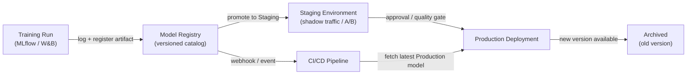

# Registre de modèles

## Définition

Un registre de modèles est un catalogue centralisé qui stocke, version et gouverne les artefacts de modèles ML entraînés tout au long de leur cycle de vie — de l'expérimentation initiale, au staging, au déploiement en production et à la retraite éventuelle. Considérez-le comme l'équivalent d'un dépôt d'artefacts logiciels (comme Nexus ou Artifactory) mais conçu spécifiquement pour le machine learning, avec des métadonnées supplémentaires sur les données d'entraînement, les métriques d'évaluation et le statut d'approbation attachées à chaque version.

Sans registre, les équipes partagent souvent les modèles via des canaux ad hoc : messages Slack avec liens S3, répertoires partagés ou chemins codés en dur dans les scripts de déploiement. Cela rend impossible de répondre à des questions de gouvernance de base comme "quel modèle est actuellement en production ?", "qui a approuvé ce modèle pour le déploiement ?" ou "quel jeu de données a été utilisé pour entraîner la version qui a causé l'incident la semaine dernière ?". Un registre rend ces questions trivialement répondables.

Les registres de modèles s'intègrent à la fois côté entraînement (les trackers d'expériences enregistrent une exécution, et l'artefact de la meilleure exécution est enregistré) et côté déploiement (CI/CD ou l'infrastructure de serving extrait l'artefact à l'étape `Production`). Ils imposent généralement un flux de travail de promotion — `None → Staging → Production → Archived` — qui peut nécessiter une approbation humaine, des portes de qualité automatisées, ou les deux avant qu'un modèle ne passe à l'étape suivante.

## Fonctionnement



### Enregistrement du modèle

Après la fin d'une exécution d'entraînement et l'enregistrement des métriques dans un tracker d'expériences, le meilleur artefact est enregistré dans le registre avec `mlflow.register_model()` ou l'appel SDK équivalent. Chaque enregistrement crée une nouvelle **version** d'un modèle nommé (par ex. `fraud-detector`). Les versions sont immuables — vous ne pouvez pas écraser une version enregistrée, seulement en créer une nouvelle. Les métadonnées telles que l'ID d'exécution, le hash du jeu de données, les paramètres d'entraînement et les métriques d'évaluation sont attachées à la version et peuvent être interrogées via l'API ou l'UI du registre.

### Flux de travail de staging

Les versions nouvellement enregistrées commencent à l'étape `None` (ou `Candidate`). Un data scientist ou une porte automatisée promeut une version en `Staging` pour une validation plus approfondie — tests d'intégration, déploiement fantôme, fractionnement du trafic canary ou comparaison A/B avec le modèle de production actuel. Le staging est un environnement sûr où les régressions sont contenues ; tout échec ici empêche le modèle d'atteindre la production sans bloquer le système de serving.

### Promotion en production et gouvernance

La promotion en `Production` peut nécessiter une étape d'approbation humaine, surtout dans les secteurs réglementés. De nombreuses équipes implémentent une révision de type pull-request : le registre émet un webhook, un réviseur examine la fiche du modèle (qui documente les données d'entraînement, les métriques d'équité et les limitations connues), et la promotion est enregistrée dans un journal d'audit avec l'identité de l'approbateur et le timestamp. L'infrastructure de serving s'abonne à l'étape `Production` et charge automatiquement la nouvelle version du modèle lors de la promotion, permettant des mises à jour de modèle sans interruption.

### Archivage et rollback

Lorsqu'une nouvelle version atteint `Production`, l'ancienne version passe à `Archived`. L'archivage ne supprime pas l'artefact — il reste entièrement récupérable pour un rollback ou une analyse forensique. Si la nouvelle version en production se dégrade (détectée par [la surveillance](/docs/mlops/monitoring)), l'équipe des opérations peut re-promouvoir la version archivée en `Production` en quelques secondes, effectuant un rollback sans déploiement de code.

## Quand utiliser / Quand NE PAS utiliser

| Utiliser quand | Éviter quand |
|---|---|
| Plusieurs modèles ou versions de modèles sont déployés simultanément | Vous avez un seul modèle entraîné une fois sans plans de mise à jour |
| Les exigences réglementaires ou d'audit demandent la provenance du modèle | L'équipe est en phase R&D précoce sans déploiement en production encore |
| Différentes équipes possèdent l'entraînement vs. le déploiement | Une seule personne entraîne et déploie dans un seul script |
| Vous avez besoin d'une capacité de rollback pour les modèles de production | L'overhead du processus de gouvernance n'est pas justifié par le niveau de risque |
| Les tests A/B ou le déploiement fantôme nécessitent de gérer plusieurs versions en direct | Le suivi d'expériences seul répond déjà à vos besoins de gouvernance |

## Comparaisons

| Critère | MLflow Model Registry | W&B Registry | AWS SageMaker Model Registry |
|---|---|---|---|
| Hébergement | Auto-hébergé ou géré par Databricks | SaaS (cloud W&B) | Service AWS entièrement géré |
| Intégration | Serveur de suivi MLflow | Suivi d'expériences W&B | Entraînement SageMaker + endpoints |
| Flux d'étapes | None → Staging → Production → Archived | Basé sur alias (étapes personnalisées) | Pending → Approved → Rejected |
| Processus d'approbation | Manuel via UI/API | Manuel via UI/API | Intégration avec AWS IAM / CodePipeline |
| Coût | Open source (auto-hébergé gratuit) | Niveau gratuit + plans payants | Tarification AWS pay-per-use |

## Avantages et inconvénients

| Avantages | Inconvénients |
|---|---|
| Source unique de vérité pour tous les modèles de production | Ajoute un overhead de processus — les équipes doivent penser à enregistrer les artefacts |
| Permet le rollback en secondes sans déploiement de code | Les registres auto-hébergés nécessitent une maintenance d'infrastructure |
| Piste d'audit complète avec identité de l'approbateur et timestamps | Travail d'intégration requis pour connecter les pipelines d'entraînement au registre |
| Découple la promotion du modèle des cycles de déploiement de code | Les processus de gouvernance peuvent ralentir les équipes rapides si sur-ingéniés |
| Permet des tests A/B sûrs en servant plusieurs versions enregistrées | Les coûts de stockage d'artefacts augmentent avec le temps au fur et à mesure que les versions s'accumulent |

## Exemples de code

```python
# model_registry_example.py
import mlflow
import mlflow.sklearn
from mlflow.tracking import MlflowClient
from sklearn.datasets import make_classification
from sklearn.ensemble import RandomForestClassifier
from sklearn.model_selection import train_test_split
from sklearn.metrics import accuracy_score

mlflow.set_tracking_uri("http://localhost:5000")
mlflow.set_experiment("fraud-detection")

X, y = make_classification(n_samples=5000, n_features=20, random_state=42)
X_train, X_test, y_train, y_test = train_test_split(X, y, test_size=0.2, random_state=42)

with mlflow.start_run(run_name="rf-baseline") as run:
    model = RandomForestClassifier(n_estimators=100, random_state=42)
    model.fit(X_train, y_train)
    accuracy = accuracy_score(y_test, model.predict(X_test))
    mlflow.log_param("n_estimators", 100)
    mlflow.log_metric("accuracy", accuracy)
    signature = mlflow.models.infer_signature(X_train, model.predict(X_train))
    mlflow.sklearn.log_model(
        sk_model=model, artifact_path="model", signature=signature,
        registered_model_name="fraud-detector",
    )

client = MlflowClient()
latest_versions = client.get_latest_versions("fraud-detector", stages=["None"])
new_version = latest_versions[0].version

client.transition_model_version_stage(
    name="fraud-detector", version=new_version, stage="Staging", archive_existing_versions=False,
)

client.transition_model_version_stage(
    name="fraud-detector", version=new_version, stage="Production", archive_existing_versions=True,
)

client.update_model_version(
    name="fraud-detector", version=new_version,
    description="Promoted after passing shadow traffic test with 0.1% error rate improvement.",
)

production_model = mlflow.sklearn.load_model("models:/fraud-detector/Production")
predictions = production_model.predict(X_test)
print(f"Loaded Production model accuracy: {accuracy_score(y_test, predictions):.4f}")
```

## Ressources pratiques

- [Documentation MLflow Model Registry](https://mlflow.org/docs/latest/model-registry.html) — Guide officiel avec référence API Python et présentation de l'UI.
- [Weights & Biases Registry](https://docs.wandb.ai/guides/model_registry) — Registre de modèles W&B avec artefacts liés et graphes de lignage.
- [AWS SageMaker Model Registry](https://docs.aws.amazon.com/sagemaker/latest/dg/model-registry.html) — Registre géré intégré avec SageMaker Pipelines et CodePipeline.
- [Google Vertex AI Model Registry](https://cloud.google.com/vertex-ai/docs/model-registry/introduction) — Solution gérée de GCP pour le versionnage et le déploiement de modèles.

## Voir aussi

- [MLflow](/docs/mlops/mlflow)
- [Weights & Biases (W&B)](/docs/mlops/wandb)
- [Serving de modèles](/docs/mlops/deployment/model-serving)
