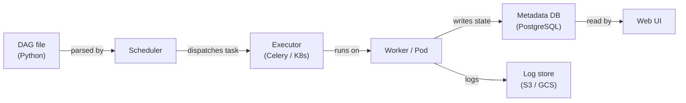

# Apache Airflow

## Définition

Apache Airflow est une plateforme open source permettant de créer, planifier et surveiller des workflows de manière programmatique. Les workflows sont exprimés sous forme de **Graphes Acycliques Dirigés (DAG)** écrits en Python, ce qui donne aux ingénieurs toute l'expressivité d'un langage de programmation pour définir des dépendances complexes, une logique de branchement, une génération dynamique de tâches et des politiques de réessai. Airflow a été créé à l'origine chez Airbnb en 2014 et a ensuite été donné à l'Apache Software Foundation ; il est devenu le standard de facto pour l'orchestration de workflows batch dans l'ingénierie des données et le MLOps.

Dans le contexte ML, Airflow orchestre l'ensemble du cycle de vie du modèle : ingestion des données, prétraitement, ingénierie de features, entraînement du modèle, évaluation, enregistrement des artefacts et déploiement. Il n'exécute pas le calcul lui-même — il délègue plutôt à des systèmes spécialisés (Spark, dbt, SageMaker, Kubernetes) via son riche écosystème d'opérateurs. Cette séparation de l'orchestration de l'exécution est une force architecturale clé : vous pouvez échanger la couche de calcul sous-jacente sans changer la logique du DAG.

Le scheduler d'Airflow analyse continuellement les fichiers DAG, évalue l'état de chaque instance de tâche et distribue les tâches prêtes à un exécuteur (LocalExecutor, CeleryExecutor ou KubernetesExecutor). L'interface web offre une visibilité en temps réel sur les exécutions de DAG, les logs de tâches et le lignage. Airflow est conçu pour les charges de travail batch avec des plannings connus — il n'est pas adapté au streaming sub-minute ou aux pipelines pilotés par événements.

## Fonctionnement

### DAGs et dépendances de tâches

Un DAG est un fichier Python qui instancie un objet `airflow.DAG` et définit des tâches à l'aide d'opérateurs. Les dépendances entre les tâches sont déclarées avec l'opérateur de décalage bit `>>` ou avec des appels `set_downstream`/`set_upstream`. Le scheduler lit ces fichiers depuis le dossier DAGs, calcule le graphe de dépendances et déclenche les instances de tâches lorsque toutes les dépendances en amont sont dans l'état `success`. Les exécutions de DAG peuvent être planifiées sur une expression cron ou déclenchées en externe via l'API REST ou le `TriggerDagRunOperator`.

### Opérateurs, capteurs et hooks

Les **opérateurs** sont les unités atomiques de travail dans Airflow. Le `PythonOperator` exécute un callable Python ; `BashOperator` exécute une commande shell ; `SparkSubmitOperator` soumet un job Spark ; `BigQueryOperator` exécute une requête SQL. Les **capteurs** sont une classe spéciale d'opérateurs qui bloquent jusqu'à ce qu'une condition soit remplie — un fichier arrive dans S3, une partition apparaît dans une table Hive, ou un DAG externe se termine. Les **hooks** fournissent des connexions réutilisables aux systèmes externes (bases de données, API cloud, files de messages) et sont utilisés en interne par les opérateurs mais peuvent aussi être appelés directement. Cette abstraction en couches signifie que la plupart des intégrations existent déjà dans les packages `apache-airflow-providers-*`.

### XComs et communication inter-tâches

Les **XComs** (cross-communications) permettent aux tâches de pousser et tirer de petites valeurs — chaînes, nombres, blobs JSON — entre les instances de tâches au sein du même cycle d'exécution de DAG. Une tâche pousse un XCom en retournant une valeur depuis son callable Python ou en appelant `context['ti'].xcom_push(key, value)`. Les tâches en aval le tirent avec `context['ti'].xcom_pull(task_ids='upstream_task', key='value')`. Les XComs sont stockés dans la base de données de métadonnées d'Airflow, ils ne conviennent donc pas aux grandes charges utiles (utilisez le stockage objet pour cela). Ils sont idéaux pour passer des métriques d'évaluation de modèles, des chemins d'artefacts ou des flags de décision entre les étapes du pipeline.

### Architecture du scheduler

Le scheduler Airflow est un processus Python qui analyse les fichiers DAG selon un intervalle configurable, calcule quelles instances de tâches sont prêtes à s'exécuter et les soumet à l'exécuteur. Avec `CeleryExecutor`, les tâches sont distribuées à un pool de processus workers via un broker de messages (Redis ou RabbitMQ). Avec `KubernetesExecutor`, chaque instance de tâche obtient son propre pod Kubernetes isolé — éliminant la contention de ressources des workers partagés et permettant des spécifications de ressources par tâche. La base de données de métadonnées (PostgreSQL ou MySQL en production) stocke l'état des exécutions de DAG, l'historique des instances de tâches, les XComs, les variables et les connexions.



## Quand utiliser / Quand NE PAS utiliser

| Utiliser quand | Éviter quand |
|----------|------------|
| Vous avez besoin d'orchestration de workflows batch avec des dépendances complexes | Votre charge de travail nécessite une latence sub-minute ou est pilotée par événements |
| Votre équipe est à l'aise pour écrire des workflows en Python | Vous souhaitez un constructeur de workflow low-code ou axé sur l'interface |
| Vous avez besoin d'une intégration riche avec les services cloud (AWS, GCP, Azure) | Vos DAGs sont extrêmement simples et une tâche cron suffirait |
| Vous nécessitez des pistes d'audit détaillées, des réessais et des alertes | Vous avez besoin d'un service d'orchestration géré et sans ops dès la sortie de la boîte |
| Vous souhaitez KubernetesExecutor pour des environnements de tâches isolés et reproductibles | Votre organisation ne peut pas maintenir le scheduler et les workers Airflow |

## Comparaisons

| Critère | Apache Airflow | Prefect |
|-----------|---------------|---------|
| Facilité d'utilisation | Modérée — nécessite la compréhension du modèle DAG, la configuration du scheduler et des exécuteurs | Élevée — flows Pythoniques avec peu de code répétitif ; l'exécution locale fonctionne simplement |
| Scalabilité | Élevée — KubernetesExecutor fait évoluer les tâches indépendamment | Élevée — Prefect Cloud ou serveur auto-hébergé avec des pools de travail |
| Qualité de l'interface | Bonne — graphe DAG, Gantt, logs de tâches ; design un peu daté | Excellente — interface moderne avec observabilité des exécutions de flow et suivi d'artefacts |
| Support Kubernetes | Première classe via KubernetesExecutor (un pod par tâche) | Via des pools de travail Kubernetes ; plus facile à configurer qu'Airflow |
| Courbe d'apprentissage | Raide — sémantique DAG, XComs, providers, configuration de l'exécuteur | Douce — ressemble à écrire du Python ordinaire ; moins à apprendre au départ |

## Avantages et inconvénients

| Avantages | Inconvénients |
|------|------|
| Écosystème mature avec des centaines d'intégrations de providers | Surcharge opérationnelle significative (scheduler, workers, base de données de métadonnées) |
| Pleine expressivité Python pour la génération dynamique de DAG | Les erreurs d'analyse de DAG peuvent silencieusement casser le scheduler |
| Fort support communautaire et entreprise (MWAA, Cloud Composer, Astronomer) | Pas adapté au streaming ou à la planification sub-minute |
| KubernetesExecutor permet l'isolation des ressources par tâche | Les XComs sont limités en taille — pas adaptés pour passer de grands artefacts |
| Interface riche avec vue graphique, diagramme de Gantt et logs au niveau des tâches | Prolifération de configuration entre les fichiers DAG, les variables d'environnement et l'interface Airflow |

## Exemples de code

```python
"""
Airflow DAG for a complete ML pipeline:
  1. Extract training data from a source database
  2. Preprocess and validate the data
  3. Train a model and register it in a model registry

Requires: apache-airflow >= 2.7, apache-airflow-providers-postgres,
          scikit-learn, pandas, mlflow
"""

from __future__ import annotations

from datetime import datetime, timedelta

from airflow import DAG
from airflow.operators.python import PythonOperator

# --- Default arguments applied to every task ---
default_args = {
    "owner": "ml-team",
    "retries": 2,
    "retry_delay": timedelta(minutes=5),
    "email_on_failure": True,
    "email": ["ml-alerts@example.com"],
}

# ---------------------------------------------------------------------------
# Task callables
# ---------------------------------------------------------------------------

def extract_data(**context) -> None:
    """
    Pull the latest training window from the feature store and
    save it to a shared location. Push the output path via XCom.
    """
    import pandas as pd

    # In production, replace with a real DB/feature-store connection
    df = pd.DataFrame(
        {
            "feature_a": [1.0, 2.0, 3.0, 4.0, 5.0],
            "feature_b": [0.1, 0.4, 0.9, 1.6, 2.5],
            "label": [0, 0, 1, 1, 1],
        }
    )

    output_path = "/tmp/airflow/training_data.parquet"
    import pathlib
    pathlib.Path(output_path).parent.mkdir(parents=True, exist_ok=True)
    df.to_parquet(output_path, index=False)

    # Push artifact path to XCom so downstream tasks can consume it
    context["ti"].xcom_push(key="data_path", value=output_path)
    print(f"[extract] saved {len(df)} rows to {output_path}")


def preprocess_data(**context) -> None:
    """
    Load extracted data, validate schema, apply feature scaling,
    and persist the preprocessed dataset.
    """
    import pandas as pd
    from sklearn.preprocessing import StandardScaler

    # Pull the path produced by the extract task
    data_path = context["ti"].xcom_pull(task_ids="extract_data", key="data_path")
    df = pd.read_parquet(data_path)

    # Validate required columns
    required = {"feature_a", "feature_b", "label"}
    missing = required - set(df.columns)
    if missing:
        raise ValueError(f"Missing columns: {missing}")

    # Scale features
    scaler = StandardScaler()
    df[["feature_a", "feature_b"]] = scaler.fit_transform(
        df[["feature_a", "feature_b"]]
    )

    output_path = "/tmp/airflow/preprocessed_data.parquet"
    df.to_parquet(output_path, index=False)
    context["ti"].xcom_push(key="preprocessed_path", value=output_path)
    print(f"[preprocess] scaled and saved {len(df)} rows to {output_path}")


def train_model(**context) -> None:
    """
    Train a logistic regression model, evaluate on a hold-out split,
    and log the run to MLflow.
    """
    import pandas as pd
    import mlflow
    import mlflow.sklearn
    from sklearn.linear_model import LogisticRegression
    from sklearn.model_selection import train_test_split
    from sklearn.metrics import accuracy_score

    preprocessed_path = context["ti"].xcom_pull(
        task_ids="preprocess_data", key="preprocessed_path"
    )
    df = pd.read_parquet(preprocessed_path)

    X = df[["feature_a", "feature_b"]].values
    y = df["label"].values
    X_train, X_test, y_train, y_test = train_test_split(
        X, y, test_size=0.2, random_state=42
    )

    with mlflow.start_run(run_name="airflow-logistic-regression"):
        model = LogisticRegression()
        model.fit(X_train, y_train)

        accuracy = accuracy_score(y_test, model.predict(X_test))
        mlflow.log_metric("accuracy", accuracy)
        mlflow.sklearn.log_model(model, artifact_path="model")

        print(f"[train] accuracy={accuracy:.4f}")
        mlflow.register_model(
            f"runs:/{mlflow.active_run().info.run_id}/model",
            name="airflow-demo-model",
        )


# ---------------------------------------------------------------------------
# DAG definition
# ---------------------------------------------------------------------------

with DAG(
    dag_id="ml_training_pipeline",
    description="Extract → Preprocess → Train pipeline for nightly model refresh",
    default_args=default_args,
    start_date=datetime(2024, 1, 1),
    schedule="0 2 * * *",  # Run at 02:00 UTC daily
    catchup=False,
    tags=["ml", "training"],
) as dag:

    extract = PythonOperator(
        task_id="extract_data",
        python_callable=extract_data,
    )

    preprocess = PythonOperator(
        task_id="preprocess_data",
        python_callable=preprocess_data,
    )

    train = PythonOperator(
        task_id="train_model",
        python_callable=train_model,
    )

    # Define linear dependency: extract → preprocess → train
    extract >> preprocess >> train
```

## Ressources pratiques

- [Documentation Apache Airflow](https://airflow.apache.org/docs/) — Référence officielle pour les DAGs, les opérateurs, les exécuteurs et la configuration
- [Astronomer — Guides Airflow](https://www.astronomer.io/docs/learn/) — Tutoriels pratiques sur la création de DAGs, les tests et le déploiement
- [Index des packages providers Airflow](https://airflow.apache.org/docs/#providers-packages-docs-apache-airflow-providers) — Parcourir toutes les intégrations officielles (AWS, GCP, Spark, dbt, etc.)
- [Airflow géré — Amazon MWAA](https://docs.aws.amazon.com/mwaa/latest/userguide/what-is-mwaa.html) — Référence du service Airflow géré AWS

## Voir aussi

- [Pipelines de données](/docs/mlops/data-engineering)
- [Apache Spark](/docs/mlops/data-engineering/spark)
- [CI/CD MLOps](/docs/mlops/cicd)
