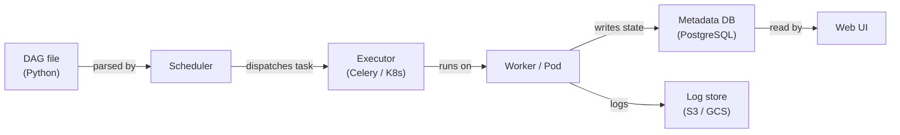

# Apache Airflow

## Définition

Apache Airflow est une plateforme open source pour créer, planifier et surveiller des workflows de manière programmatique. Les workflows sont exprimés sous forme de **Graphes Acycliques Dirigés (DAGs)** écrits en Python, ce qui donne aux ingénieurs toute l'expressivité d'un langage de programmation pour définir des dépendances complexes, de la logique de branchement, de la génération dynamique de tâches et des politiques de relance. Airflow a été créé à l'origine chez Airbnb en 2014 et donné à la Apache Software Foundation ; il est devenu le standard de facto pour l'orchestration de workflows batch en ingénierie des données et MLOps.

Dans le contexte ML, Airflow orchestre l'ensemble du cycle de vie du modèle : ingestion de données, prétraitement, ingénierie de features, entraînement du modèle, évaluation, enregistrement d'artefacts et déploiement. Il n'exécute pas lui-même le calcul — au lieu de cela, il délègue à des systèmes spécialisés (Spark, dbt, SageMaker, Kubernetes) via son riche écosystème d'opérateurs.

## Fonctionnement

### DAGs et dépendances de tâches

Un DAG est un fichier Python qui instancie un objet `airflow.DAG` et définit des tâches avec des opérateurs. Les dépendances entre tâches sont déclarées avec l'opérateur de décalage de bits `>>` ou les appels `set_downstream`/`set_upstream`.

### Opérateurs, capteurs et hooks

Les **opérateurs** sont les unités atomiques de travail dans Airflow. Les **capteurs** sont une classe spéciale d'opérateur qui bloque jusqu'à ce qu'une condition soit remplie. Les **hooks** fournissent des connexions réutilisables aux systèmes externes.

### XComs et communication inter-tâches

Les **XComs** permettent aux tâches de pousser et d'extraire de petites valeurs entre les instances de tâches dans le même DAG run. Ils sont idéaux pour passer des métriques d'évaluation du modèle, des chemins d'artefacts ou des flags de décision.

### Architecture du scheduler

Avec `KubernetesExecutor`, chaque instance de tâche obtient son propre pod Kubernetes isolé, éliminant la contention de ressources des workers partagés.



## Quand utiliser / Quand NE PAS utiliser

| Utiliser quand | Éviter quand |
|---|---|
| Vous avez besoin d'orchestration de workflows batch avec des dépendances complexes | Votre charge de travail nécessite une latence inférieure à la minute ou est dirigée par des événements |
| Votre équipe est à l'aise pour écrire des workflows en Python | Vous voulez un constructeur de workflow low-code ou UI-first |
| Vous avez besoin d'une intégration riche avec les services cloud | Vos DAGs sont extrêmement simples et un cron job suffirait |
| Vous avez besoin de pistes d'audit détaillées, de nouvelles tentatives et d'alertes | Vous avez besoin d'un service d'orchestration géré et sans opérations |

## Comparaisons

| Critère | Apache Airflow | Prefect |
|---|---|---|
| Facilité d'utilisation | Modérée | Haute |
| Scalabilité | Haute | Haute |
| Qualité de l'UI | Bonne | Excellente |
| Courbe d'apprentissage | Raide | Douce |

## Avantages et inconvénients

| Avantages | Inconvénients |
|---|---|
| Écosystème mature avec des centaines d'intégrations de providers | Surcharge opérationnelle significative |
| Expressivité Python complète pour la génération dynamique de DAGs | Les erreurs de parsing de DAG peuvent casser le scheduler silencieusement |
| Solide support communautaire et entreprise | Non adapté au streaming ou à la planification sub-minute |
| KubernetesExecutor permet l'isolation des ressources par tâche | Les XComs sont limités en taille |

## Exemple de code

```python
from __future__ import annotations
from datetime import datetime, timedelta
from airflow import DAG
from airflow.operators.python import PythonOperator

default_args = {
    "owner": "ml-team",
    "retries": 2,
    "retry_delay": timedelta(minutes=5),
    "email_on_failure": True,
    "email": ["ml-alerts@example.com"],
}

def extract_data(**context) -> None:
    import pandas as pd, pathlib
    df = pd.DataFrame({"feature_a": [1.0, 2.0], "feature_b": [0.1, 0.4], "label": [0, 1]})
    output_path = "/tmp/airflow/training_data.parquet"
    pathlib.Path(output_path).parent.mkdir(parents=True, exist_ok=True)
    df.to_parquet(output_path, index=False)
    context["ti"].xcom_push(key="data_path", value=output_path)

def train_model(**context) -> None:
    import pandas as pd, mlflow, mlflow.sklearn
    from sklearn.linear_model import LogisticRegression
    from sklearn.model_selection import train_test_split
    from sklearn.metrics import accuracy_score

    data_path = context["ti"].xcom_pull(task_ids="extract_data", key="data_path")
    df = pd.read_parquet(data_path)
    X = df[["feature_a", "feature_b"]].values
    y = df["label"].values
    X_train, X_test, y_train, y_test = train_test_split(X, y, test_size=0.2, random_state=42)
    with mlflow.start_run(run_name="airflow-logistic-regression"):
        model = LogisticRegression()
        model.fit(X_train, y_train)
        accuracy = accuracy_score(y_test, model.predict(X_test))
        mlflow.log_metric("accuracy", accuracy)
        mlflow.sklearn.log_model(model, artifact_path="model")

with DAG(
    dag_id="ml_training_pipeline",
    description="Extract -> Train pipeline for nightly model refresh",
    default_args=default_args,
    start_date=datetime(2024, 1, 1),
    schedule="0 2 * * *",
    catchup=False,
    tags=["ml", "training"],
) as dag:
    extract = PythonOperator(task_id="extract_data", python_callable=extract_data)
    train = PythonOperator(task_id="train_model", python_callable=train_model)
    extract >> train
```

## Ressources pratiques

- [Documentation Apache Airflow](https://airflow.apache.org/docs/) — Référence officielle pour les DAGs, opérateurs, exécuteurs et configuration.
- [Astronomer — Guides Airflow](https://www.astronomer.io/docs/learn/) — Tutoriels pratiques sur la création, les tests et le déploiement de DAGs.
- [Index des packages providers Airflow](https://airflow.apache.org/docs/#providers-packages-docs-apache-airflow-providers) — Parcourez toutes les intégrations officielles.
- [Airflow géré — Amazon MWAA](https://docs.aws.amazon.com/mwaa/latest/userguide/what-is-mwaa.html) — Référence du service Airflow géré d'AWS.

## Voir aussi

- [Pipelines de données](/docs/mlops/data-engineering)
- [Apache Spark](/docs/mlops/data-engineering/spark)
- [MLOps CI/CD](/docs/mlops/cicd)
