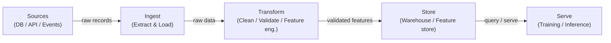

# Pipelines de données

## Définition

Un pipeline de données est une séquence automatisée d'étapes qui déplace les données brutes d'une ou plusieurs sources vers une destination où elles peuvent être consommées — par des analystes, des tableaux de bord ou des modèles d'apprentissage automatique. Dans le contexte ML, les pipelines ne se contentent pas de déplacer des données : ils garantissent que les données arrivent dans la bonne forme, au bon moment et avec une qualité vérifiable afin que les modèles s'entraînent et servent de manière prévisible. Sans pipelines fiables, chaque artefact en aval — features, modèles entraînés, prédictions — est suspect.

Les pipelines de données sont au fondement de chaque système MLOps. Ils englobent l'ingestion depuis des sources hétérogènes (bases de données, API, flux d'événements, fichiers), la transformation pour produire des jeux de données propres et structurés ou des vecteurs de features, le stockage dans des entrepôts de données ou des feature stores, et le service aux jobs d'entraînement ou aux endpoints d'inférence en ligne. Les choix de conception faits au niveau du pipeline — batch vs. streaming, push vs. pull, schéma à la lecture vs. schéma à l'écriture — se propagent jusqu'à la latence, la fraîcheur et la fiabilité du modèle.

La qualité des données est le contrat caché entre les ingénieurs de données et les équipes de modèles. La dérive de schéma, les explosions de valeurs nulles, la dérive de distribution et les enregistrements dupliqués sont parmi les causes les plus courantes de dégradation silencieuse des modèles. Les pipelines modernes intègrent des points de contrôle de validation (à l'aide d'outils comme Great Expectations ou les tests dbt) pour détecter ces problèmes avant que de mauvaises données n'atteignent l'entraînement ou le service.

## Fonctionnement

### Batch vs. streaming

Les pipelines batch traitent les données en tranches délimitées selon un calendrier — horaire, quotidien ou déclenché par l'arrivée d'un fichier. Ils sont plus simples à construire et à raisonner et constituent le bon défaut lorsque le consommateur en aval (un job d'entraînement nocturne, un tableau de bord BI) ne nécessite pas une fraîcheur inférieure à la minute. Les pipelines de streaming traitent les enregistrements à leur arrivée, permettant des features en quasi-temps réel pour les modèles en ligne. Le compromis est la complexité opérationnelle : vous devez gérer les arrivées tardives, les événements désordonnés et la sémantique d'exactement-une-fois. La plupart des plateformes ML matures exécutent les deux : le batch pour le réentraînement à grande échelle et l'évaluation hors ligne, le streaming pour le calcul de features en ligne.

### ETL vs. ELT

Extract-Transform-Load (ETL) applique les transformations avant que les données n'atterrissent dans le store de destination. C'était le modèle dominant lorsque le stockage était coûteux et que les entrepôts manquaient de calcul. Extract-Load-Transform (ELT) charge d'abord les données brutes, puis les transforme à l'intérieur d'un entrepôt ou d'un lakehouse puissant (par exemple BigQuery, Snowflake, Databricks). ELT préserve l'historique brut et permet l'exploration ad hoc sans ré-ingestion — un avantage majeur dans les charges de travail ML où l'ingénierie de features évolue constamment. Le choix est principalement déterminé par les outils, les exigences de gouvernance et si le système de destination peut gérer efficacement le calcul de transformation.

### Qualité des données et validation de schéma

Les contrôles de qualité des données doivent être intégrés à chaque étape du pipeline, pas ajoutés en fin de course. À l'ingestion, les contrôles vérifient que les données sources sont conformes au schéma attendu (noms de colonnes, types, contraintes nullable). À la transformation, les contrôles au niveau des lignes affirment les règles métier (prix non négatifs, plages de dates valides, intégrité référentielle). Au niveau du service, des contrôles statistiques détectent la dérive de distribution — le tueur silencieux des modèles déployés. La validation de schéma peut être effectuée avec des outils comme Pandera, Great Expectations ou les tests dbt ; la surveillance de la distribution est généralement gérée par des couches d'observabilité dédiées.



## Quand utiliser / Quand NE PAS utiliser

| Utiliser quand | Éviter quand |
|----------|------------|
| Plusieurs sources de données doivent être consolidées pour l'entraînement ML | Les données résident déjà dans une seule table propre prête à être utilisée directement |
| Les données doivent être actualisées selon un calendrier ou en temps réel | Votre analyse est une exploration ponctuelle qui ne sera pas répétée |
| Des garanties de qualité (schéma, complétude, fraîcheur) sont requises par les modèles en aval | La surcharge d'un pipeline complet dépasse la valeur pour un prototype rapide |
| Les transformations doivent être versionnées, testées et reproductibles | Le volume de données est trivial et un simple script dans un notebook suffit |
| Plusieurs consommateurs (entraînement, tableaux de bord, API) partagent les mêmes données traitées | Le système source fournit déjà une API propre et contractualisée |

## Comparaisons

| Critère | Pipeline batch | Pipeline streaming |
|-----------|---------------|--------------------|
| Fraîcheur des données | Minutes à heures (piloté par calendrier) | Inférieure à la seconde jusqu'à quelques secondes |
| Complexité | Faible — jeux de données délimités, re-tentatives simples | Élevée — données tardives, fenêtrage, état |
| Coût | Prévisible, calcul en rafale | Calcul continu, souvent base de coût plus élevée |
| Tolérance aux pannes | Ré-exécuter le lot défaillant | Sémantique exactement-une-fois ou au-moins-une-fois requise |
| Cas d'utilisation ML typique | Entraînement hors ligne, actualisation nocturne des features | Feature store en ligne, scoring en temps réel |

## Avantages et inconvénients

| Avantages | Inconvénients |
|------|------|
| Centralise et standardise l'accès aux données entre les équipes | Investissement initial non négligeable pour la construction et la maintenance |
| Permet des transformations de données reproductibles et testées | Les défaillances de pipeline se propagent à tous les consommateurs en aval |
| Intègre des contrôles de qualité avant que les mauvaises données n'atteignent les modèles | Le débogage des pipelines distribués est complexe |
| Supporte le versionnage et le suivi de lignage | Le streaming ajoute une surcharge opérationnelle significative |
| Découple les producteurs des consommateurs | Nécessite une discipline de gouvernance et de propriété des données |

## Exemples de code

```python
"""
Simple batch data pipeline with pandas.
Reads raw CSV data, validates schema, applies transformations,
and writes a clean Parquet file ready for model training.
"""

import pandas as pd
import pandera as pa
from pandera import Column, DataFrameSchema, Check
from pathlib import Path


# --- Schema definition (contract between pipeline and consumers) ---
raw_schema = DataFrameSchema(
    {
        "user_id": Column(int, nullable=False),
        "event_ts": Column(str, nullable=False),
        "amount": Column(float, Check(lambda x: x >= 0), nullable=False),
        "category": Column(str, nullable=True),
    }
)

output_schema = DataFrameSchema(
    {
        "user_id": Column(int),
        "event_date": Column("datetime64[ns]"),
        "amount": Column(float),
        "category": Column(str),
        "log_amount": Column(float),
    }
)


def extract(source_path: str) -> pd.DataFrame:
    """Load raw data from CSV."""
    df = pd.read_csv(source_path)
    print(f"[extract] loaded {len(df):,} rows from {source_path}")
    return df


def validate(df: pd.DataFrame, schema: DataFrameSchema) -> pd.DataFrame:
    """Fail fast if data does not match the declared schema."""
    validated = schema.validate(df)
    print(f"[validate] schema check passed for {len(validated):,} rows")
    return validated


def transform(df: pd.DataFrame) -> pd.DataFrame:
    """Apply cleaning and feature engineering."""
    df = df.copy()

    # Parse timestamp column
    df["event_date"] = pd.to_datetime(df["event_ts"])
    df.drop(columns=["event_ts"], inplace=True)

    # Fill missing categories with a sentinel value
    df["category"] = df["category"].fillna("unknown")

    # Feature engineering: log-transform amount (handles skew)
    import numpy as np
    df["log_amount"] = np.log1p(df["amount"])

    # Drop duplicates based on user_id + date
    df.drop_duplicates(subset=["user_id", "event_date"], inplace=True)

    print(f"[transform] produced {len(df):,} clean rows")
    return df


def load(df: pd.DataFrame, dest_path: str) -> None:
    """Write clean data to Parquet for efficient downstream reads."""
    Path(dest_path).parent.mkdir(parents=True, exist_ok=True)
    df.to_parquet(dest_path, index=False)
    print(f"[load] wrote {len(df):,} rows to {dest_path}")


def run_pipeline(source: str, destination: str) -> None:
    """Orchestrate the full ETL pipeline."""
    raw = extract(source)
    validated_raw = validate(raw, raw_schema)
    clean = transform(validated_raw)
    validated_clean = validate(clean, output_schema)
    load(validated_clean, destination)
    print("[pipeline] completed successfully")


if __name__ == "__main__":
    run_pipeline(
        source="data/raw/events.csv",
        destination="data/processed/events.parquet",
    )
```

## Ressources pratiques

- [The Data Engineering Cookbook (Andreas Kretz)](https://github.com/andkret/Cookbook) — Guide open source complet couvrant les modèles d'ingestion, de stockage et de traitement
- [Documentation dbt](https://docs.getdbt.com/) — Le standard pour les transformations ELT en SQL avec des tests intégrés et le lignage
- [Great Expectations](https://docs.greatexpectations.io/) — Framework de qualité et de validation des données qui s'intègre avec la plupart des outils de pipeline
- [Pandera](https://pandera.readthedocs.io/) — Validation de schéma légère pour les DataFrames pandas et Spark en Python
- [Fundamentals of Data Engineering (O'Reilly)](https://www.oreilly.com/library/view/fundamentals-of-data/9781098108298/) — Livre couvrant l'ensemble du cycle de vie de l'ingénierie des données, de l'ingestion au service

## Voir aussi

- [Apache Airflow](/docs/mlops/data-engineering/airflow)
- [Apache Spark](/docs/mlops/data-engineering/spark)
- [Apache Kafka](/docs/mlops/data-engineering/kafka)
- [MLOps](/docs/mlops)
