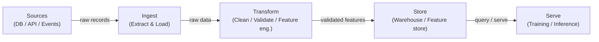

# Pipelines de données

## Définition

Une pipeline de données est une séquence automatisée d'étapes qui déplace des données brutes d'une ou plusieurs sources vers une destination où elles peuvent être consommées par des analystes, des tableaux de bord ou des modèles de machine learning. Dans le contexte ML, les pipelines ne consistent pas seulement à déplacer des données : elles garantissent que les données arrivent dans la bonne forme, au bon moment et avec une qualité vérifiable pour que les modèles s'entraînent et servent de manière prévisible. Sans pipelines fiables, chaque artefact en aval — features, modèles entraînés, prédictions — est suspect.

Les pipelines de données se trouvent à la base de chaque système MLOps. Elles englobent l'ingestion depuis des sources hétérogènes (bases de données, APIs, flux d'événements, fichiers), la transformation pour produire des jeux de données propres et structurés ou des vecteurs de features, le stockage dans des entrepôts de données ou des feature stores, et le serving aux jobs d'entraînement ou aux endpoints d'inférence en ligne. Les choix de conception au niveau de la couche pipeline — batch vs. streaming, push vs. pull, schema-on-read vs. schema-on-write — se propagent jusqu'à la latence, la fraîcheur et la fiabilité du modèle.

La qualité des données est le contrat caché entre les ingénieurs données et les équipes modèles. La dérive de schéma, les explosions de nuls, le changement de distribution et les enregistrements dupliqués font partie des causes les plus courantes de dégradation silencieuse des modèles. Les pipelines modernes intègrent des points de contrôle de validation (avec des outils comme Great Expectations ou les tests dbt) pour détecter ces problèmes avant que les mauvaises données n'atteignent l'entraînement ou le serving.

## Fonctionnement

### Batch vs. Streaming

Les pipelines batch traitent les données par lots bornés selon un planning — toutes les heures, quotidiennement ou déclenchées par l'arrivée de fichiers. Elles sont plus simples à construire et à raisonner, et sont le bon choix par défaut lorsque le consommateur en aval (un job d'entraînement nocturne, un tableau de bord BI) ne nécessite pas une fraîcheur inférieure à la minute. Les pipelines de streaming traitent les enregistrements à mesure qu'ils arrivent, permettant des features quasi temps réel pour les modèles en ligne. Le compromis est la complexité opérationnelle : il faut gérer les arrivées tardives, les événements hors ordre et la sémantique exactly-once.

### ETL vs. ELT

Extract-Transform-Load (ETL) applique les transformations avant que les données n'atterrissent dans le stockage de destination. Extract-Load-Transform (ELT) charge d'abord les données brutes, puis les transforme dans un entrepôt ou lakehouse puissant (par ex. BigQuery, Snowflake, Databricks). ELT préserve l'historique brut et permet l'exploration ad hoc sans ré-ingestion — un avantage majeur dans les charges de travail ML où l'ingénierie de features évolue constamment.

### Qualité des données et validation de schéma

Les contrôles de qualité des données doivent être intégrés à chaque étape de la pipeline, pas ajoutés à la fin. À l'ingestion, les contrôles vérifient que les données source sont conformes au schéma attendu. À la transformation, les contrôles au niveau des lignes affirment les règles métier. Au niveau du serving, les contrôles statistiques détectent la dérive de distribution — le tueur silencieux des modèles déployés.



## Quand utiliser / Quand NE PAS utiliser

| Utiliser quand | Éviter quand |
|---|---|
| Plusieurs sources de données doivent être consolidées pour l'entraînement ML | Les données existent déjà dans une seule table propre prête à l'emploi |
| Les données doivent être actualisées selon un planning ou en temps réel | Votre analyse est une exploration ponctuelle qui ne sera pas répétée |
| Des garanties de qualité sont requises par les modèles en aval | L'overhead d'une pipeline complète dépasse la valeur pour un prototype rapide |
| Les transformations doivent être versionnées, testées et reproductibles | Le volume de données est trivial et un script simple dans un notebook suffit |
| Plusieurs consommateurs partagent les mêmes données traitées | Le système source fournit déjà une API propre et contractualisée |

## Comparaisons

| Critère | Pipeline batch | Pipeline de streaming |
|---|---|---|
| Fraîcheur des données | Minutes à heures (basé sur un planning) | Sous-seconde à secondes |
| Complexité | Faible — jeux de données bornés, reprises simples | Haute — données tardives, fenêtrage, état |
| Coût | Prévisible, calcul en rafale | Calcul continu, baseline souvent plus élevée |
| Tolérance aux pannes | Ré-exécuter le batch échoué | Sémantique exactly-once ou at-least-once requise |
| Cas d'usage ML typique | Entraînement offline, actualisation nocturne des features | Feature store en ligne, scoring temps réel |

## Avantages et inconvénients

| Avantages | Inconvénients |
|---|---|
| Centralise et standardise l'accès aux données entre les équipes | Investissement initial non trivial pour construire et maintenir |
| Permet des transformations de données reproductibles et testées | Les échecs de pipeline se propagent à tous les consommateurs en aval |
| Intègre des contrôles de qualité avant que les mauvaises données n'atteignent les modèles | Déboguer des pipelines distribuées est complexe |
| Supporte le versionnage et le suivi de lignage | Le streaming ajoute une surcharge opérationnelle significative |
| Découple les producteurs des consommateurs | Nécessite discipline de gouvernance et responsabilité des données |

## Exemples de code

```python
import pandas as pd
import pandera as pa
from pandera import Column, DataFrameSchema, Check
from pathlib import Path

raw_schema = DataFrameSchema({
    "user_id": Column(int, nullable=False),
    "event_ts": Column(str, nullable=False),
    "amount": Column(float, Check(lambda x: x >= 0), nullable=False),
    "category": Column(str, nullable=True),
})

def extract(source_path: str) -> pd.DataFrame:
    return pd.read_csv(source_path)

def validate(df: pd.DataFrame, schema: DataFrameSchema) -> pd.DataFrame:
    return schema.validate(df)

def transform(df: pd.DataFrame) -> pd.DataFrame:
    df = df.copy()
    df["event_date"] = pd.to_datetime(df["event_ts"])
    df.drop(columns=["event_ts"], inplace=True)
    df["category"] = df["category"].fillna("unknown")
    import numpy as np
    df["log_amount"] = np.log1p(df["amount"])
    df.drop_duplicates(subset=["user_id", "event_date"], inplace=True)
    return df

def load(df: pd.DataFrame, dest_path: str) -> None:
    Path(dest_path).parent.mkdir(parents=True, exist_ok=True)
    df.to_parquet(dest_path, index=False)

def run_pipeline(source: str, destination: str) -> None:
    raw = extract(source)
    validated_raw = validate(raw, raw_schema)
    clean = transform(validated_raw)
    load(clean, destination)
    print("[pipeline] completed successfully")

if __name__ == "__main__":
    run_pipeline("data/raw/events.csv", "data/processed/events.parquet")
```

## Ressources pratiques

- [The Data Engineering Cookbook (Andreas Kretz)](https://github.com/andkret/Cookbook) — Guide open source complet couvrant les patterns d'ingestion, de stockage et de traitement.
- [Documentation dbt](https://docs.getdbt.com/) — Le standard pour les transformations ELT en SQL avec tests intégrés et lignage.
- [Great Expectations](https://docs.greatexpectations.io/) — Framework de qualité et de validation des données qui s'intègre avec la plupart des outils de pipeline.
- [Pandera](https://pandera.readthedocs.io/) — Validation de schéma légère pour les DataFrames pandas et Spark en Python.
- [Fundamentals of Data Engineering (O'Reilly)](https://www.oreilly.com/library/view/fundamentals-of-data/9781098108298/) — Livre couvrant le cycle de vie complet de l'ingénierie des données.

## Voir aussi

- [Apache Airflow](/docs/mlops/data-engineering/airflow)
- [Apache Spark](/docs/mlops/data-engineering/spark)
- [Apache Kafka](/docs/mlops/data-engineering/kafka)
- [MLOps](/docs/mlops)
