# Apache Kafka

## Définition

Apache Kafka est une plateforme de streaming d'événements distribué, développée à l'origine chez LinkedIn et rendue open source en 2011. Elle est conçue pour gérer des flux d'événements à haut débit, faible latence et durables — messages de log, événements d'activité utilisateur, lectures de capteurs, transactions — sur un cluster de matériel standard. Kafka agit comme un journal persistant et rejouable : les producteurs écrivent des événements dans des **topics** nommés, et les consommateurs lisent depuis ces topics à leur propre rythme, indépendamment les uns des autres. Ce découplage des producteurs et des consommateurs est la propriété architecturale déterminante qui rend Kafka si puissant comme épine dorsale d'intégration.

Dans le contexte de l'apprentissage automatique, Kafka occupe deux rôles critiques. Premièrement, il sert d'épine dorsale pour les **pipelines de features en temps réel** : les événements bruts (clics, transactions, lectures de capteurs) circulent à travers Kafka, sont consommés par des processeurs de flux ([Apache Spark](/docs/mlops/data-engineering/spark) Structured Streaming, Apache Flink ou Kafka Streams), transformés en vecteurs de features, et écrits dans un feature store en ligne (par exemple Feast, Tecton) pour un service de modèles à faible latence. Deuxièmement, Kafka est utilisé pour les **pipelines de service de modèles** : les requêtes de prédiction arrivent comme des messages Kafka, un consommateur applique le modèle et produit des événements de prédiction vers un topic de résultats, permettant une inférence asynchrone et découplée à grande échelle.

Les garanties de durabilité de Kafka — les messages sont persistés sur disque et répliqués entre les brokers — signifient que les groupes de consommateurs peuvent rejouer le journal d'événements depuis n'importe quel offset, permettant des remplissages de feature stores lorsque de nouvelles définitions de features sont déployées, et supportant la sémantique d'exactement-une-fois pour les pipelines ML critiques.

## Fonctionnement

### Topics et partitions

Un **topic** est un journal ordonné, immuable et nommé d'événements. Les topics sont divisés en **partitions** — l'unité de parallélisme dans Kafka. Chaque partition est une séquence ordonnée et append-only d'enregistrements stockés sur disque et répliqués entre plusieurs brokers pour la tolérance aux pannes. Le nombre de partitions détermine le parallélisme maximum des consommateurs : au sein d'un groupe de consommateurs, chaque partition est assignée à exactement une instance de consommateur. Choisir le bon nombre de partitions est une décision de capacité critique — trop peu limite le débit, trop nombreuses augmente la surcharge des brokers.

### Producteurs

Un **producteur** est un client qui publie des enregistrements vers un ou plusieurs topics. Les enregistrements se composent d'une clé optionnelle, d'une valeur (typiquement sérialisée en JSON, Avro ou Protobuf), d'un horodatage optionnel et d'en-têtes optionnels. Lorsqu'une clé est présente, Kafka utilise le hachage cohérent pour router tous les enregistrements avec la même clé vers la même partition — garantissant l'ordre pour une entité donnée (par exemple, tous les événements pour un `user_id` donné atterrissent dans la même partition). Les producteurs configurent la sémantique d'accusé de réception : `acks=0` (fire and forget), `acks=1` (accusé de réception du leader) ou `acks=all` (réplication ISR complète — durabilité maximale).

### Consommateurs et groupes de consommateurs

Un **consommateur** lit des enregistrements depuis une ou plusieurs partitions. Les consommateurs s'organisent en **groupes de consommateurs** : chaque enregistrement est livré à exactement un consommateur au sein d'un groupe, permettant le scaling horizontal du traitement. Différents groupes de consommateurs peuvent lire le même topic indépendamment — un groupe de consommateurs de pipeline de features, un groupe de consommateurs de surveillance et un groupe de consommateurs de rejeu peuvent tous consommer les mêmes événements bruts sans interférer les uns avec les autres. Les offsets des consommateurs (la position dans chaque partition) sont commités dans Kafka, fournissant une tolérance aux pannes : si un consommateur tombe en panne, une autre instance reprend depuis le dernier offset commité.

### Kafka dans les pipelines ML en temps réel

Kafka est typiquement positionné entre les sources d'événements bruts et les systèmes ML en aval. Les événements bruts arrivent depuis des backends d'application ou des appareils IoT dans un topic brut. Un processeur de flux (Spark Structured Streaming, Flink ou Kafka Streams) consomme ces événements, calcule des features (agrégats glissants, recherches d'entités, embeddings) et écrit les résultats dans un topic de features ou directement dans un feature store en ligne. Le feature store sert des lectures à faible latence à la couche de service de modèles. Les résultats de prédiction peuvent à leur tour être écrits dans un topic Kafka pour être consommés par des systèmes de surveillance, des applications en aval ou des déclencheurs de réentraînement.

```mermaid
flowchart LR
  Producer["Producer\n(App / IoT / DB CDC)"] -- "publish events" --> Topic["Kafka Topic\n(partitioned, replicated)"]
  Topic -- "consume raw events" --> StreamProcessor["Stream Processor\n(Spark / Flink / Kafka Streams)"]
  StreamProcessor -- "write features" --> FeatureStore["Online Feature Store\n(Feast / Redis)"]
  FeatureStore -- "low-latency read" --> ModelServer["Model Server\n(REST / gRPC)"]
  ModelServer -- "publish predictions" --> PredictionTopic["Prediction Topic"]
  PredictionTopic -- "consume" --> Consumer["Consumer\n(Monitoring / Downstream app)"]
```



## Quand utiliser / Quand NE PAS utiliser

| Utiliser quand | Éviter quand |
|----------|------------|
| Vous avez besoin d'un streaming d'événements durable à haut débit (millions d'événements/sec) | Votre cas d'utilisation est une simple file de tâches avec un taux de messages modeste |
| Plusieurs groupes de consommateurs indépendants doivent lire le même flux d'événements | Vous avez besoin d'une logique de routage complexe, de priorités de messages ou de files de lettres mortes dès la sortie de la boîte |
| Vous devez rejouer des événements historiques pour remplir des feature stores | La complexité opérationnelle d'un cluster Kafka n'est pas justifiée par la charge de travail |
| Le calcul de features en temps réel pour le service ML en ligne est requis | Les messages sont volumineux (> quelques Mo) — Kafka est optimisé pour les petits enregistrements fréquents |
| L'ordre des événements par entité (par exemple par utilisateur) doit être préservé | Votre équipe a besoin d'un broker de messages entièrement géré avec peu d'opérations (considérez SQS, Pub/Sub) |

## Comparaisons

| Critère | Apache Kafka | RabbitMQ |
|-----------|-------------|----------|
| Débit | Extrêmement élevé — millions de messages/sec par cluster | Modéré — centaines de milliers/sec |
| Latence | Faible (quelques ms) mais optimisé pour le débit, pas la latence minimale | Très faible — inférieure à la milliseconde dans certaines configurations |
| Persistance des messages | Messages conservés pendant une période configurable (jours/semaines) ; entièrement rejouables | Messages supprimés après accusé de réception par défaut ; rejeu non natif |
| Modèle de consommateur | Pull ; les consommateurs suivent leurs propres offsets ; plusieurs groupes lisent indépendamment | Push ; le broker route les messages ; chaque message livré à un consommateur |
| Complexité | Élevée — cluster de brokers, ZooKeeper (pré-3.x) ou KRaft, registre de schémas, surveillance | Modérée — plus simple à opérer ; bien pour les files de tâches traditionnelles |
| Meilleur cas d'utilisation ML | Pipelines de features en temps réel, event sourcing, agrégation de logs | Files de tâches pour des jobs ML asynchrones (par exemple des requêtes de prétraitement) |

## Avantages et inconvénients

| Avantages | Inconvénients |
|------|------|
| Débit extrêmement élevé et scalabilité horizontale | Complexité opérationnelle significative — cluster, réplication, surveillance |
| Journal durable et rejouable permettant les remplissages et l'auditabilité | Pas adapté aux charges de travail de messages très petits ou peu fréquents |
| Découple les producteurs et consommateurs — chacun évolue indépendamment | L'évolution du schéma nécessite un registre de schémas (Confluent Schema Registry) |
| Plusieurs groupes de consommateurs peuvent lire le même topic indépendamment | Le réglage du nombre de partitions, des facteurs de réplication et de la rétention nécessite une expertise |
| Écosystème fort : Kafka Connect, Kafka Streams, ksqlDB, Confluent Cloud | Surcharge opérationnelle historiquement plus élevée que les alternatives hébergées (SQS, Pub/Sub) |

## Exemples de code

```python
"""
Kafka producer and consumer example using kafka-python.

Scenario: a feature pipeline for real-time ML scoring.
  - Producer: simulates user events (clicks) and publishes to Kafka.
  - Consumer: reads events, computes a simple feature, and logs predictions.

Requires: kafka-python >= 2.0
  pip install kafka-python

Start a local Kafka broker before running (e.g. via Docker):
  docker run -d -p 9092:9092 --name kafka \
    -e KAFKA_CFG_NODE_ID=0 \
    -e KAFKA_CFG_PROCESS_ROLES=controller,broker \
    -e KAFKA_CFG_LISTENERS=PLAINTEXT://:9092,CONTROLLER://:9093 \
    -e KAFKA_CFG_ADVERTISED_LISTENERS=PLAINTEXT://localhost:9092 \
    -e KAFKA_CFG_LISTENER_SECURITY_PROTOCOL_MAP=CONTROLLER:PLAINTEXT,PLAINTEXT:PLAINTEXT \
    -e KAFKA_CFG_CONTROLLER_QUORUM_VOTERS=0@kafka:9093 \
    -e KAFKA_CFG_CONTROLLER_LISTENER_NAMES=CONTROLLER \
    bitnami/kafka:latest
"""

import json
import time
import random
import threading
from datetime import datetime

from kafka import KafkaProducer, KafkaConsumer
from kafka.admin import KafkaAdminClient, NewTopic


BROKER = "localhost:9092"
EVENTS_TOPIC = "user-events"
PREDICTIONS_TOPIC = "predictions"


# ---------------------------------------------------------------------------
# Topic creation (idempotent)
# ---------------------------------------------------------------------------

def ensure_topics() -> None:
    """Create Kafka topics if they do not already exist."""
    admin = KafkaAdminClient(bootstrap_servers=BROKER)
    existing = admin.list_topics()
    topics_to_create = [
        NewTopic(name=t, num_partitions=3, replication_factor=1)
        for t in [EVENTS_TOPIC, PREDICTIONS_TOPIC]
        if t not in existing
    ]
    if topics_to_create:
        admin.create_topics(new_topics=topics_to_create, validate_only=False)
        print(f"[admin] created topics: {[t.name for t in topics_to_create]}")
    admin.close()


# ---------------------------------------------------------------------------
# Producer: simulate user click events
# ---------------------------------------------------------------------------

def run_producer(num_events: int = 20, delay: float = 0.5) -> None:
    """
    Publish synthetic user-click events to the events topic.
    Each event carries a user_id (used as the partition key for ordering),
    a page_id, and a timestamp.
    """
    producer = KafkaProducer(
        bootstrap_servers=BROKER,
        # Serialize Python dicts to JSON bytes
        value_serializer=lambda v: json.dumps(v).encode("utf-8"),
        # Key is UTF-8 encoded string (user_id) — ensures per-user ordering
        key_serializer=lambda k: k.encode("utf-8"),
        # Wait for full ISR replication before confirming (highest durability)
        acks="all",
        retries=3,
    )

    for i in range(num_events):
        user_id = f"user_{random.randint(1, 5)}"
        event = {
            "event_id": i,
            "user_id": user_id,
            "page_id": random.choice(["home", "product", "checkout", "search"]),
            "dwell_time_sec": round(random.uniform(1.0, 120.0), 2),
            "timestamp": datetime.utcnow().isoformat(),
        }
        future = producer.send(
            topic=EVENTS_TOPIC,
            key=user_id,    # Partition key — all events for a user go to same partition
            value=event,
        )
        record_metadata = future.get(timeout=10)
        print(
            f"[producer] sent event {i:02d} | user={user_id} | "
            f"partition={record_metadata.partition} offset={record_metadata.offset}"
        )
        time.sleep(delay)

    producer.flush()
    producer.close()
    print("[producer] finished")


# ---------------------------------------------------------------------------
# Consumer: compute features and produce a mock prediction
# ---------------------------------------------------------------------------

def score_event(event: dict) -> float:
    """
    Trivial scoring function — in production this calls a model server
    or retrieves features from an online feature store.
    """
    # Higher dwell time on 'product' or 'checkout' pages → higher purchase probability
    base = event["dwell_time_sec"] / 120.0
    multiplier = {"checkout": 1.5, "product": 1.2, "search": 0.9, "home": 0.7}.get(
        event["page_id"], 1.0
    )
    return min(round(base * multiplier, 4), 1.0)


def run_consumer(max_messages: int = 20) -> None:
    """
    Consume user events, compute a purchase-probability score,
    and publish the prediction to the predictions topic.
    """
    consumer = KafkaConsumer(
        EVENTS_TOPIC,
        bootstrap_servers=BROKER,
        group_id="ml-feature-pipeline",            # Consumer group for offset tracking
        value_deserializer=lambda b: json.loads(b.decode("utf-8")),
        auto_offset_reset="earliest",              # Start from beginning if no committed offset
        enable_auto_commit=True,
        consumer_timeout_ms=5000,                  # Stop after 5 s of inactivity
    )

    prediction_producer = KafkaProducer(
        bootstrap_servers=BROKER,
        value_serializer=lambda v: json.dumps(v).encode("utf-8"),
        key_serializer=lambda k: k.encode("utf-8"),
    )

    count = 0
    for message in consumer:
        if count >= max_messages:
            break

        event = message.value
        score = score_event(event)

        prediction = {
            "event_id": event["event_id"],
            "user_id": event["user_id"],
            "purchase_probability": score,
            "scored_at": datetime.utcnow().isoformat(),
        }

        prediction_producer.send(
            topic=PREDICTIONS_TOPIC,
            key=event["user_id"],
            value=prediction,
        )
        print(
            f"[consumer] event={event['event_id']:02d} user={event['user_id']} "
            f"page={event['page_id']} score={score:.4f}"
        )
        count += 1

    consumer.close()
    prediction_producer.flush()
    prediction_producer.close()
    print(f"[consumer] processed {count} messages")


# ---------------------------------------------------------------------------
# Main: run producer and consumer concurrently
# ---------------------------------------------------------------------------

if __name__ == "__main__":
    ensure_topics()

    # Start consumer in a background thread so it reads while producer writes
    consumer_thread = threading.Thread(target=run_consumer, args=(20,))
    consumer_thread.start()

    # Give the consumer a moment to initialize
    time.sleep(1.0)

    # Run producer in the main thread
    run_producer(num_events=20, delay=0.3)

    consumer_thread.join()
    print("[main] pipeline demo complete")
```

## Ressources pratiques

- [Documentation Apache Kafka](https://kafka.apache.org/documentation/) — Référence officielle couvrant les brokers, les producteurs, les consommateurs, Kafka Streams et Kafka Connect
- [Confluent Developer — Tutoriels Kafka](https://developer.confluent.io/tutorials/) — Tutoriels pratiques pour les producteurs, les consommateurs, le registre de schémas et ksqlDB
- [Kafka : The Definitive Guide, 2e édition (O'Reilly)](https://www.oreilly.com/library/view/kafka-the-definitive/9781492043072/) — Livre complet couvrant les mécanismes internes, les opérations et le traitement de flux
- [Bibliothèque kafka-python](https://kafka-python.readthedocs.io/) — Documentation du client Python avec référence API pour les producteurs, les consommateurs et l'admin
- [Feast — Feature store open source](https://docs.feast.dev/) — Feature store qui s'intègre avec Kafka pour l'ingestion de features en temps réel

## Voir aussi

- [Pipelines de données](/docs/mlops/data-engineering)
- [Apache Spark](/docs/mlops/data-engineering/spark)
- [Surveillance MLOps](/docs/mlops/monitoring)
