# Apache Kafka

## Définition

Apache Kafka est une plateforme de streaming d'événements distribuée développée à l'origine chez LinkedIn et publiée en open source en 2011. Elle est conçue pour gérer des flux d'événements à haut débit, faible latence et durables — messages de log, événements d'activité utilisateur, lectures de capteurs, transactions — sur un cluster de matériel standard. Kafka agit comme un log persistant et reproductible : les producteurs écrivent des événements dans des **topics** nommés, et les consommateurs lisent ces topics à leur propre rythme, indépendamment les uns des autres.

Dans le contexte ML, Kafka occupe deux rôles critiques. Premièrement, il sert de colonne vertébrale de données pour les **pipelines de features en temps réel**. Deuxièmement, il est utilisé pour les **pipelines de serving de modèles** : les demandes de prédiction arrivent comme des messages Kafka, un consommateur applique le modèle et produit des événements de prédiction vers un topic de résultats.

## Fonctionnement

### Topics et partitions

Un **topic** est un log nommé, ordonné et immuable d'événements. Les topics sont divisés en **partitions** — l'unité de parallélisme dans Kafka.

### Producteurs

Un **producteur** est un client qui publie des enregistrements dans un ou plusieurs topics. Lorsqu'une clé est présente, Kafka utilise le hachage cohérent pour router tous les enregistrements avec la même clé vers la même partition.

### Consommateurs et groupes de consommateurs

Un **consommateur** lit les enregistrements d'une ou plusieurs partitions. Les consommateurs s'organisent en **groupes de consommateurs** : chaque enregistrement est livré exactement à un consommateur au sein d'un groupe.



```mermaid
flowchart LR
  Producer["Producer\n(App / IoT / DB CDC)"] -- "publish events" --> Topic["Kafka Topic\n(partitioned, replicated)"]
  Topic -- "consume raw events" --> StreamProcessor["Stream Processor\n(Spark / Flink / Kafka Streams)"]
  StreamProcessor -- "write features" --> FeatureStore["Online Feature Store\n(Feast / Redis)"]
  FeatureStore -- "low-latency read" --> ModelServer["Model Server\n(REST / gRPC)"]
  ModelServer -- "publish predictions" --> PredictionTopic["Prediction Topic"]
  PredictionTopic -- "consume" --> Consumer["Consumer\n(Monitoring / Downstream app)"]
```

## Quand utiliser / Quand NE PAS utiliser

| Utiliser quand | Éviter quand |
|---|---|
| Vous avez besoin de streaming d'événements haut débit et durable | Votre cas d'usage est une file d'attente simple avec un taux de messages modeste |
| Plusieurs groupes de consommateurs indépendants doivent lire le même flux | Vous avez besoin d'une logique de routage complexe ou de files de lettres mortes |
| Vous devez rejouer des événements historiques pour remplir des feature stores | La complexité opérationnelle d'un cluster Kafka n'est pas justifiée |
| Le calcul de features en temps réel est requis | Les messages sont volumineux (> quelques Mo) |
| L'ordre des événements par entité doit être préservé | Votre équipe a besoin d'un message broker entièrement géré |

## Comparaisons

| Critère | Apache Kafka | RabbitMQ |
|---|---|---|
| Débit | Extrêmement élevé | Modéré |
| Latence | Faible (ms à un chiffre) | Très faible — sous-milliseconde |
| Persistance des messages | Messages conservés pour une période configurable ; entièrement reproductibles | Messages supprimés après acquittement par défaut |
| Modèle de consommateur | Basé sur pull | Basé sur push |
| Complexité | Haute | Modérée |
| Meilleur cas d'usage ML | Pipelines de features temps réel, event sourcing | Files d'attente pour jobs ML asynchrones |

## Avantages et inconvénients

| Avantages | Inconvénients |
|---|---|
| Débit extrêmement élevé et scalabilité horizontale | Complexité opérationnelle significative |
| Log durable et reproductible | Non adapté aux charges de travail à faible volume |
| Découple producteurs et consommateurs | L'évolution du schéma nécessite un schema registry |
| Plusieurs groupes de consommateurs peuvent lire le même topic indépendamment | Régler les comptes de partitions nécessite de l'expertise |
| Fort écosystème : Kafka Connect, Kafka Streams, ksqlDB | Overhead opérationnel historiquement plus élevé |

## Exemple de code

```python
import json, time, random, threading
from datetime import datetime
from kafka import KafkaProducer, KafkaConsumer
from kafka.admin import KafkaAdminClient, NewTopic

BROKER = "localhost:9092"
EVENTS_TOPIC = "user-events"
PREDICTIONS_TOPIC = "predictions"

def ensure_topics() -> None:
    admin = KafkaAdminClient(bootstrap_servers=BROKER)
    existing = admin.list_topics()
    topics_to_create = [
        NewTopic(name=t, num_partitions=3, replication_factor=1)
        for t in [EVENTS_TOPIC, PREDICTIONS_TOPIC] if t not in existing
    ]
    if topics_to_create:
        admin.create_topics(new_topics=topics_to_create, validate_only=False)
    admin.close()

def run_producer(num_events: int = 20, delay: float = 0.5) -> None:
    producer = KafkaProducer(
        bootstrap_servers=BROKER,
        value_serializer=lambda v: json.dumps(v).encode("utf-8"),
        key_serializer=lambda k: k.encode("utf-8"),
        acks="all", retries=3,
    )
    for i in range(num_events):
        user_id = f"user_{random.randint(1, 5)}"
        event = {
            "event_id": i, "user_id": user_id,
            "page_id": random.choice(["home", "product", "checkout", "search"]),
            "dwell_time_sec": round(random.uniform(1.0, 120.0), 2),
            "timestamp": datetime.utcnow().isoformat(),
        }
        producer.send(topic=EVENTS_TOPIC, key=user_id, value=event)
        time.sleep(delay)
    producer.flush()
    producer.close()

def score_event(event: dict) -> float:
    base = event["dwell_time_sec"] / 120.0
    multiplier = {"checkout": 1.5, "product": 1.2, "search": 0.9, "home": 0.7}.get(event["page_id"], 1.0)
    return min(round(base * multiplier, 4), 1.0)

def run_consumer(max_messages: int = 20) -> None:
    consumer = KafkaConsumer(
        EVENTS_TOPIC, bootstrap_servers=BROKER,
        group_id="ml-feature-pipeline",
        value_deserializer=lambda b: json.loads(b.decode("utf-8")),
        auto_offset_reset="earliest", enable_auto_commit=True, consumer_timeout_ms=5000,
    )
    prediction_producer = KafkaProducer(
        bootstrap_servers=BROKER,
        value_serializer=lambda v: json.dumps(v).encode("utf-8"),
        key_serializer=lambda k: k.encode("utf-8"),
    )
    count = 0
    for message in consumer:
        if count >= max_messages:
            break
        event = message.value
        score = score_event(event)
        prediction = {
            "event_id": event["event_id"], "user_id": event["user_id"],
            "purchase_probability": score, "scored_at": datetime.utcnow().isoformat(),
        }
        prediction_producer.send(topic=PREDICTIONS_TOPIC, key=event["user_id"], value=prediction)
        count += 1
    consumer.close()
    prediction_producer.flush()
    prediction_producer.close()

if __name__ == "__main__":
    ensure_topics()
    consumer_thread = threading.Thread(target=run_consumer, args=(20,))
    consumer_thread.start()
    time.sleep(1.0)
    run_producer(num_events=20, delay=0.3)
    consumer_thread.join()
```

## Ressources pratiques

- [Documentation Apache Kafka](https://kafka.apache.org/documentation/) — Référence officielle pour les brokers, producteurs, consommateurs, Kafka Streams et Kafka Connect.
- [Confluent Developer — Tutoriels Kafka](https://developer.confluent.io/tutorials/) — Tutoriels pratiques.
- [Kafka: The Definitive Guide, 2nd edition (O'Reilly)](https://www.oreilly.com/library/view/kafka-the-definitive/9781492043072/) — Livre complet sur les internals et le traitement de flux.
- [Bibliothèque kafka-python](https://kafka-python.readthedocs.io/) — Documentation du client Python.
- [Feast — Open Source Feature Store](https://docs.feast.dev/) — Feature store qui s'intègre avec Kafka.

## Voir aussi

- [Pipelines de données](/docs/mlops/data-engineering)
- [Apache Spark](/docs/mlops/data-engineering/spark)
- [Surveillance MLOps](/docs/mlops/monitoring)
